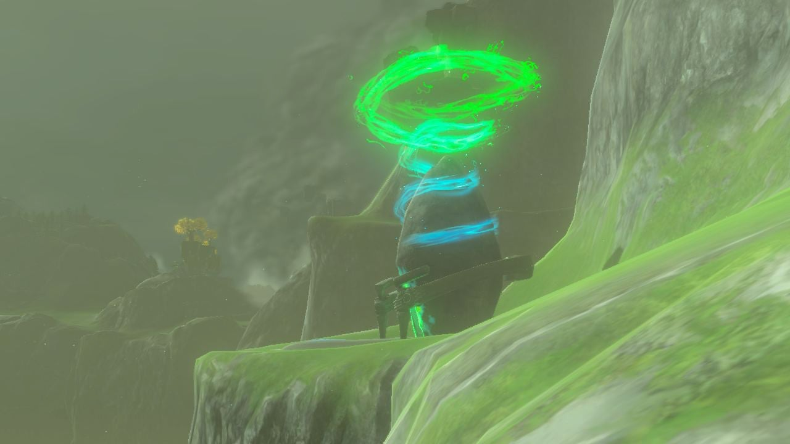
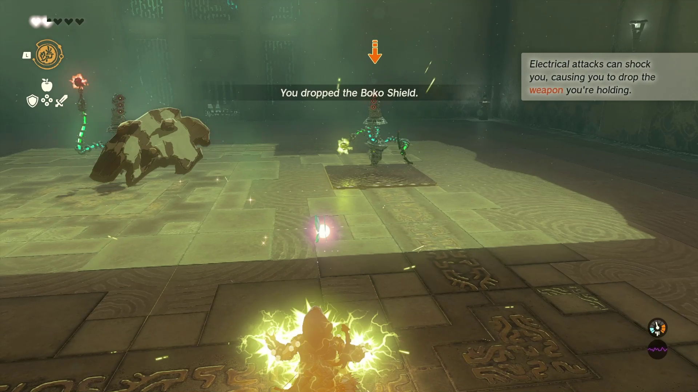
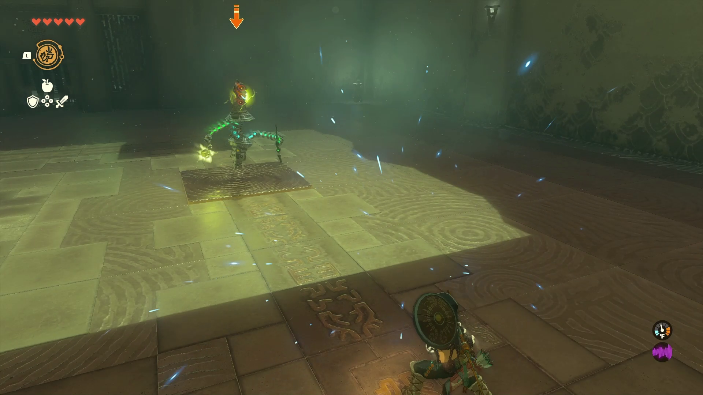

Eshos Shrine (**Combat Training: Shields**) in The Legend of Zelda: Tears of the Kingdom is a shrine located in the West Necluda Region on the east side of the Dueling Peaks range and is one of 152 shrines in TOTK (see all shrine locations). This page contains a guide for how to locate and enter the shrine, a walkthrough for the shrine itself, and puzzle solutions as well as treasure chest locations for the TotK Eshos shrine. 

### Treasure and Rewards

  * Mighty Zonaite Shield

## Eshos Shrine Location

The Eshos Shrine is located on the**east side of the Dueling Peaks** , on a platform about a third of the way up the side of the northern cliff’s east side. We got there by Recalling a Sky Island piece east of the shrine (location 1769, -2029, 0013) and gliding straight to it, but you can also climb up the side of the cliff if you have the stamina. 

  * Coordinates: 1566, -1945, 0157

## Eshos Shrine Walkthrough

This is a combat shrine with a small twist, as it’s designed to teach you to deflect projectiles**depending on your shield material and the enemy attack type**. If you need another shield type, there are a few on the rack to your left after you enter the room where the enemy resides. 

First,**use a metal shield** to deflect the fire projectile so you don’t set any of your wooden shields on fire. 

Then, **use a wooden shield** (not a metal one) to deflect the electric attacks, so you don’t get shocked and drop your shield. 

After defeating both enemies by parrying their projectiles back at them, enter through the final gate and pick up the Mighty Zonaite Shield before completing the shrine. 

Eshos Shrine

Congrats on solving the shrine and earning a Light of Blessing! Click or tap here to return to the rest of the Shrine Guides. You can also check out which shrines are nearby with our shrine map filter on our complete map of Hyrule.

### Up Next: Walkthrough

Previous

About IGN's Zelda TotK Guide Writers

Next

Walkthrough

### Top Guide Sections

  * Walkthrough
  * Zelda: Tears of The Kingdom Switch 2 Edition Guide
  * Zelda Notes Voice Memories
  * List of Side Quests and Side Adventures

### Was this guide helpful?

Leave feedback

Go to comments