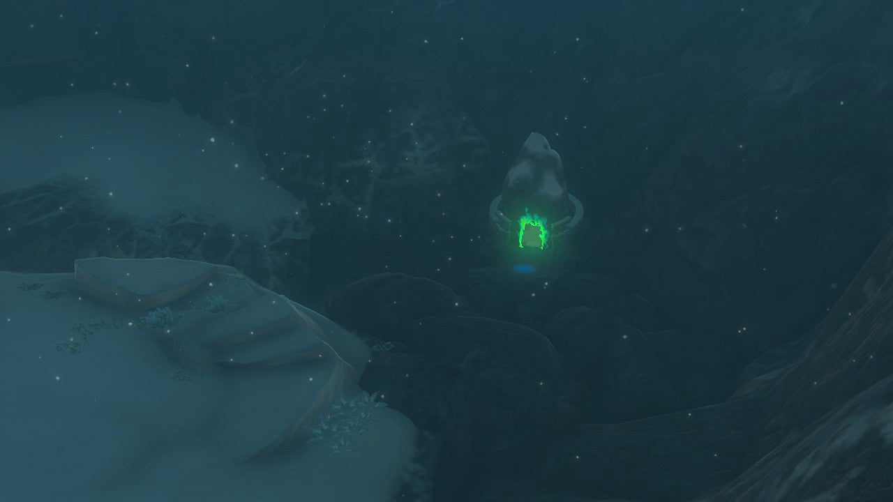
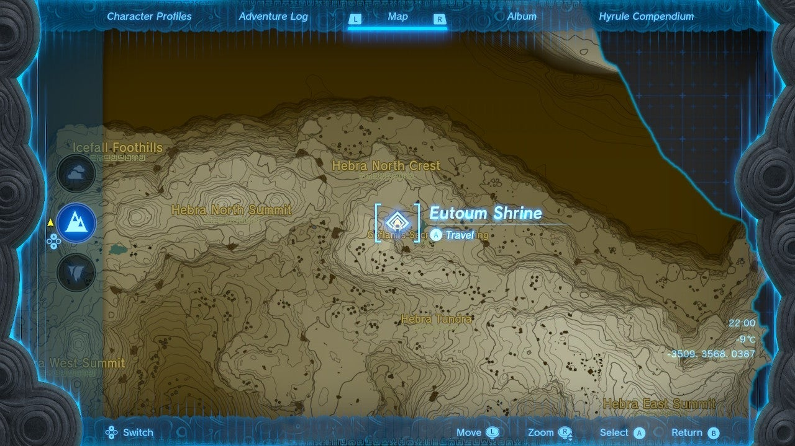
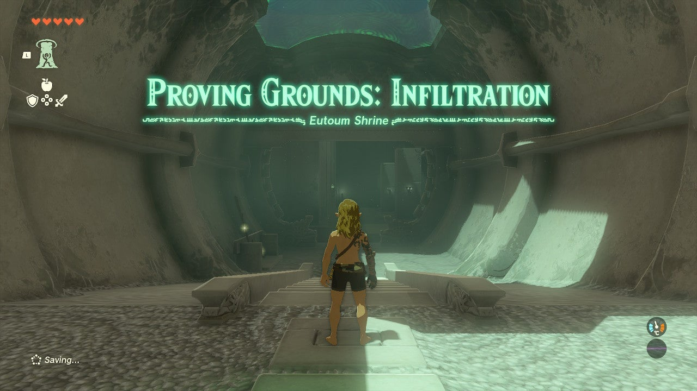
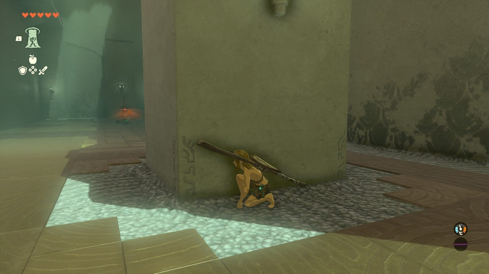
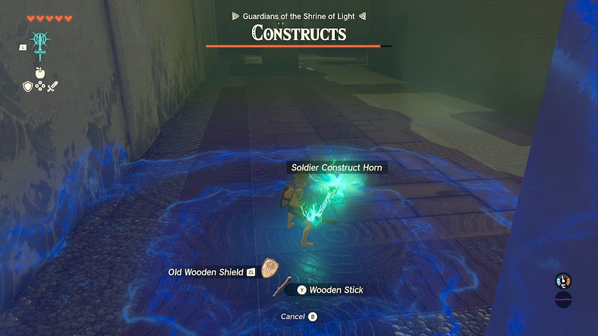
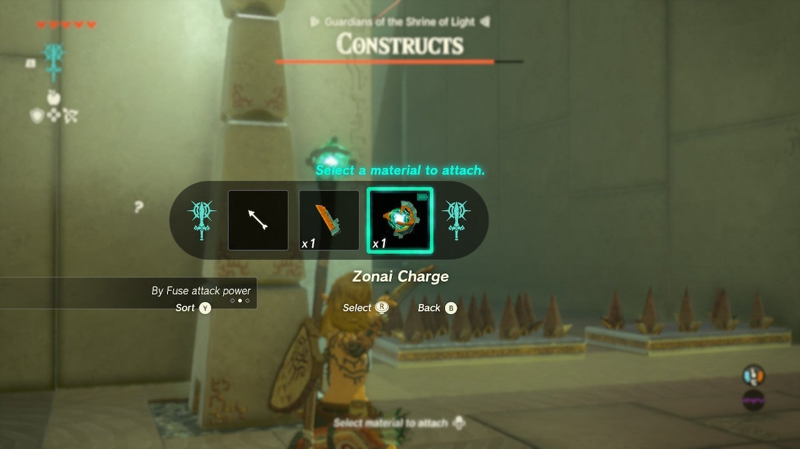
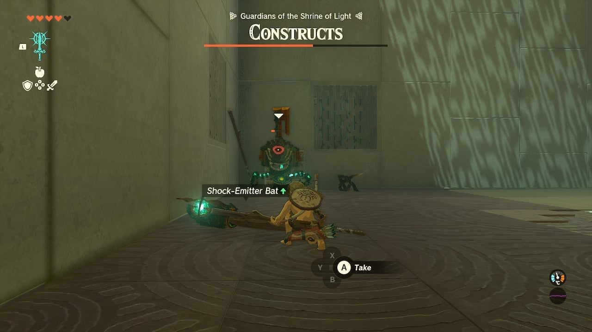
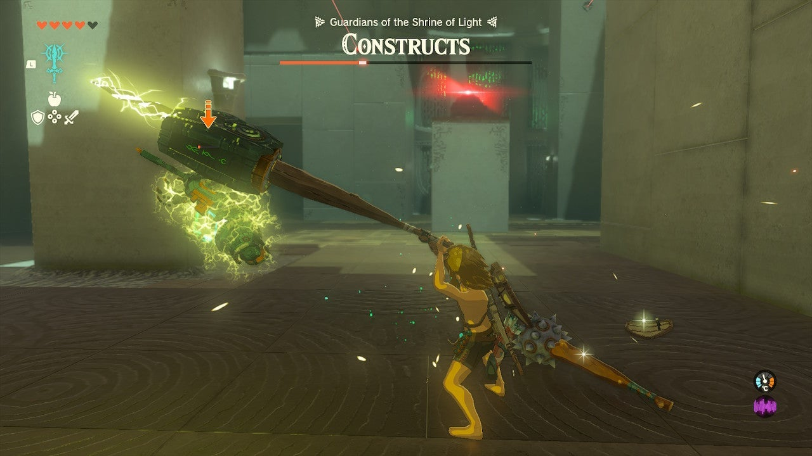
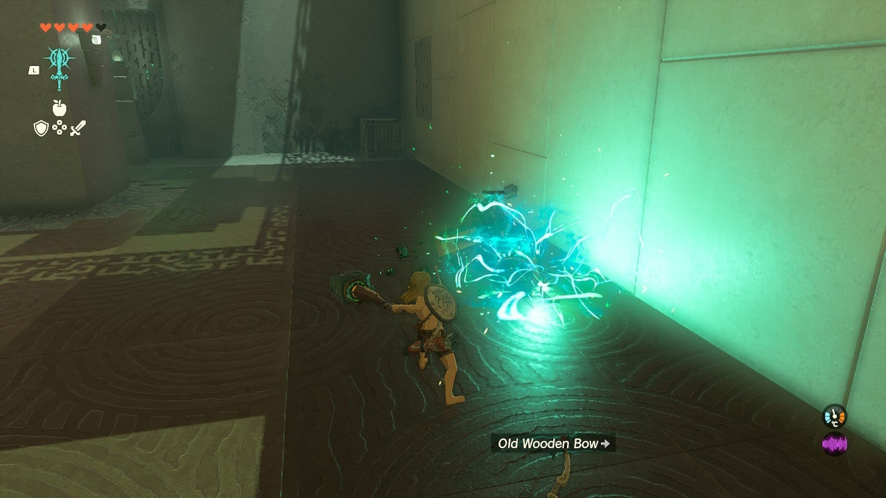
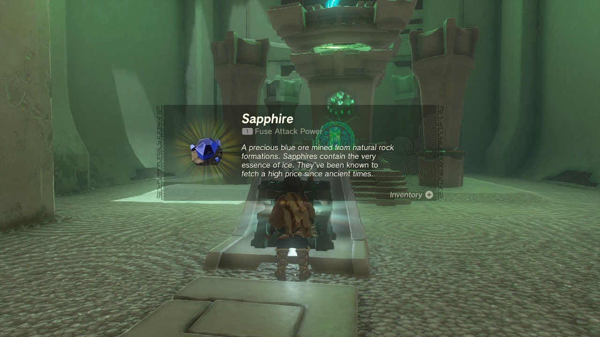

Eutoum Shrine (Proving Grounds: Infiltration) in The Legend of Zelda: Tears of the Kingdom is a shrine located in the Hebra Region. This page contains a guide for how to locate and enter the shrine, a walkthrough for the shrine itself, and puzzle solutions as well as treasure chest locations for the TotK Eutoum shrine. 

### 

### Treasure and Rewards

  * Sapphire

## Location/How to Reach

The Eutoum shrine (Proving Grounds: Infiltration) can be seen and reached from the Rospro Pass Skyview Tower launch. It is almost due north of the tower, and slightly east, in the far north edge of Hebra. It is on the far sideof the peak range, and near a bit of water known as Goflam’s Secret Hot Springs. 

  * Coordinates: -3509, 3568, 0387

## Walkthrough and Puzzle Solutions

**Eutoum Shrine challenges you to a Proving Grounds challenge, meaning all materials, equipment, and food are gone but will be returned at the end of the challenge, once you destroy all Constructs. You'll have to use what's provided instead and get crafty with your abilities.**

You may want to do this shrine after you have more hearts/health later in the game, but it’s completely reasonable even with very few hearts if you follow these steps. 

The goal here is to kill 5 Zonai Constructs with only the provided weapons and equipment. That means you need to get creative with Fuse to boost your weapons. 

The layout is as follows: There are two constructs outside the central chamber, one with a spear, one with a bow. The bow enemy guards the door. Beware the spikes on the floor of the entrance to the chamber. You should leap these when crossing them. They can also be Fused to a weapon but that is not recommended as it allows you to retreat past them, blocking enemies from following you. 

An un-killable enemy alarm bot in the center of the chamber alerts all enemies to your presence when in sight. Inside the chamber are two enemies with powerful weapons and one with an electric/shock equipped bow. 

Grab the spear, stick and shield at the start of the shrine on the left side. Equip the spear and kill the first enemy to the right, patrolling. It will drop another spear and two items, each can be Fused to your current weapons to increase their strength. 

  
Now, rush the bow wielding construct at the door to the chamber and stay out of line-of-site from the enemies chucking rocks within. 

Once its dead, grab the bow and use it and Fuse to weaken the enemies inside (draw a shot, hold UP on the DPAD and select and item to fuse). 

Once you are out of arrows, wait for the enemies inside to go back to their routines. The closest one just inside to the left is your next target. 

Hop the spikes when the other enemy has returned far across the room and hit it with your strongest Fused weapon. If the far enemy rushes you, retreat across the spikes and let them separate again. 

You will eventually kill the first enemy inside and it drops a weapon with a shock charge – use this to kill the next enemy, the one from across the room. Retreat across the spikes to let it come to you for easy attacking – it cannot cross the spikes. 

Now, there’s one more enemy with a bow that you can rush with your electric weapon. It will instantly paralyze this enemy and it will be over in a jiffy. 

## Treasure Location

A Sapphire awaits you in a chest as you exit. 

Eutoum Shrine

Congrats on solving the shrine and earning a Light of Blessing! Click or tap here to return to the rest of the Shrine Guides.

### Up Next: Walkthrough

Previous

About IGN's Zelda TotK Guide Writers

Next

Walkthrough

### Top Guide Sections

  * Walkthrough
  * Zelda: Tears of The Kingdom Switch 2 Edition Guide
  * Zelda Notes Voice Memories
  * List of Side Quests and Side Adventures

### Was this guide helpful?

Leave feedback

Go to comments