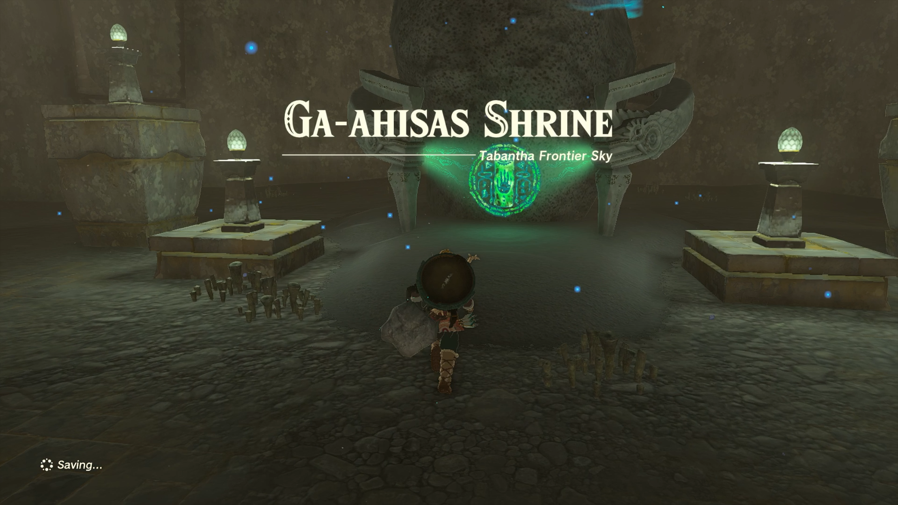

Ga-ahisas Shrine (Rauru’s Blessing) in Zelda: Tears of the Kingdom is a shrine located on Lightcast Island in the Tabantha Frontier Sky region. This page contains a guide for how to locate and enter the shrine, a walkthrough for the shrine itself, and puzzle solutions as well as treasure chest locations for the TotK Ga-ahisas shrine. 

### Ga-ahisas Treasure and Rewards

  * Star Fragment

## Ga-ahisas Location/How to Reach

Ga-ahisas Shrine is located on **Lightcast Island** , west of Lindor’s Brow Skyview Tower. Approach the stone circle on the west part of the island and touch the green hand field to activate. This will drain the water. 

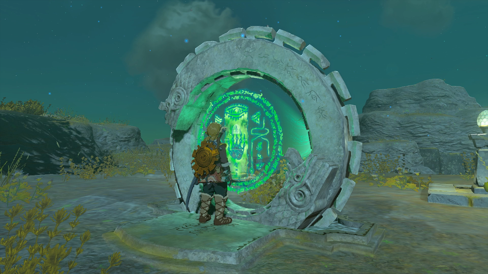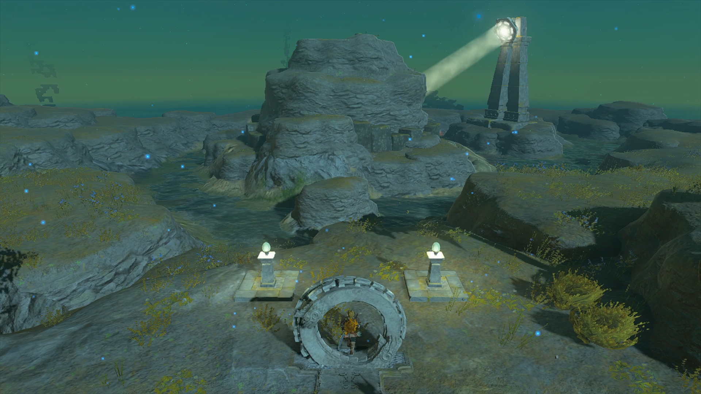

Head toward the area where the spotlight is shining. Fight the Soldier Construct guarding the entrance. Use a rock-fused weapon or Bomb Flower to destroy the blocked entrance. Continue into the cave. 

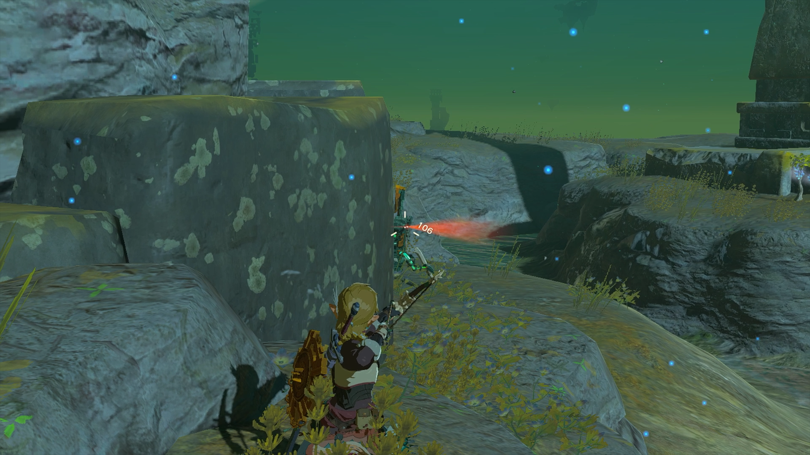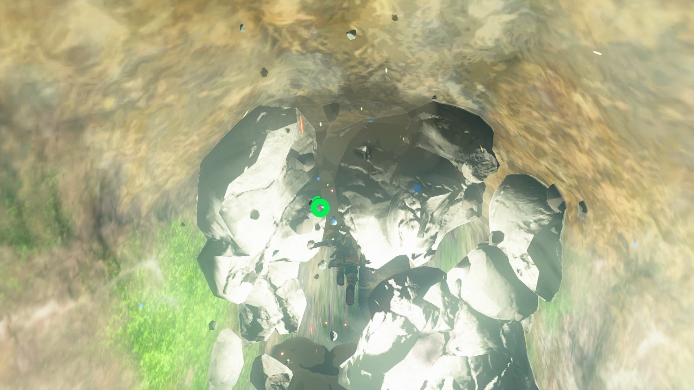

Now the light shines into the cave. Move the provided mirrors to reflect the light by either picking them up or by using Ultrahand. Before you continue to solve the light puzzle, paraglide to the right of the entrance to find the treasure chest, which contains **3 Mirror** Zonai devices. 

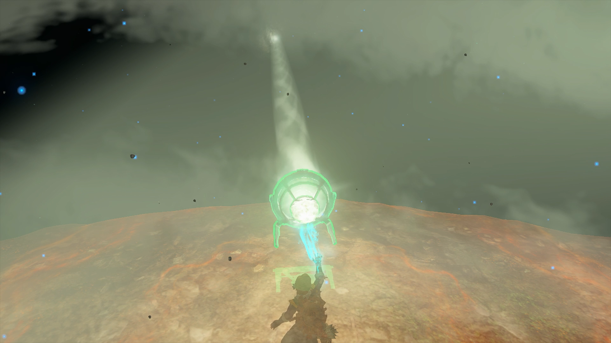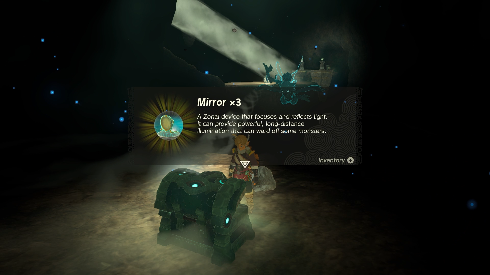

Head back to the main entrance area. Move the mirror to reflect light across the room until you light up another mirror. Head to that mirror and rotate the reflected light again to face another mirror across the room. Continue this process until you point the light at a mirror that reflects light down. 

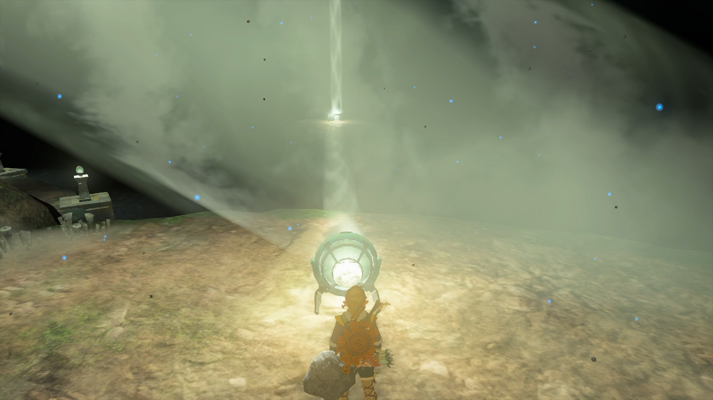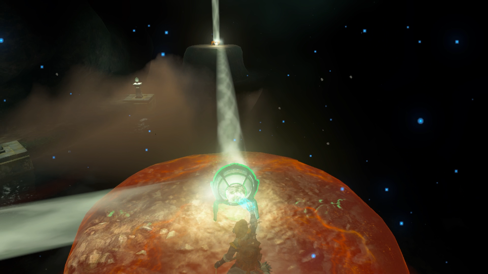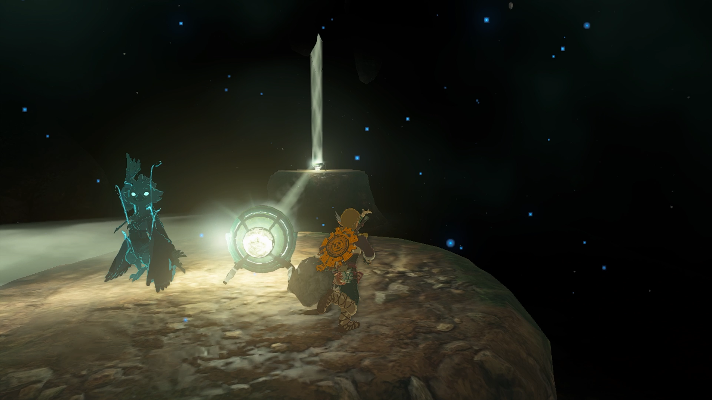

Glide toward the light beam and stop before jumping down. There is another Soldier Construct standing in front of the yellow hexagon. Fight the enemy by shooting arrows from this raised area. 

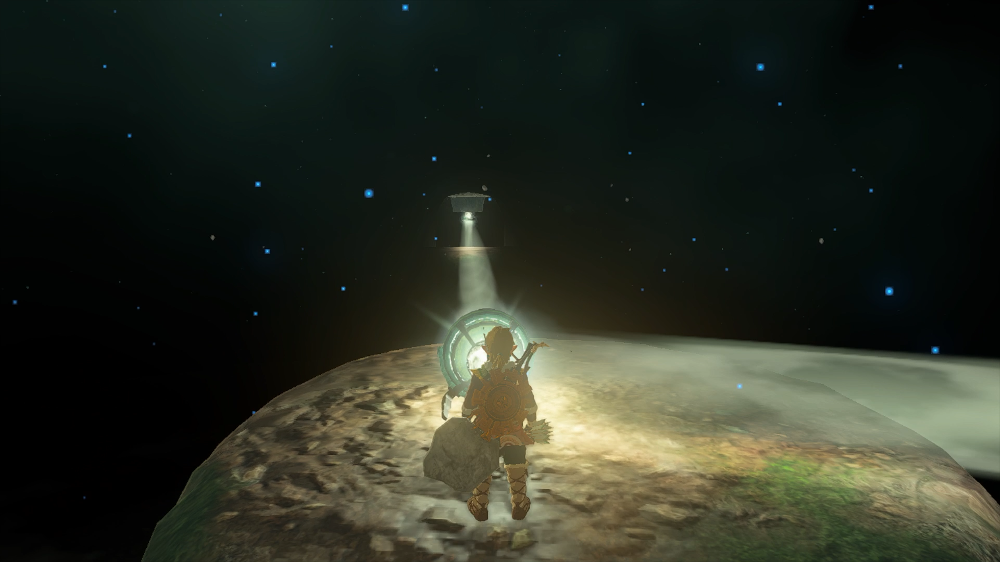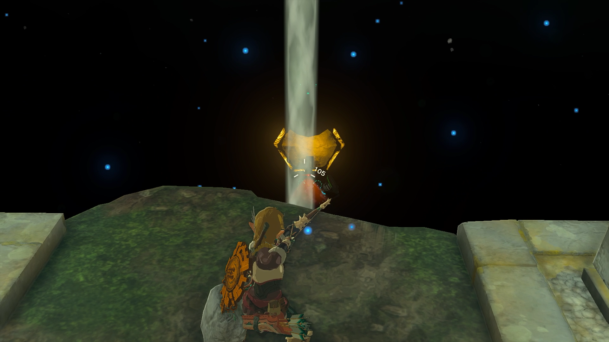

The defeated construct will drop a Mirror Shield. Pick up and equip the Mirror Shield. Stand in the light beam and angle the shield to reflect light directly onto the yellow hexagon. 

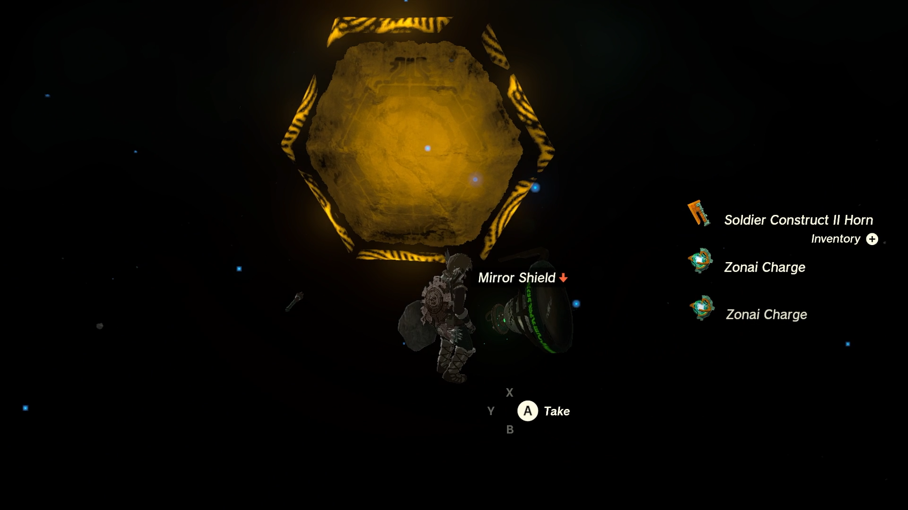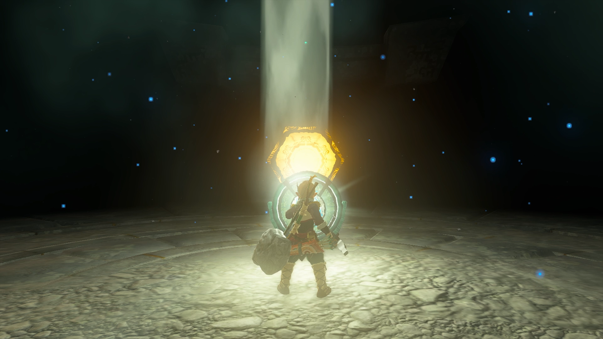

The light will charge it up and turn the hexagon green. There is one more treasure chest on the ledge above the hexagon. Use Ascend to access the chest to receive a **Zonaite Helm**. 

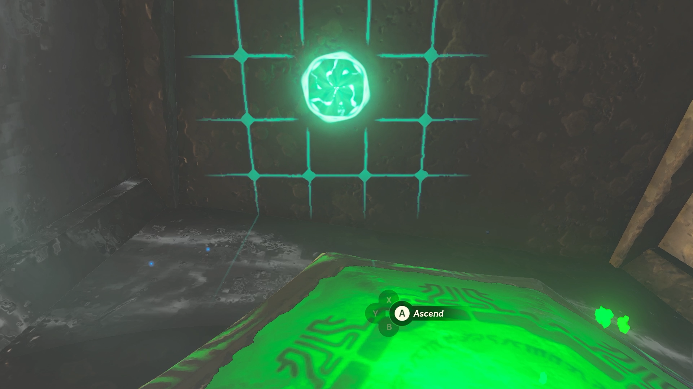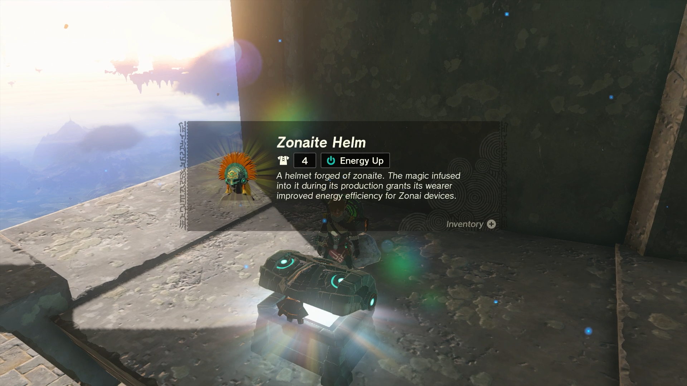

After the platform raises, head to the right where you will find stairs that lead you down to the Ga-ahisas Shrine. 

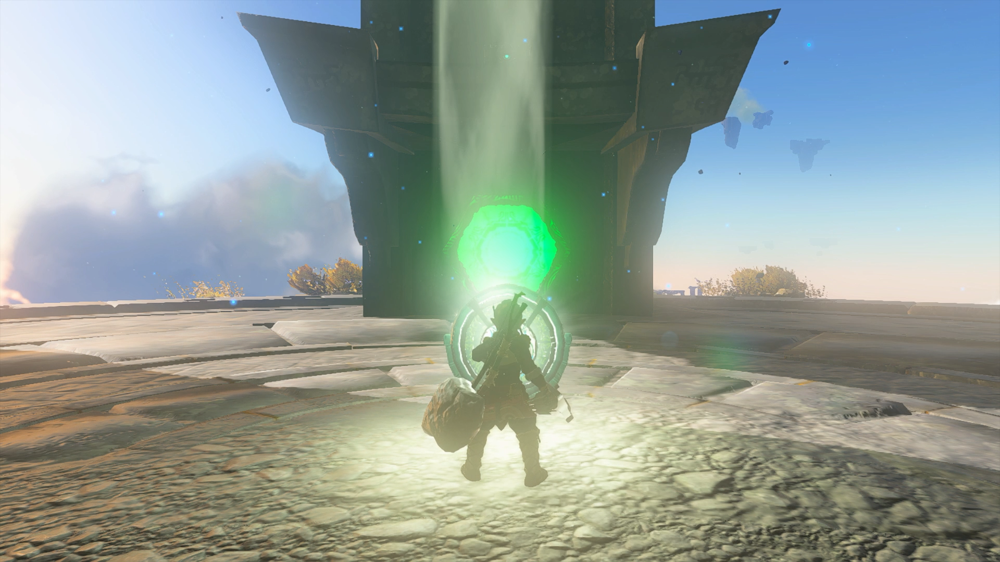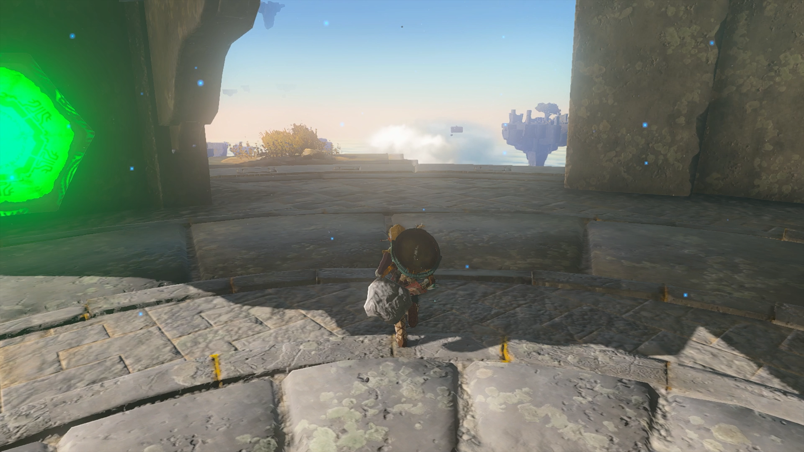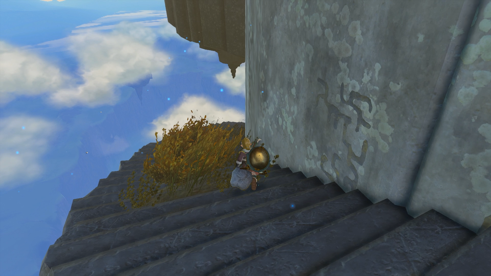

  * Coordinates: -3595, 0957, 1699

## Ga-ahisas Walkthrough and Puzzle Solutions

Enter the shrine and you will be rewarded with Rauru’s Blessing. Head straight up the stairs to open the treasure chest with a Star Fragment inside. Continue up the next set of stairs to exit the shrine. 

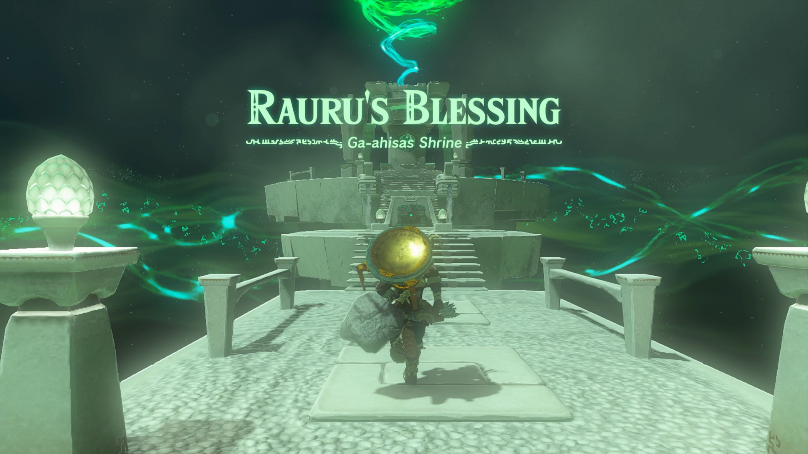

Ga-ahisas Shrine

Congrats on solving the shrine and earning a Light of Blessing! Click or tap here to return to the rest of the Shrine Guides. You can also check out which shrines are nearby with our shrine map filter on our complete map of Hyrule.

### Up Next: Walkthrough

Previous

About IGN's Zelda TotK Guide Writers

Next

Walkthrough

### Top Guide Sections

  * Walkthrough
  * Zelda: Tears of The Kingdom Switch 2 Edition Guide
  * Zelda Notes Voice Memories
  * List of Side Quests and Side Adventures

### Was this guide helpful?

Leave feedback

Go to comments