Ganos Shrine (Rauru’s Blessing) in Zelda: Tears of the Kingdom is a shrine located on Lightcast Island in the Tabantha Frontier Sky region and is one of 152 shrines in TOTK (see all shrine locations). In order to access it you'll need to complete **The Tabantha Sky Crystal Shrine Quest**. 

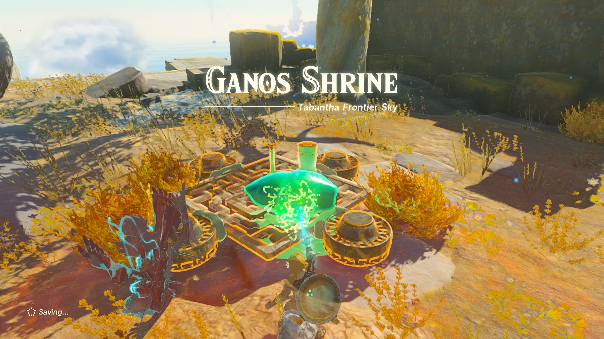

### Ganos Treasure and Rewards

  * Diamond

## The Tabantha Sky Crystal Shrine Quest

Ganos Shrine is located on a sky island in Tabantha Frontier Sky, north of Gerudo Highlands Skyview Tower. If you have already unlocked the Ga-ahisas Shrine in **Lightcast Island** , head southeast with your Paraglider. 

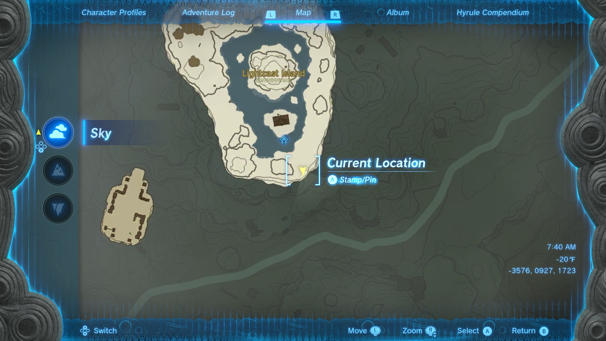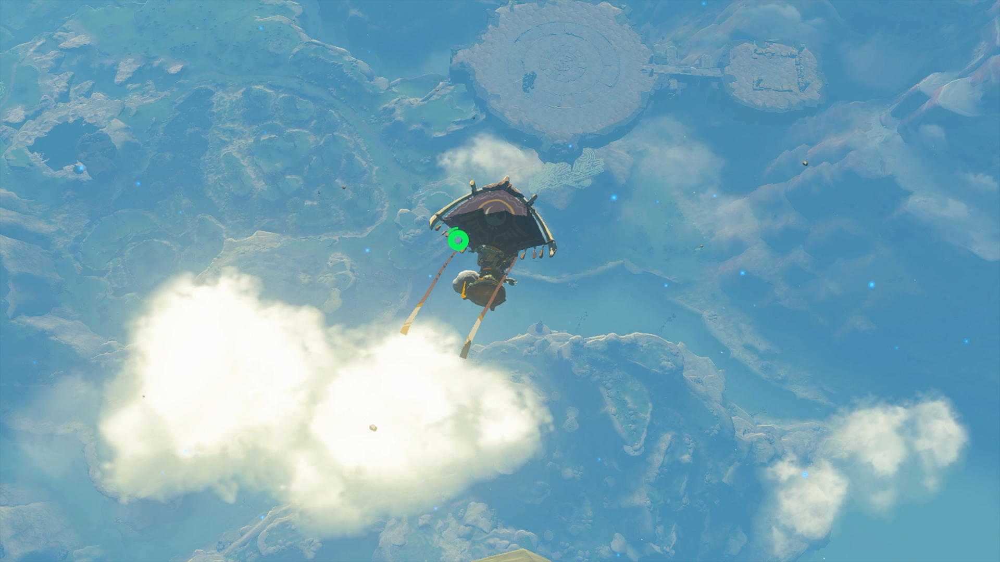

You will approach a sky island with a **Flex Construct III**. Get this enemy’s attention and wait for it to slam attack on the ground while avoiding the hit. Use Ultrahand during the brief moment of no movement to remove the **Tabantha Sky Crystal** attached to its body. 

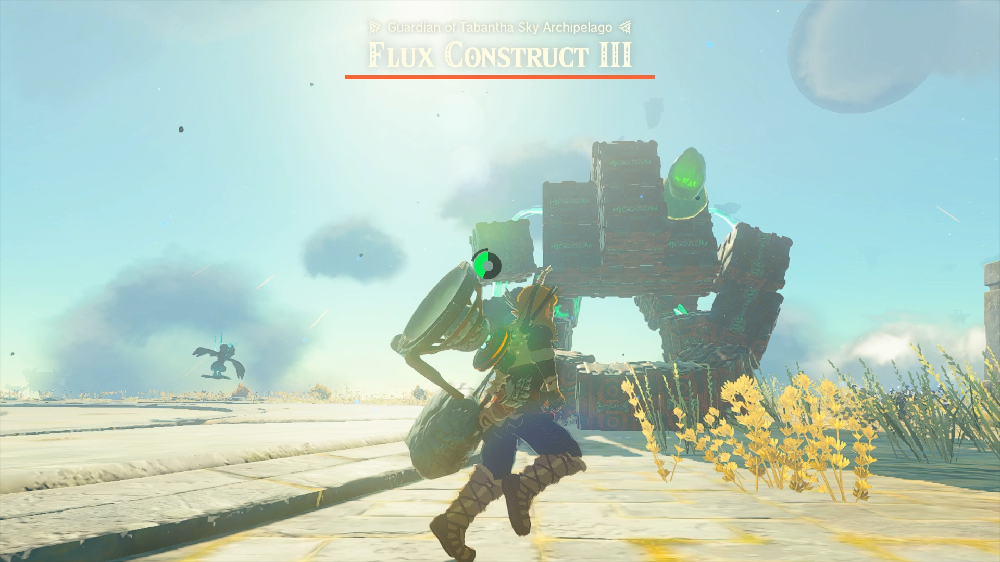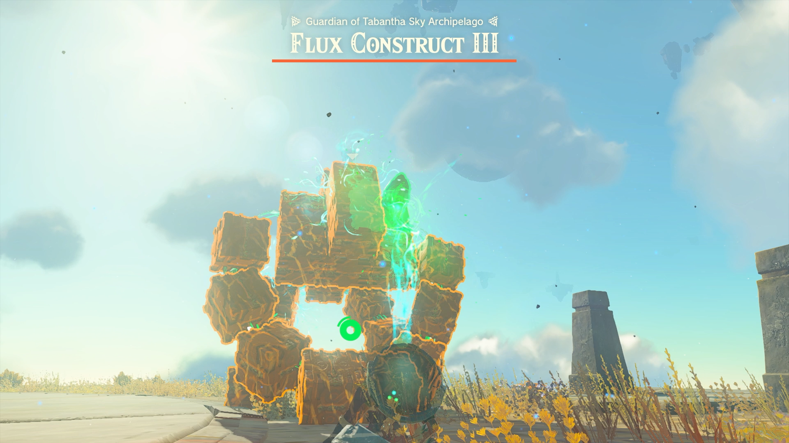

Quickly carry the crystal across the bridge. Attach the crystal to the flying contraption using Ultrahand. There are additional materials nearby. Use Ultrahand to grab two more **Zonai batteries** and attach them to your vehicle. 

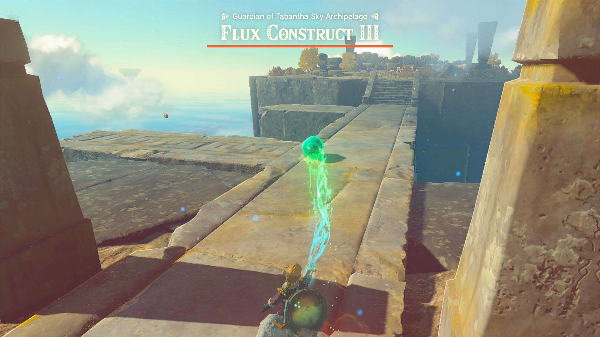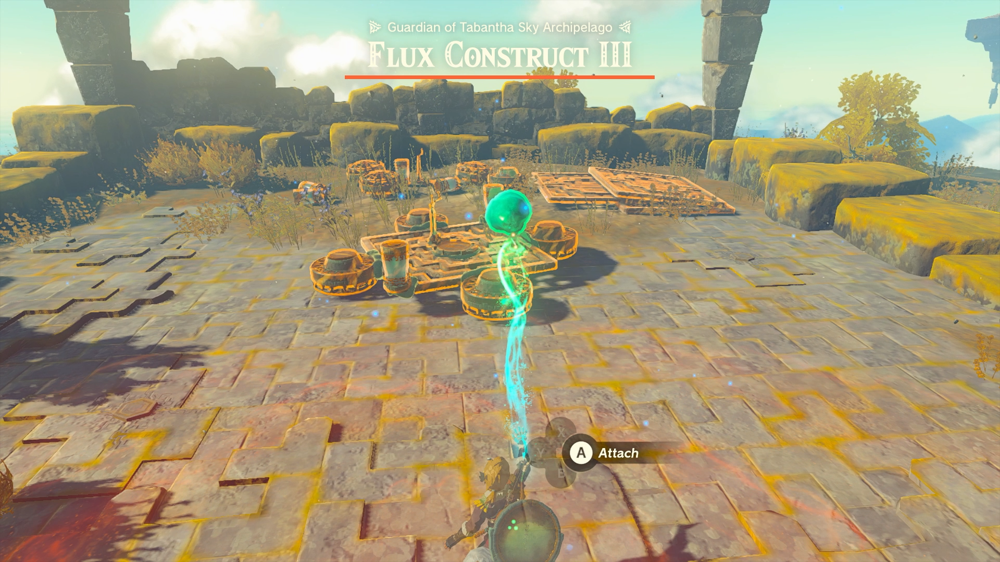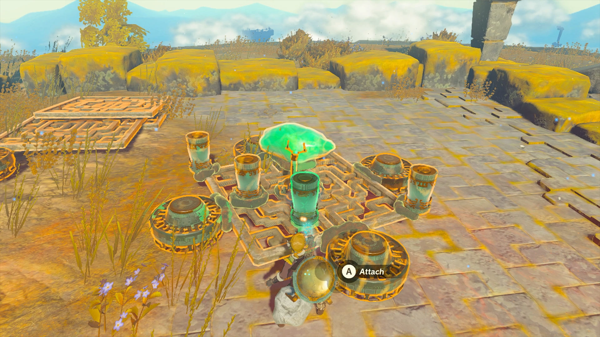

Jump on and control the vehicle to begin hovering up into the air. Travel to the sky island south of your location where you will see a horseshoe. When you are above the location, let go of the control to let the vehicle free-fall down. 

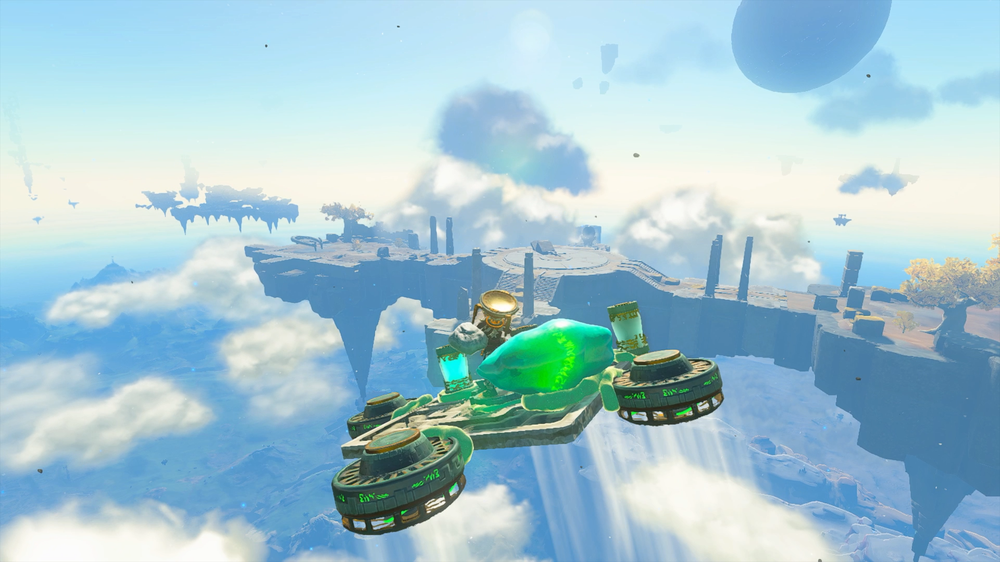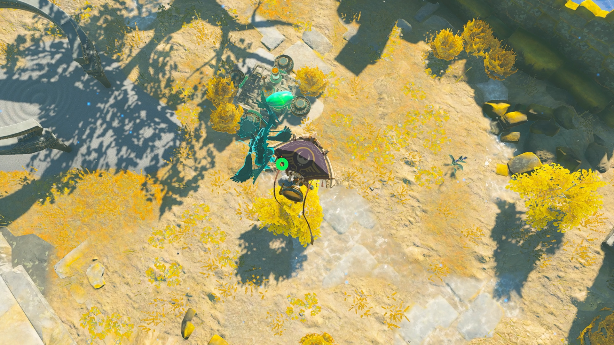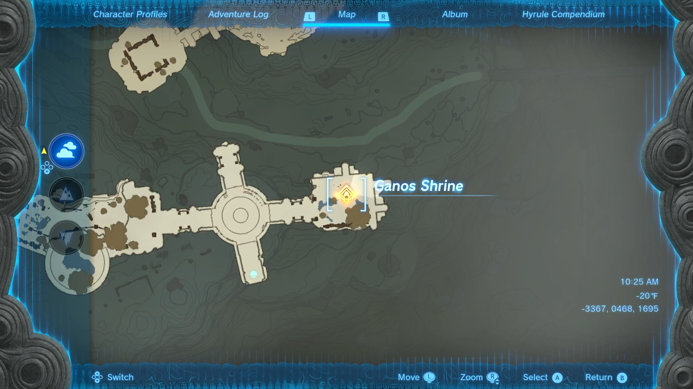

Remove the crystal and approach the shrine location. Activate the green hand to get instructions. Use Ultrahand to move the crystal to the glowing green marker to activate the shrine. 

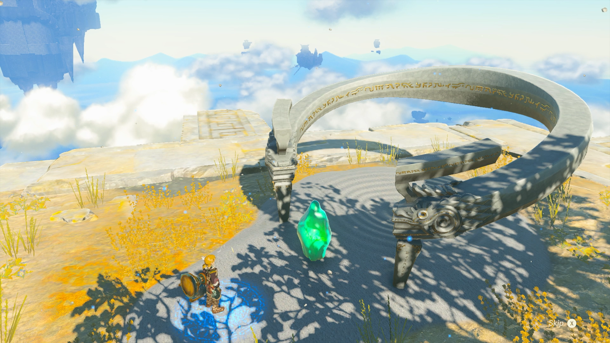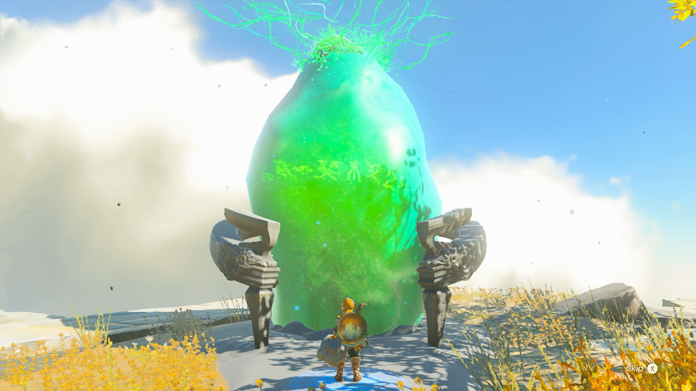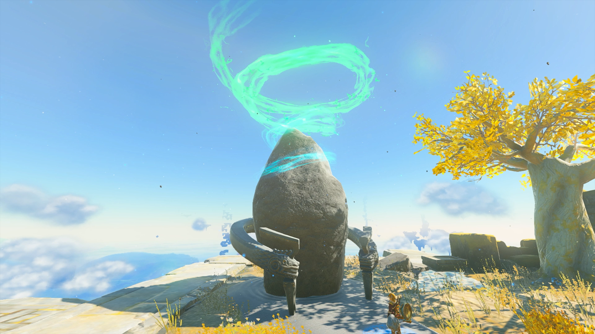

  * Coordinates: -3367, 0468, 1695

The Tabantha Sky Crystal

## Inside Ganos Shrine

Enter the shrine and you will be rewarded with Rauru’s Blessing. Head straight up the stairs to open the treasure chest with a Diamond inside. 

Continue up the next set of stairs to exit the shrine. 

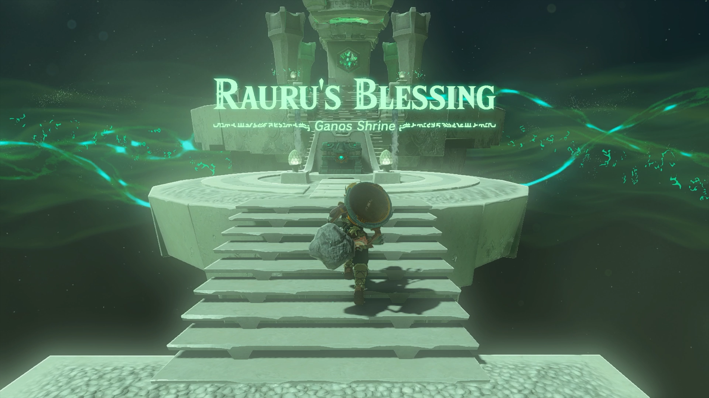

Ganos Shrine

Congrats on solving the shrine and earning a Light of Blessing! Click or tap here to return to the rest of the Shrine Guides. You can also check out which shrines are nearby with our shrine map filter on our complete map of Hyrule.

### Up Next: Walkthrough

Previous

About IGN's Zelda TotK Guide Writers

Next

Walkthrough

### Top Guide Sections

  * Walkthrough
  * Zelda: Tears of The Kingdom Switch 2 Edition Guide
  * Zelda Notes Voice Memories
  * List of Side Quests and Side Adventures

### Was this guide helpful?

Leave feedback

### In This Guide

The Legend of Zelda: Tears of the KingdomNintendo EPD

Initial Release: May 12, 2023

Learn more

Go to comments