Gasas Shrine (**Well-Timed Cuts**) in The Legend of Zelda: Tears of the Kingdom is a shrine located in the Tabantha Frontier and one of 152 shrines in TOTK (see all shrine locations). This page contains a guide for how to locate and enter the shrine, a walkthrough for the shrine itself, and puzzle solutions as well as treasure chest locations for the TotK Gasas shrine. 

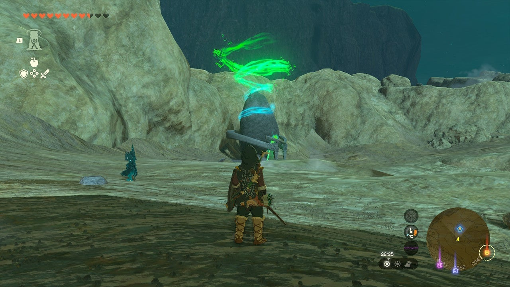

### Treasure and Rewards

  * Large Zonai Charge

## Gasas Shrine Location

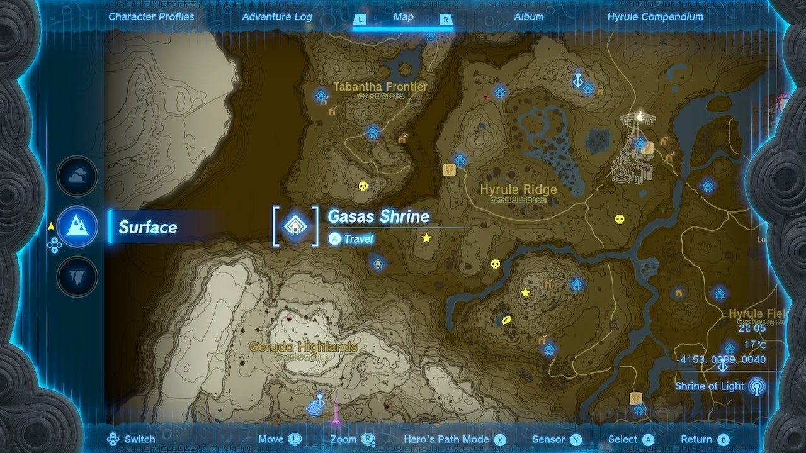

In the far southwest of Tabantha Frontier, at the tail southwest end of the massive Tanagar Canyon you can find Gasas Shrine out in the open. 

  * Coordinates: -3079, 1617, 0243

## Gasas Shrine Walkthrough

The first area has a large cube hanging from a rope. Two barrels to the left of the cube hold Arrows x5, so lift those aloft with Ultrahand and drop them to get the arrows, you’ll need them! 

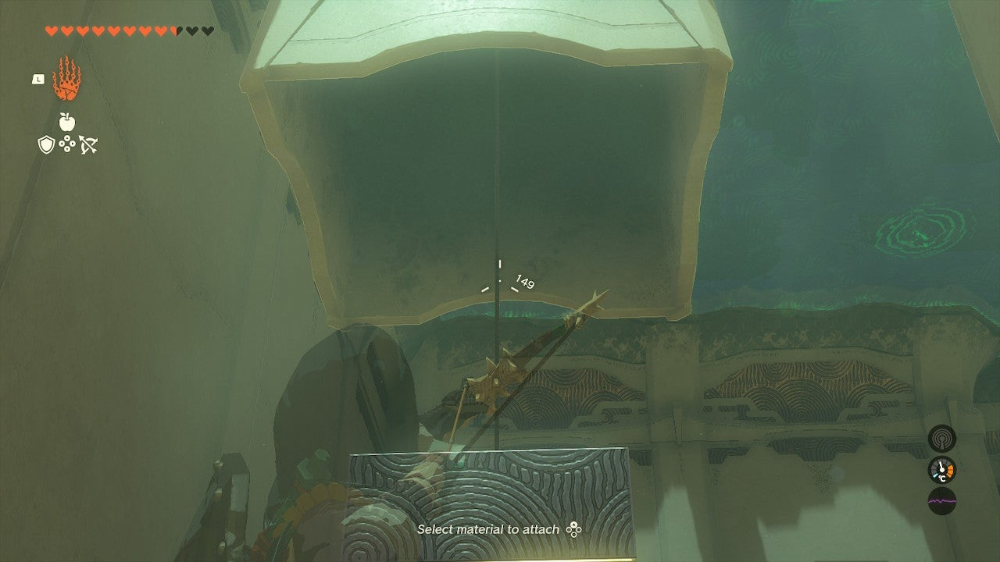

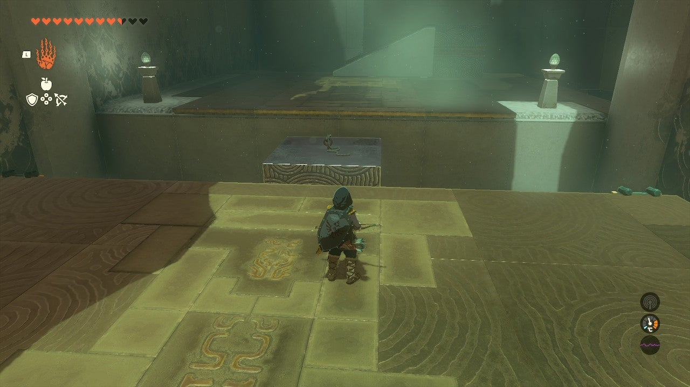

Aim an arrow at the rope holding the cube to snap it. Retrieve your arrow which will be in the gap by the cube. Cross the cube. 

In the next area there’s a high ledge, stairs and another cube. Lift the cube you just crossed and use Ultrahand to fuse it halfway up the next cube. This creates a “step” block you can place by the stairs and lean against the ledge wall to climb up.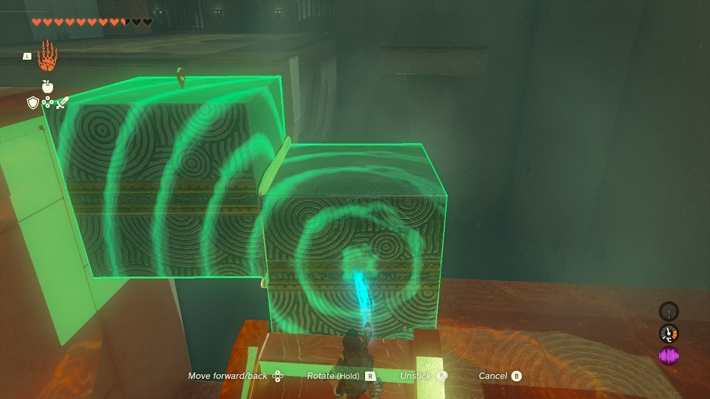

From here you’ll see two panels on the ground and a cap, and a chest hanging across the way. Use Ultrahand to glue the two panels end-to-end, then use them as a bridge to cross to the next area with the hanging chest. 

## Treasure Chest Location

Use the bridge you made to move directly under the chest. Shoot the chest rope with an arrow to bring the chest down on the bridge and obtain the Large Zonai Charge inside. 

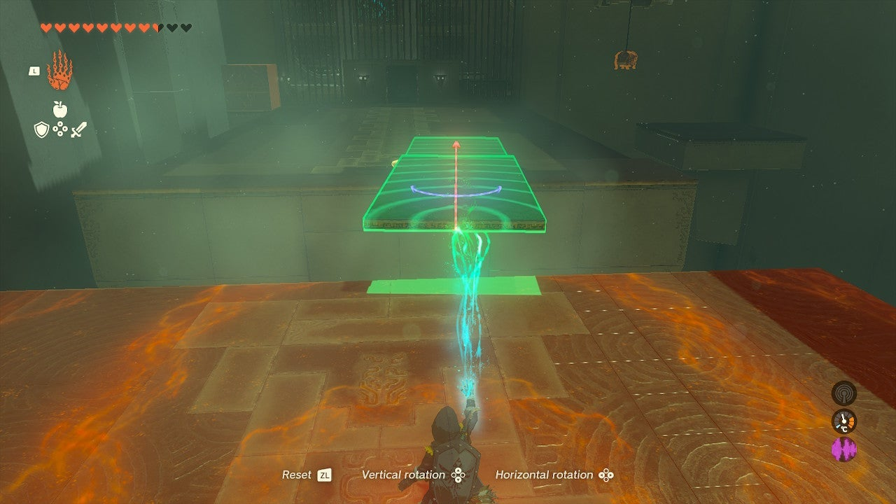

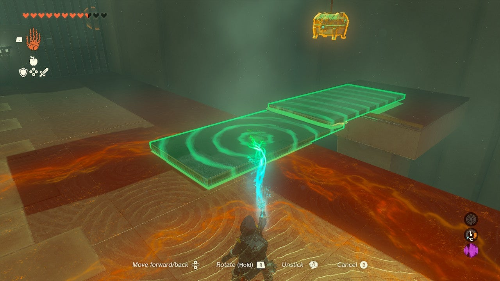

There is yet another chest in this room, hanging along the wall. This contains the **Small Key** you need to exit the shrine. You need a bridge under this chest, but you’ll need to weigh your bridge down on one end with the large cube so it doesn’t fall into the abyss! 

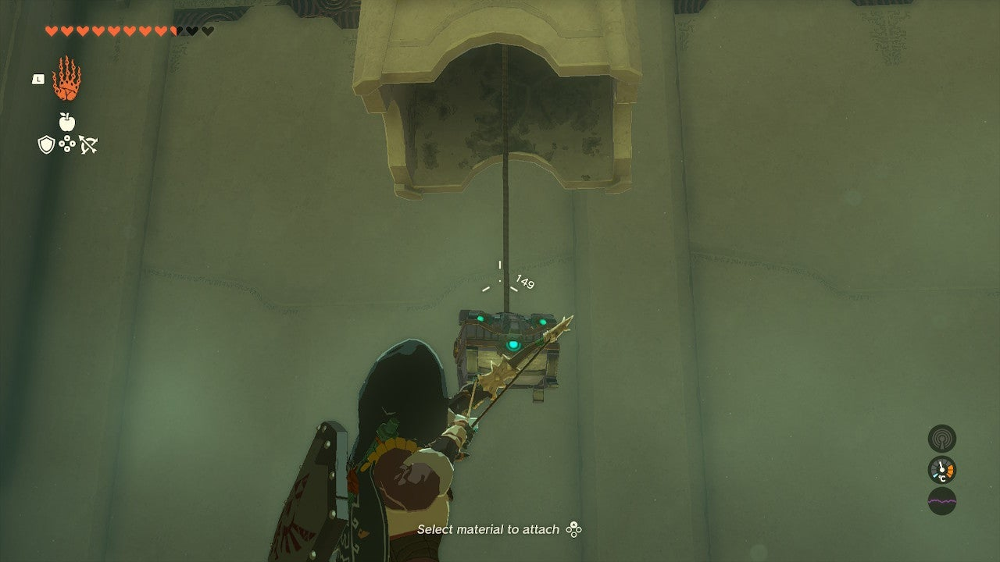

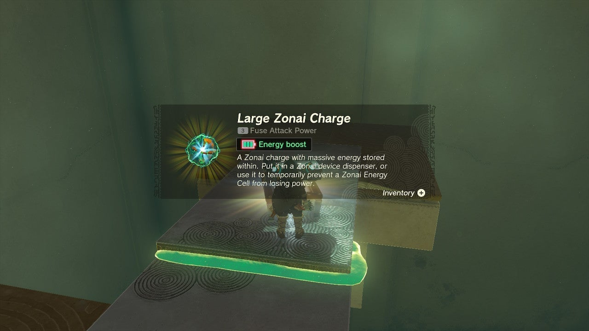

Use Ultrahand to add the cube in the corner to your bridge and place it under the chest. Shoot the rope, get the Small Key, and use it on the green door to get to the next room. 

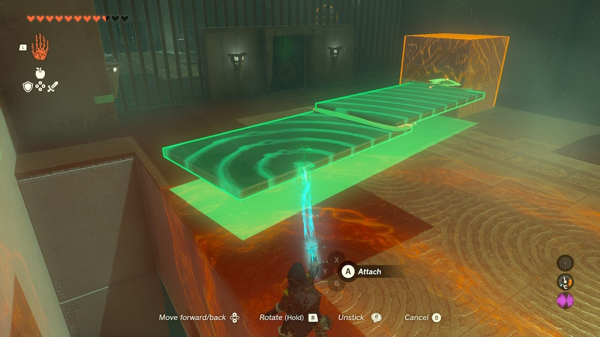

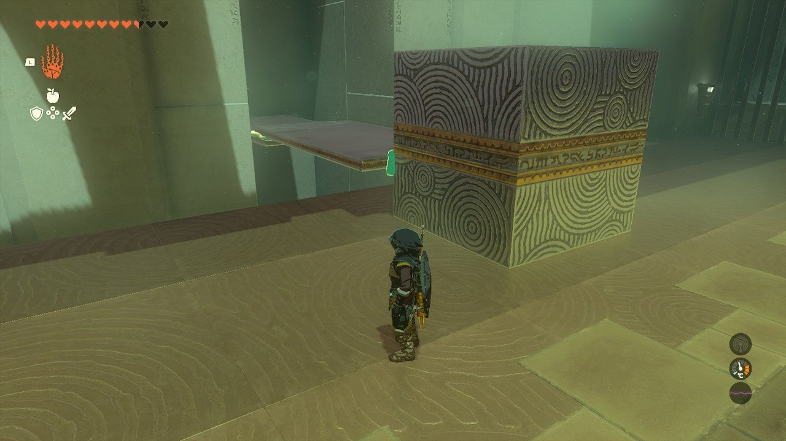

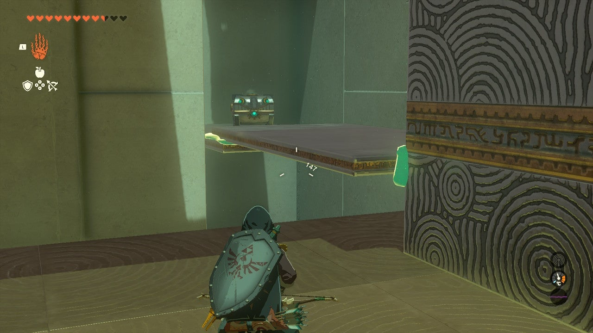

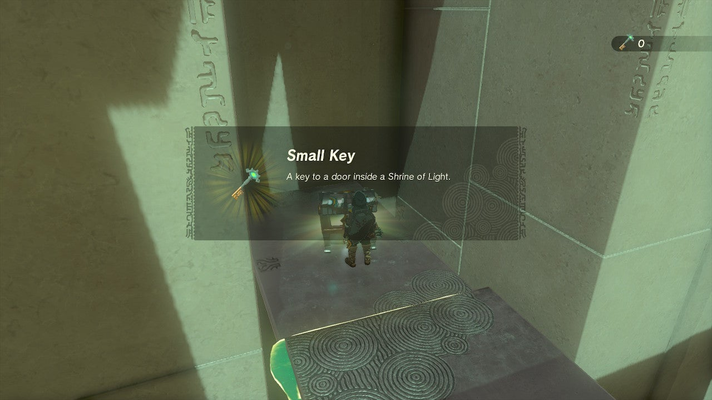

In the final room a large sphere hangs from a long rope. Your goal here is to get the sphere swinging and then shoot the rope, while the sphere is swung out over safe ground, away from the abyss. 

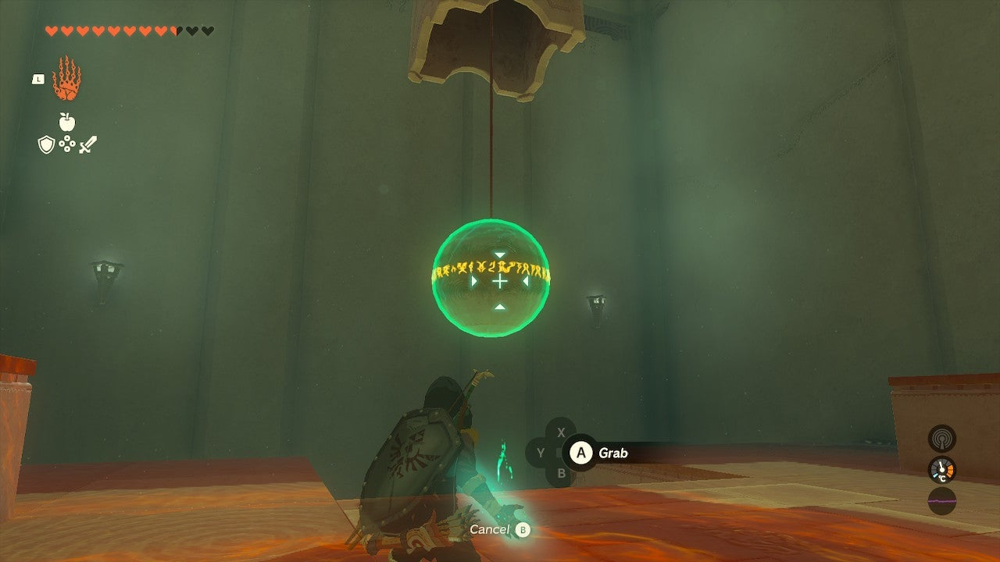

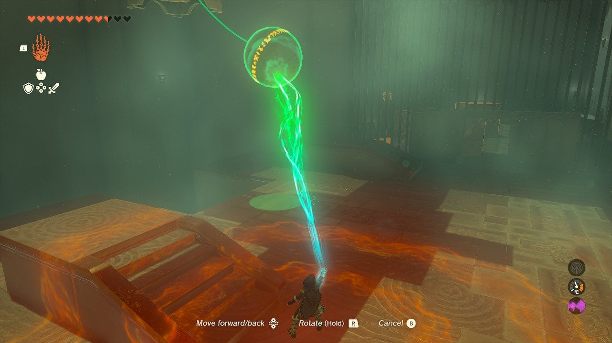

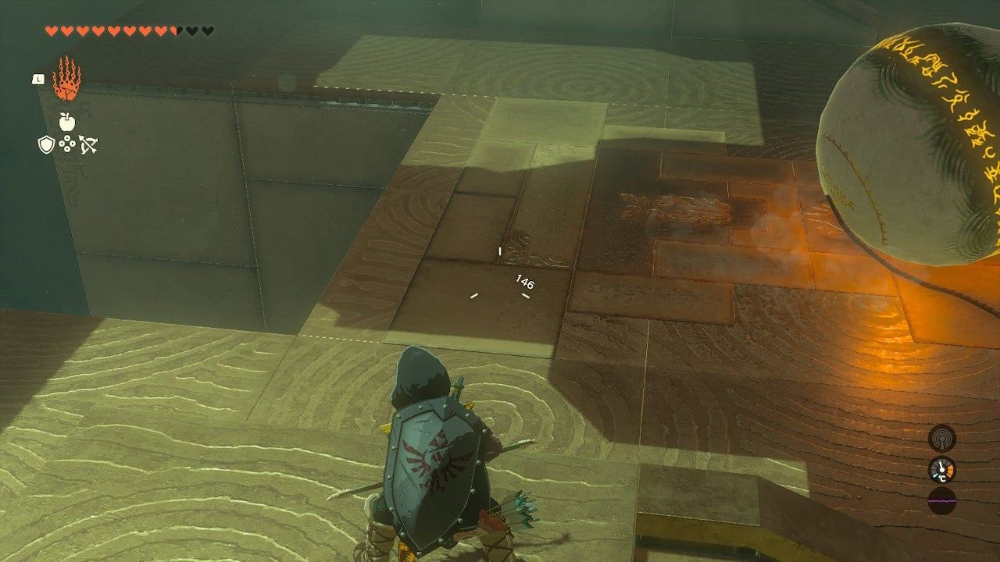

Use Ultrahand to grab the sphere and **pull it towards the target**. Then, aim your arrows at the top of the rope and time it _just right_ so the sphere drops while swinging over solid land. To get better timing, **you can slow down time by jumping off the stairs and using your paraglider**. Shooting in mid-air starts slow motion – but you can easily get the shot without doing so. 

Gasas Shrine

Congrats on solving the shrine and earning a Light of Blessing! Click or tap here to return to the rest of the Shrine Guides. You can also check out which shrines are nearby with our shrine map filter on our complete map of Hyrule.

### Up Next: Walkthrough

Previous

About IGN's Zelda TotK Guide Writers

Next

Walkthrough

### Top Guide Sections

  * Walkthrough
  * Zelda: Tears of The Kingdom Switch 2 Edition Guide
  * Zelda Notes Voice Memories
  * List of Side Quests and Side Adventures

### Was this guide helpful?

Leave feedback

Go to comments