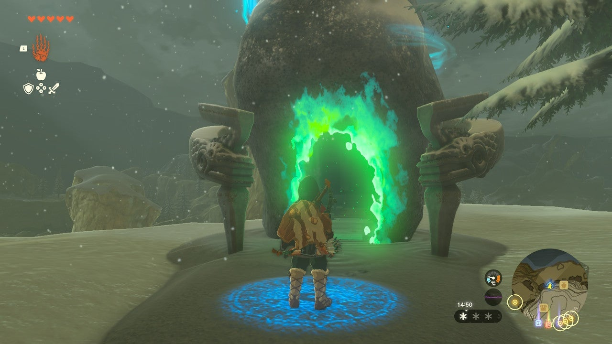
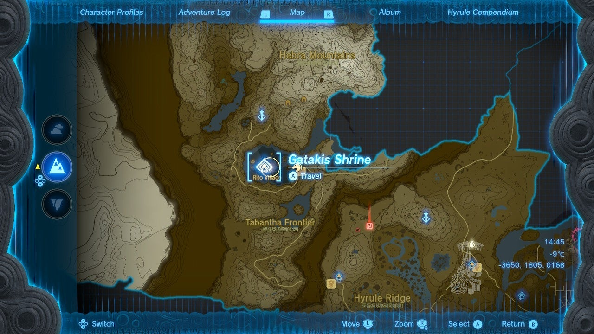
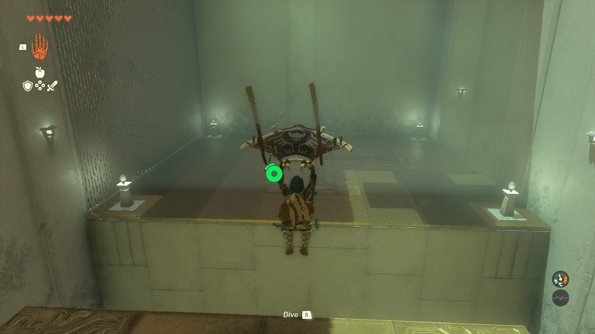
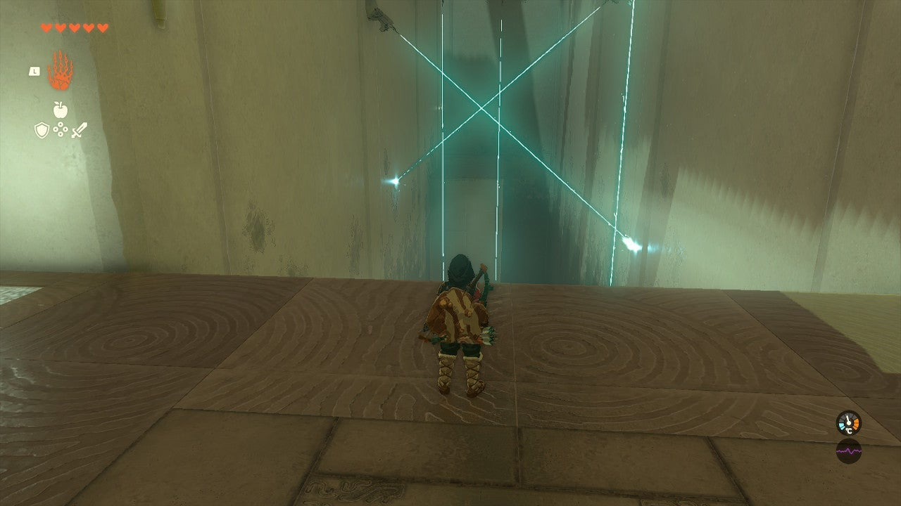
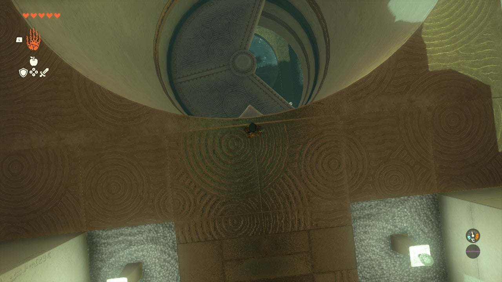
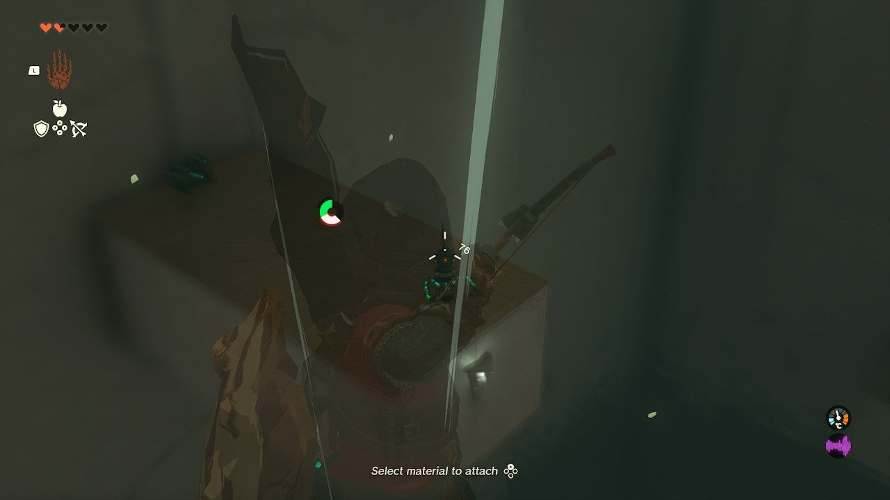
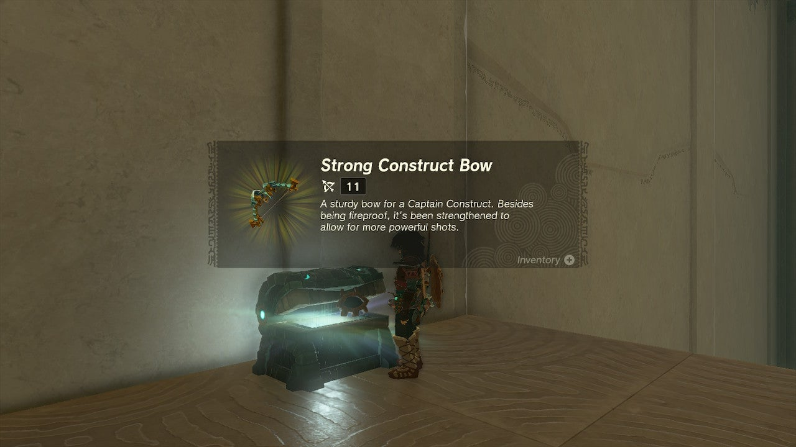
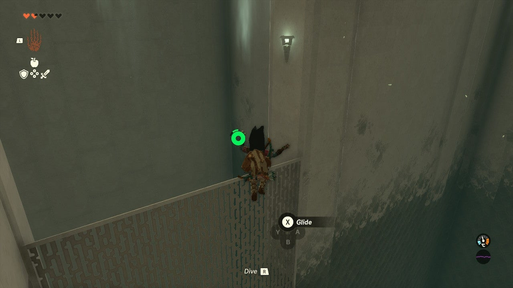
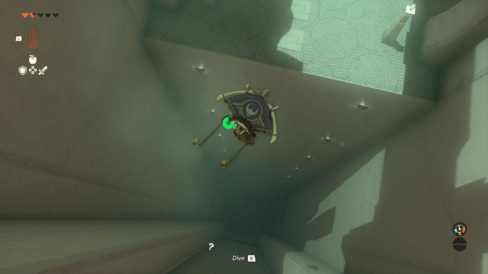

Gatakis Shrine (Ride the Winds) in The Legend of Zelda: Tears of the Kingdom is a shrine located in the **Hebra Region**. This page contains a guide for how to locate and enter the shrine, a walkthrough for the shrine itself, and puzzle solutions as well as treasure chest locations for the TotK Gatakis shrine. 

### Treasure and Rewards

  * Strong Construct Bow

## Location/How to Reach

Gatakis Shrine is located in the lower tier of the Rito Village in Hebra, around the west side. To reach Rito Village, approach from the east and at Lucky Clover Gazette, use the campfire by the downed bridge to create an updraft by throwing a Hylian Pinecone on it. Hylian Pinecones can be found in Central Hyrule, they are in forests and often dropped by the trees that attack you. Use the updraft to catch a ride with your paraglider across the gap. 

  * Coordinates: -3651, 1805, 0168

## Walkthrough and Puzzle Solutions

The Gatakis shrine is all about wind and your paraglider. Cross the first chasm with your paraglider and note the strong wind. 

The next area is full of lasers. The wind will take you straight across and you won’t drop at all, so you really just need to line up a perfectly straight line here to avoid the lasers: Slightly to the left of center will do. 

The next area is a tube leading down with a rotating apparatus. You need to time your fall to fall through this, as wind blows upwards. Use your paraglider in spurts, tapping and falling to line it up. You can incur fall damage if you drop onto the surface of the spinning device but it won’t hurt to land on it. 

The next area has a large ice sheet. Land carefully on it and jump three times to break it. Continue your descent. 

The next room has three constructs that will fire lasers at you. Note on one of the construct platforms on the southwest side is a Treasure Chest. 

## Treasure Chest Location

On one of the construct platforms on the southwest side is a Treasure Chest. Pull out your bow while floating on your paraglider on the updraft and you can freeze time and shoot the construct in the face to stun it. Land, get your treasure, a ‘’’Strong Construct Bow’’’, and you can paraglide out all without conflict. 

There is a gap in the metal paneled wall below the construct platforms here that leads to the exit. You can either take this without killing them or destroy them for parts. 

Gatakis Shrine

Congrats on solving the shrine and earning a Light of Blessing! Click or tap here to return to the rest of the Shrine Guides.

### Up Next: Walkthrough

Previous

About IGN's Zelda TotK Guide Writers

Next

Walkthrough

### Top Guide Sections

  * Walkthrough
  * Zelda: Tears of The Kingdom Switch 2 Edition Guide
  * Zelda Notes Voice Memories
  * List of Side Quests and Side Adventures

### Was this guide helpful?

Leave feedback

### In This Guide

The Legend of Zelda: Tears of the KingdomNintendo EPD

Initial Release: May 12, 2023

Learn more

Go to comments