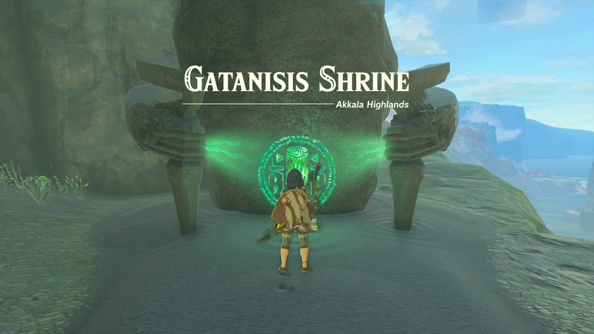
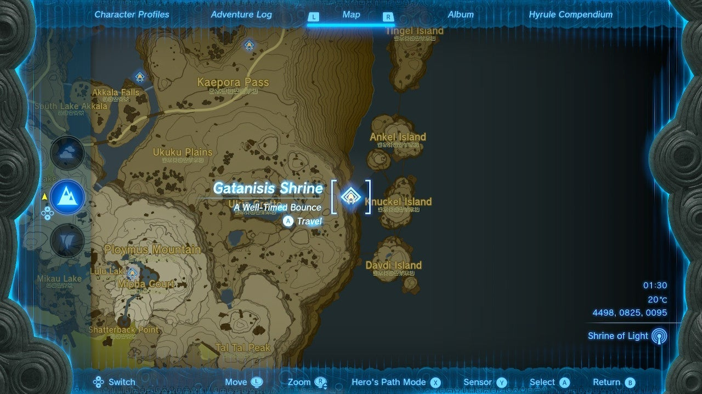
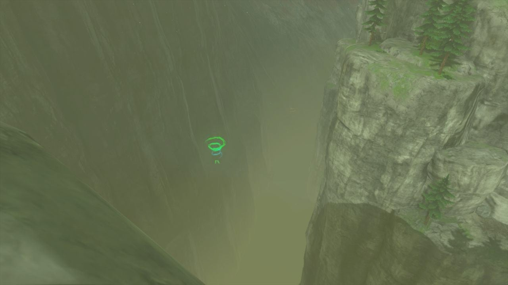
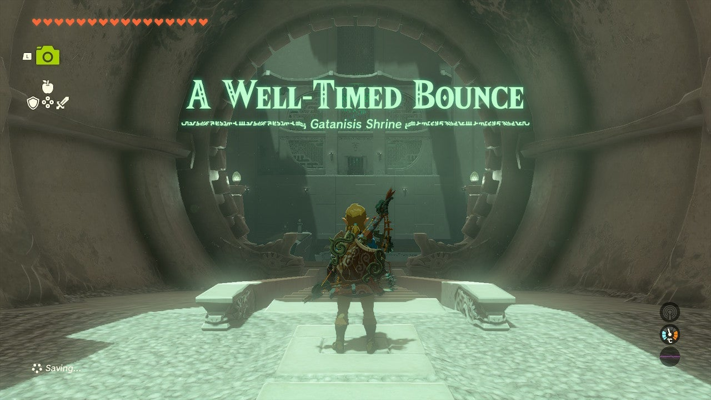
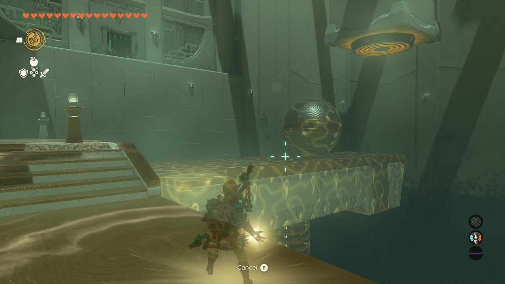
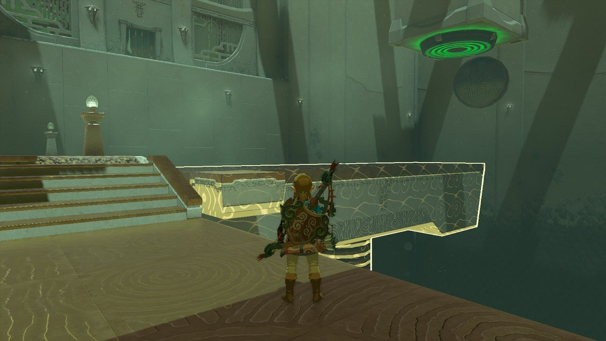
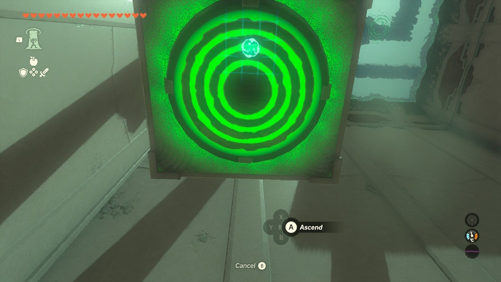
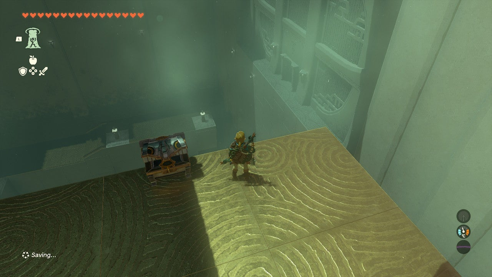
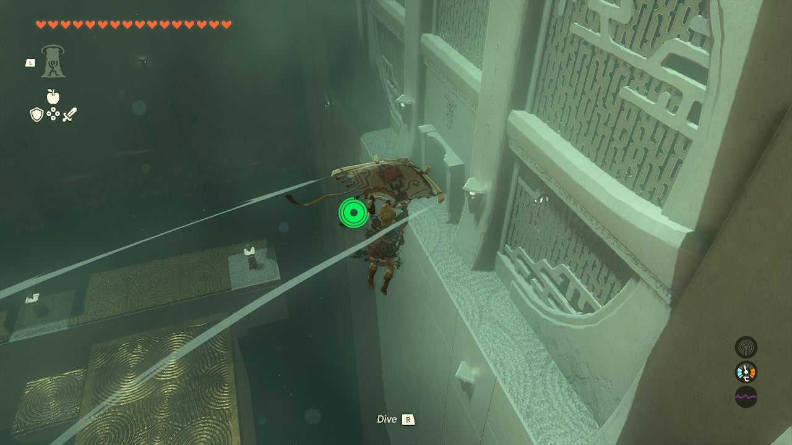

Gatanisis Shrine (**A Well-Timed Bounce**) in Zelda: Tears of the Kingdom is a shrine located in the Akkala Highlands and is one of 152 shrines in TOTK (see all shrine locations). This page contains a guide for how to locate and enter the shrine, a walkthrough for the shrine itself, and puzzle solutions as well as treasure chest locations for the TotK Gatanisis shrine. 

### Treasure and Rewards

  * x5 Bomb Flower

## Gatanisis Shrine Location

 This shrine is stealthily nestled on the cliffside between Ulria Grotto and Knuckel Island, just east of Zora's Domain. 

  * Coordinates: 4497, 0830, 0095

## Gatanisis Shrine Walkthrough

This shrine is one large room with little in it. A massive ball falls and bounces along a spring before rolling into the abyss. 

Equip **Recall**. Watch the ball fall, knocking the spring down. Then, once the ball is at about or a little past halfway down the platform, use **Recall** on the platform (shown below). 

The spring will pull down and suddenly fling the ball into the air, high enough to hit the target. The gate to the exit opens. 

### How to Get the Gatanisis Treasure Chest

The treasure chest is on top of the target platform. To get to it, all you need to do is get under the target and use **Ascend**. Just watch out for the ball so you don't get knocked off! 

With the treasure chest collected (Bomb Flowers), glide down to the exit and collect the Light of Blessing. 

Gatanisis Shrine

Congrats on solving the shrine and earning a Light of Blessing! Click or tap here to return to the rest of the Shrine Guides. You can also check out which shrines are nearby with our shrine map filter on our complete map of Hyrule.

### Up Next: Walkthrough

Previous

About IGN's Zelda TotK Guide Writers

Next

Walkthrough

### Top Guide Sections

  * Walkthrough
  * Zelda: Tears of The Kingdom Switch 2 Edition Guide
  * Zelda Notes Voice Memories
  * List of Side Quests and Side Adventures

### Was this guide helpful?

Leave feedback

Go to comments