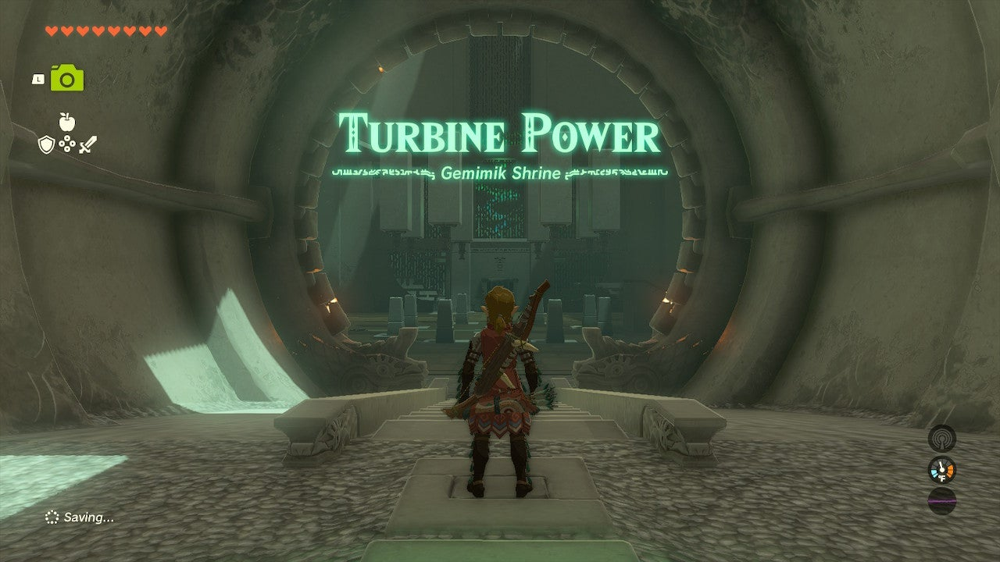
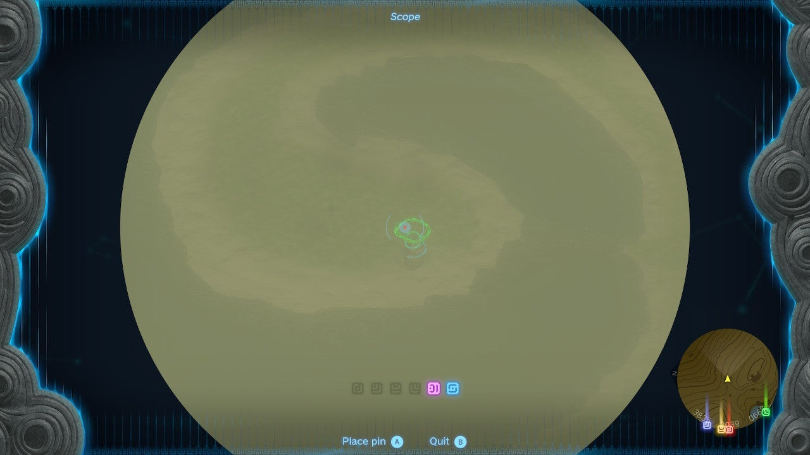
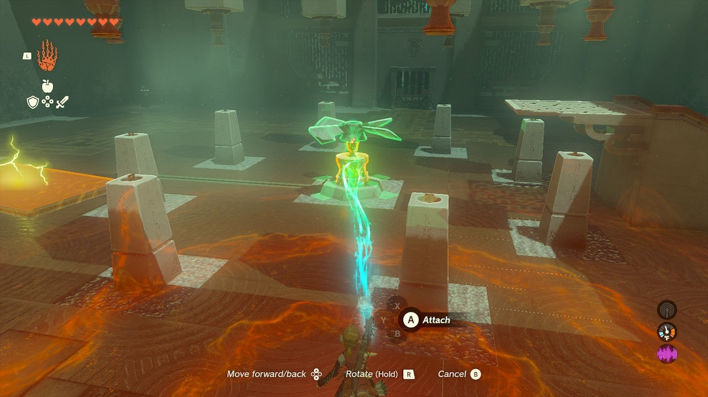
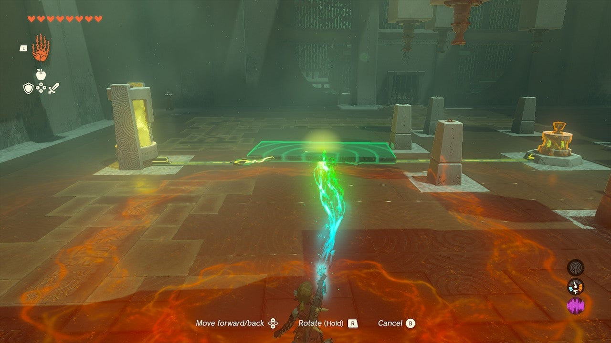
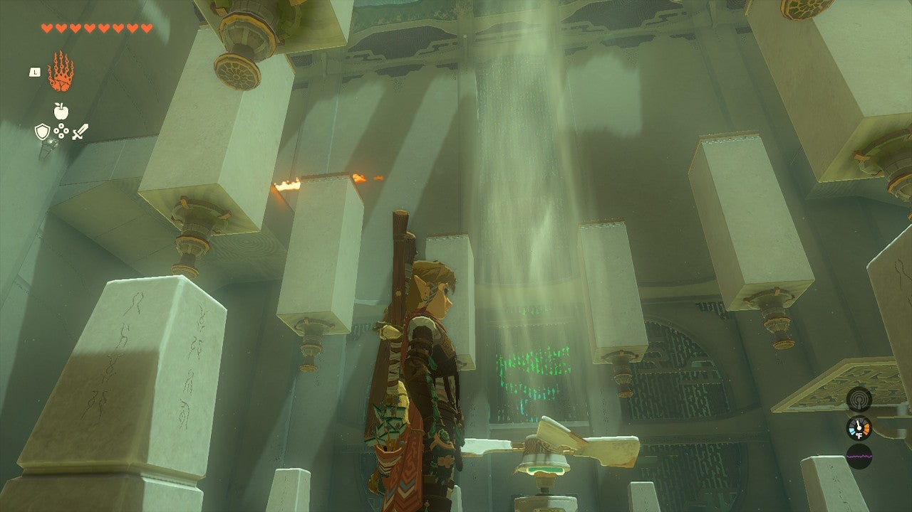
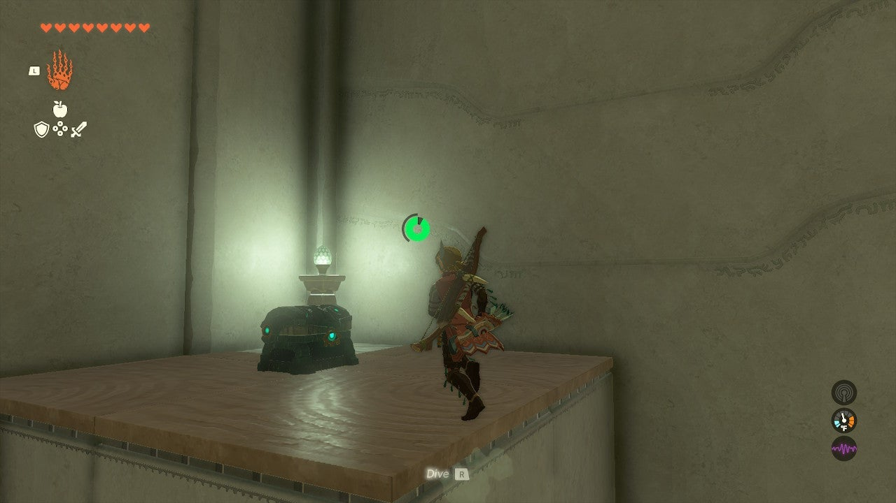
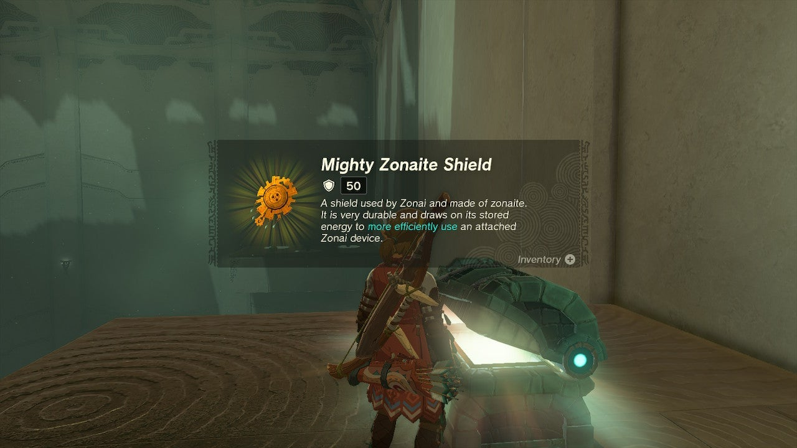
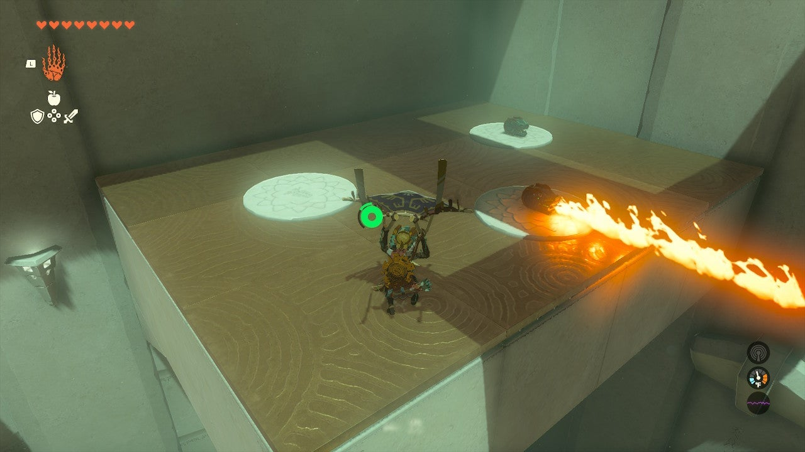
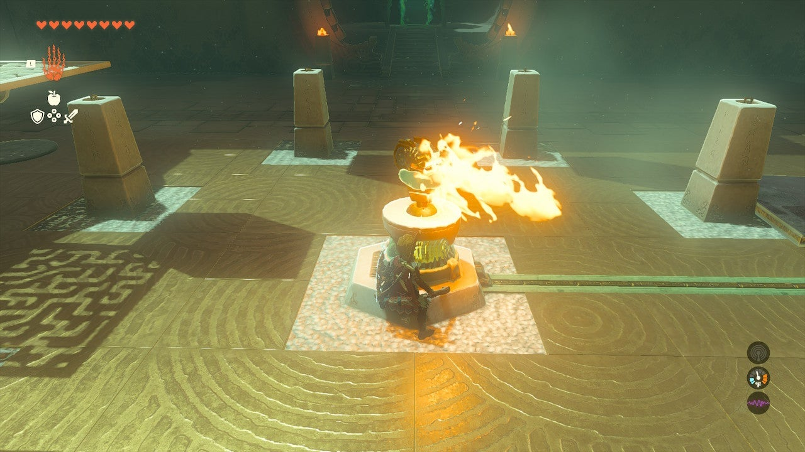
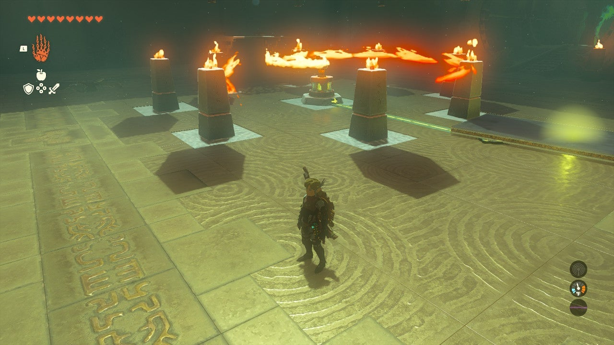

Gemimek Shrine (Turbine Power) in The Legend of Zelda: Tears of the Kingdom is a shrine located in the Deep Akkala region and is one of 152 shrines in TOTK (see all shrine locations). This page contains a guide for how to locate and enter the shrine, a walkthrough for the shrine itself, and puzzle solutions as well as treasure chest locations for the Gemimek shrine. 

The "turbine" or motor in Gemimik Shrine is a unique device you can fuse to a weapon or shield and remove from this shrine and can be un-fused in Tarry Town and used for devices. 

  * See: How to Unfuse Weapons for how to save fused items.

## Gemimek Shrine Treasure and Rewards

  * Mighty Zonaite Shield

## Gemimek Shrine Location/How to Reach

Gemimik Shrine is on a spiraling strip of land or spiral peninsula in northeast Hyrule on the east coast of Akkala. It is in plain sight, but you need to get pretty close to it to see it. You can easily paraglide to Gemimik Shrine from the Ulri Mountain Skyview Tower. It is due east of this tower. 

  * Coordinates: 4513, 2116, 0001

## Gemimek Shrine Walkthrough and Puzzle Solutions

Gemimik Shrine has a large central “turbine” or spinning device. You need to route power to it and attach a fan blade as well. Note the unlit torches surrounding it as a clue for later – these open the exit. 

Start with the fan blade sitting on the ground. Use Ultrahand to lift it up and place it above the turbine, then attach it to the top of the turbine. 

Now, look for a metal panel on the ground near the yellow glowing electrical source. You need to use Ultrahand to move this slab between the yellow glowing source of electricity and the turbine, they both have leads in the ground you can place the slab on top of to complete the electrical connection. 

Now, you should have an updraft above the spinning fan. 

## Treasure Chest Location

Locate the high up platform with the chest in the northeast corner. Use the ramp to jump into the fan updraft and do so facing this corner, pulling out your paraglider to float up. From the very top of the updraft you can aim towards the chest and make it to the platform and the **Mighty Zonaite Shield** within will be yours. 

Now, return to the fan updraft. Ride it up to the platform with the three fire emitters. Grab one that is turned off (you can toggle them on and off with your weapons) and toss it below. 

Move the panel off of the electrical pads to disable the turbine. Remove the fan by grabbing it with Ultrahand and wiggling the right stick. 

Grab the flame emitter with Ultrahand and attach it to the turbine. When you replace the panel on the electrical pads, you will have a spinning fire wheel to light the ring of torches and open the exit. 

Gemimik Shrine

Congrats on solving the shrine and earning a Light of Blessing! Click or tap here to return to the rest of the Shrine Guides. You can also check out which shrines are nearby with our shrine map filter on our complete map of Hyrule.

### Up Next: Walkthrough

Previous

About IGN's Zelda TotK Guide Writers

Next

Walkthrough

### Top Guide Sections

  * Walkthrough
  * Zelda: Tears of The Kingdom Switch 2 Edition Guide
  * Zelda Notes Voice Memories
  * List of Side Quests and Side Adventures

### Was this guide helpful?

Leave feedback

Go to comments