Gutanbac Shrine (**The Ability to Rise**) is known as the "Shrine in the snow" or the "third Shrine" in The Legend of Zelda: Tears of the Kingdom is a shrine located in the **Great Sky Island**. It is located on the snowy edge of the Great Sky Island and you will need warming food to reach it. It is often the **third Shrine** people discover, but you can get to it earlier. **We cover both routes to the shrine.**

This page contains a guide for how to locate and enter the shrine, a walkthrough for the shrine itself, and puzzle solutions as well as treasure chest locations for the Totk Gutanbac Shrine. This shrine is where you acquire **Ascension.**

###  Treasure and Rewards

  * ****Ascension****
  * ****Stone Axe****

##  Gutanbac Shrine Location

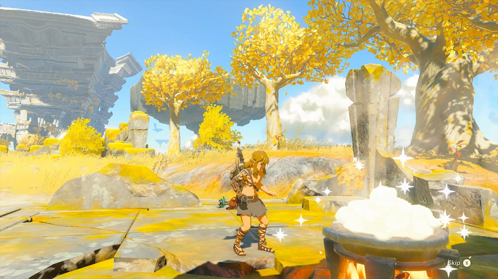  
If you’re attempting to reach the snowy shrine first by way of the Temple of Time, your route will be very different than if you continued on from the lakeside shrine. You’ll have to enter the cold temperature region by way of the ruins east of the Temple of Time. Luckily, you can find a Cooking Pot in one of the ruins, which you should use to cook up the **Spicy Pepper** found growing in front of the slopes, and stockpile food that will let you survive freezing temperatures without taking damage (five cooked peppers will give you 12:30 of cold resistance).  
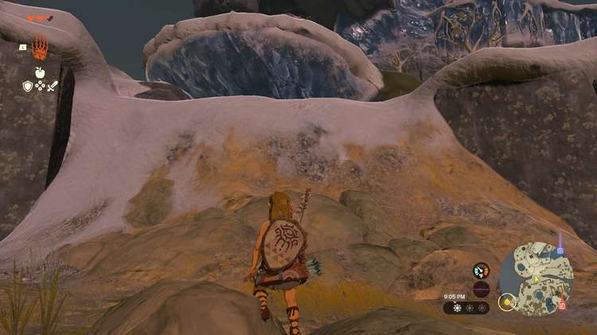

  
When you’re ready, head up the slope into the snow and veer right to reach an icy river that will quickly kill you if you fall in.   
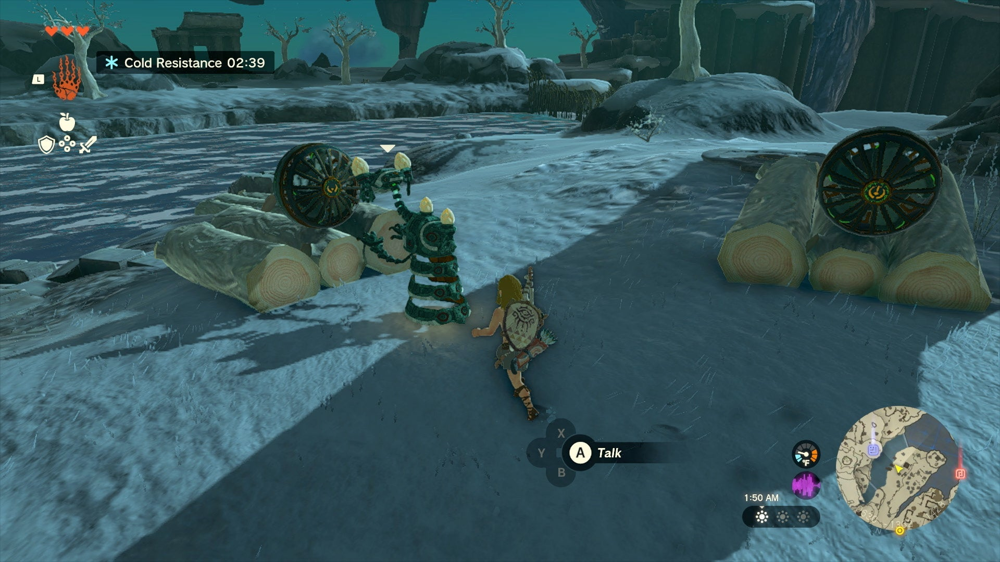

  
Luckily, the nearby Constructs will demonstrate how Zonai Devices work with rafts, and give you an Energy Cell to power the fans attached to rafts.  
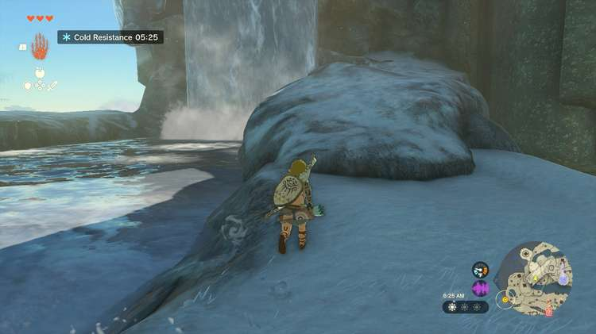

  
Once you reach the other side, follow the river up to the left and climb up to reach the shrine. 

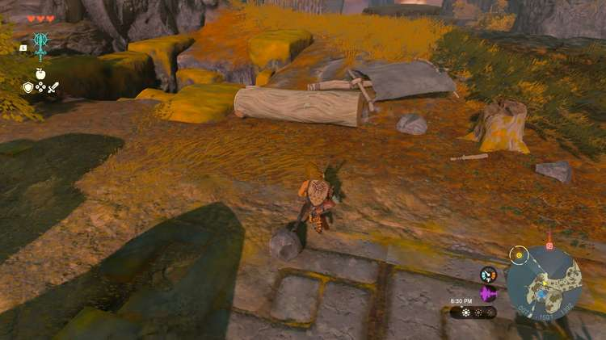

To reach the third shrine in the cold region to the east from the Lake Shrine, head back down the hill, and be sure to look for a ditch full of rubble. 

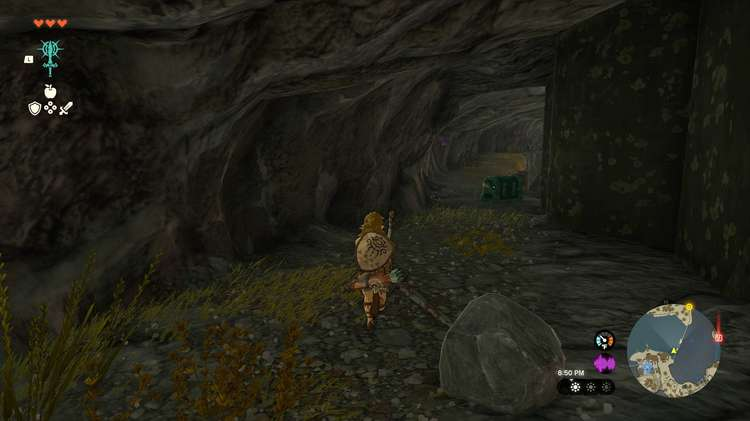

With the Fuse ability, you can now fuse a rock to your weapon and break them apart, revealing a low path under the falls and back across to the other side of the lake, as well as another chest with **Amber** inside. 

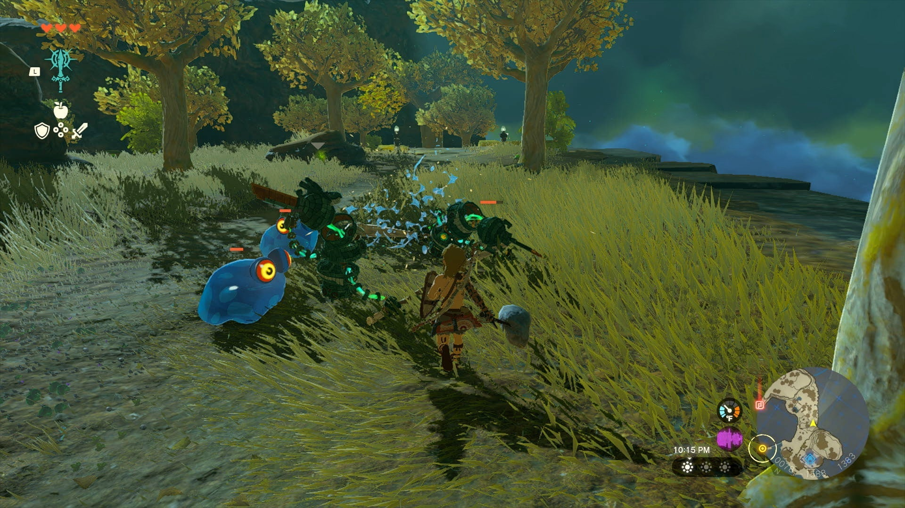

Head down the path to the right and watch for Constructs battling with Chuchu monsters, and pick off whoever wins that fight. 

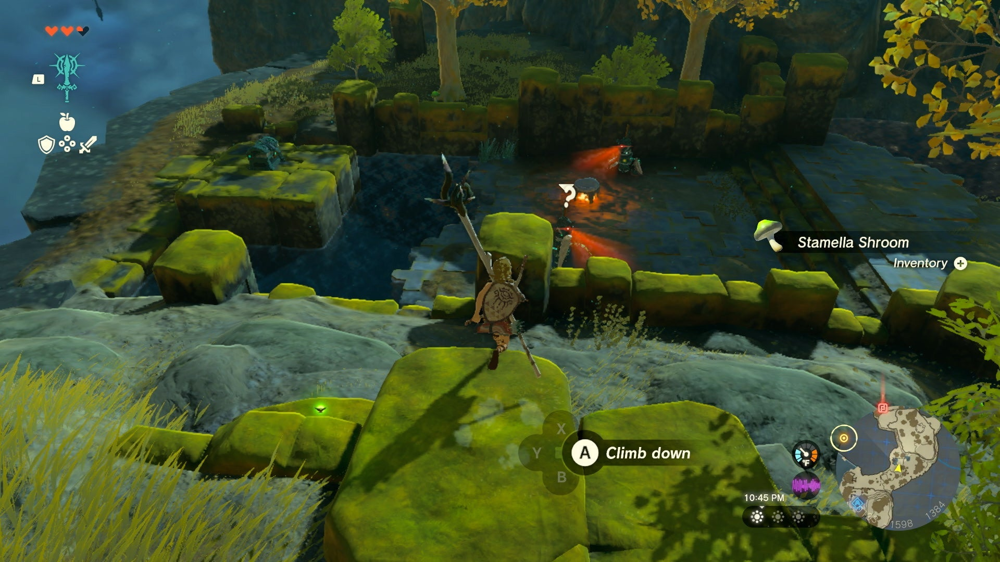

Up ahead is another camp of Soldier Constructs guarding a chest, but you’ll want to be careful engaging them. Not only does one have a shield, but the other has created a fuse weapon of its own — combining a stick with a large wooden plank. 

The enemy will use this new weapon to send massive gusts at you to knock you backwards, so avoid having your back to any ledges at all costs! If you find it hard to get close, try getting some distance and shooting a Fire Fruit to burn away their weapons before finishing them off. 

Once they’ve been taken care of, be sure to loot the nearby chest for a **Soldier Reaper** fused weapon. When in doubt, fusing monster horns to any basic weapon you find is always a great bet, as they tend to increase your attack power more than most other fusion materials. 

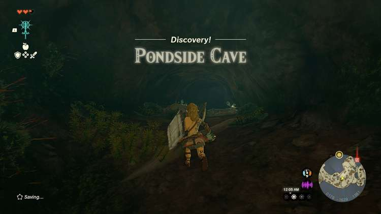

A large cliff borders this area, and the only way to proceed is by heading into a new area - the Pondside Cave. You’ll find many caves spread out all around the world in Tears of the Kingdom, and they can often offer many secrets if you’re willing to look around. 

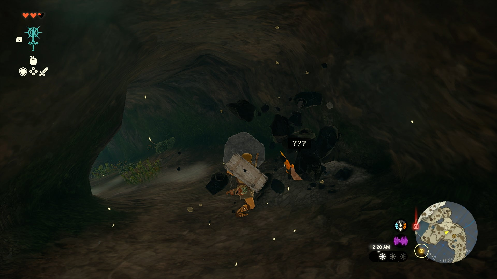

Be sure to pick up **Brightbloom Seed**, as they’ll be useful later on in this area. You can also find giant ore veins in caves like these, and having a fused hammer weapon (or just fusing any odd weapon with nearby stones) will help you break them apart to find minerals. Not only does Amber sell for a good bit, but it also makes a great fuse material for increased damage early in the game. 

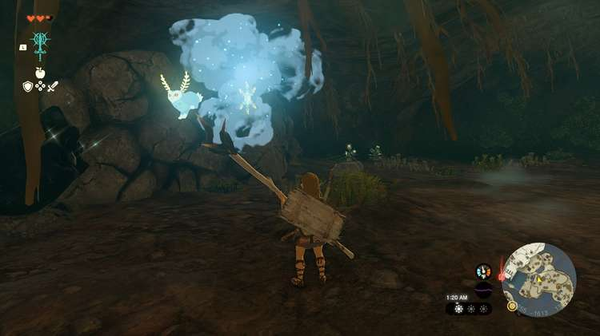

When the cave opens up into a wider room, be on the lookout for a large glowing frog hopping along the ceiling. This special creature is called a Bubbulfrog, and will relinquish a **Bubbul Gem** if you can hit it enough times (it will only try to dissuade you with bubbles, but shouldn’t be hard to take down with arrows). 

Each cave has one mystical frog in it, and you’ll know which ones on your map have been cleared by looking for a checkmark on the map.

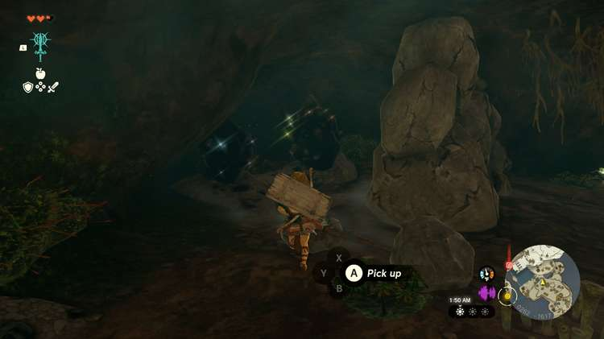

Be sure to mine the rest of the ore in this room, and break open the pile of rubble to find sparkling ore that should contains a rare gem that will sell for a ton (or empower your weapons with great elemental powers!), then head through a side passage to the left of the pile of rubble. 

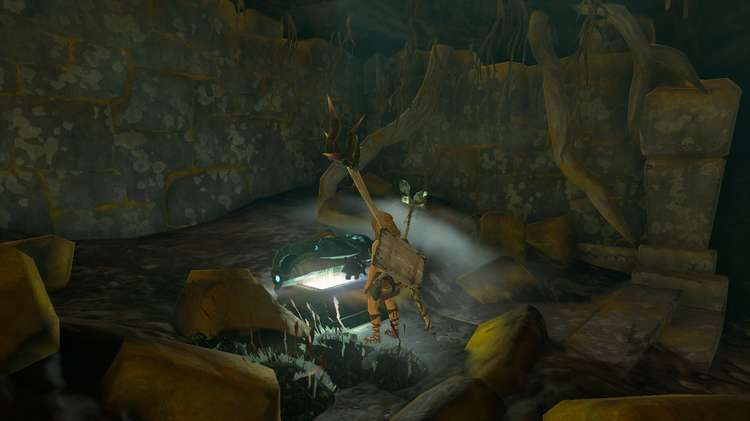

Check the small passage and clear it of Keese, and look for a green chest before exiting the Pondside Cave. In the chest you’ll find the second piece of armor - the **Archaic Tunic**! 

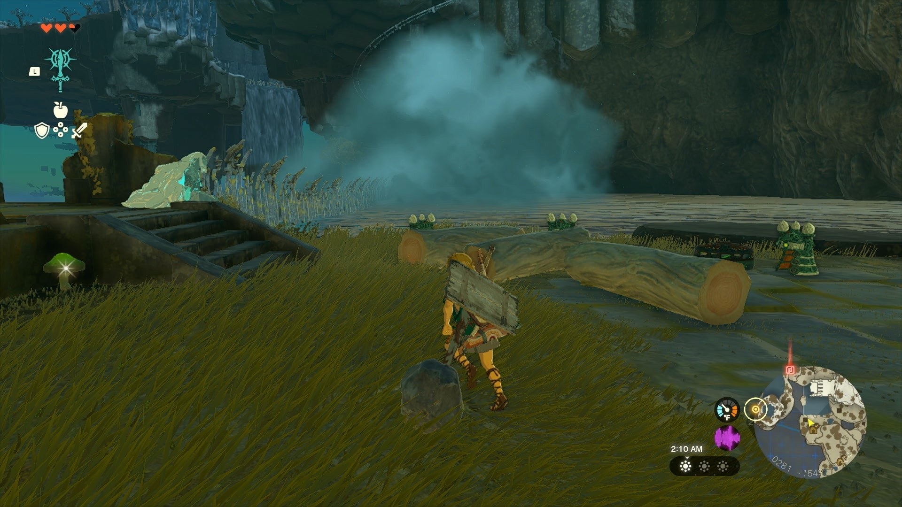

The large pond outside is much like the lake by the last shrine, and is too large to swim. You can talk to Rauru’s spirit nearby, as well as the Constructs to learn more about building rafts and Zonai Devices. 

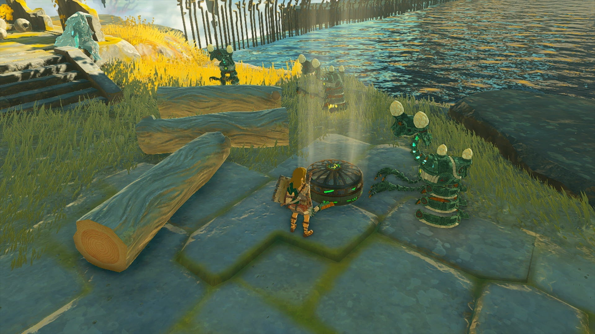

Even if the pond is large, you now have the power of Fuse to use along with the Zonai Devices here. 

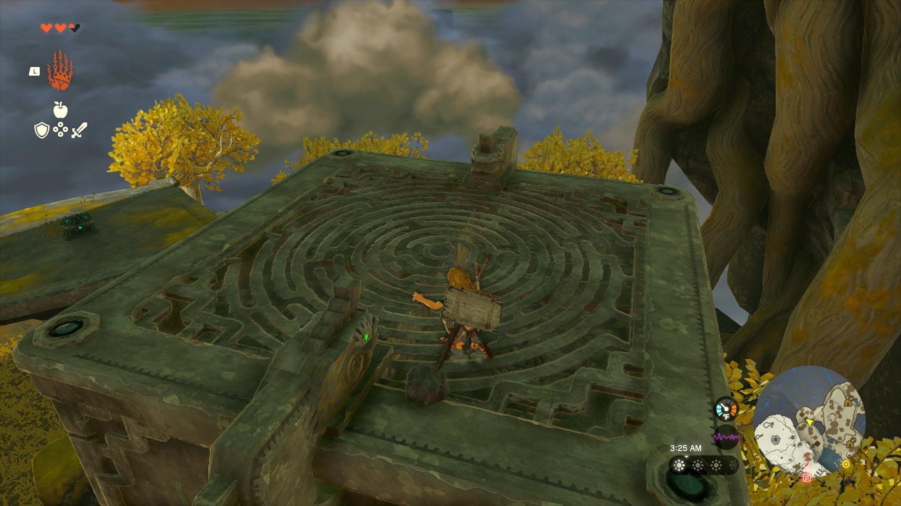

First however, you may want to take a detour to the right of the pond to find a series of Zonai floating platforms leading down among the roots to a lower island. You can use Ultrahand to chain the platforms together and leapfrog over to the lower area, and defeat the Zonai Construct Captain to claim the chest he’s guarding for an **Amber**. 

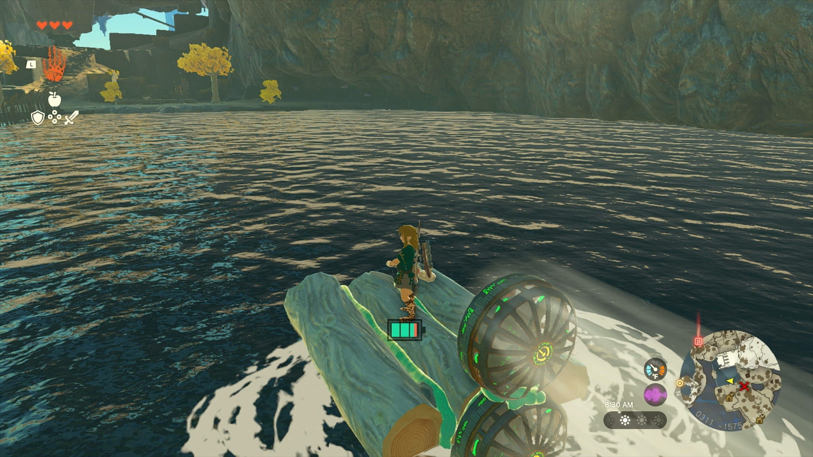

Back at the pond, it’s time to make your own powered Zonai raft. Use Ultrahand to stick at least three logs together side by side, and then raise and tilt one or two fans to stick on the end of the raft. When you strike the fans, they’ll activate and use the energy from your pack to operate for a limited time (which can be extended by using Zonai Charge in your inventory). Even with your one battery pack, you’ll have more than enough energy to cross the pond on your new boat! 

After you cross to the other side, the Construct will warn you of a treacherous path up to the next shrine, so make use of the assorted materials, crates, and Cooking Station you can light by striking the ****Flint**** with a metallic weapon. 

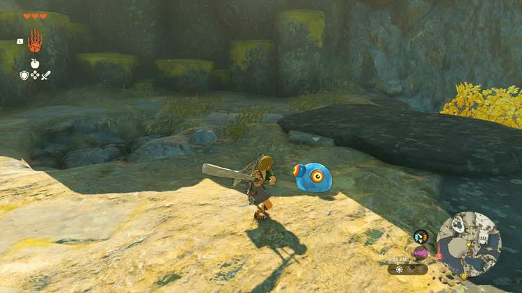

Be sure to look off to the right as you climb the first stairs, as a pile of rocks in a small hole can be found to the side that you can break through with the right weapon. 

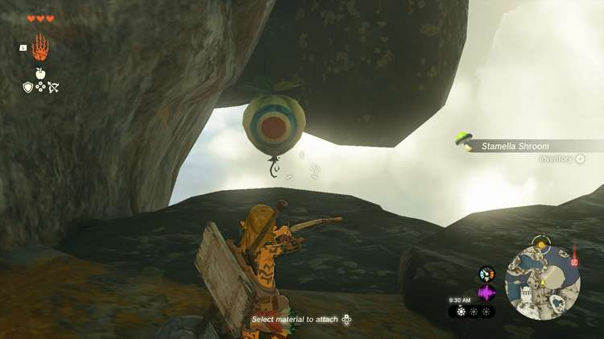

This will lead to an underground path with a balloon you can shoot to summon a Korok Seed. 

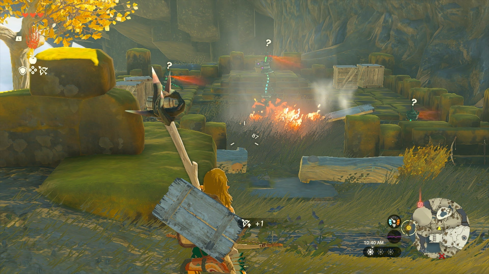

Take out any Chuchu that ambushes you on the road to the top, where you’ll find the entrance to another cave, and a squad of Soldier Constructs off to the left. Lucky for you, they happen to be in a ruin that’s overgrown with grass, making it perfect for lobbing a Fire Fruit into and setting them all ablaze. Defeat them all, and you can loot the chest nearby for an **Opal**. When fused, they shoot out fast jets of water or can explode when shot from an arrow, so be careful and use them sparingly! 

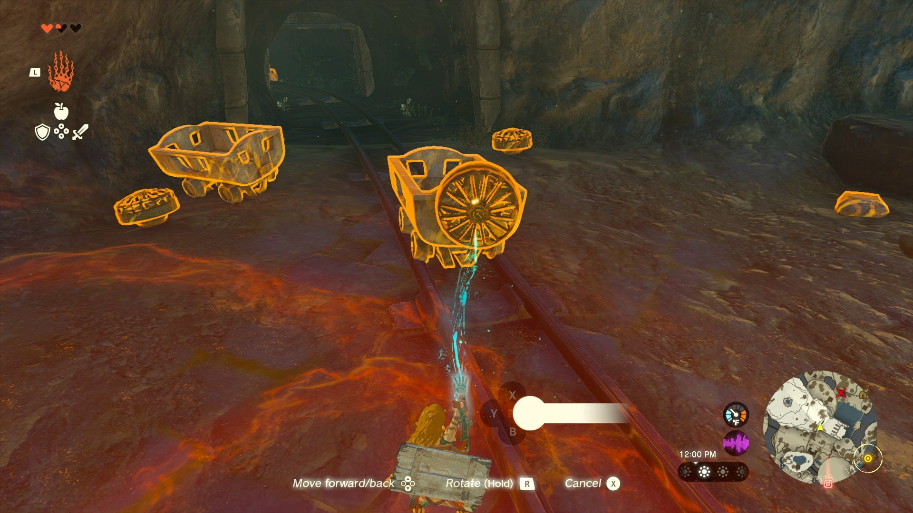

Back at the cave entrance, look for several discarded minecarts and place them on the track. Gone are the days of needing to whack it while using Stasis — now you can simply place a fan on the back and hit the fan, and away you’ll go into the Mining Cave. Unlike the other cave, this one will get pitch dark, and you’ll need to find a way to create some light. 

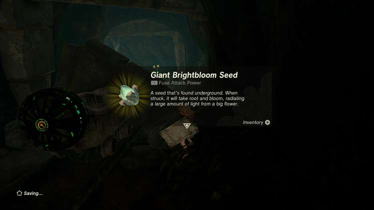

Eventually the cart will hit a block in the road, so leave it and hop over the illuminated barrier to spy the light source. A Construct will tell you that the Brightbloom Seeds will create light when struck, or can be harvested when not blooming. There’s even a **Giant Brightbloom Seed** near where the minecart stopped that will illuminate even more of a dark area. 

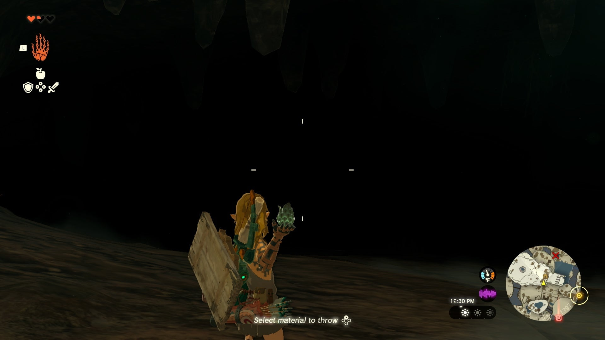

Put them to use by either tossing them (Hold R and then Up on the D-Pad), or fitting one to your arrow when aiming a bow, and shoot it out to immediately watch the cave become revealed. 

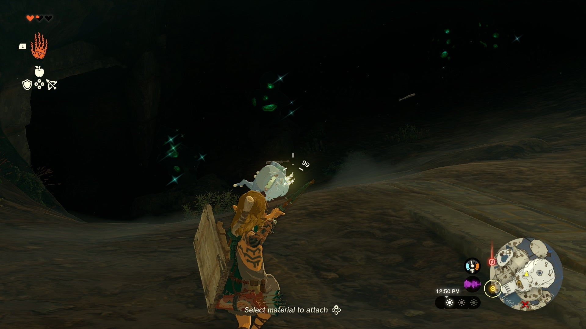

You should also spot another Bubbulfrog scurrying about in the large darkened chamber beyond, so take him out and collect another Bubbul Gem. 

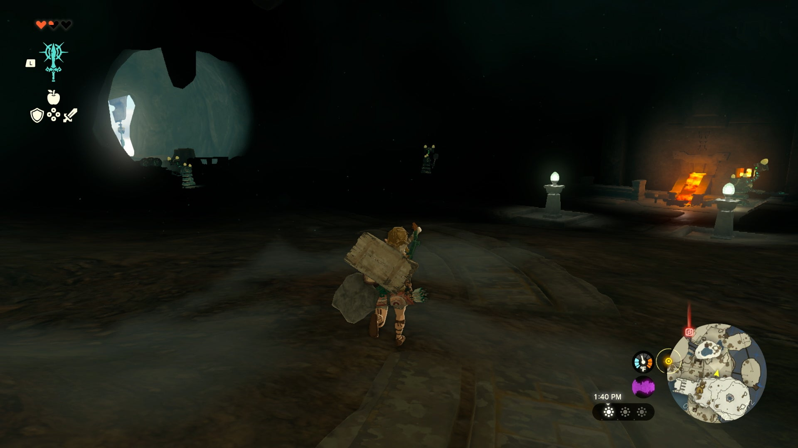

Reaching the last chamber, you’ll make an important discovery as you locate a **Zonaite Forge**. The Construct here works with Zonaite mined from the glowing ore veins nearby, and processes it into Zonai Charges that you can also gain from defeating Soldier Constructs. 

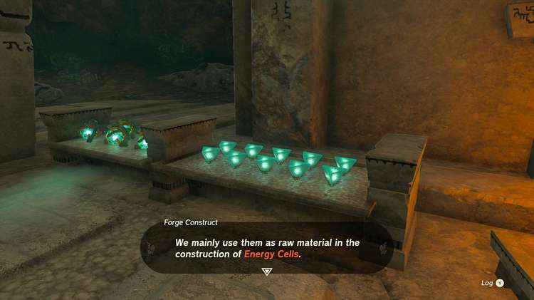

He also deals in **Crystalized Charges** , which take a lot more Zonaite to condense into a pure form that can be used to upgrade your **Energy Cell**. Be sure to mine Zonaite whenever you come across it, as it can be very useful later in your adventure. 

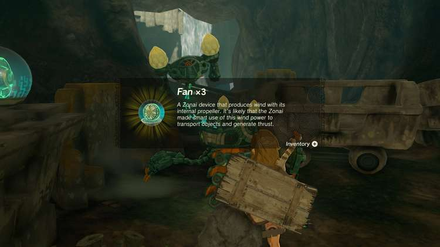

For now, you can leave the forge behind and carry another minecart over the barrier. Talk to the Construct here to see the three **Fans** he has in little capsules. When in capsule form, they can fit in your inventory — but once placed out in the open, they can’t be stored again. 

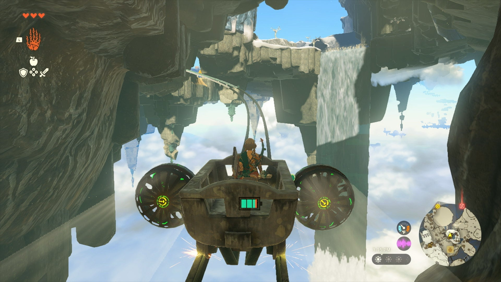

Strap a few fans on either side of a minecart to give yourself a boost up the next minecart track leading all the way up to a high ridge. 

There’s a few things of note to do here, including speaking to Rauru again for some more insight into the Great Sky Island. You can also check out a large machine that looks like a toy dispenser behind him. 

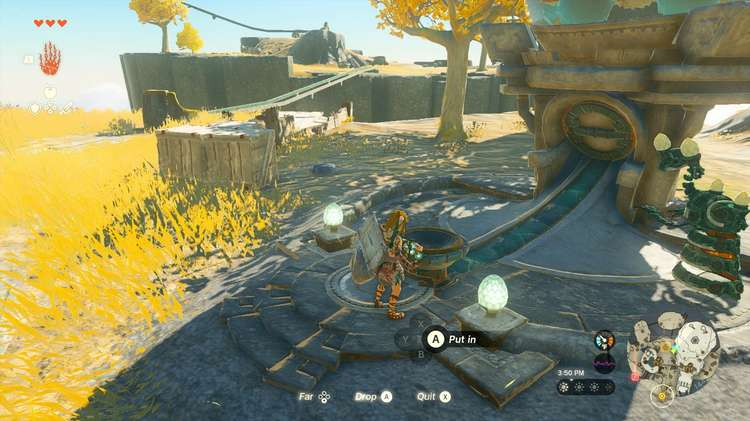

The construct nearby will note that the device will dispense certain types of Zonai Devices in exchange for Zonai Charges - the more you toss in, the more you’ll get in return. Grab a handful to try it out, and you should get several Fans, Flame Emitters, and Portable Pots: 

  * **Fans** can be attached to other objects to propel them under the right conditions, and is useful to create vehicles (or blow enemies away)
  * **Flame Emitters** can be attached primarily to weapons and shields to shoot out bursts of flame - but will cost energy to maintain.
  * **Portable Pots** are single use Cooking Stations that will come pre-lit, and are incredibly important when you need a specific meal in an unfamiliar or hostile territory. They even still work regardless of the weather!

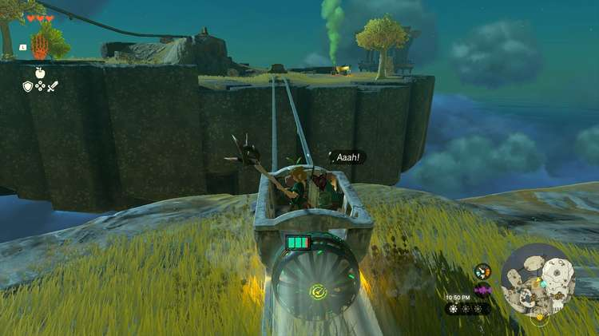

Up past the dispenser, you can find another rail line and yet another Korok who longs to meet his friend on the smaller island above. Once again, you can grab one of the minecarts and toss him in, and use a Fan to get across to the island to get 2 Korok Seeds. 

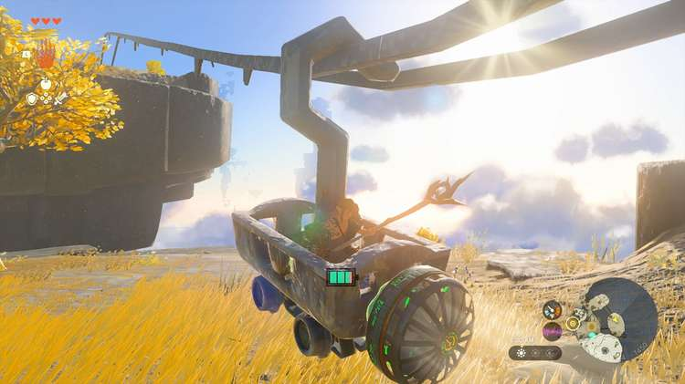

The rail line to a second raised island is broken, rendering the minecart useless - at least placed normally. You can circumvent this in a variety of ways - like placing a hook in the middle of the minecart and a fan at the back to push it up the track on a single line. Doing so leads to a chest with a Portable Pot. 

Off to the east lies a cave below the frigid mountain, and a floating platform near a large circular arena where a mini-boss awaits. It’s better to hold off on this fight for the moment, so for now focus on getting to the next shrine. 

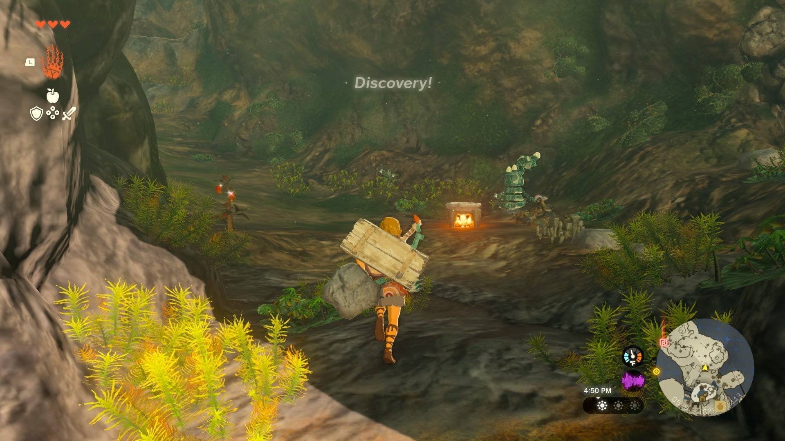

Inspect the Pit Cave entrance to find a few plants holding **Hot Peppers** , and look for a Cooking Station inside where you can cook them up to grant you a limited amount of cold resistance. 

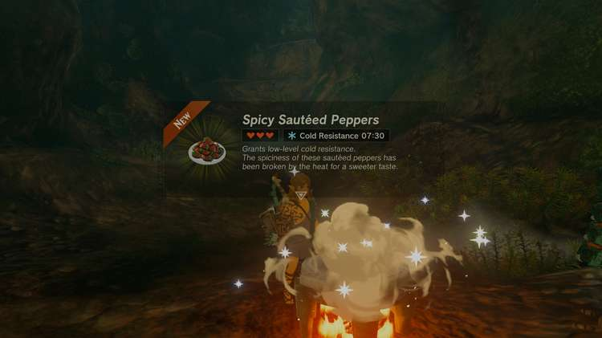

Cook as many as you can to give yourself a head start, and remember that caves will offer you safety from the freezing temperatures outside. 

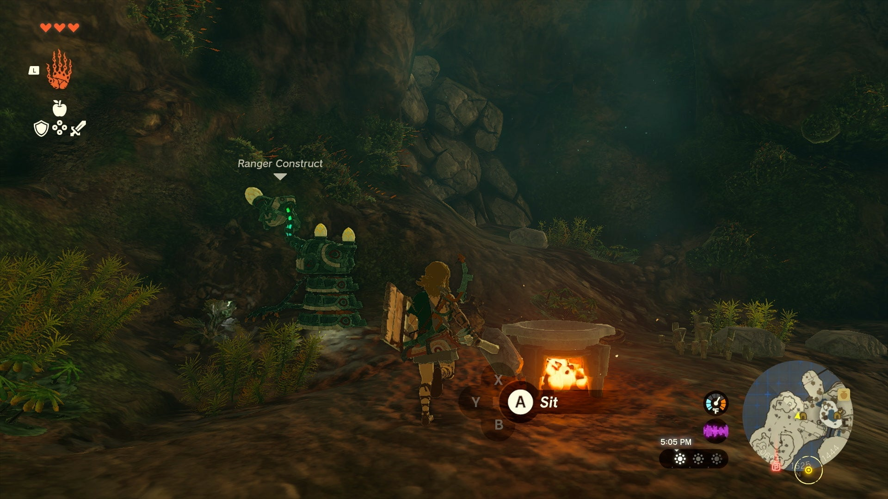

Look to the right of the Cooking Station to find some rubble you can break apart with a fused hammer weapon. 

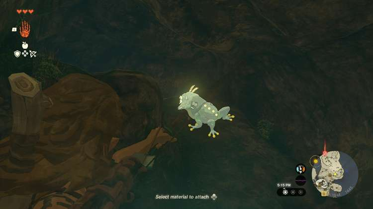

Check the small path through it to shoot down a third **Bubbulfrog**. 

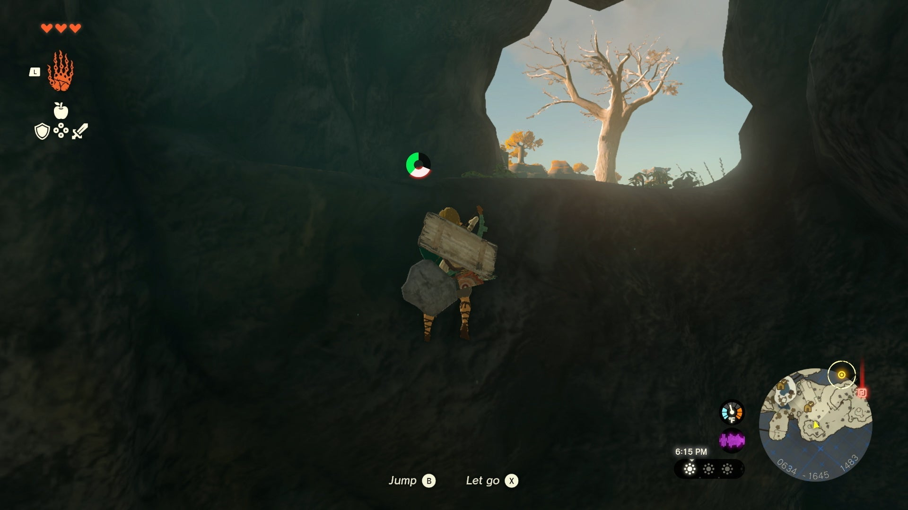

Then, return to the main cave path and climb up to reach the frozen wastelands above. 

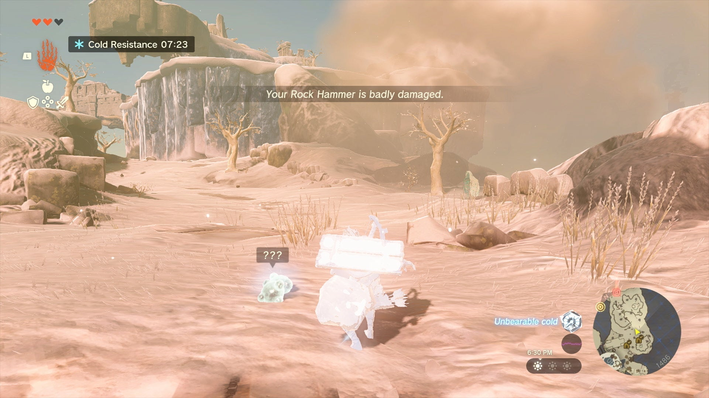

Be on the lookout for ambushes from Ice Chuchu — they’ll explode in freezing mist when defeated, so shooting them from afar is highly recommended. 

Looking for Spicy Peppers and places to cook them? Consult the map below!  
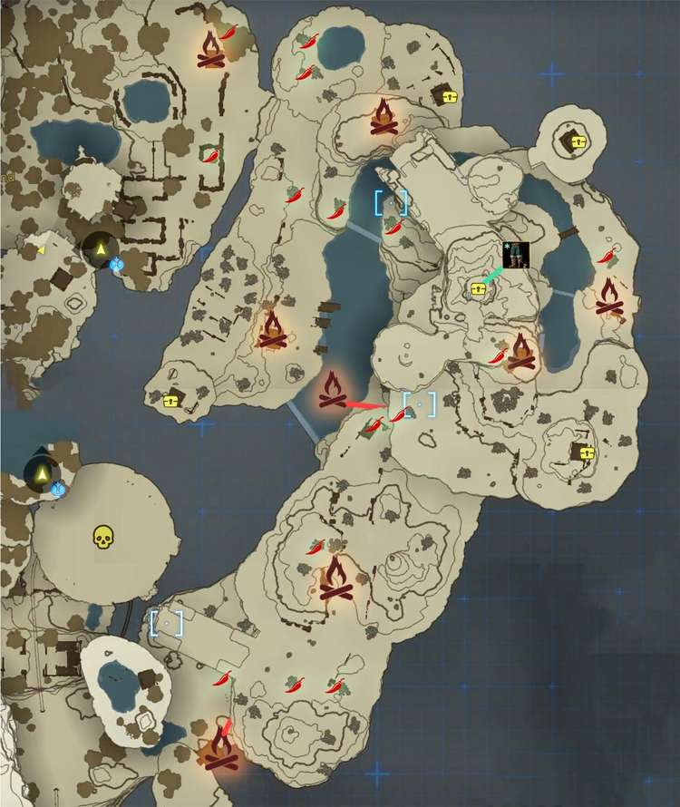

Since time is not on your side, you should hold off doing any extra exploration for now and make your way towards the shrine high up in the distance further east. Rauru can again be spotted by a tree to the right of the path, and will remark on some Soldier Constructs along a rocky ridge to the left. 

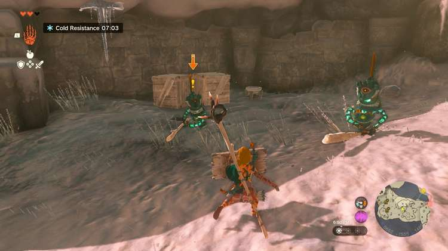

You can avoid them if you wish, but if you find your cold resistance time running out, defeat them quickly and ignite the Cooking Station near them to cook up some more Spicy Peppers. 

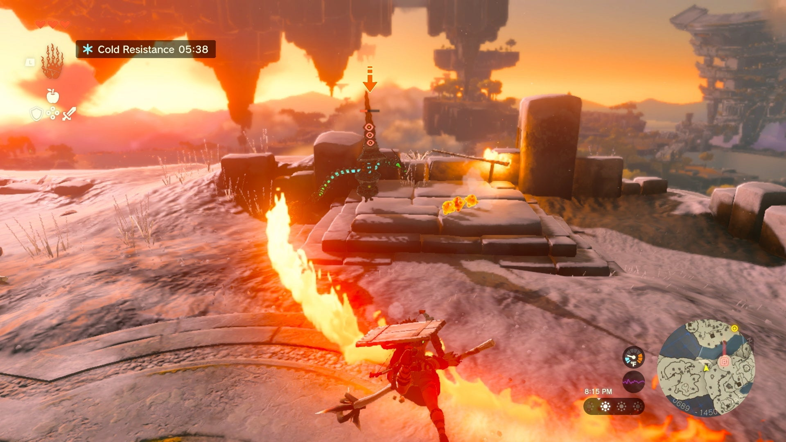

The end of this path leads to another cave entrance guarded by a Soldier Construct Captain, who will utilize nearby Flame Emitters to create a flamethrower weapon he will blast out in a low sweep. You can either do your best to jump over the flames, or sprint around behind the construct and hit it from behind. 

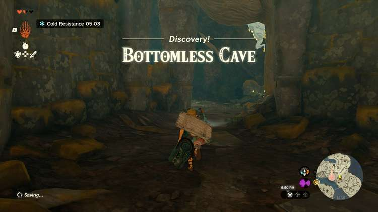

Grab the Flame Emitter Sword from the defeated Construct and head into the **Bottomless Cave**. As its name implies, there's a large chasm in the cave leading down to a lower island that you won’t survive falling, so move carefully inside. 

You should be able to spot a Bubbulfrog hopping along the walls, be sure to snipe it with your bow and collect a fourth Bubbul Gem. There are also several **Bomb Flower** growing in this cave, which should be harvested on sight. These will replace the typical Bomb Arrows from Breath of the Wild, and will be incredibly useful in combat or creating pathways through rubble! 

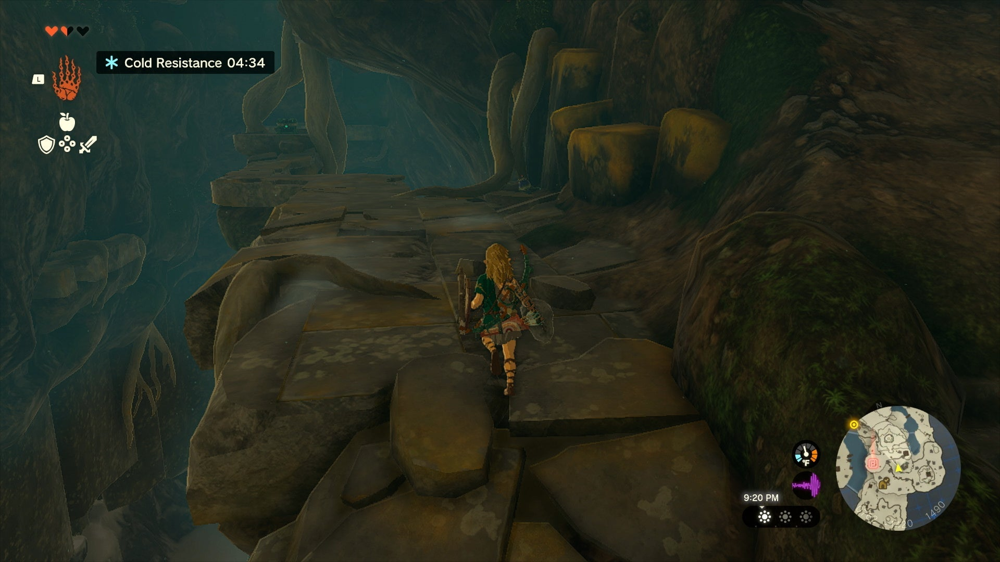

Be sure to check the low path on the left through the cave to find a chest perched on a narrow ledge holding **Amber** , and then start trekking upwards. You’ll soon come to a new enemy type that may be familiar if you’ve played earlier Zelda games: The Like Like. 

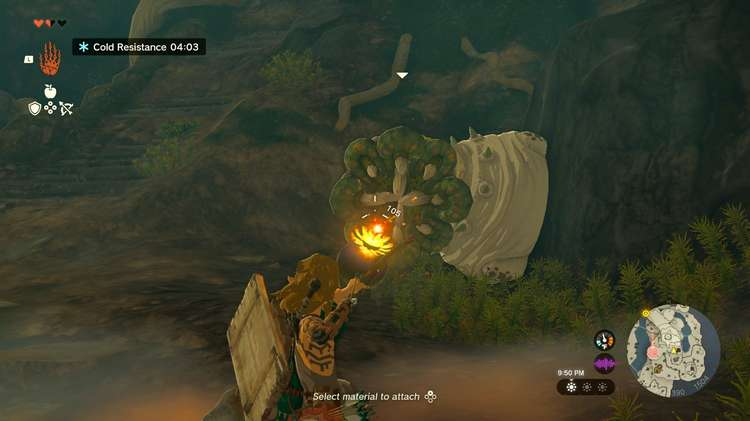

These fanged slug-like enemies cling to walls and ceilings and will try to grab and consume you — often stealing your equipped items in the process! Luckily, killing them will cause them to spit out your lost items. They are also fairly durable except for certain weak spots. 

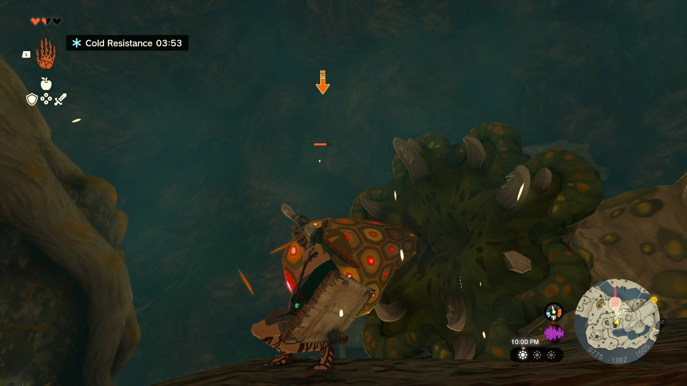

The main weakness comes before they strike, as they’ll reveal a glowing center in their mouth before striking, and hitting it will stun them, causing it to be exposed for a longer period. If you’re having trouble baiting out their weak spot, you can also use Bomb Flowers, or your Flame Emitter to ignite them, which should also expose their weak spot. Attack fast and hard when they are defenseless, and you’ll also get a treasure chest with a random item from defeating them. 

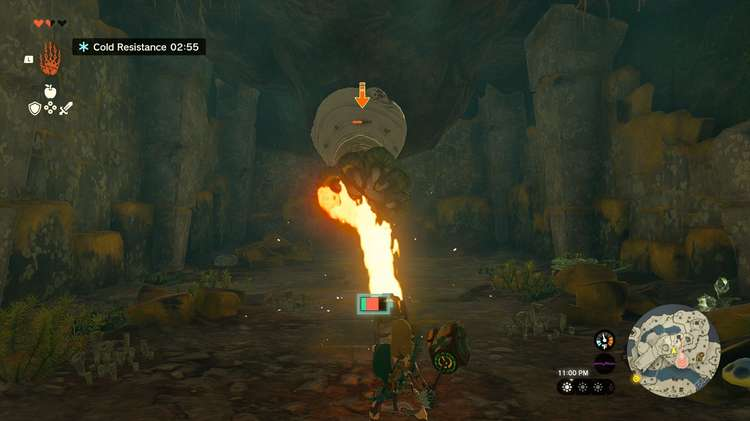

As you head up to the top floor of the cave, there’s one more Like Like guarding a chest, but a discarded Flame Emitter Shield can help you reach its high spot and expose its weak spot to quickly kill. Once defeated, claim its chest, plus the one it was guarding for another Flame Emitter Capsule. 

Re-up your Cold Resistance with more Spicy Pepper dishes (and put down a Portable Pot if you need to), and head back out into the cold. The Shrine is still above you, and getting to it will take a bit of work. 

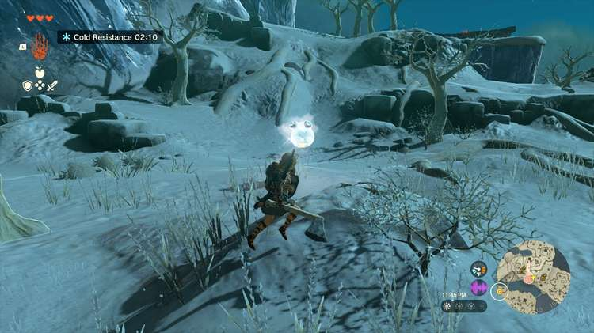

Head along the roots and avoid Ice Chuchus as you climb up to the top of the ridge, and look for a cliff drop going down to a waterfall. The walls all around are icy and slippery, making climbing a no go — but if you look closely, you can spot a break in the ice just past the waterfall. 

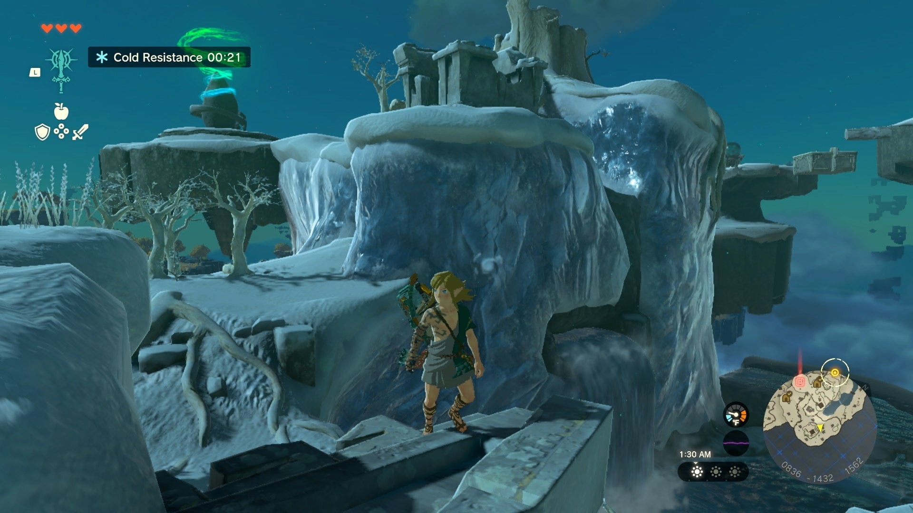

Drop down to the path below, hang to the left and pass under the freezing waterfall, and you’ll find a small break in the ice just large enough to climb upwards. 

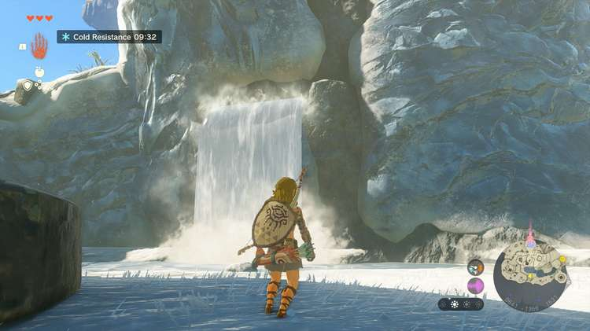

Don’t rush it by jumping — you’ll have enough stamina to make it to the top in one piece. 

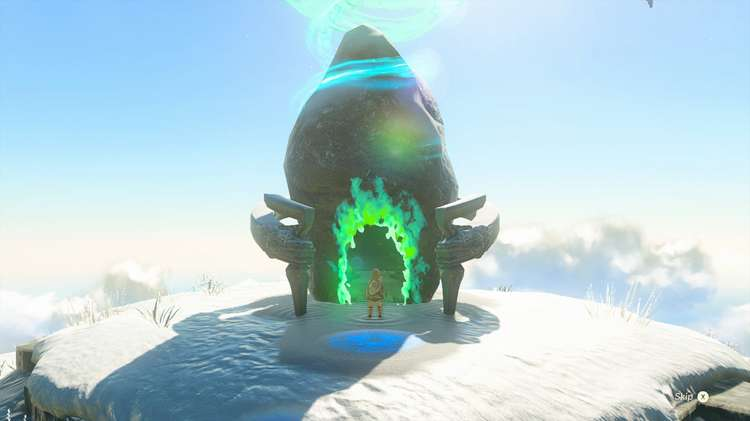

When you finally reach the top, the Shrine will be in sight. You can quickly dart off to the left to a ruined building with a Cooking Station and Flint to cook any peppers you might have, otherwise it’s time to take down the third shrine. 

  * Coordinates: 0709, -1381, 1584

## Gutanbac Shrine Walkthrough

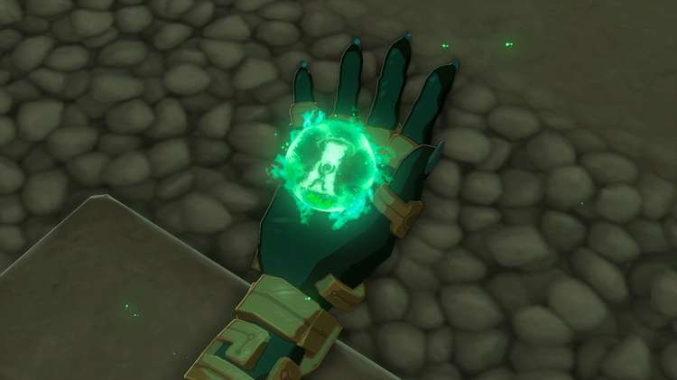

In this shrine, Rauru will appear before you to impart a brand new ability: Ascend. While it may not have too many combat applications, it is an essential part of your toolset for navigating Tears of the Kingdom. 

Ledges that were once too high to climb can become a thing of the past, as it allows you to pass through the ceiling that is close enough, and allows Link to “swim” up through to the top of whatever you are trying to get to the top of. 

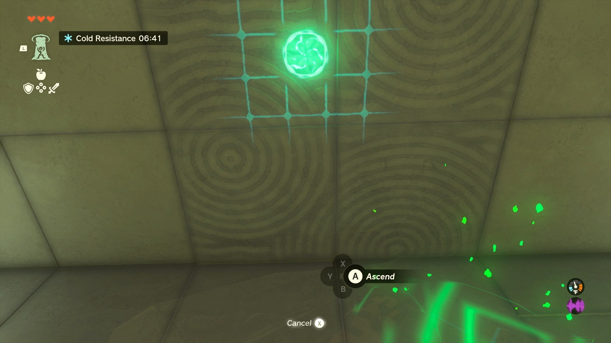

Give it a try as you come to the first obstacle, a large wall with a section jutting out that makes climbing impossible. Ready your Ascend ability and look for the green circle to appear above (or listen for the chime). Press A when prompted, and you’ll be able to get to the next platform. 

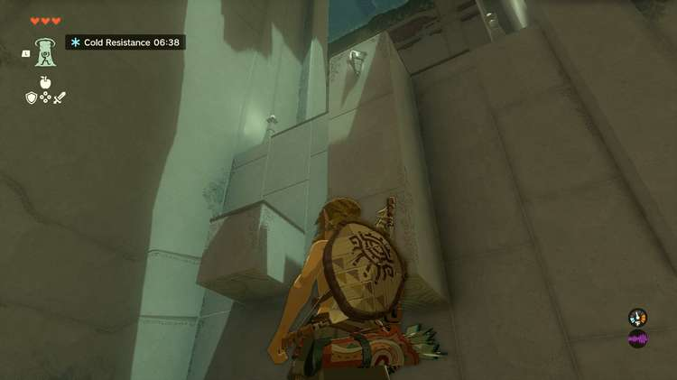

In this next area, there are two high platforms out of reach attached to the edge of a high ridge. Both columns let you stand under them to Ascend upwards, but check out the one on the left first. 

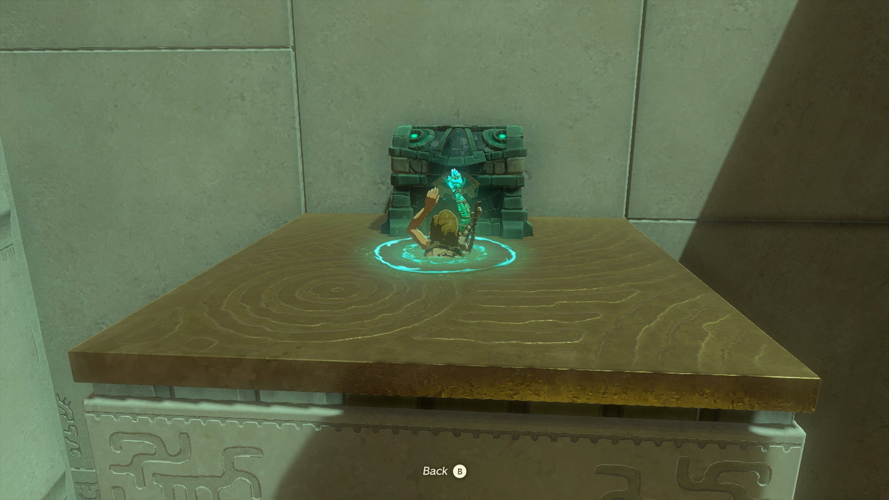

It doesn’t go all the way up, but rather allows you to claim a chest holding a ****Stone Axe****. 

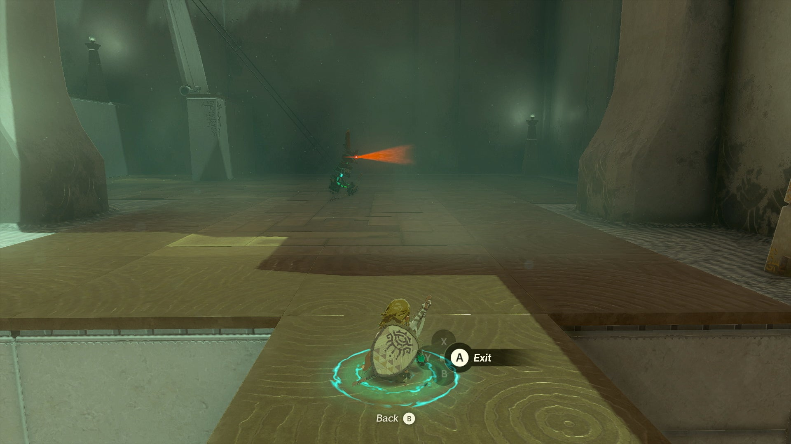

Take the other column to ascend up, and note the Soldier Construct waiting on this platform. While still in the ground, time will be stopped as you Ascend, allowing you to either choose to exit and attack, or press B to cancel and return back down from whence you came. 

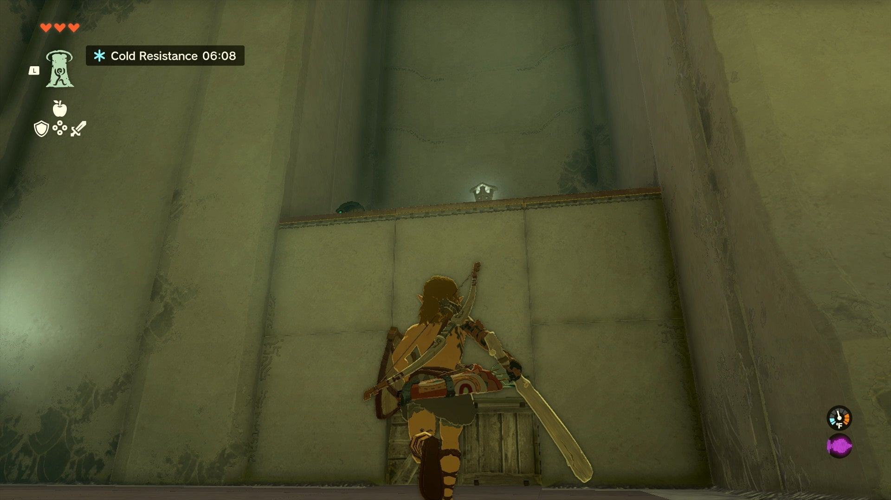

Ambush and defeat the Soldier Construct, and then inspect the room. There is a wall to the right with two crates placed at the bottom, and they can be pushed back to allow you entrance into a small alcove. From here, use Ascend to climb up to a platform above holding another chest with a **Construct Bow**. 

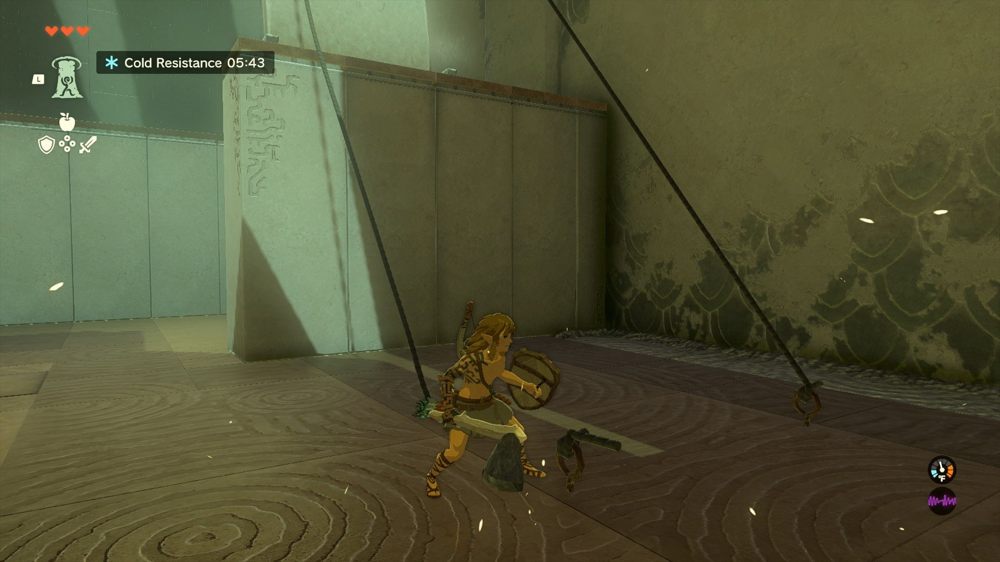

To proceed, look for the raised platform held up by two ropes. 

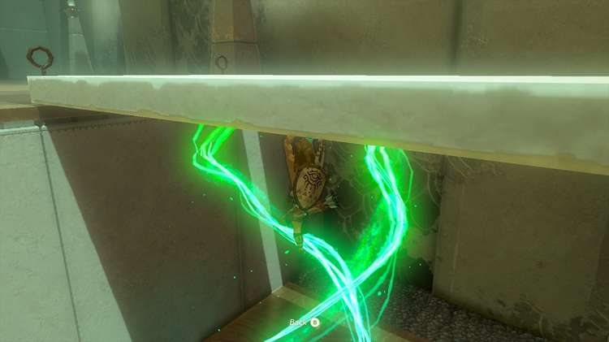

By slashing each rope, the platform will fall down to form a bridge, and you can Ascend up through the lowered bridge. 

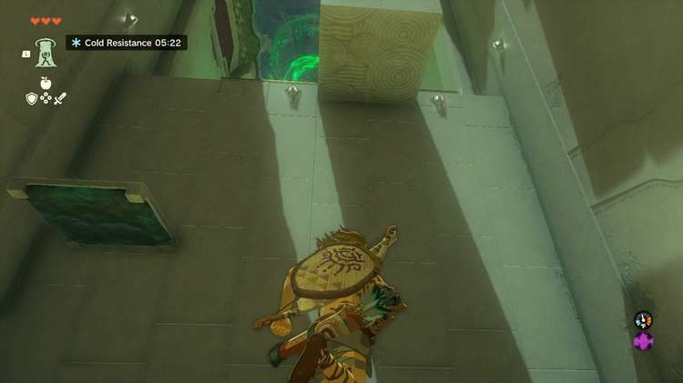

The final puzzle has a high outstretched platform that’s too far up for Ascend to reach, but there’s a much lower moving platform below it. All you need to do is wait for it to pass by to swim up through it, and then look up to hit the next platform as you pass under it. 

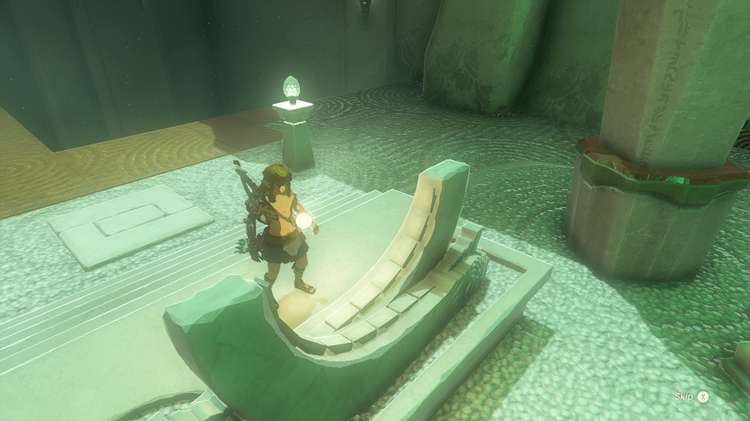

This will lead you straight to the inner shrine, and you can collect the Light of Blessing. 

Gutanbac Shrine

Congrats on solving the shrine and earning a Light of Blessing! Click or tap to return to see the rest of the TotK Shrine Locations and Puzzle Solution Guides or check out the other shrine guides for the area: 

  * Ukouh Shrine
  * In-isa Shrine
  * Nachoyah Shrine

### Up Next: Walkthrough

Previous

About IGN's Zelda TotK Guide Writers

Next

Walkthrough

### Top Guide Sections

  * Walkthrough
  * Zelda: Tears of The Kingdom Switch 2 Edition Guide
  * Zelda Notes Voice Memories
  * List of Side Quests and Side Adventures

### Was this guide helpful?

Leave feedback

Go to comments