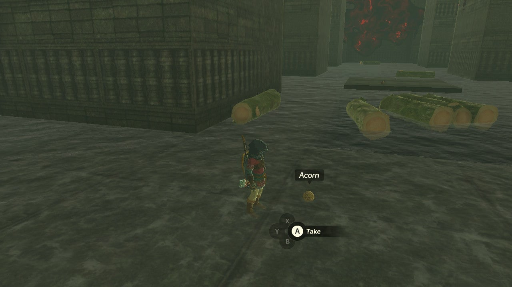

Igashuk Shrine (Rauru's Blessing) in Zelda: Tears of the Kingdom is hidden in the Lomei Labyrinth Island in the top northeast corner of the map. Here's how you can reach the shrine within. 

There are a couple of different ways to get to the shrine at the center of this flooded labyrinth, depending on how you want to go about it. The simplest solution is to start at the entrance and follow a path of acorns that a Zonai Research team NPC has left leading to the end. 

**Having trouble following the trail?** If you’ve unlocked the improved tracker on your Purah Pad, you can take a picture of the item you are following and then set it to be tracked so that you always have an indication as to where the next closest one is waiting.

However, following that path is far from the most direct route. The Ascend ability allows you to quickly get on top of the labyrinth walls by finding one of the many alcoves or underpasses in the maze, or you can try to glide in from the mainland and land on top of it from the start. From there you can explore the area more safely and quickly. 

The fastest way to bypass the maze entirely is to get on top of the walls, then run to the southwest corner of the larger section near the top (shown below) where you can hop back down. From there you can climb a short ladder and follow the path of acorns to the central chamber and activate the shrine. 

Inside the Igashuk shrine you can collect the treasure and Light of Blessing.

Igashuk Shrine

For more on the Lomei Labyrinth Island, visit its guide for directions on getting through its sky and depths portions. 

Congrats on solving the shrine and earning a Light of Blessing! Click or tap here to return to the rest of the Shrine Guides. You can also check out which shrines are nearby with our shrine map filter on our complete map of Hyrule.

### Up Next: Walkthrough

Previous

About IGN's Zelda TotK Guide Writers

Next

Walkthrough

### Top Guide Sections

  * Walkthrough
  * Zelda: Tears of The Kingdom Switch 2 Edition Guide
  * Zelda Notes Voice Memories
  * List of Side Quests and Side Adventures

### Was this guide helpful?

Leave feedback

Go to comments