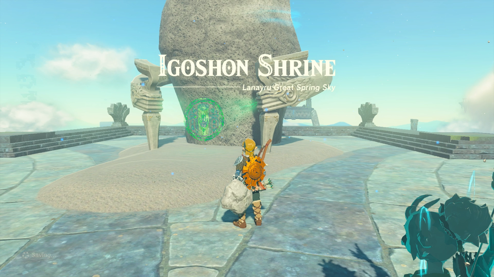

Igoshon Shrine (Orbs of Water) in Zelda: Tears of the Kingdom is a shrine located on Wellspring Island in the Lanayru Sky Region and is one of 152 shrines in TotK (see all shrine locations). This page contains a guide for how to locate and enter Igoshon Shrine in Tears of the Kingdom, a walkthrough for the shrine itself, and puzzle solutions and treasure chest locations for the TotK Igoshon Shrine. 

### Igoshon Shrine Treasure and Rewards

  * Large Zonai Charge

## How to Find Igoshon Shrine in TotK - Location Guide

Igoshon Shrine is located on Wellspring Island, east of Upland Zorana Skyview Tower. You can find this shrine during the Sidon of the Zora main quest. Link’s Zora Armor is helpful to climb waterfalls in the sky islands to reach the shrine. 

  * Coordinates: 3480, 0667, 1325

## Igoshon Walkthrough and Puzzle Solutions

Walk straight to the platform where an orb of water appears. Stand directly on top of the circle and wait for an orb to consume Link and lift him up in the air. When the orb reaches its maximum height, use the Paraglider to land in the next area of the shrine. 

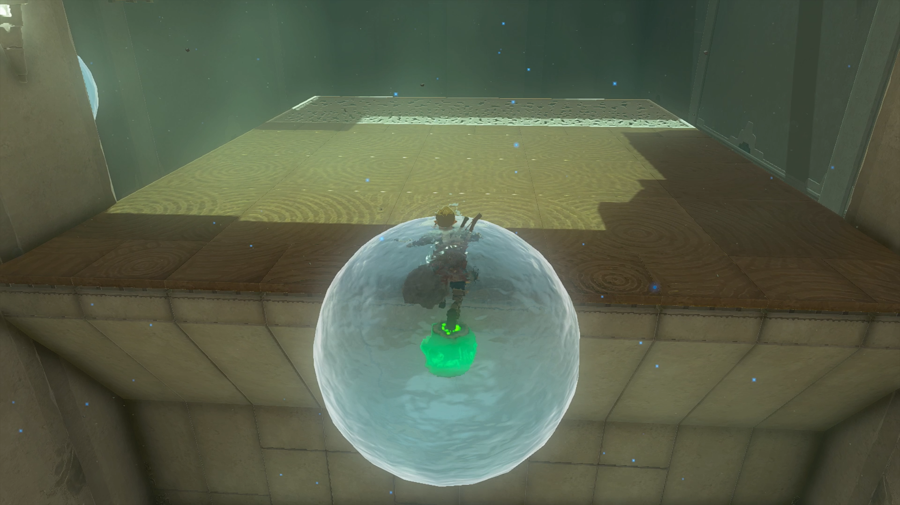

Turn to the left where you’ll find another orb of water on a platform attached to the wall. A treasure chest will also continually fall to the right of the orb. Use Ultrahand to grab the orb of water and position it where you can attach it to the chest as it falls. Bring the orb of water with the chest to your feet and wait for it to pop. 

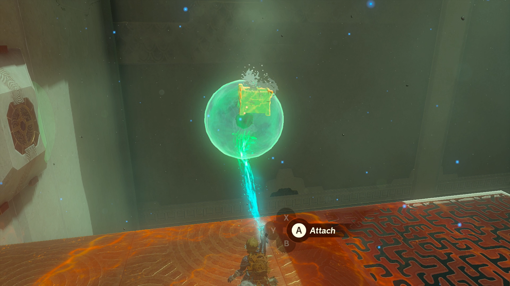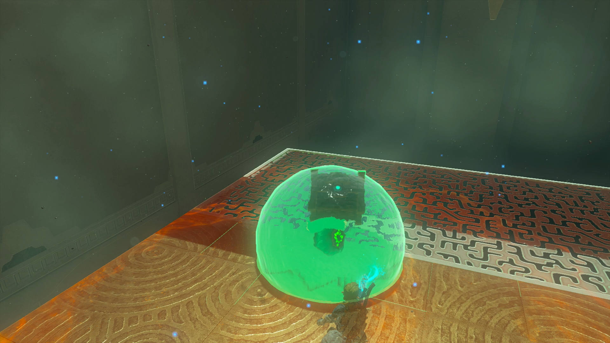

Open the treasure chest with a Large Zonai Charge inside. 

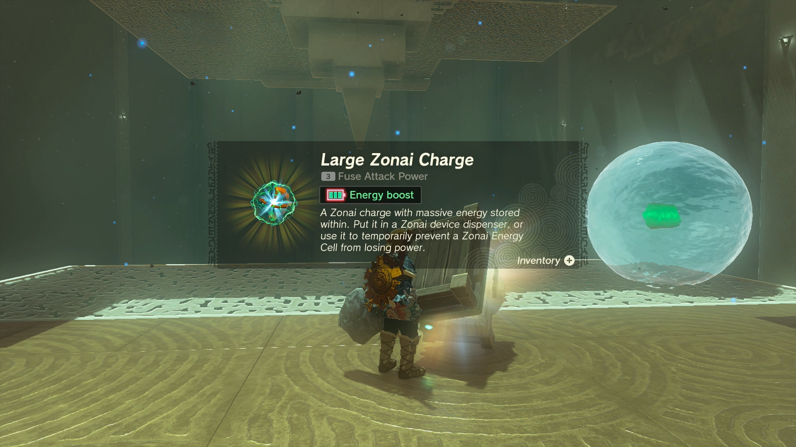

On the right, you’ll see an orb of water falling from above. Use Recall on the orb and jump into it to travel back up its path. Land in the next orb that travels across the platform to head to the next section of the shrine. 

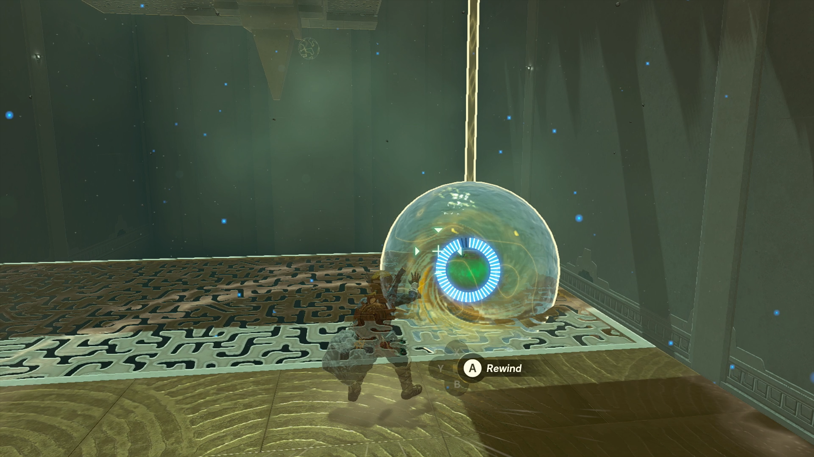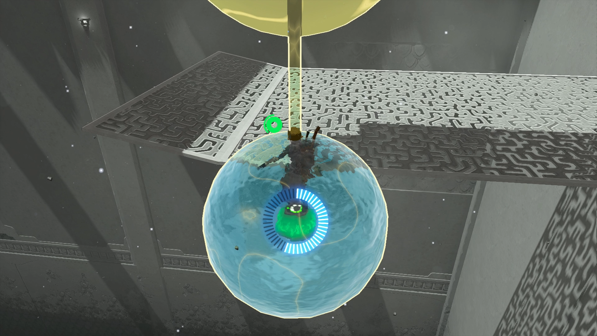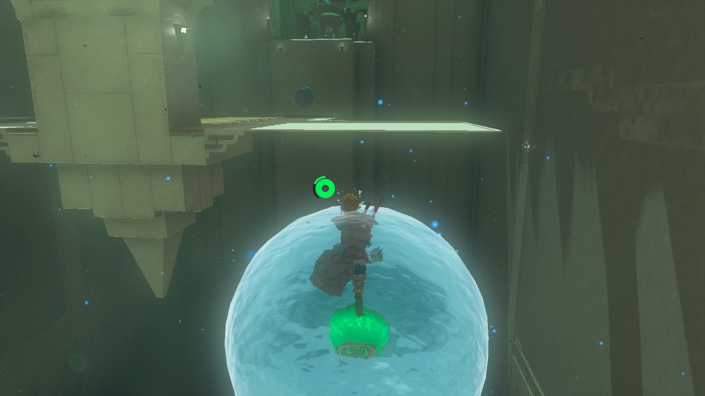

Use Ultrahand to slide the raised platform in line with the path of the final orb of water. Grab the flat slab with Ultrahand and attach it to the raised platform to create a ramp that angles toward the shrine exit. 

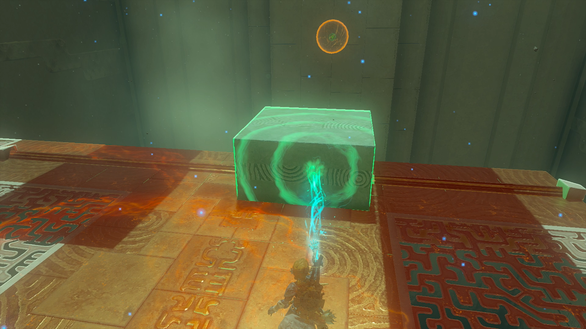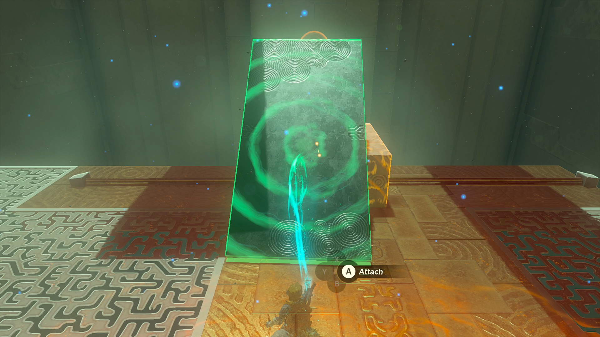

Stand at the top of the ramp you created and wait for an orb of water to transport you to the shrine exit. 

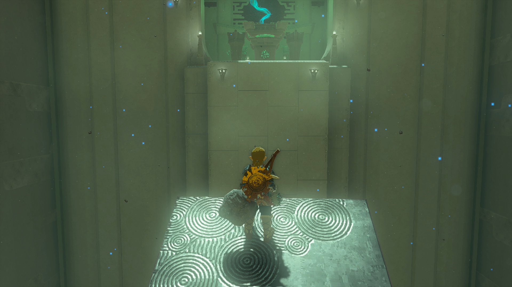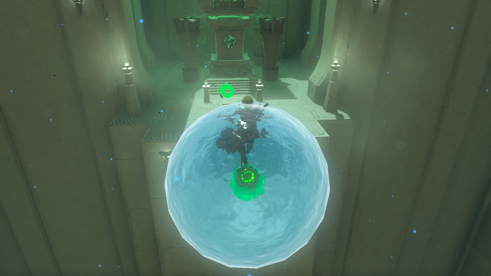

Igoshon Shrine

Congrats on solving the shrine and earning a Light of Blessing! Click or tap here to return to the rest of the Shrine Guides. You can also check out which shrines are nearby with our shrine map filter on our complete map of Hyrule.

### Up Next: Walkthrough

Previous

About IGN's Zelda TotK Guide Writers

Next

Walkthrough

### Top Guide Sections

  * Walkthrough
  * Zelda: Tears of The Kingdom Switch 2 Edition Guide
  * Zelda Notes Voice Memories
  * List of Side Quests and Side Adventures

### Was this guide helpful?

Leave feedback

Go to comments