Ihen-a Shrine (**Midair Perch**) in Zelda: Tears of the Kingdom is a shrine located in the Lanayru Great Spring region and is one of 152 shrines in TOTK (see all shrine locations). This page contains a guide for how to locate and enter the shrine, a walkthrough for the shrine itself, and puzzle solutions as well as treasure chest locations for the TotK Ihen-a Shrine. 

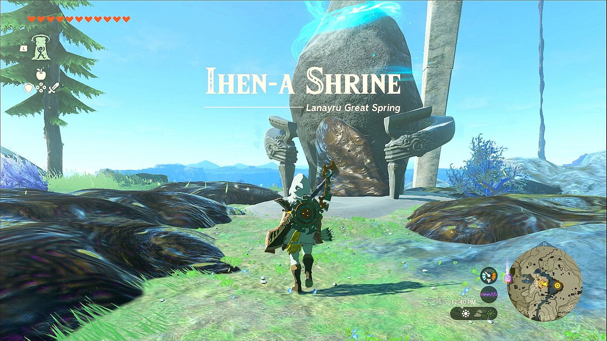

### Treasure and Rewards

  * Arrow x5

## Ihen-a Shrine Location

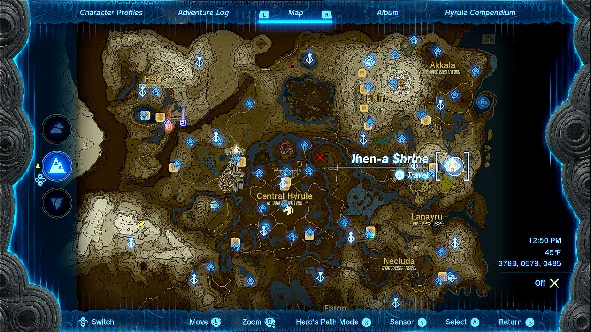

The Ihen-a Shrine is located just west of Mipha Court, which is at the peak of Ploymus Mountain. If you’re currently working on the Regional Phenomena main story quest, then going to the Zora region will bring you to this Shrine organically. If not, you can just trek up the mountain to get to it or paraglide east after blasting off from the Upland Zorana Skyview Tower. 

  * Coordinates: 3783, 0579, 0485

## Ihen-a Shrine Walkthrough

Whether you’ve reached Ihen-a Shrine by doing the Regional Phenomenon main story quest, or just found it from exploring, you’ll notice that the area is covered in sludge. There’s a story-related reason why this sludge exists, but all you need to know is that it’s everywhere, and it's blocking the Shrine entrance. Removing the sludge is easy. You can throw a blue chuchu jelly or a splash fruit at it to dissolve it (or attach either item to an arrow and shoot it) or use the fire hydrant Zonai device to spray it off. Regardless, once that’s done, you are free to enter the Shrine. 

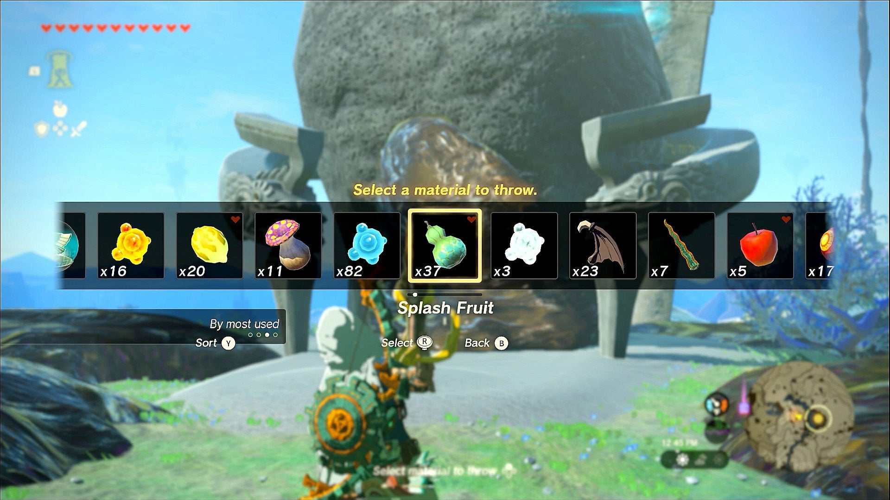

Once inside, you’ll find yourself in a large room with floating Zonai devices called Hover Stones. These work similar to ones you’ve seen before on the Great Sky Island, except these are much smaller, and need to be activated to float. But once they’re activated, you can move and adjust them in any way you like and they’ll stay suspended in the air. 

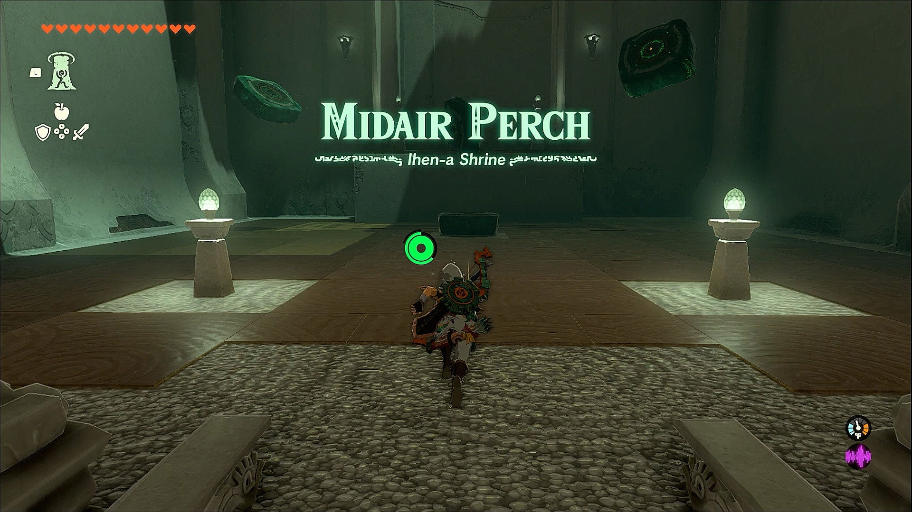

The first thing you’ll need to do in the first room is get up on the ledge. To do this, either position the Hover Stones to create stairs for you to walk up, or simply place one near the ledge level with it, and use Ascend to teleport up through it. 

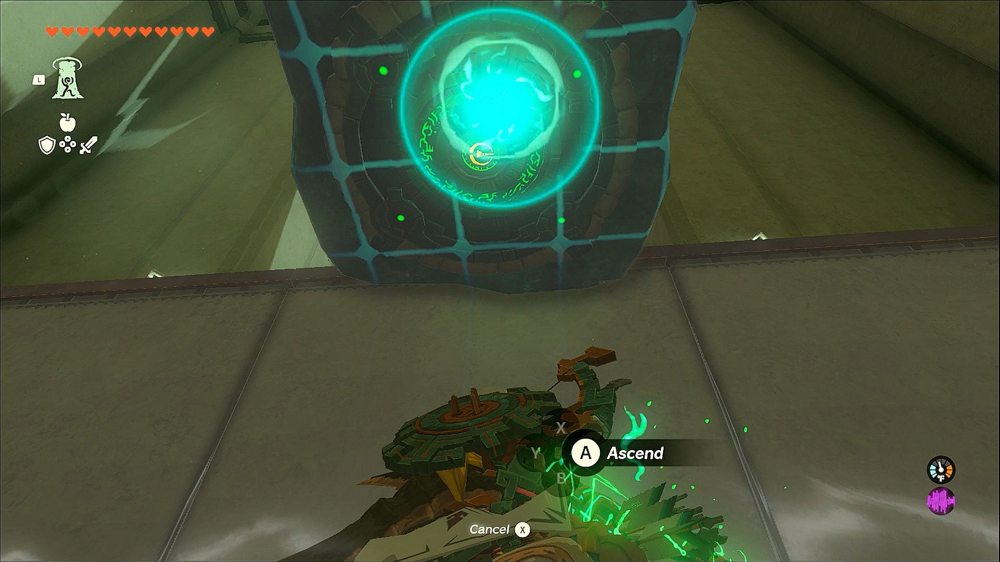

Continue through, and after turning the corner, you’ll see another Hover Stone laying on the ground next to a long platform you can use as a bridge. Hit the Hover Stone to activate it, then use Ultrahand to glue the long platform to the Hover Stone to create a bridge. Then use Ultrahand to place it over the gap for you to walk over. 

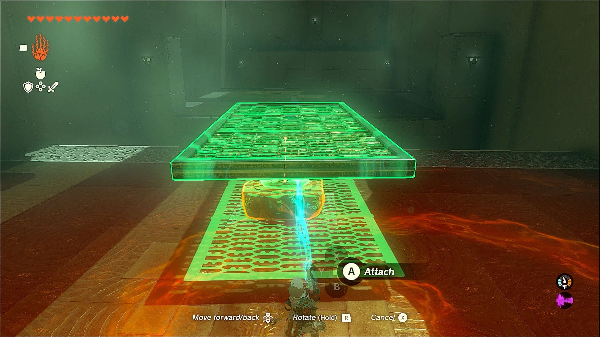

You’ll immediately be faced with another gap, this time with the ledge being higher than the one you’re currently standing on. Grab the make-shift bridge you’ve already created and position it into a ramp form and place it over the gap so you can use it to get to the next ledge. 

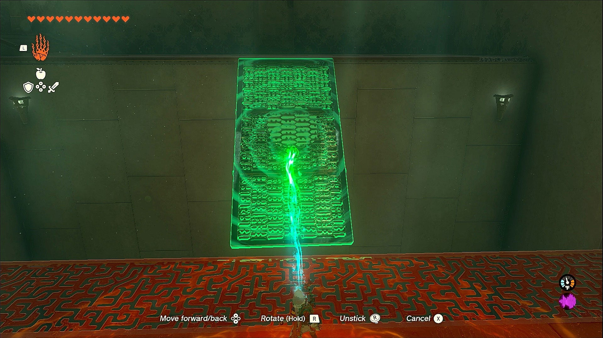

Before heading to the next room, grab your bridge again as we’re going to use it a couple more times, first to get the chest. As you walk into the next huge room, immediately to your left you’ll see a hole cut out in the wall that houses the chest. Use your ramp bridge to get up to the chest which contains five arrows. 

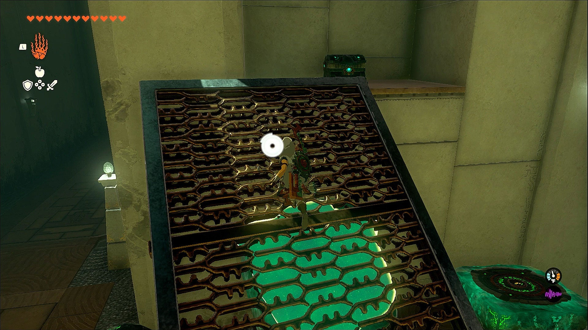

Now to solve the final puzzle. In the large room, you’ll see a huge gap with a spot for a ball on the other side. On the side you’re currently on, you’ll see the ball, several Hover Stones, and a switch. Hitting the switch will trigger a catapult that pushes objects to the other side of the room. 

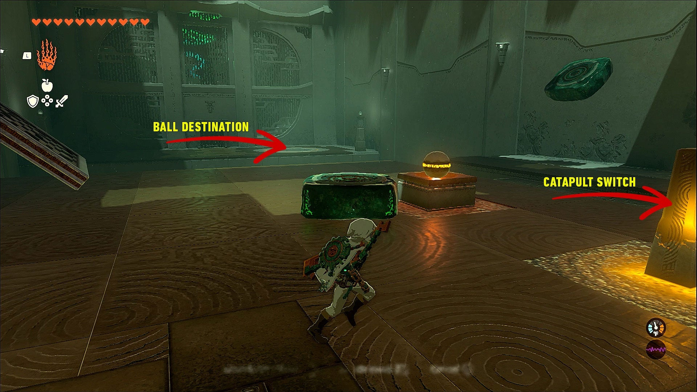

Using Ultrahand, glue the ball to one of the activated Hover Stones and place it in the front of the catapult, then hit the switch and see the catapult push the Hover Stone carrying the ball across the room. 

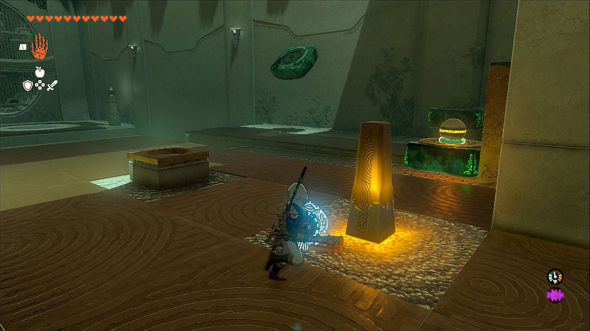

Now put your bridge in front of the catapult, jump on it, and shoot the switch with an arrow – you should have at least one, you just got five from the chest! Doing this will push the bridge carrying Link across the gap. 

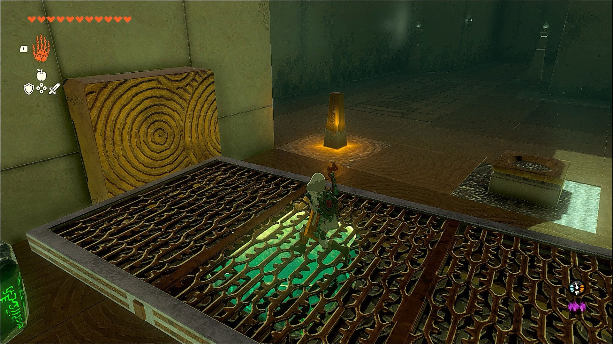

Now simply jump down, use Ultrahand to grab the ball from the Hover Stone, and place it in the hole. And you’re done! The final gate will open and you can claim your **Blessing of Light**. 

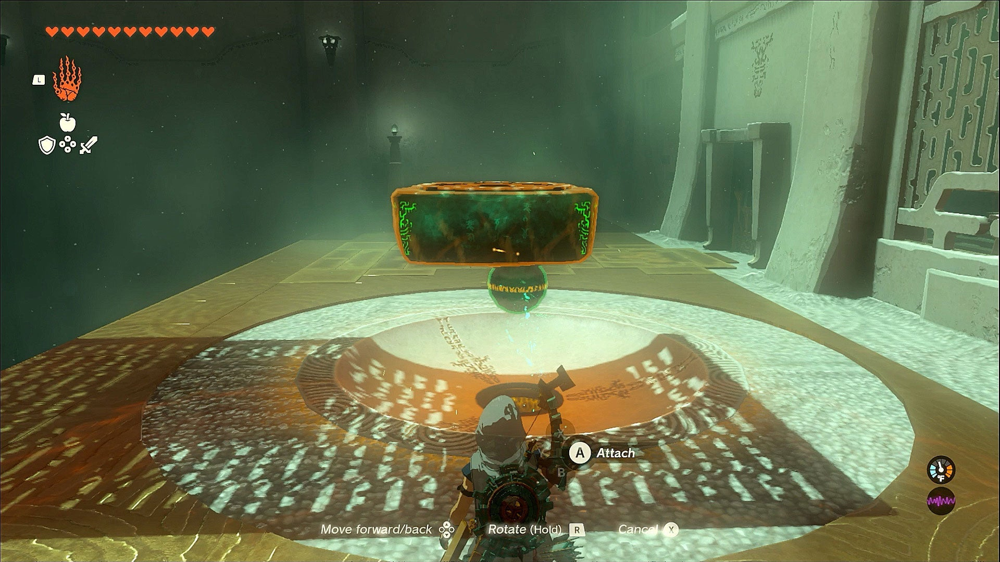

Ihen-a Shrine

Congrats on solving the shrine and earning a Light of Blessing! Click or tap here to return to the rest of the Shrine Guides. You can also check out which shrines are nearby with our shrine map filter on our complete map of Hyrule.

### Up Next: Walkthrough

Previous

About IGN's Zelda TotK Guide Writers

Next

Walkthrough

### Top Guide Sections

  * Walkthrough
  * Zelda: Tears of The Kingdom Switch 2 Edition Guide
  * Zelda Notes Voice Memories
  * List of Side Quests and Side Adventures

### Was this guide helpful?

Leave feedback

Go to comments