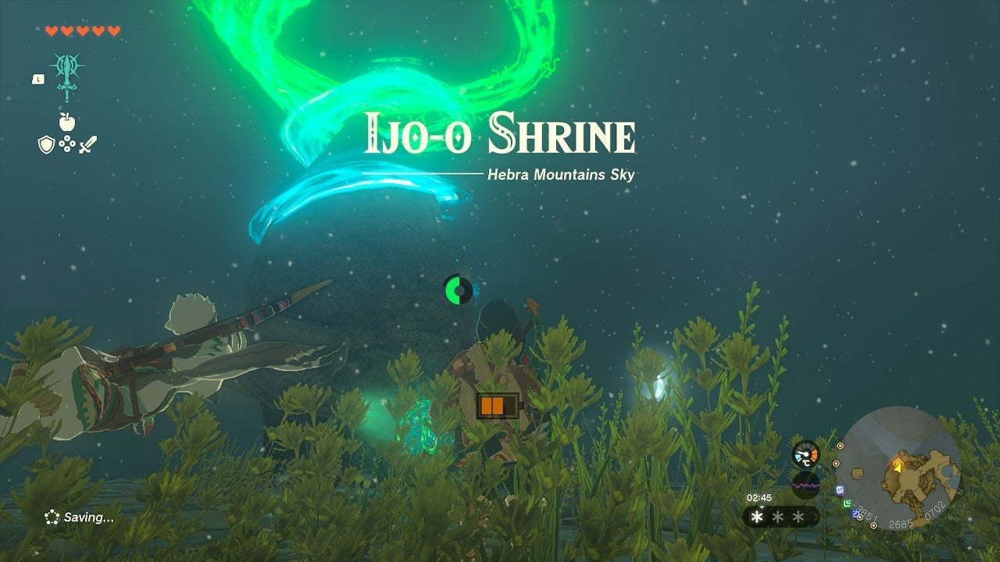

Ijo-o Shrine (More Than Defense) in The Legend of Zelda: Tears of the Kingdom is a shrine located in the Hebra Sky Region. This page contains a guide for how to locate and enter the shrine, a walkthrough for the shrine itself, and puzzle solutions as well as treasure chest locations for the TotK Ijo-o shrine. 

### Treasure and Rewards

  * Arrow x5

## Location/How to Reach

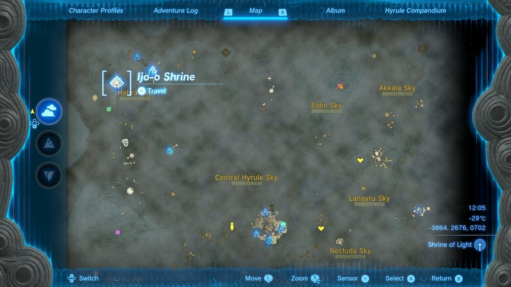

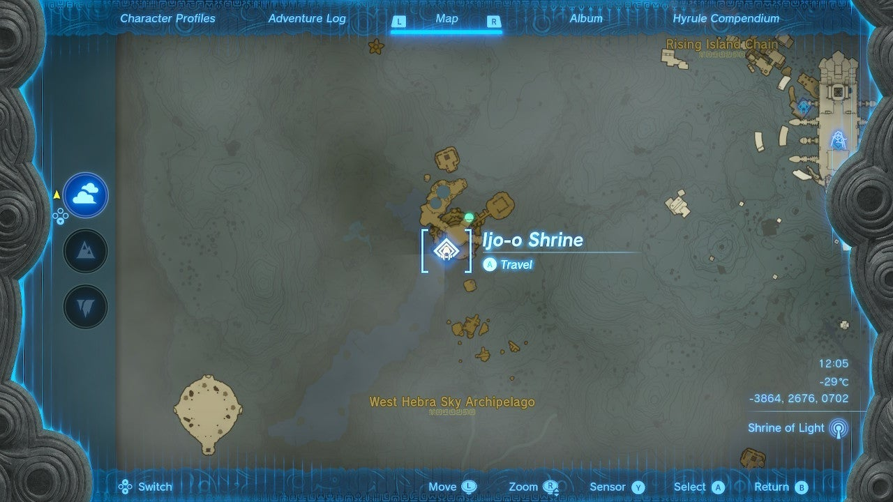

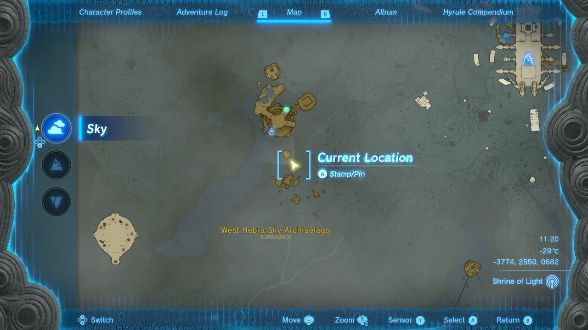

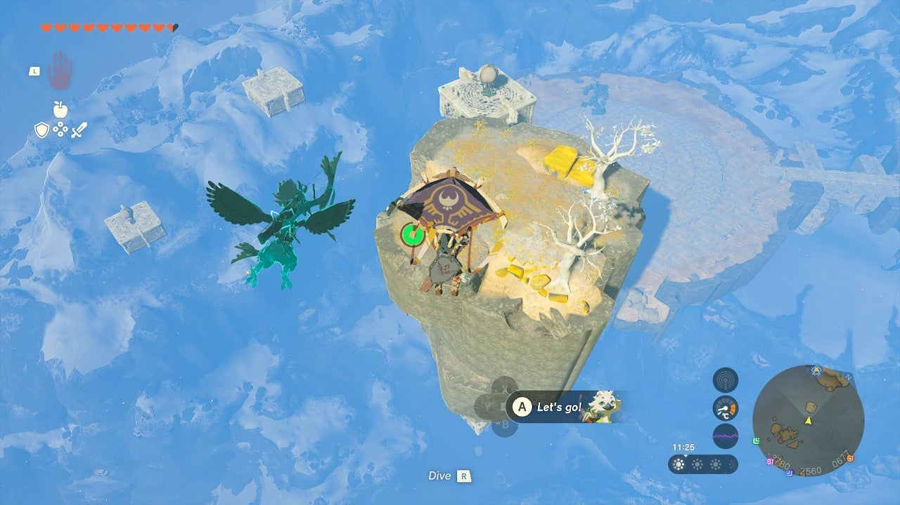

The easiest way to get to the shrine is to use Tulin’s help -- but you'll have to start the Tulin of Rito Village main quest from the Rito Village first. From the Rospro Pass Skyview Tower in the Hebra Mountains, launch into the air and you should see this shrine glowing in the West Hebra Sky Archipelago to the northwest. Float down to the nearest northwest island with a floating, detached platform and balloon attached to it. Hit the engine on the balloon to float up to the apex of the engine’s height. 

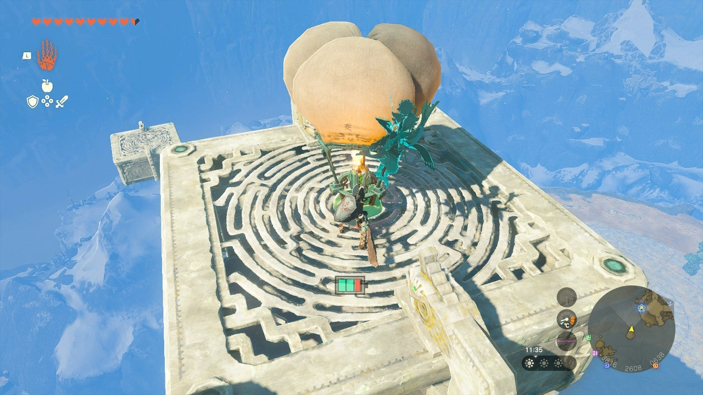

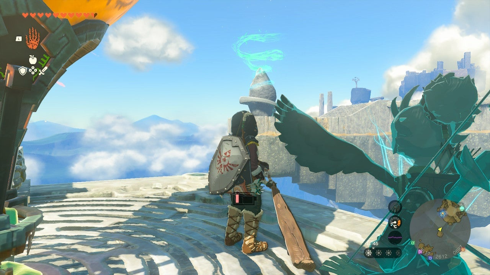

If you don't have Tulin with you, you can still get to the shrine -- you just have to time it right and jump off at the highest point and glide over to one of the walls of the floating island. Cling on and climb up. With Tulin, it's much easier: just activate Tulin’s power from the floating platform and ride the gust on your paraglider to the island with the shrine. 

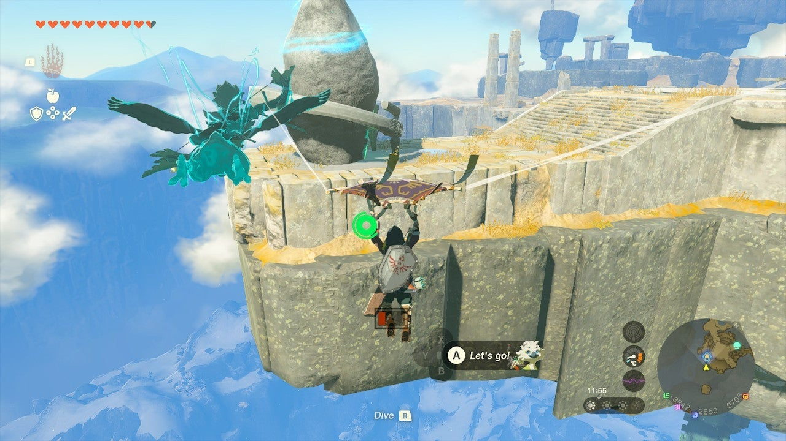

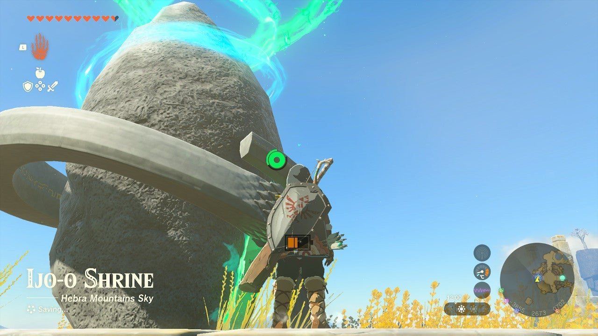

  * Coordinates: -3862, 2679, 0702

## Walkthrough and Puzzle Solutions

There’s an ice block and a Construct in the first room – and the Construct’s shield, along with the shrine description “Ijo-o Shrine (More Than Defense)” is a clue here: Kill the Construct by rushing it with your best weapon and then either take its flame emitting shield, or Fuse your own favorite shield with the Flame Emitter in the corner. 

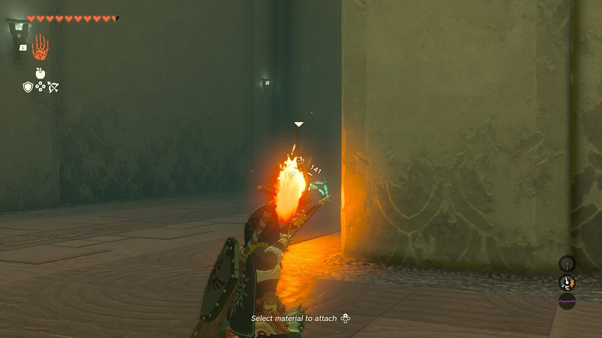

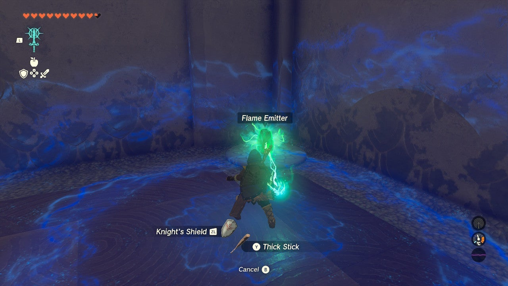

Equip your flame shield by holding no weapon OR a one-handed weapon and pressing RT. This will allow you to melt ithe first ice block and enter the second room. Alternative means include using any Ruby-fused weapon's fire power, or dropping a pile of wood and flint and striking it with a sword, or lighting a wooden weapon on fire and standing next to the block until it melts. 

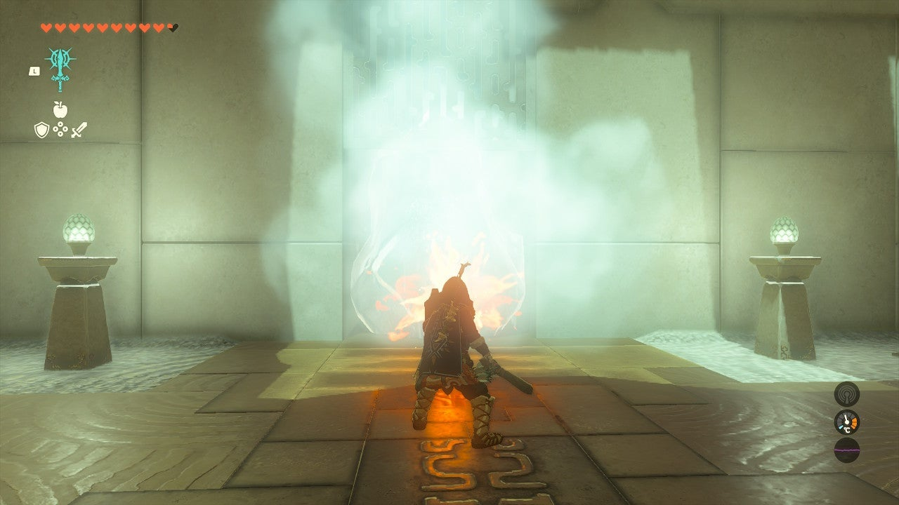

Pass through the gate the ice blocked and you’ll find another ice block and a Construct. 

## Treasure Location

Melt the second ice block the same way you melted the first and it will reveal a chest with Arrows x5 inside. 

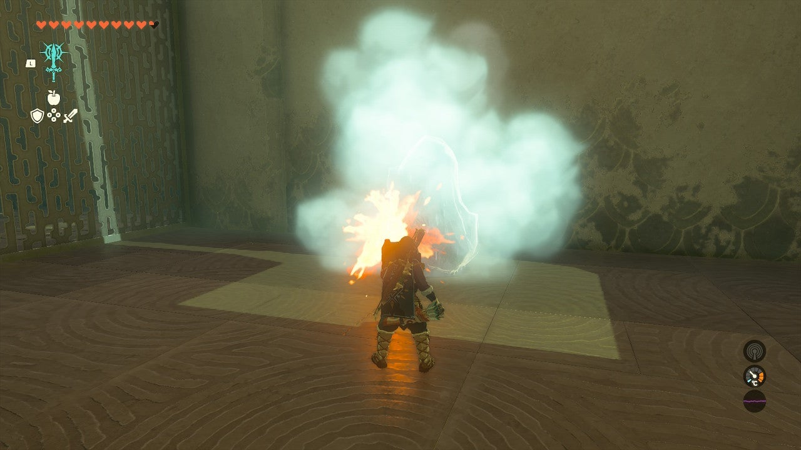

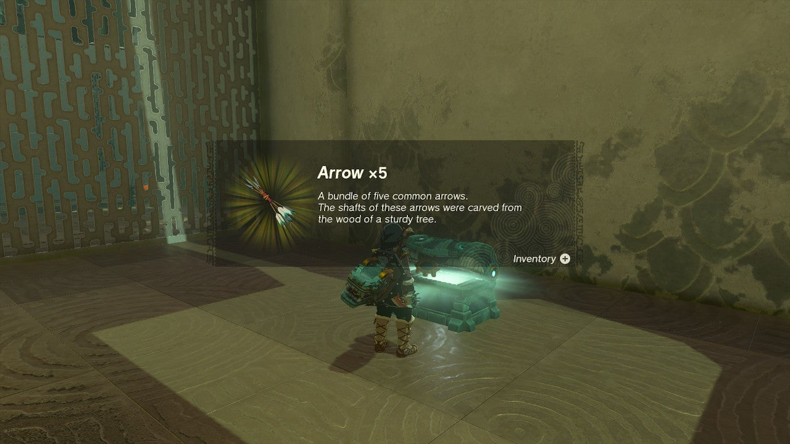

Use your flame shield to torch the next Construct or lock and and evade and strike with your favorite weapon. Here you can take its shield with a stone slab attached to it – or make your own. To remove the flame emitter you must select the shield in your pause menu and destroy the attached emitter. This will leave your shield intact. 

Whatever the case, you should take your shield with a big stone slab over to the wall of fire, equip it, put away any two-handed weapons and hold R to block the fire, and edge sideways to the next area. 

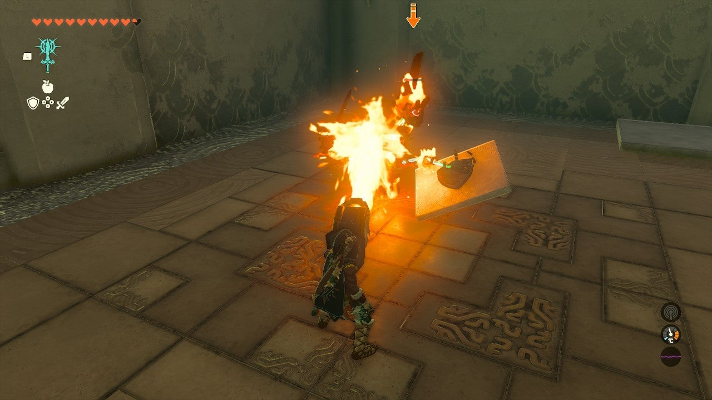

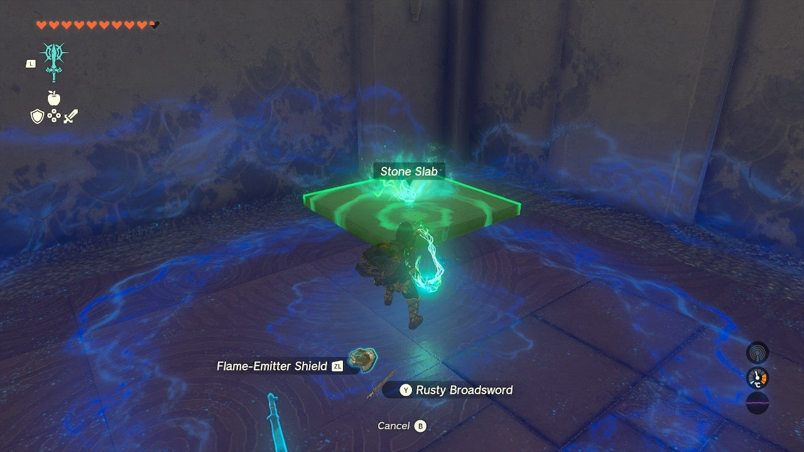

The next Construct is in a room with four rockets and a couple of shields. It’s dangerous from afar so move in close and try to parry or dodge its attacks while attacking it. You can have fun here and send rockets flying at your enemy, but the easiest way to take down the Construct is arrows to the eye(s) or direct strikes. 

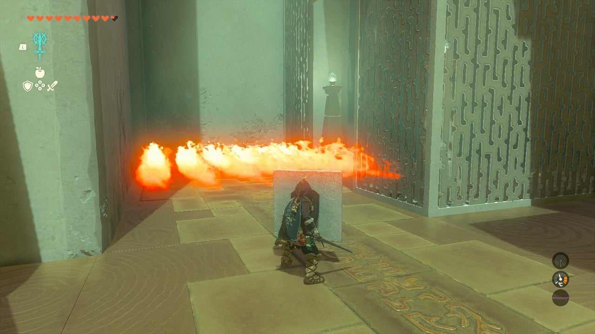

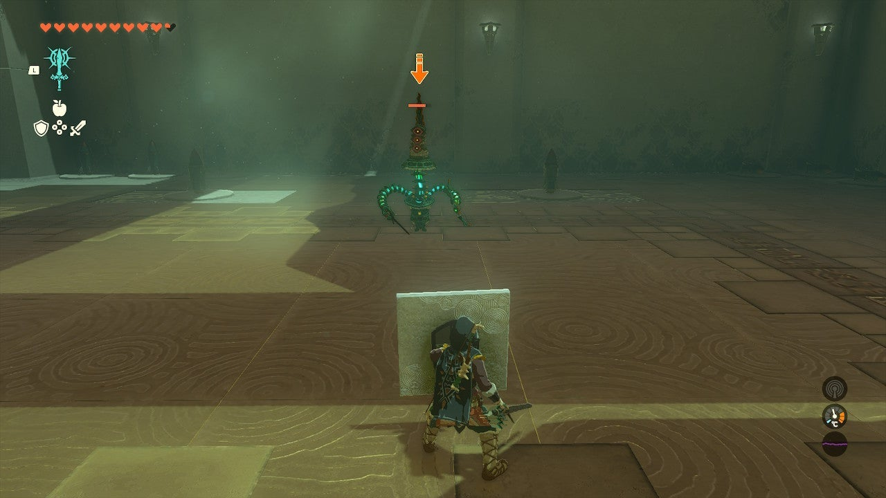

When you're done, it's time to fuse items again. Fuse the rocket, this time, to your shield, or one of the shields you can find in the room. 

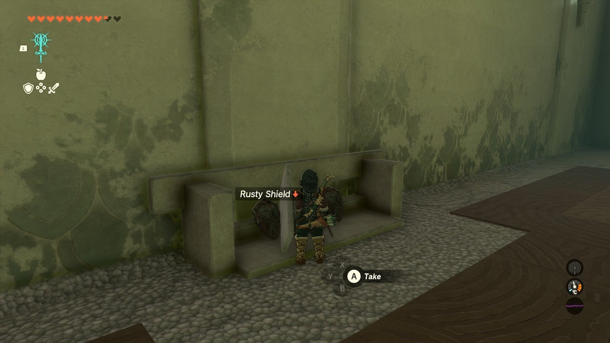

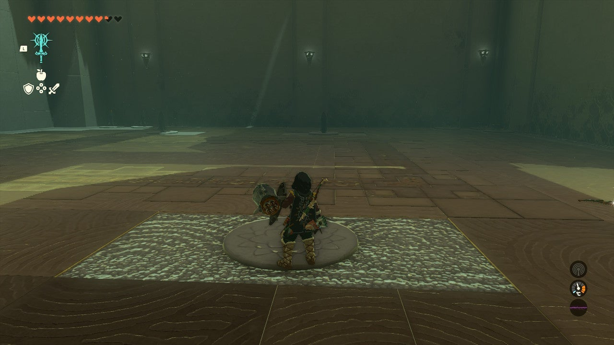

Move to the ledge with the exit above. When you pull out a the rocket shield, it will take you to the ceiling, and fast, so be ready to paraglide to the exit from the top of the flight. 

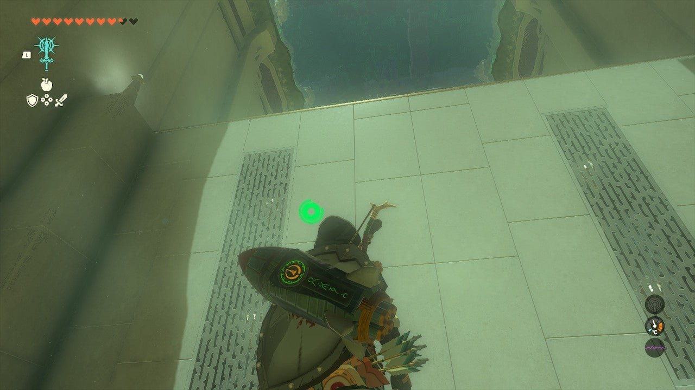

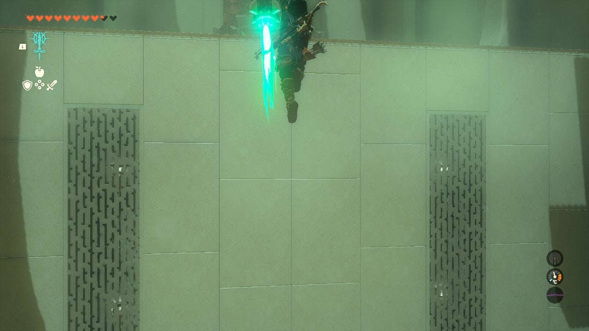

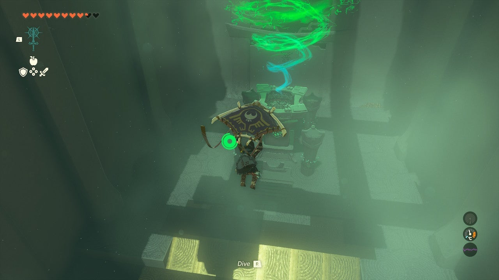

Ijo-o Shrine

Congrats on solving the shrine and earning a Light of Blessing! Click or tap here to return to the rest of the Shrine Guides.

### Up Next: Walkthrough

Previous

About IGN's Zelda TotK Guide Writers

Next

Walkthrough

### Top Guide Sections

  * Walkthrough
  * Zelda: Tears of The Kingdom Switch 2 Edition Guide
  * Zelda Notes Voice Memories
  * List of Side Quests and Side Adventures

### Was this guide helpful?

Leave feedback

Go to comments