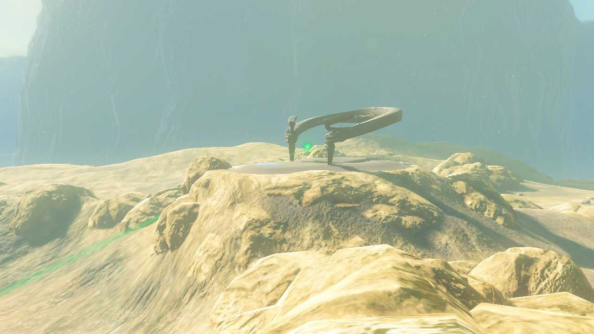
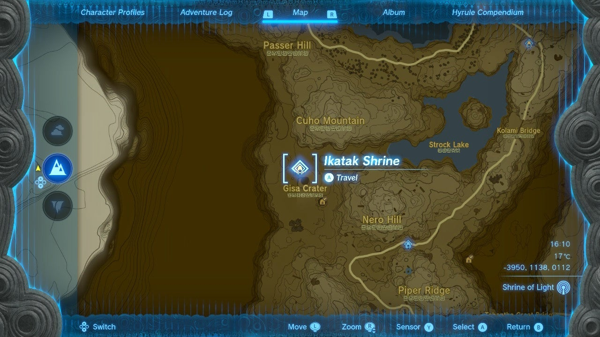
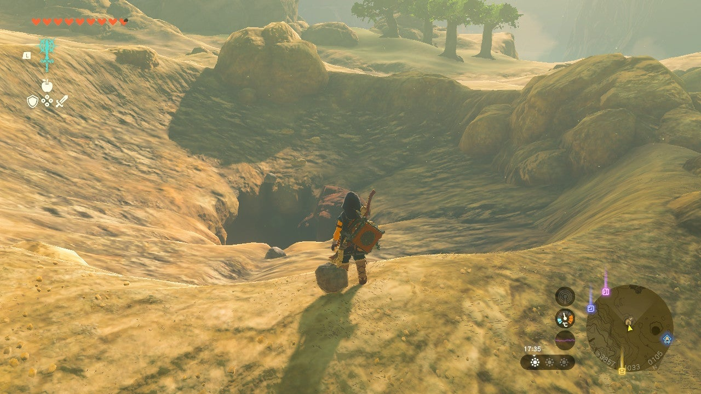
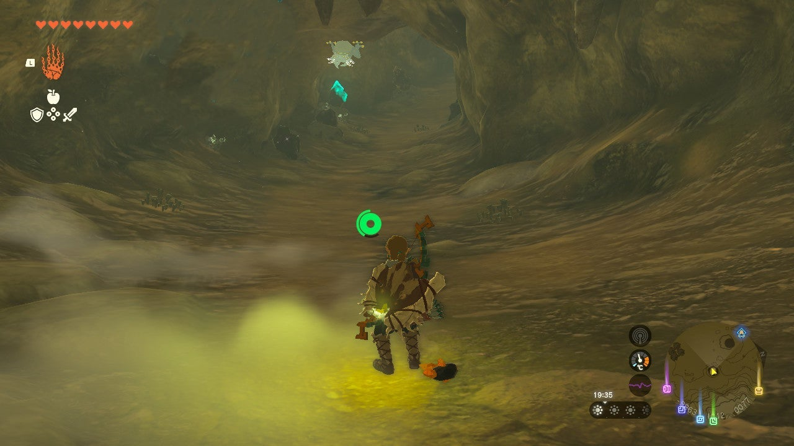
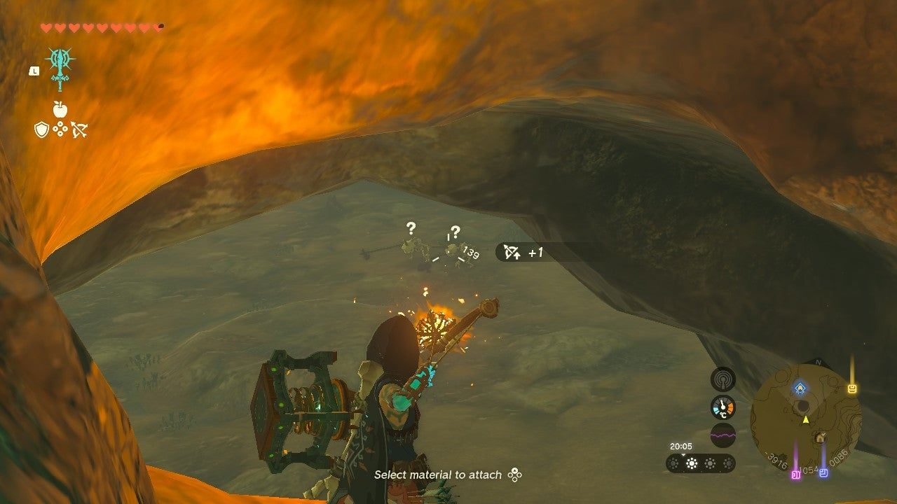
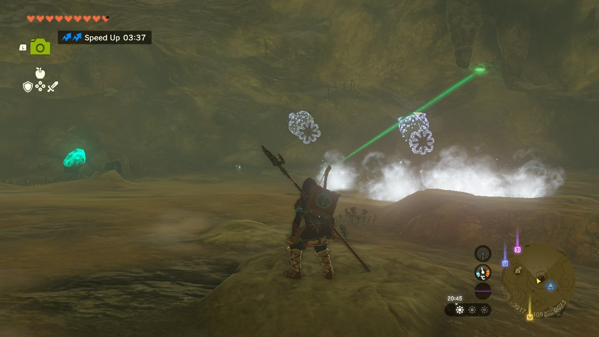
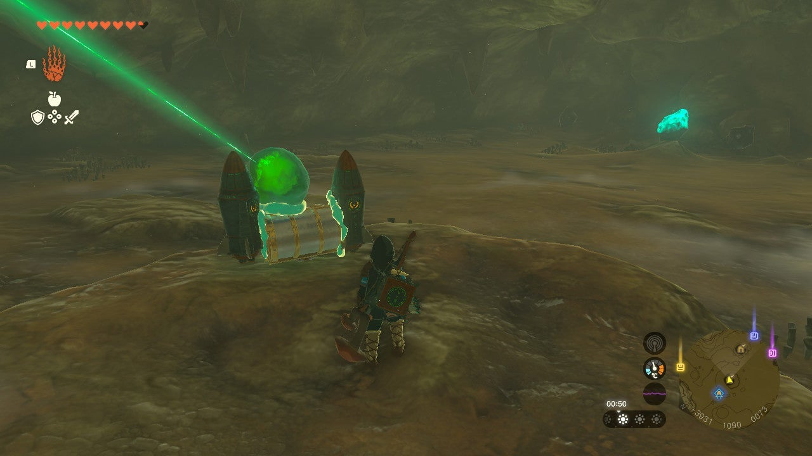
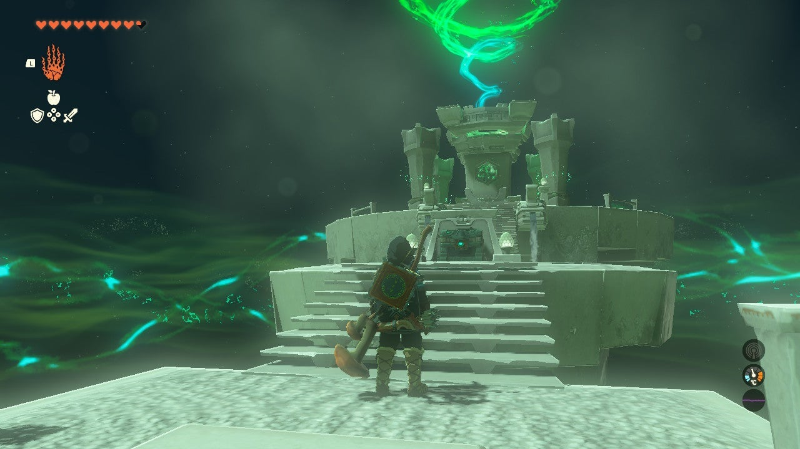

Ikatak Shrine (Rauru's Blessing) in The Legend of Zelda: Tears of the Kingdom is a shrine located in the **Tabantha Frontier** 's Gisa Crater. This page contains a guide for how to locate and enter the shrine, a walkthrough for the shrine itself, and puzzle solutions as well as treasure chest locations for the Ikatak shrine. 

### Treasure and Rewards

  * Big Battery

## Location/How to Reach

This shrine sits empty on a dry plain above the Gisa Crater impact point. 

  * Coordinates: -3950, 1138, 0112

## The Gisa Crater Crystal Walkthrough

In order to enter the Ikatak Shrine you'll need to retrieve the shrine crystal, which happens to be in the Gisa Crater. Rather than directly jumping into the indicated crater (be sure to destroy the rocks covering it, though), walk southeast from it to another crater entrance. It's a smaller crater with red rock filling its center. 

This is a separate entrance to the main Gisa Crater cave and it's filled with ore and is home to a Bubbulfrog. Slay it with an arrow and collect any of the goods that interest you in here. 

At the end of the cave you'll see a small entrance into a larger cave below. It's hard to pick anything off here, but below you'll see two Stalkoblin and you may peek the Ice Like. 

The two Ice Like in this cave are the real threat. 

To kill Ice Like, you'll want to stun them (they're susceptible to electricity) then pelt their stunned form with attacks. The ice mist they shoot has a decent range, so mind your positioning. Bursts of electricity from a Topaz Rod and Arrows are extremely effective. If you don't feel like defeating both of them you can get one out of the way then use Ultrahand to drag the shrine crystal to safety. 

Now there's the issue of getting the shrine crystal out of the crater. Luckily there are two rockets ready to go. Attach them to the shrine crystal (is this blasphemous?) and shoot it through the opening. It'll land somewhere above. Use Ascend to get out of the crater too. 

We wanted the shrine crystal to feel extra secure, so we used the nearby chest as a base for good measure. 

Retrieve the shrine crystal and bestow it to the shrine to complete the quest. 

**Tip** : If you happen to accidentally drop it while trying to get up the side of the crater and it rolls back down into the crater pit, use Recall to bring it back and be ready to grab it. Maybe just use Ultrahand to carry it! 

The Gisa Crater Crystal

### Inside Ikatak Shrine

This shrine requires a quest you don't need to complete any additional challenges. Collect your treasure (Big Battery) and the Light of Blessing. 

Ikatak Shrine

Congrats on solving the shrine and earning a Light of Blessing! Click or tap here to return to the rest of the Shrine Guides.

### Up Next: Walkthrough

Previous

About IGN's Zelda TotK Guide Writers

Next

Walkthrough

### Top Guide Sections

  * Walkthrough
  * Zelda: Tears of The Kingdom Switch 2 Edition Guide
  * Zelda Notes Voice Memories
  * List of Side Quests and Side Adventures

### Was this guide helpful?

Leave feedback

Go to comments