In-isa Shrine (**The Ability to Combine**) in The Legend of Zelda: Tears of the Kingdom is a shrine located on the Great Sky Island and is one of many shrines in TOTK (see all shrine locations) . This page contains a guide for how to locate and enter the shrine, a walkthrough for the shrine itself, and puzzle solutions as well as treasure chest locations for the TotK In-isa Shrine. 

### Treasure and Rewards

  * **Fuse**
  * ****Arrows******x 5**

##  In-isa Shrine Location

This Shrine can be reached via the Great Sky Island - Find Princess Zelda and The Closed Door quest. 

  * Coordinates: 0027, -1503, 1408

## In-isa Walkthrough and Puzzle Solutions

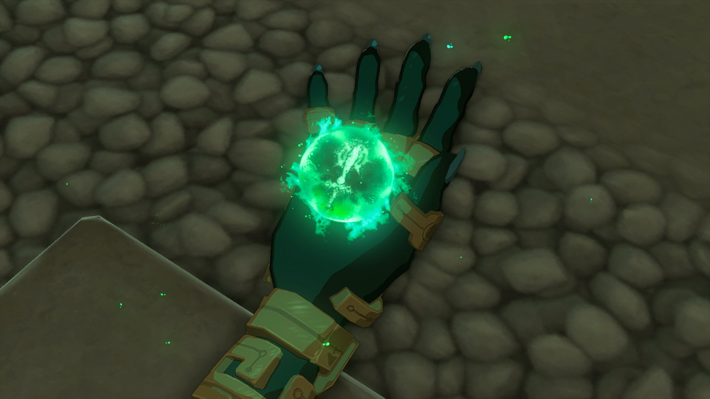

Once you enter, Rauru will give you one of the most important abilities of your entire arsenal: Fuse. This allows you to meld almost any object on the ground with your weapons to create entirely new fused creations to fight with. Not only will this improve their attack power, but it can also drastically increase its durability and let you fight with it for much longer than a standard weapon. 

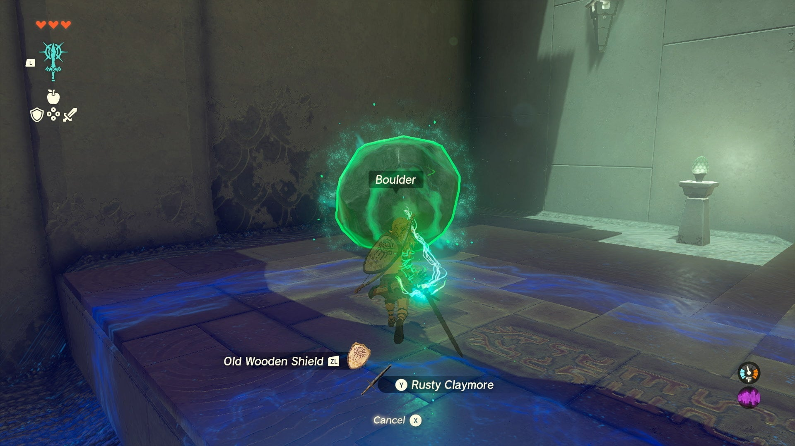

Even more importantly - the type of item fused to the weapon can modify its properties. As you approach the first crumbling stone pillars blocking your path, use the **Rusty Claymore** and fuse it with a boulder to create a Broadsword Hammer! 

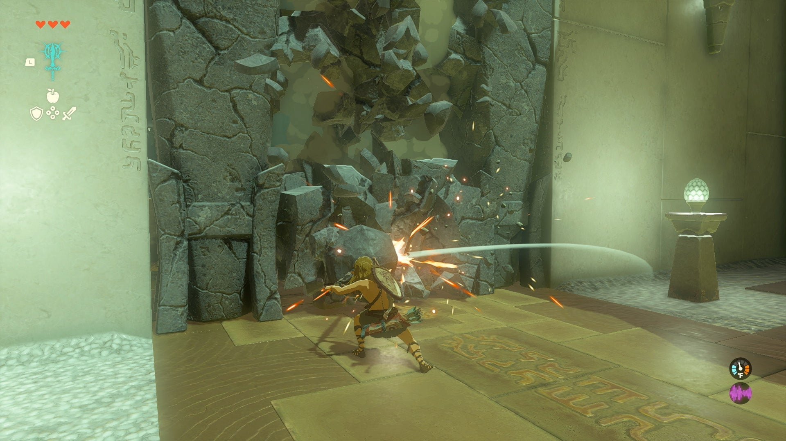

With a rock on the end, it can now break apart other rocks as a suitable mining tool! 

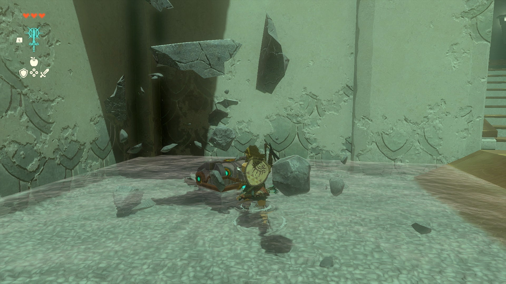

Once you destroy the gate, move into the next room and try it on the four pillars here. One has a chest on the top that you can reach by destroying the pillar with your weapon, and claim **5 Arrows**. 

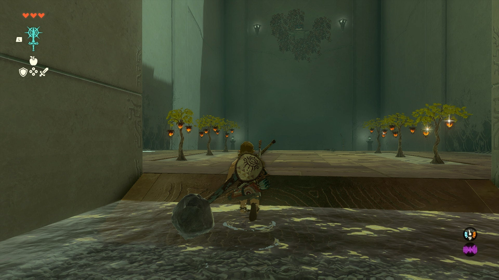

Off to the right is another fun activity — as Fuse is not just limited to your swords. Another chest sits on a high wooden platform surrounded by leaves, and several plants nearby bear **Fire Fruit**. 

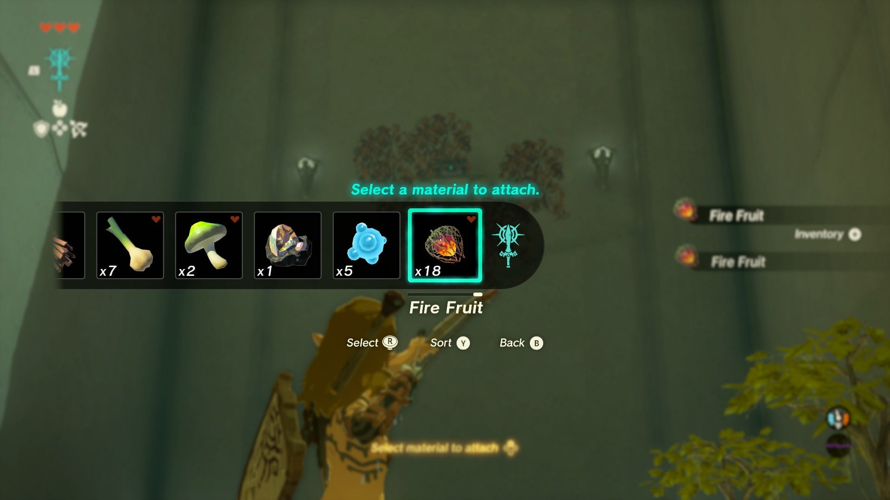

Hold out your bow by holding ZR, and then press up on the D-pad to cycle through all of your available materials. Select the Fire Fruit, and you’ll find that it’s now fused to your arrow, and can be launched as a fire arrow to ignite the wood and send the chest down, which holds a **Small Key**. 

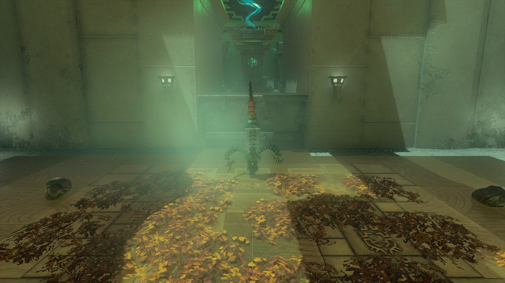

Using the key on the main door, you’ll reach an arena with a lone Soldier Construct Captain. These advanced constructs also have the power of Fuse, and will routinely collect anything nearby to fuse onto their weapons to fight you with. 

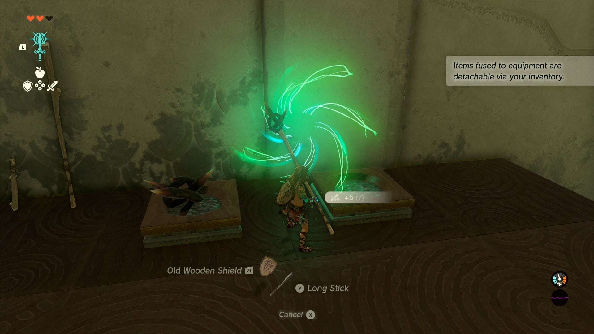

Luckily, two can play at that game, so look for a ladder to the left to find a host of items to fuse. You can attach the thorns to your shield to give it a damage boost, or a wooden stick to turn into a spear. 

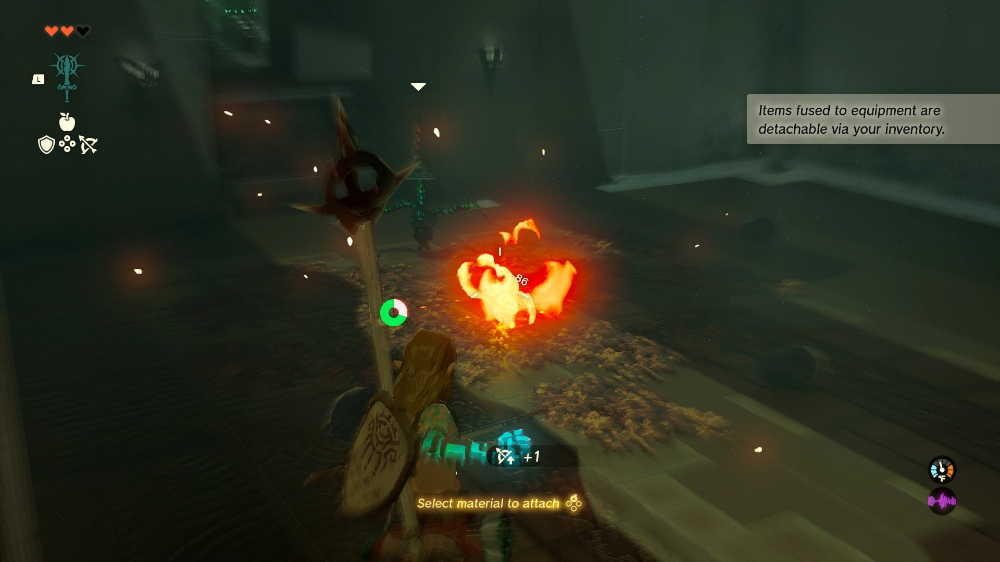

You can also make quick work of the Construct by igniting the very ground it stands on with a well placed Fire Fruit shot onto the dried leaves around the arena. 

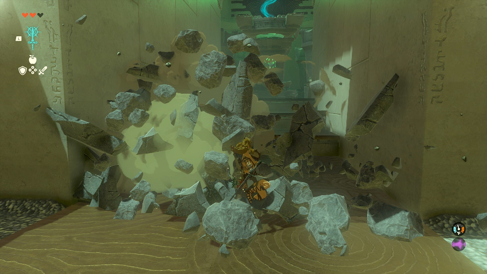

Once he’s dead, swap to a weapon fused with a rock or boulder to smash down the last gate to claim the Light of Blessing. 

In-isa Shrine

## Reaching the Snowy Shrine

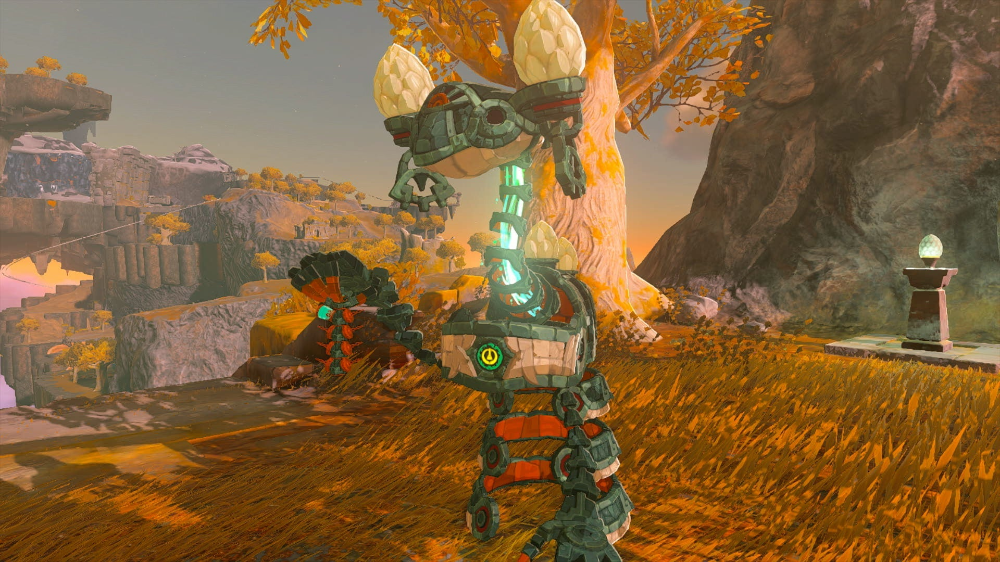

After leaving the lakeside shrine, a Steward Construct will appear to give you the **Energy Cell** if you haven’t stumbled across two specific areas already. This item allows you to power up Zonai Devices that are nearby when you hit them. 

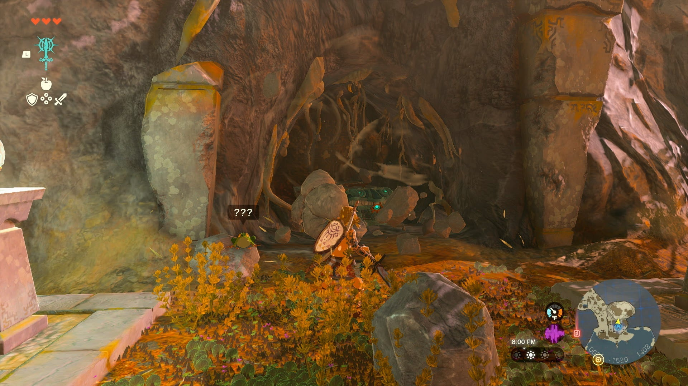

While you’re still by the shrine, you can destroy the wall of rubble to the right and find a chest with **5 Arrows** , and then climb up the ledge above to a high plateau with a tree hiding a Korok under a rock at the top! 

Congrats on solving the shrine and earning a Light of Blessing! Click or tap to return to see the rest of the TotK Shrine Locations and Puzzle Solution Guides or check out the other shrine guides for the area: 

  * Ukouh Shrine
  * Gutanbac Shrine
  * Nachoyah Shrine

### Up Next: Walkthrough

Previous

About IGN's Zelda TotK Guide Writers

Next

Walkthrough

### Top Guide Sections

  * Walkthrough
  * Zelda: Tears of The Kingdom Switch 2 Edition Guide
  * Zelda Notes Voice Memories
  * List of Side Quests and Side Adventures

### Was this guide helpful?

Leave feedback

Go to comments