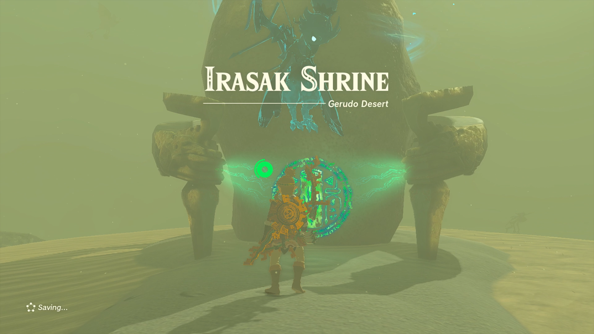
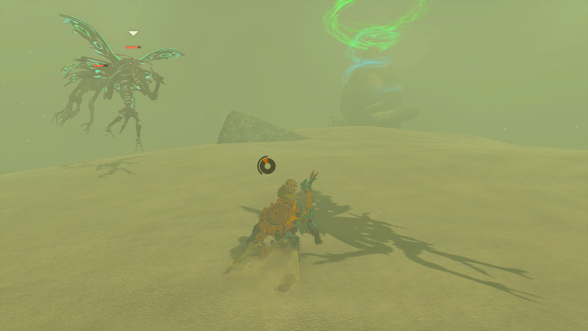
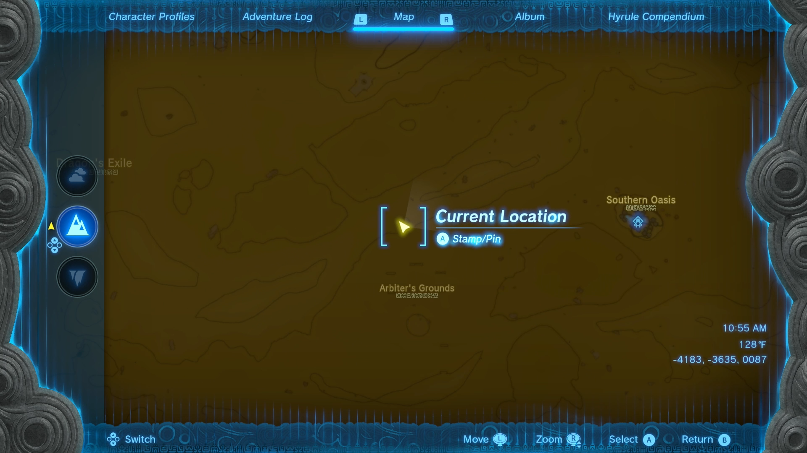
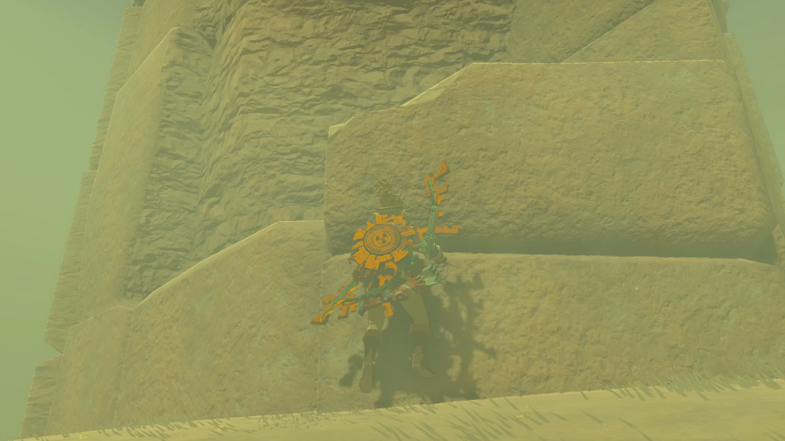
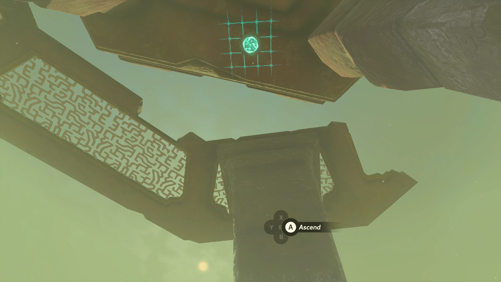
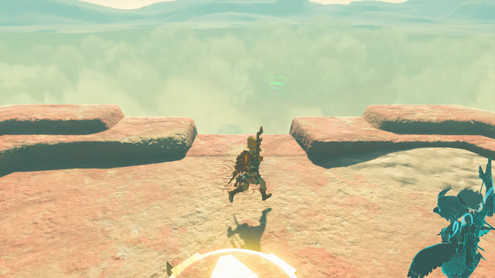
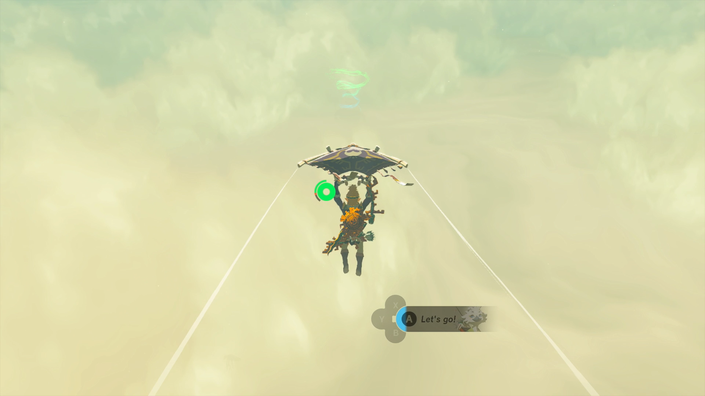
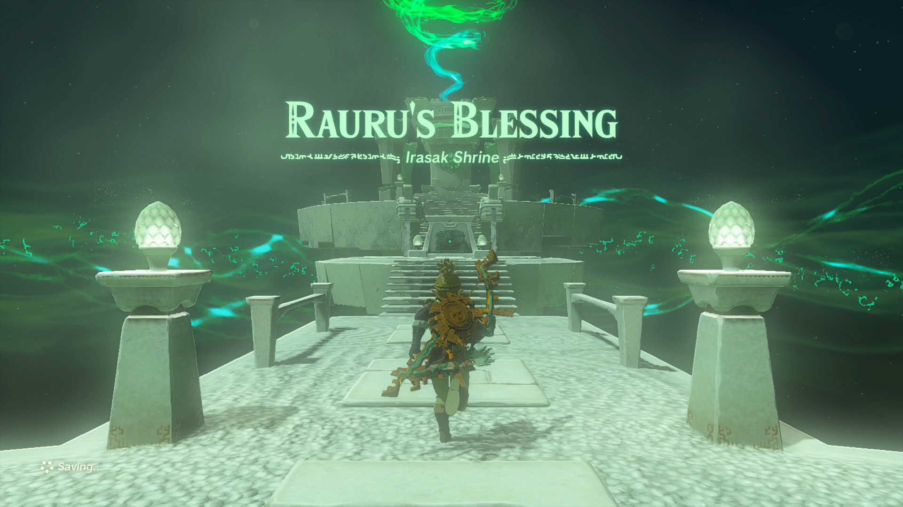

Irasak Shrine (Rauru’s Blessing) in Zelda: Tears of the Kingdom is a shrine located in the Gerudo Desert region. This page contains a guide for how to locate and enter the shrine, a walkthrough for the shrine itself, and puzzle solutions as well as treasure chest locations for the TotK Irasak shrine. 

### Irasak Treasure and Rewards

  * Large Zonai Charge

## Irasak Location/How to Reach

Irasak Shrine is located in the Arbiter’s Grounds in the Gerudo Desert, southwest of Gerudo Canyon Skyview Tower. The shrine is surrounded by quicksand, which depletes your stamina quickly if you walk through it. 

One way to avoid the quicksand entirely is to locate the small building structure just north of the Arbiter’s Grounds. If you have completed the Lightning Temple, you can also start at the temple location. 

Climb the structure and use Ascend to get to the top. 

Paraglide to the shrine location. 

  * Coordinates: -4158, -3824, 0028

## Irasak Walkthrough and Puzzle Solutions

Enter the shrine and you will be rewarded with Rauru’s Blessing. Head straight up the stairs to open the treasure chest with a Large Zonai Charge inside. 

Continue up the next set of stairs to exit the shrine. 

Irasak Shrine

Congrats on solving the shrine and earning a Light of Blessing! Click or tap here to return to the rest of the Shrine Guides. You can also check out which shrines are nearby with our shrine map filter on our complete map of Hyrule.

### Up Next: Walkthrough

Previous

About IGN's Zelda TotK Guide Writers

Next

Walkthrough

### Top Guide Sections

  * Walkthrough
  * Zelda: Tears of The Kingdom Switch 2 Edition Guide
  * Zelda Notes Voice Memories
  * List of Side Quests and Side Adventures

### Was this guide helpful?

Leave feedback

Go to comments