Ishodag Shrine (**A Windy Device**) in The Legend of Zelda: Tears of the Kingdom is a shrine located in the Central Hyrule Region and is one of 152 shrines in TOTK (see all shrine locations). This page contains a guide for how to locate and enter the shrine, a walkthrough for the shrine itself, and puzzle solutions as well as treasure chest locations for the TotK Ishodag shrine. 

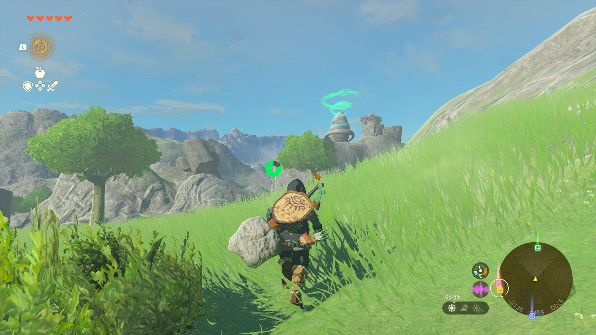

### Treasure and Rewards

  * Opal

## Ishodag Shrine Location

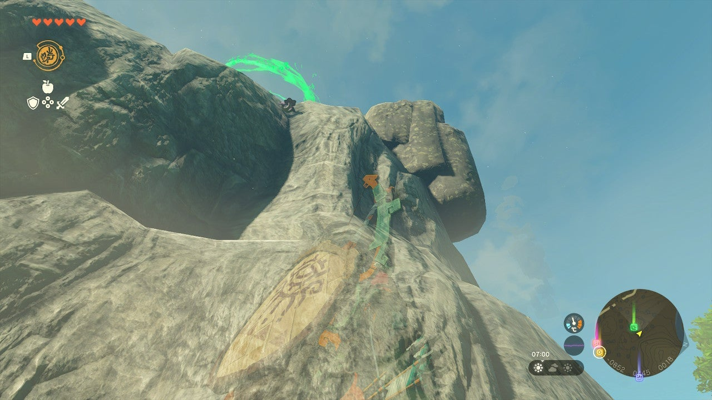

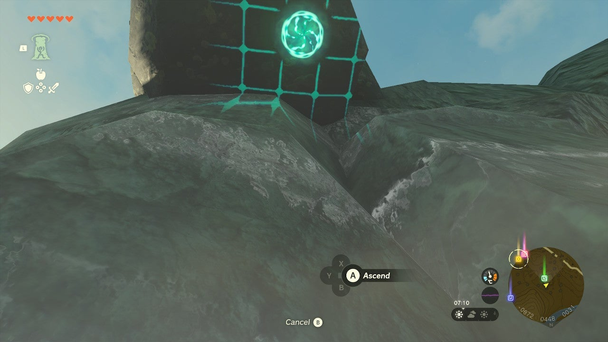

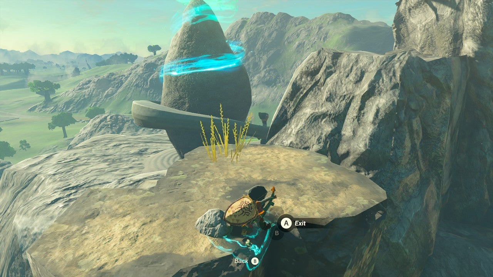

The Ishodag Shrine is located on top of a rocky hill due west of Hyrule Castle Town Ruins in Central Hyrule. It is slightly north and a bit further west of Lookout Landing Skyview Tower. To reach the shrine, look for a stone-cut overhang on the northern side. 

You can climb to this, then use Ascend to pass through it. 

  * Coordinates: -0880, 0422, 0049

## Ishodag Shrine Walkthrough and Puzzle Solutions

The first thing you’ll need to do is use the fan and your trusty paraglider to get up the steep ledge in front of you. Move the fan so the blowing part faces upwards using your Ultrahand, remember you can hold R to flip the fan in any direction. 

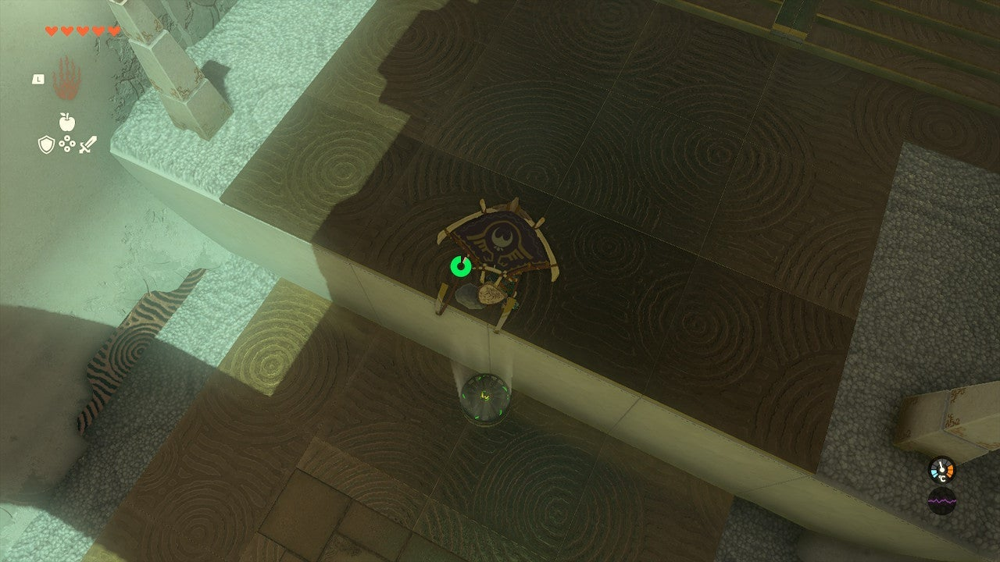

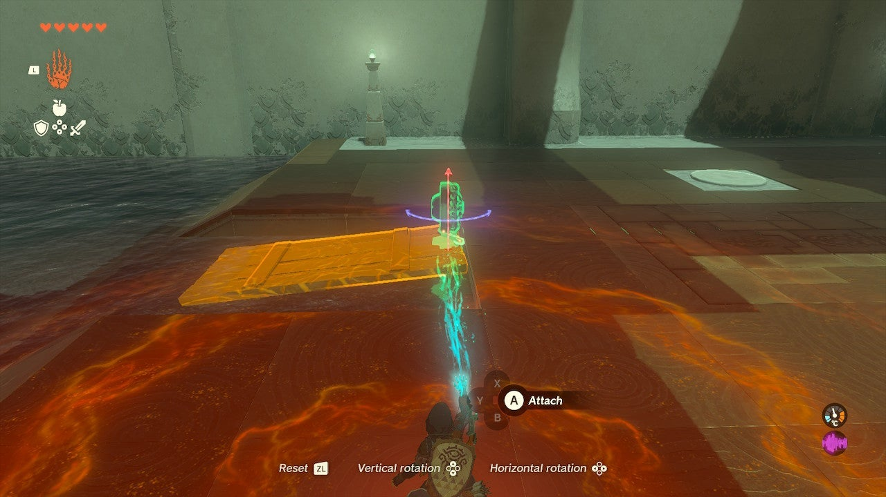

Set it down on the ground by the ledge and thwack it with a weapon. It will turn on and you can hop above it with Y and tap Y a second time to open your paraglider and zoom up to the next area. 

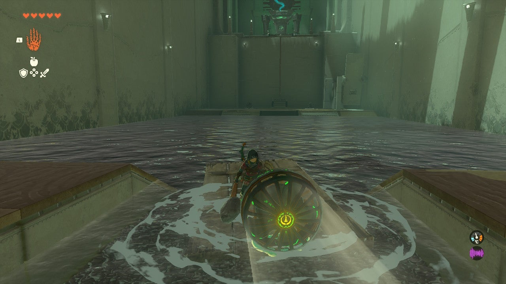

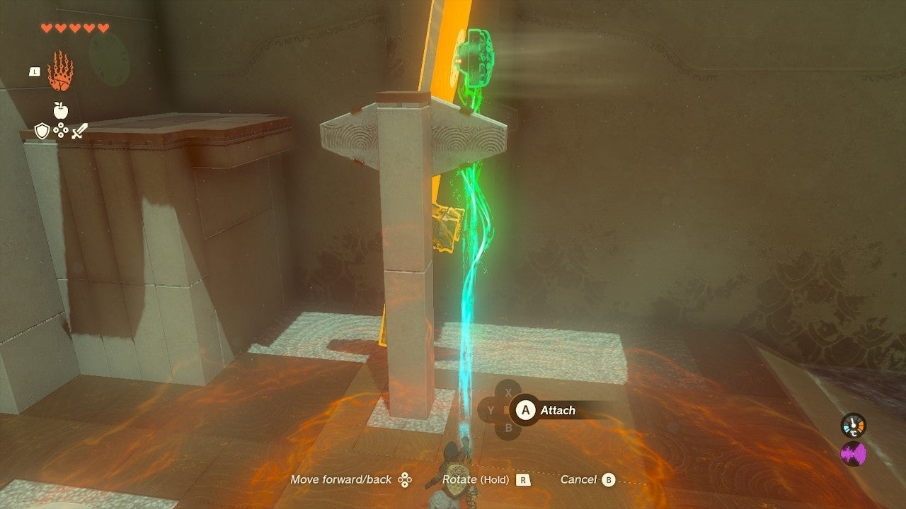

A large lake lies ahead now. Next, you’ll need to make a boat. Use Ultrahand to move the wood plank into the water. Attach the fan to the end as shown in the picture. Get on the boat and swat the fan to turn it on and let it carry you across the lake. 

## Treasure Chest Location

The chest in Ishodag shrine is on a vertical beam just before the very tall ledge leading to the exit. To make this vertical plank horizontal, attach a fan to its outer, top side, as shown. This will level it out. Use the other fan to place on the ground and activate, jump above and use your paraglider to get up to the chest. Inside the chest is an ’’’Opal’’’. 

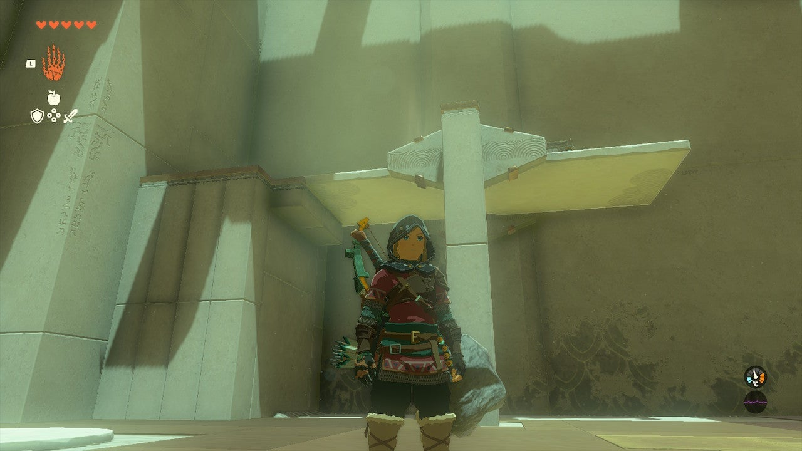

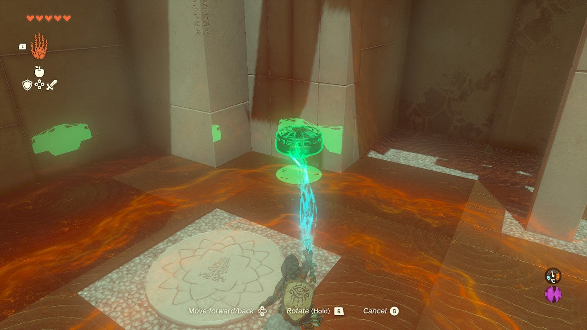

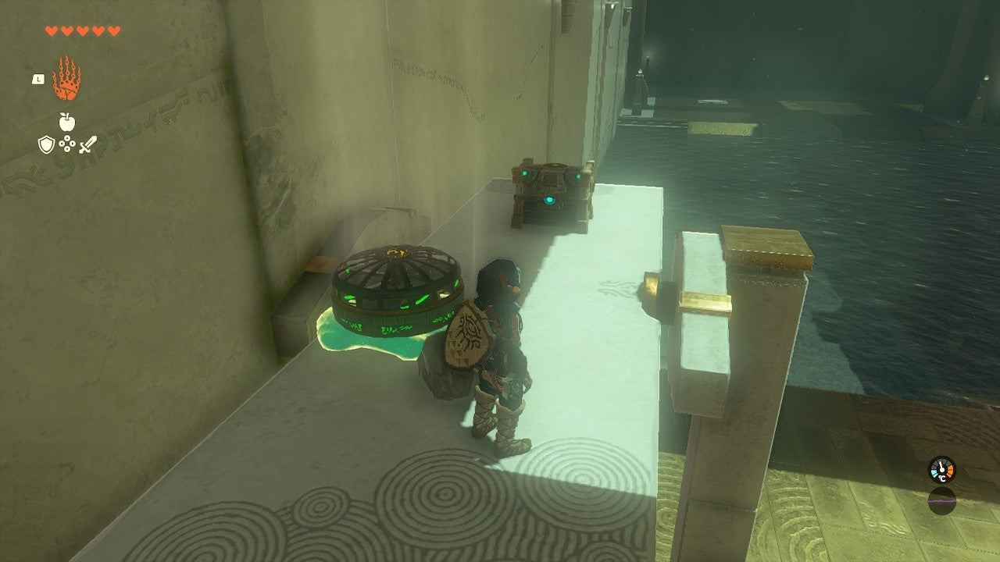

The final tall ledge can be surmounted by riding the platform upwards with the power of two fans attached. Turn OFF the fans. Flip the fans facing downward and attach them to the sides anywhere on the platform. Get on the platform and hit each fan to turn it on. 

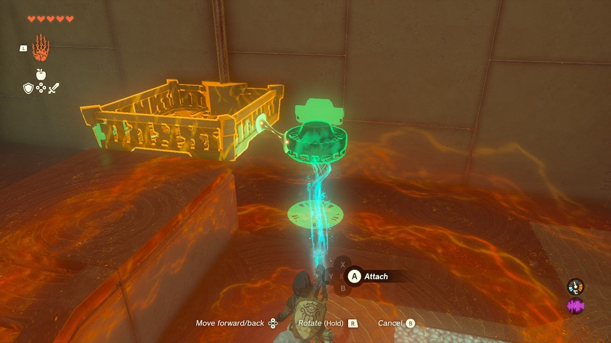

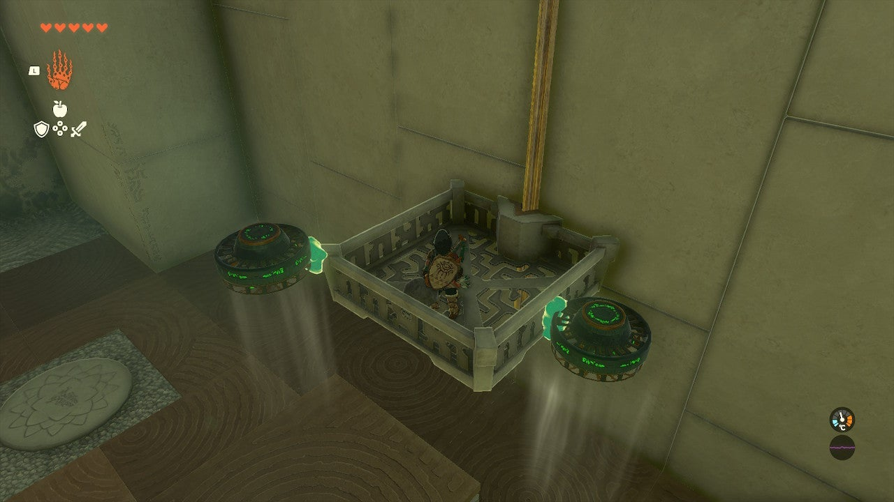

The exit is above. 

Ishodag Shrine

Congrats on solving the shrine and earning a Light of Blessing! Click or tap here to return to the rest of the Shrine Guides. You can also check out which shrines are nearby with our shrine map filter on our complete map of Hyrule.

### Up Next: Walkthrough

Previous

About IGN's Zelda TotK Guide Writers

Next

Walkthrough

### Top Guide Sections

  * Walkthrough
  * Zelda: Tears of The Kingdom Switch 2 Edition Guide
  * Zelda Notes Voice Memories
  * List of Side Quests and Side Adventures

### Was this guide helpful?

Leave feedback

Go to comments