Ishokin Shrine (Rauru's Blessing) in The Legend of Zelda: Tears of the Kingdom is a shrine located in the Faron Region's Faron Grasslands and requires you to complete the **Ride the Giant Horse** shrine quest to get its crystal. This guide includes the Giant Horse location in Faron and more details on the TotK Ishokin shrine. 

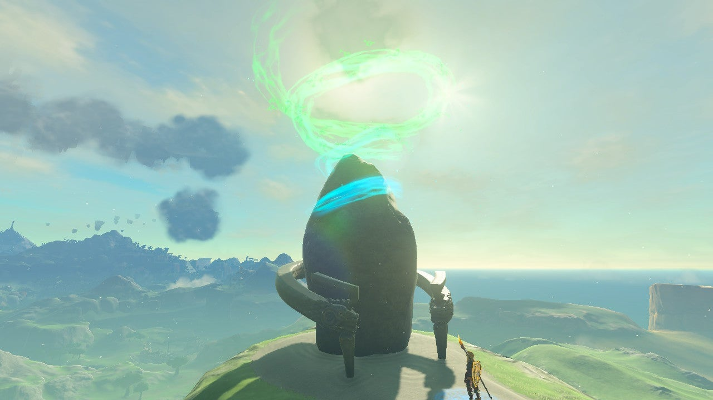

### Treasure and Rewards

  * Giant White Stallion
  * Topaz

## Location/How to Reach

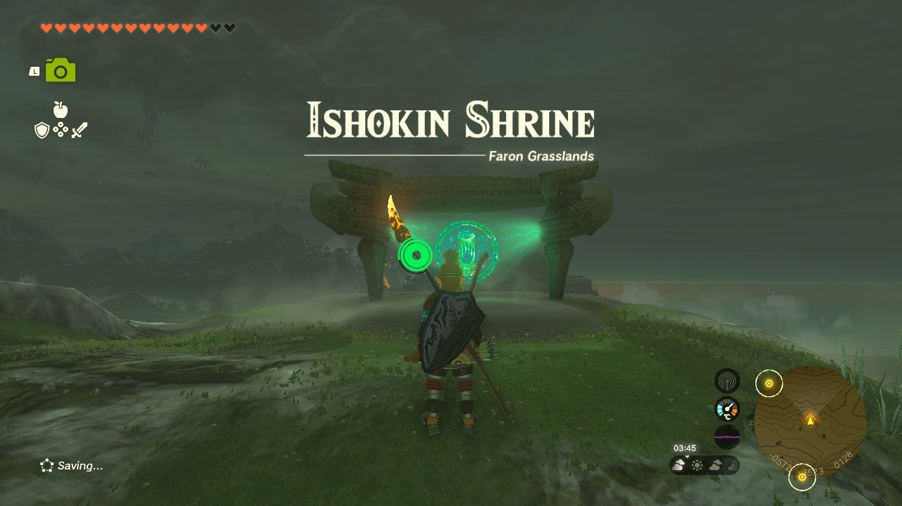

Ishokin shrine is on a ridge overlooking Pappetto Grove. There's a small campfire not too far from it. 

  * Coordinates: -0562, -3524, 0129

## Walkthrough and Puzzle Solutions

Interact with Ishokin shrine and it'll ask you to retrieve its crystal, which is oddly nearby and exposed. Turn toward the beam and it'll lead you to a camp northwest from the shrine base. 

At the camp a man called Baddek looks at the crystal. Apparently, he's just here to look at herds of wild horses. Tell him you need the crystal and he'll ask you to find an enormous horse, no,**a giant horse** , and bring it to him. 

Note that if you already have a giant horse, like Ganon's horse found on the beach southeast of Hateno Village, you can bring that to Baddek to complete the Ride the Giant Horse side quest. Thank you to commenters TheGoodPastor and DurringtonFartworthy for confirming!

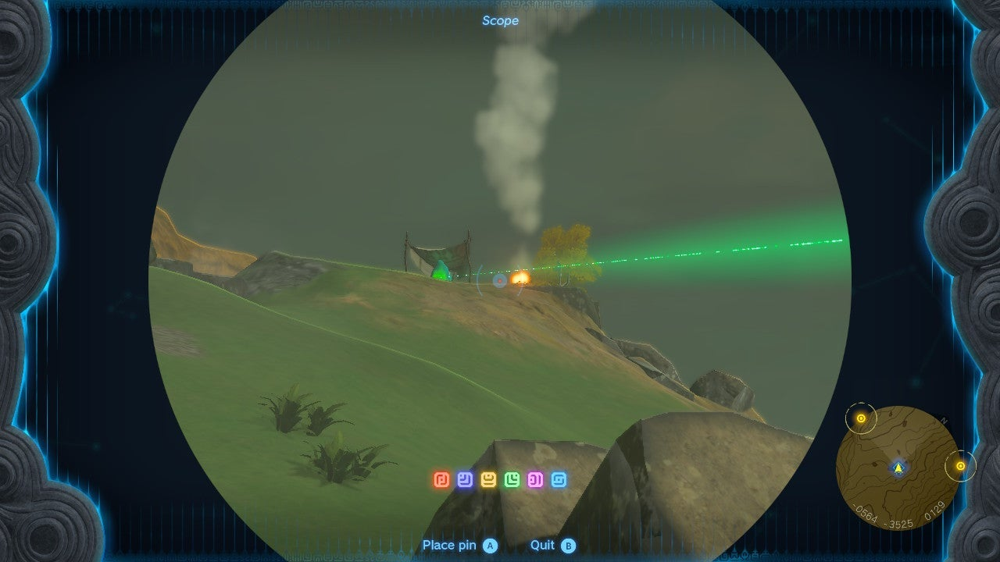

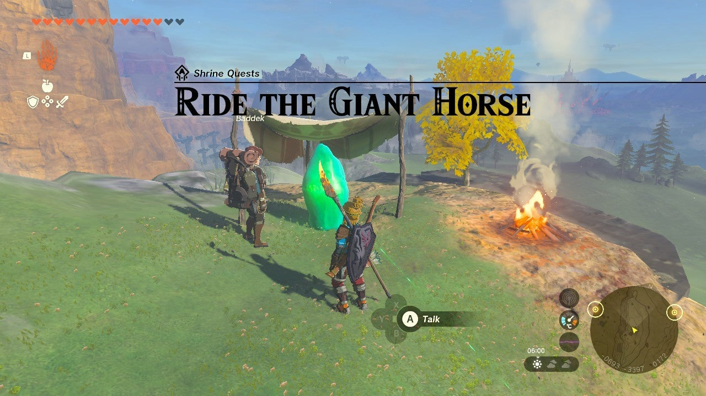

If you get that gigantic horse, he'll give you the crystal. Baddek recommends you go to nearby stables for information. 

If you try to use Ultrahand on the crystal Baddek gets angry. 

### Ride the Giant Horse Shrine Quest

**At Highland Stable** , Padok, the stable attendant, said he heard travelers mention a giant white stallion. They were going to take the road to the **Lake of the Horse God**(southeast of the stable) to look for it. 

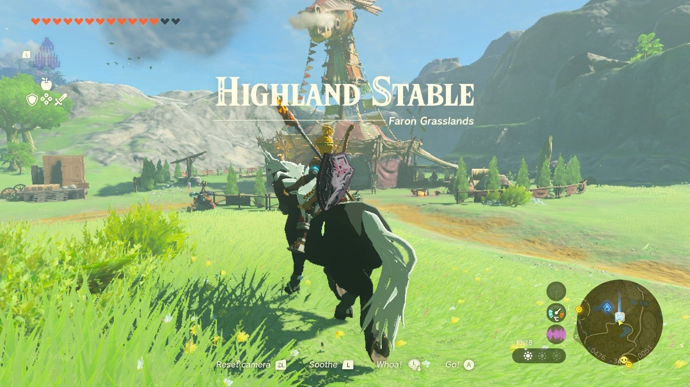

That information confirms that we're not looking for Ganon's horse, but another giant one! Next, let's go find those travelers. 

**Head southeast and cross the Horse God Bridge.** You'll see two travelers, Straia and Jini, with their horses talking about another horse. When you talk to them you can ask them more about the giant white stallion and the Horse god. Straia says he's seen the horse "deep within this valley." 

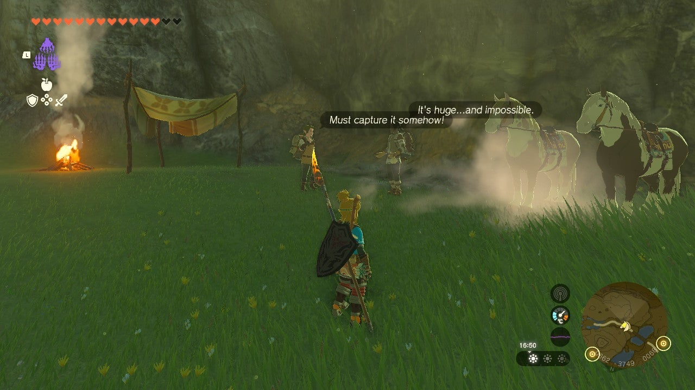

They weren't kidding! 

### Giant White Stallion Location

Walk past them deeper into the valley and you'll see the giant white stallion standing and grazing alone. Now all you need to do is tame it! Before you do, you can use your camera to log the special horse to your Hyrule Compendium. 

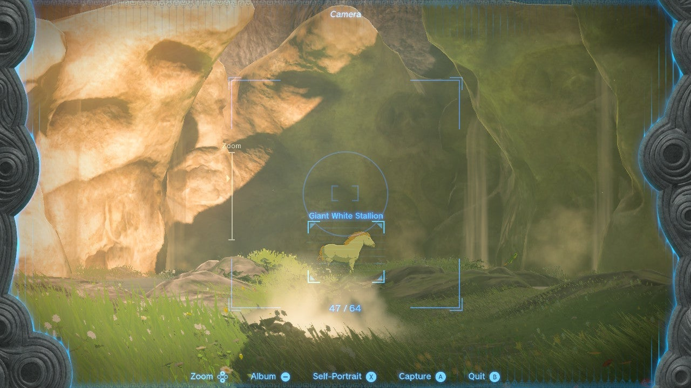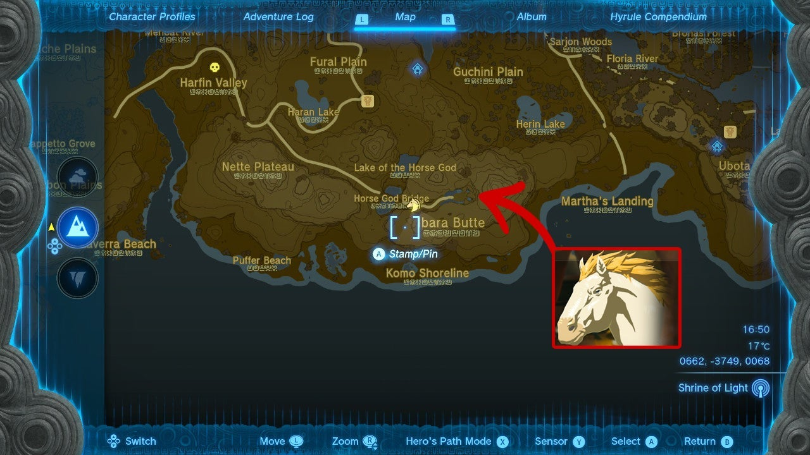

It's recommended that you bring several energizing elixir or other ways to restore your stamina unless you have a ridiculous stamina bar. Even then, it can't hurt to be over-prepared! 

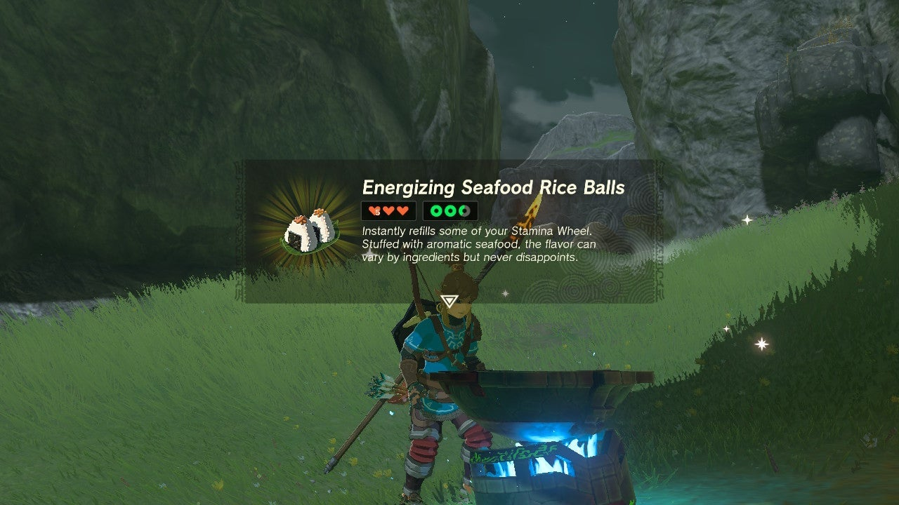

You can get stamina from… 

  * Energizing Elixir, made from restless crickets and monster parts
  * Meals cooked with Staminoka Bass
  * Meals cooked with Stambulb
  * Meals cooked with Stamella Shroom

It took us about**five full stamina circles** to tame the gigantic horse. 

Now, onto the actual taming. Again, unless you have a massive stamina bar,**don't waste it doing something like gliding down onto the horse**. Instead, sneak up behind the massive beast like you would any other horse then mount it as soon as you see the prompt. 

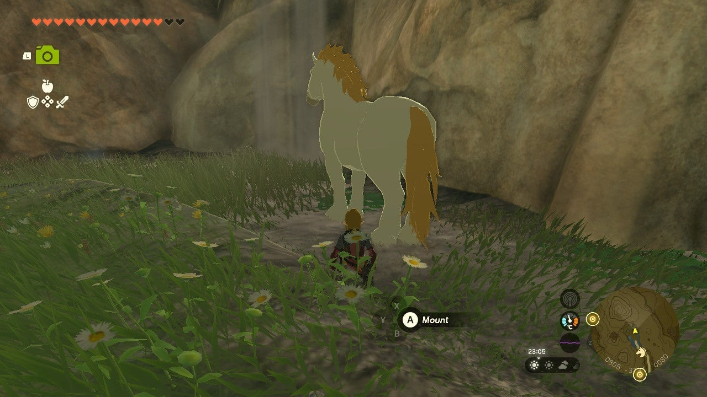

Work on taming it by pressing L, but be prepared to bring up your food menu sooner than you'd think. Replenish your stamina as needed. Once you've successfully tamed the horse, carefully ride it back to the Highland Stable to register it. Like any newly tamed horse, you'll want to provide it with plenty of reassurance as you go. This one will be particularly fussy. And not all that fast. 

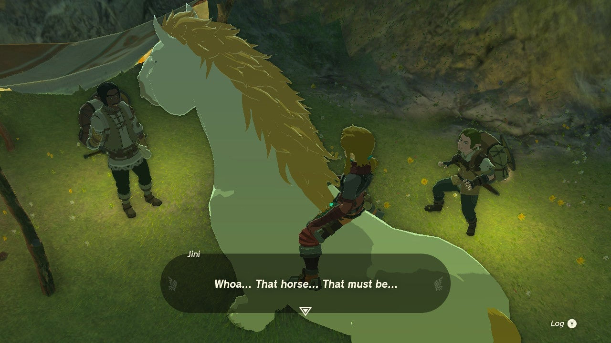

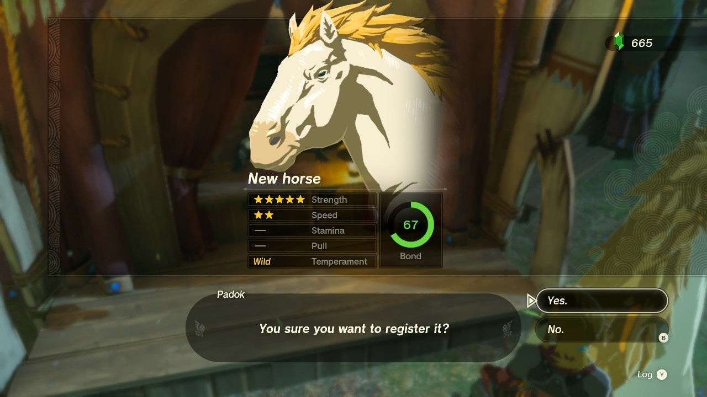

Follow the road across to Pappetto Grove and ride through the Plains to get to the shrine and back to Baddek. Upon seeing the giant white stallion Baddek will give you the crystal. Pick it up and return it to the shrine base. 

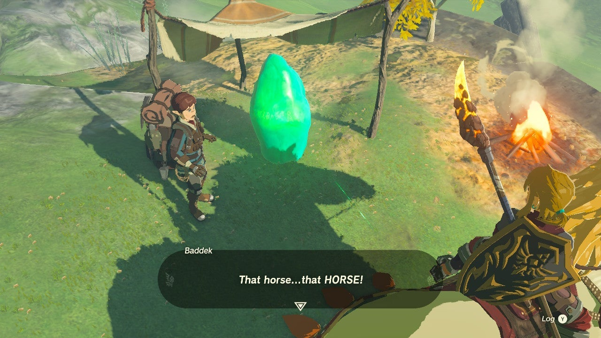

Ride the Giant Horse

### Inside Ishokin Shrine

As a shrine quest shrine, you'll be greeted with one of the best interiors – Rauru's Blessing. A blessing indeed! Collect the treasure from the treasure chest straight ahead (Topaz), and exit with your rewards. 

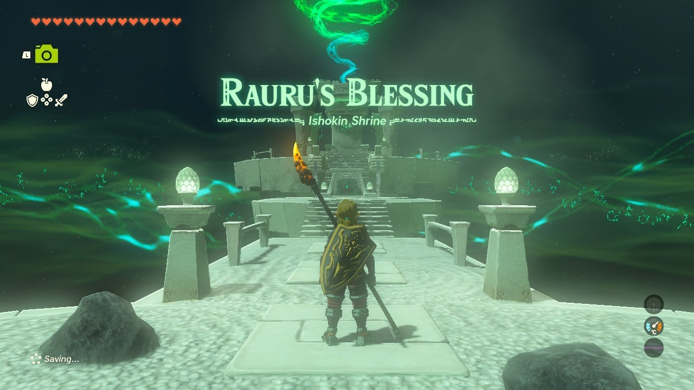

Ishokin Shrine

Click or tap here to return to see the rest of the Shrine Guides.

### Up Next: Walkthrough

Previous

About IGN's Zelda TotK Guide Writers

Next

Walkthrough

### Top Guide Sections

  * Walkthrough
  * Zelda: Tears of The Kingdom Switch 2 Edition Guide
  * Zelda Notes Voice Memories
  * List of Side Quests and Side Adventures

### Was this guide helpful?

Leave feedback

### In This Guide

The Legend of Zelda: Tears of the KingdomNintendo EPD

Initial Release: May 12, 2023

Learn more

Go to comments