Isisim Shrine (Proving Grounds: In Reverse) is a Shrine located in the **Death Mountain** Region in The Legend of Zelda: Tears of the Kingdom. This page contains a guide for how to find and enter the Isisim Shrine, a walkthrough for how to complete the Isisim Shrine and puzzle solutions, as well as treasure chest locations. 

Isisim Shrine Treasure and Rewards

Magic Rod

## Isisim Shrine Location in Zelda TotK

There are two conditions you must resolve before attempting the Isisim shrine: 

  * You must begin the Yunobo of Goron City quest to access Isisim Shrine, as it is buried under red stone that only Yunobo can destroy.
  * You will need heat resistance in the form of elixirs, food, or Armor. Two pieces of the Flamebreaker Armor Set are enough, and you can purchase these in the Goron City armor shop.

Isisim Shrine is in a large open valley due north of Goron City. Use Yunobo to detroy all the red stone in the area and you will find the entrance to YunoboCo HQ East Cave. Your Shrine of Light Sensor or our map can help you find this. 

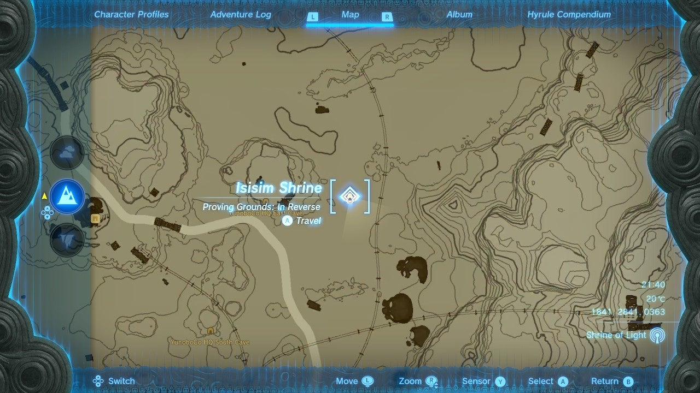

Once inside, destroy the red rocks on the right and enter the cavern with the Like-Like and the Shrine. You will need Yunobo to mine the stone around the Shrine itself for free, or you can use mining weapons or bombs on it. 

  * Coordinates: 1838, 2837, 0363

## Isisim Shrine Walkthrough and Puzzle Solutions

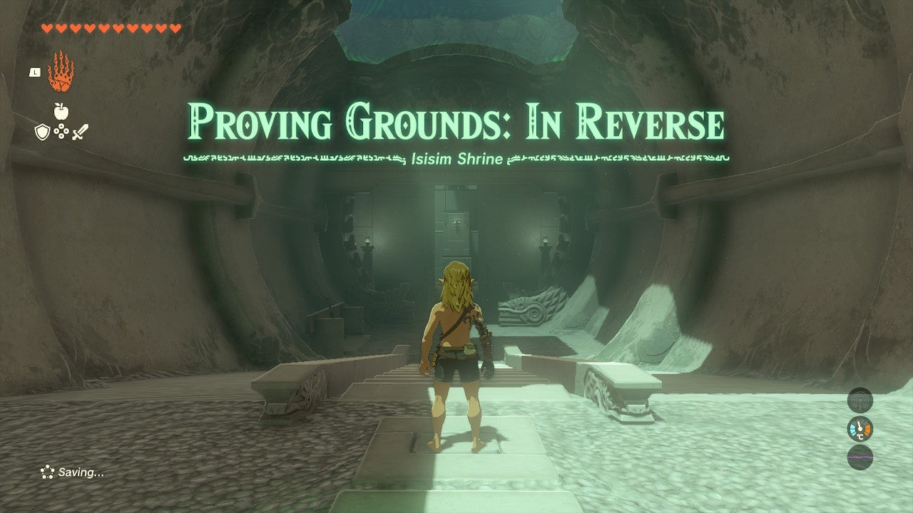

‘’Isisim Shrine challenges you to a Proving Grounds challenge, meaning all materials, equipment, and food are gone but will be returned at the end of the challenge, once you destroy all Constructs. You'll have to use what's provided instead and get crafty with your abilities. Note that you may want at least **8 Heart Containers** for this challenge, or you’ll face some one-hit kills that can be frustrating.’’’ 

Isisim Shrine’s big hint is in its large reversible gears. You can use these to get up to higher levels by using Recall on them and hopping on the teeth, but that’s not all: You can also Recall some of the bombs thrown at you here to get the jump on enemies. 

First, gather your starting equipment on the left side of the entrance. 

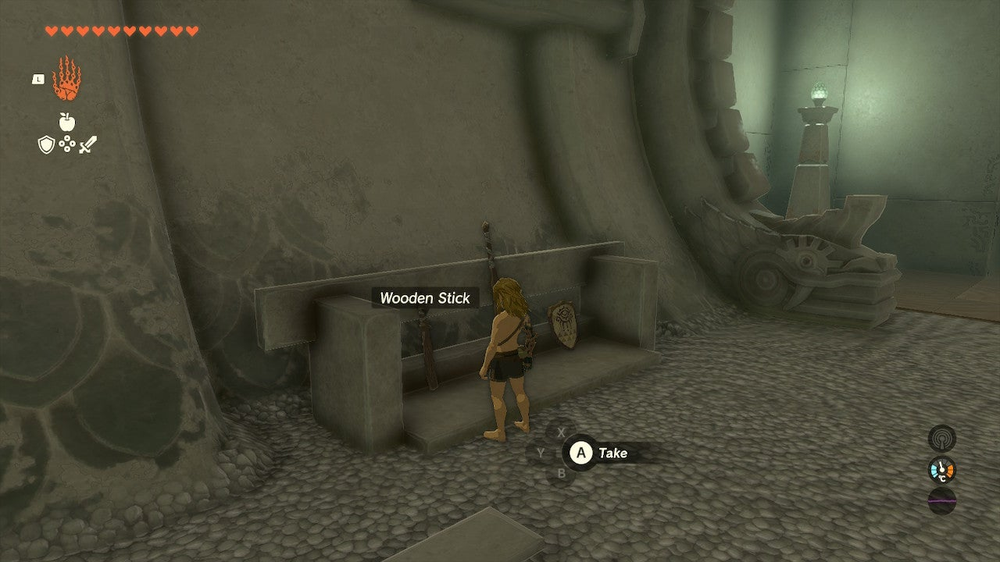

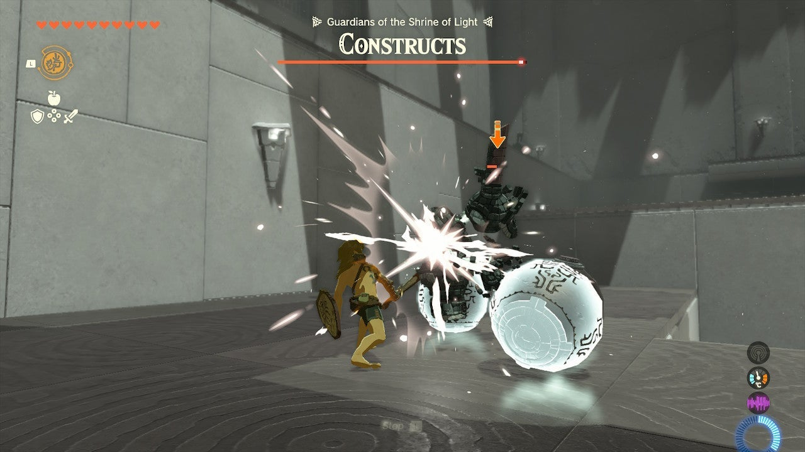

Now, rush the first enemy up the ramp on the left side. Your target is to hit a bomb or two in front of it and then dash away, causing an explosion. Now, gather the arrows and bow and enemy bits here. 

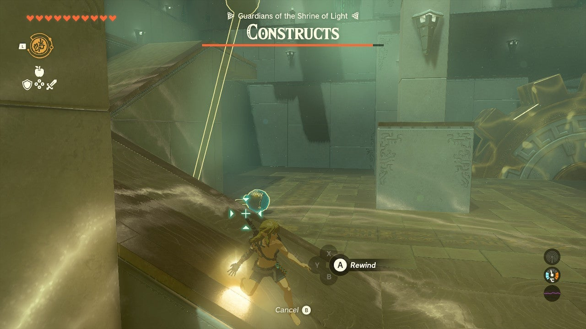

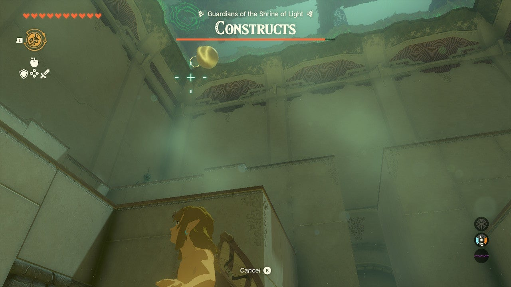

Return to the bottom level and look above the entrance for another bomb-tossing enemy. With Recall equipped, tap it when a bomb is thrown and select the bomb to reverse it. When it reaches the Construct, tap Recall to turn it off and destroy the enemy. 

Equip your larger club. Now use Recall on the gear in the northeast corner and ride it up. Rush the enemy here with a Zonai Longsword. Your club should keep it from attacking, and if you can get it off the ledge even better. You can use your height and paraglider to target its face with arrows. 

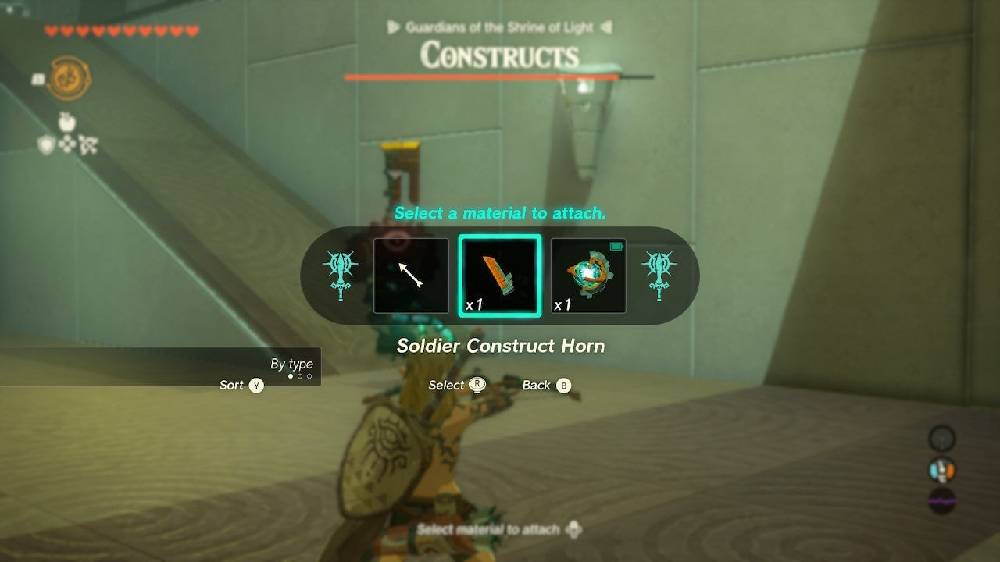

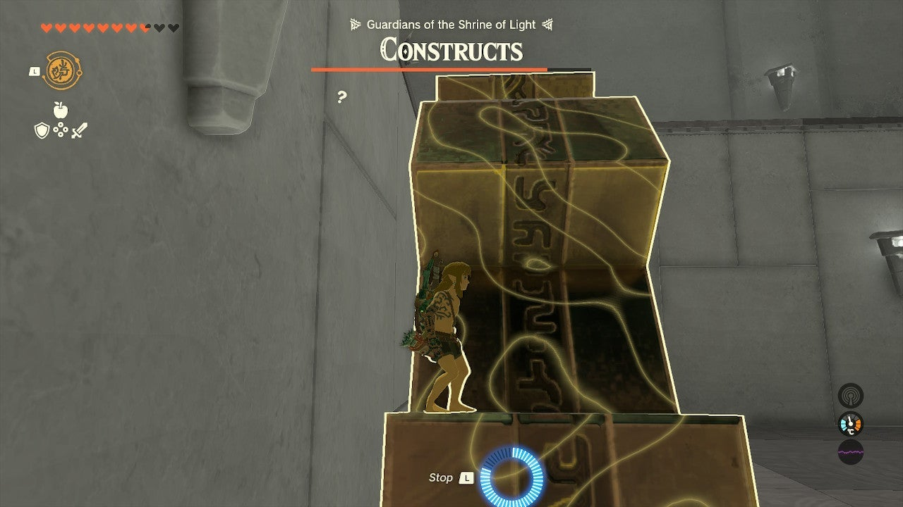

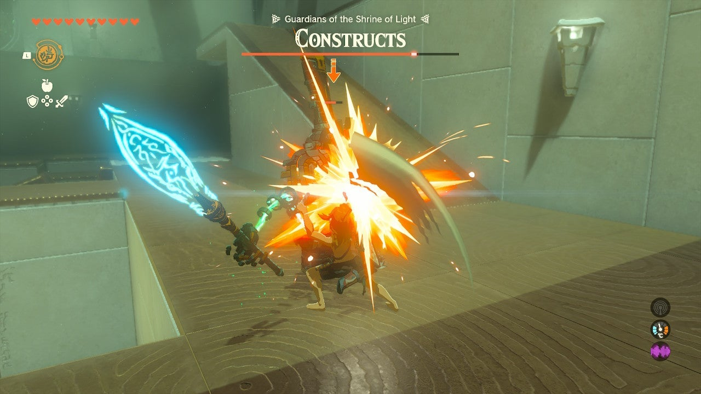

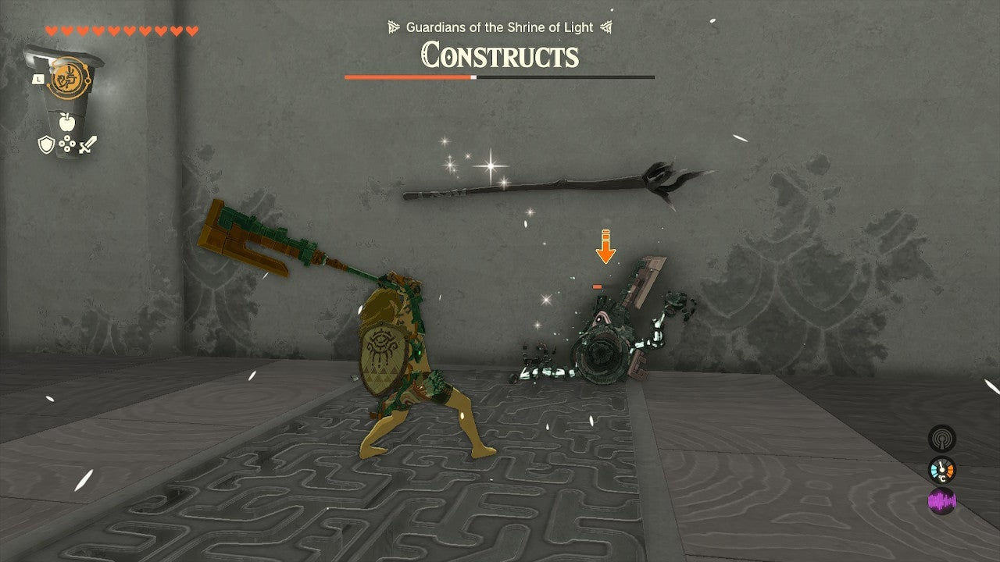

  * Grab the Longsword and fuse your best enemy item to it. Now you can take on the strongest enemies!
  * Use the southwest gear to ride up and rush the first one with your new weapon – it should easily overpower this and the final enemy.
  * Note that there are bombs in the corners of the room you can target with arrows if you’d like as well.

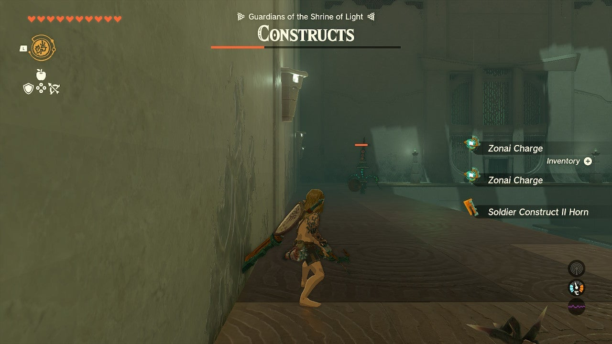

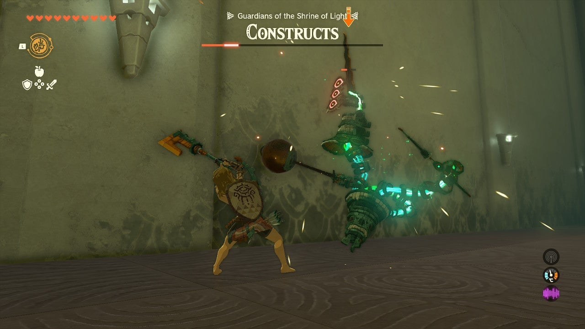

## Treasure Location

Don’t forget to check the Treasure Chest before leaving, it’s right at the exit and contains a Magic Rod. 

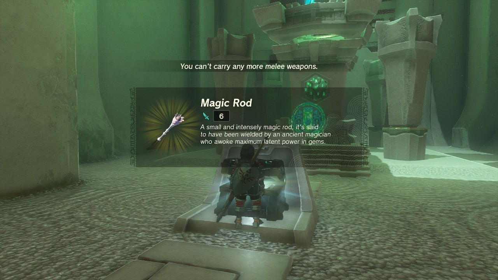

Isisim Shrine

Congrats on solving the shrine and earning a Light of Blessing! Click or tap here to return to the rest of the Shrine Guides.

### Up Next: Walkthrough

Previous

About IGN's Zelda TotK Guide Writers

Next

Walkthrough

### Top Guide Sections

  * Walkthrough
  * Zelda: Tears of The Kingdom Switch 2 Edition Guide
  * Zelda Notes Voice Memories
  * List of Side Quests and Side Adventures

### Was this guide helpful?

Leave feedback

Go to comments