Iun-orok Shrine (The Right Roll) in The Legend of Zelda: Tears of the Kingdom is located in the Tabantha Frontier Region and is one of 152 shrines in TOTK (see all shrine locations). See what treasures wait in the Iun-orok Shrine and how to solve the shrine's iron ball puzzle with the help of this complete guide. 

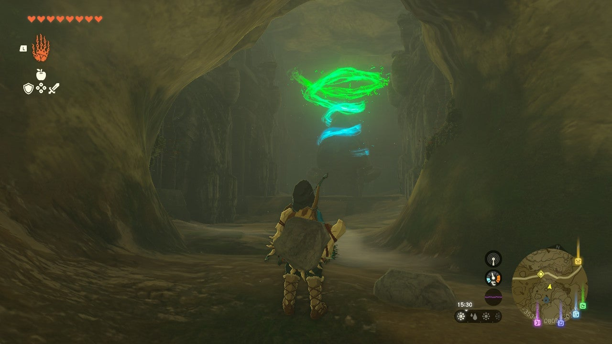

## Iun-orok Shrine Treasure and Rewards

  * Arrows x10

## Iun-orok Shrine Location / How to Reach

  * Coordinates: -3538, 0853, -0133
  * Click or tap here to skip to the puzzle walkthrough

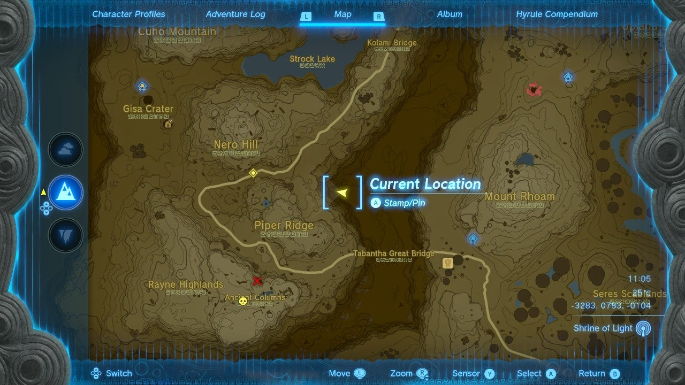

It’s recommended you have a decent store of **Bomb Plants or Claymores** to make Rock Hammers (or any other rock weapon!) to get to this shrine and collect all the treasures around it. 

If you keep seeing the “nearby shrine below” notification near **Piper Ridge and Nero Hill in the Tabantha Frontier,** your shrine in question is far below. Dive/glide down Tanagar Canyon near the wooden wind turbine, just east of the road that runs between Nero Hill and Piper Ridge. 

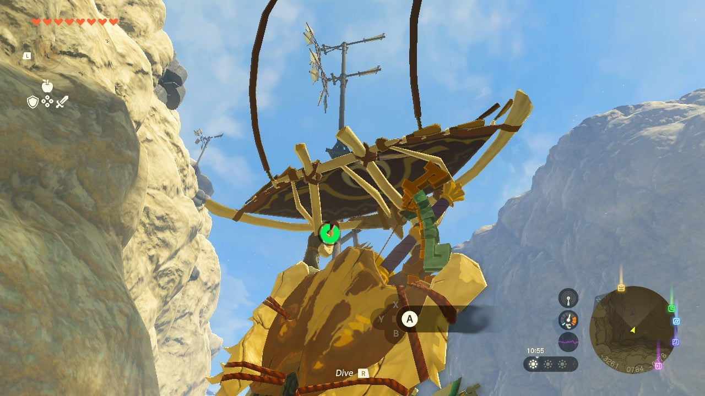

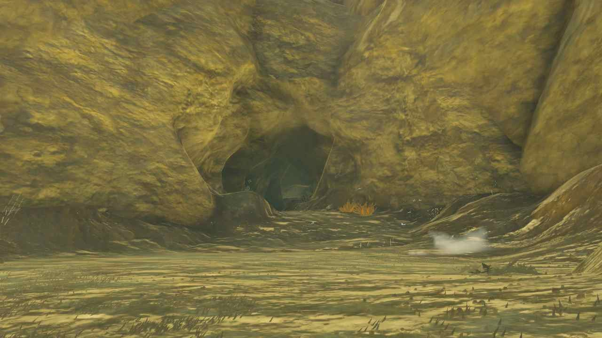

At the bottom of the canyon far under the hills you’ll spot an opening to a cave — the Tanagar Canyon West Cave. Proceed into the cave. 

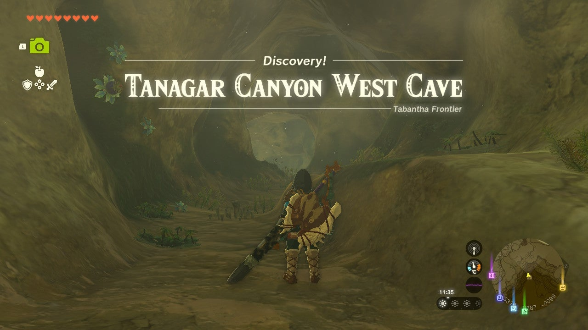

Not far in the cave opens up to expose ruins leading further down. Use Brightbloom Seeds to light the way if you need them. You’ll find plenty, so no need to be sparing. Below, though, you’ll be met with two monsters. 

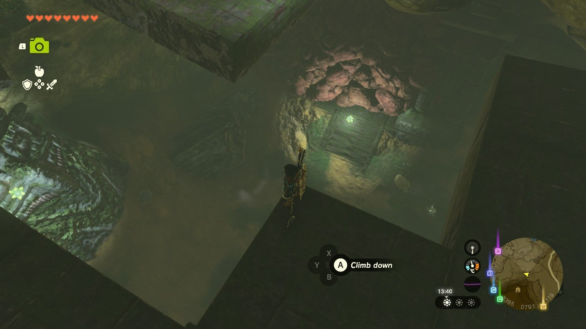

Two Stone Pebblits appear not long after you land in the ruins. You can destroy them quickly by fusing a sword with one of the many rocks on the ground to create a Rock Hammer. With them down you can use the rock hammer (or bomb plants if you’d prefer) to destroy the rocks blocking the path forward. A bomb will get you through this rather heavy rock collapse blocking the door much faster, though. 

Once you’re through you’ll come to paths leading right and left. **The right path is the fast way.** Take that if you don’t have a lot of resources or just want to get to the shrine quickly. Both paths feature fighting various Like Likes, though. 

### **The Right Path**

Fighting the Ice Like: On the right path you’ll see a Luminous Stone Deposit among the ruins and around the corner is an Ice Like. As with any Like Like, getting too close without it being stunned is dangerous, especially since this one spews out an ice blast. After it does, though, it’ll expose its weak spot, allowing you to shoot it and stun it. It’s also weak to electricity. 

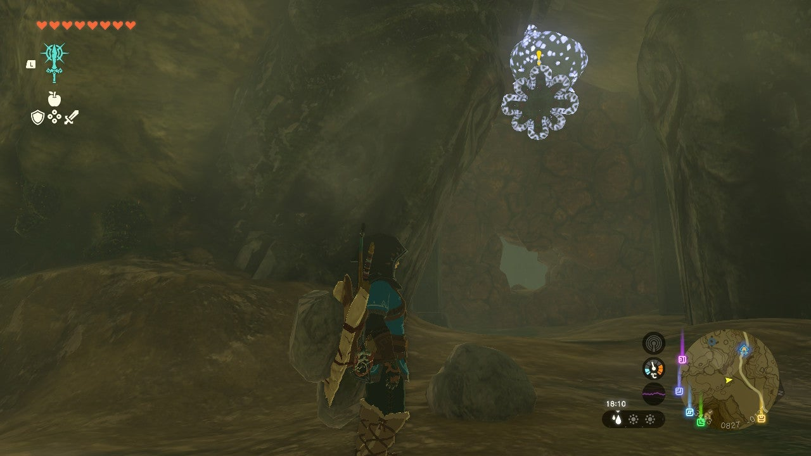

With it down you can destroy the red rock wall behind it and proceed to the room before the shrine that has another elemental Like Like. You’re already almost to the shrine! The path on the left has two additional rooms to explore. 

### **The Left Path**

Fighting the Ice Like: Immediately left on the ceiling is an Ice Like — watch out as its ice blast range isn’t a joke! Use ranged combat to take it down if you can. You’ll want to shoot it when a blue ball (its tongue) appears after it uses its ice attack. Stunning it with electricity is particularly effective. 

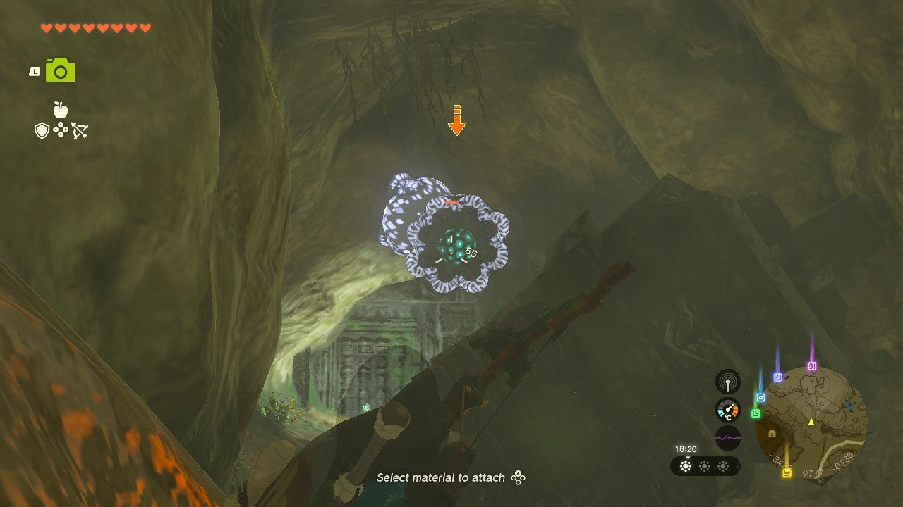

The path stops with blue rocks that’s more resilient than the usual red stone, but it can be destroyed all the same. Beyond the wall is a large cave with another blue rock wall, a toppled structure, and most excitingly, a Bubbulfrog. Shoot it down to claim your prize. 

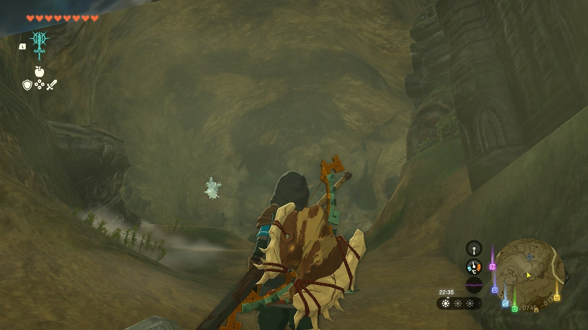

The red rock wall in the cave leads to an excellent cavern — one home to three Fairies (careful not to scare them away) and a Rare Ore Deposit. 

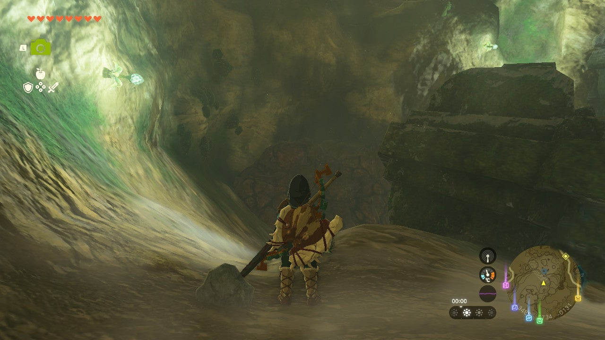

Back to the next rock wall, blast through it. Beyond it in the next cave path are more foes: the Shock Like and two more Stone Pebblits. 

### **The Shock Like — Paths Converge**

Regardless of which side you’re on, you’ll come across the Shock Like and two Stone Pebblits. Try to take out the Stone Pebblits first so you don’t need to worry about them if the Shock Like is giving you trouble. The electricity can be rather annoying and it has a fair bit of health if you only have weaker weapons on you. If you use fire against the Shock Like it’ll briefly hold out its tongue. Hit it with an arrow (or another weapon) to stun it longer. 

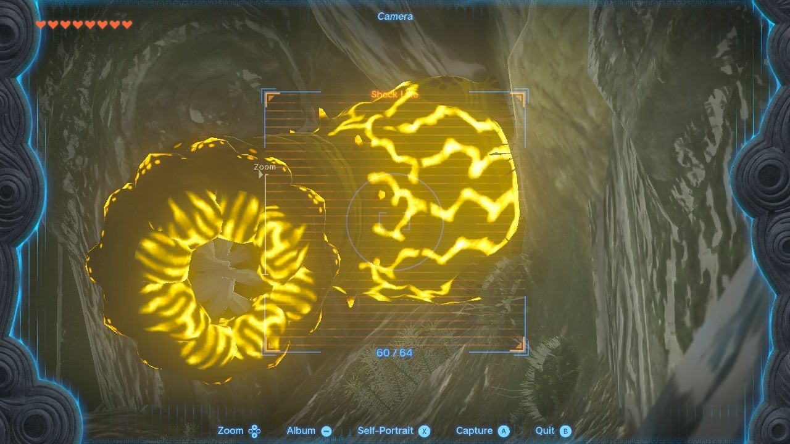

With the area clear you can work on destroying the red stone wall. The path to the shrine skews right, so don’t try to destroy it by going straight ahead. It’s best to angle your digging toward the right if you’re low on resources. 

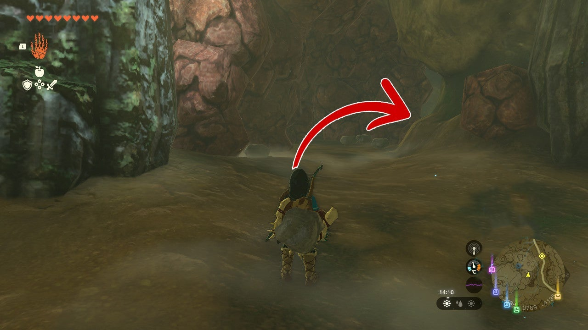

If not, you can potentially find some nice materials. Once you’re through the wall you can finally approach the shrine. 

### Iun-orok Shrine Walkthrough and Puzzle Solutions

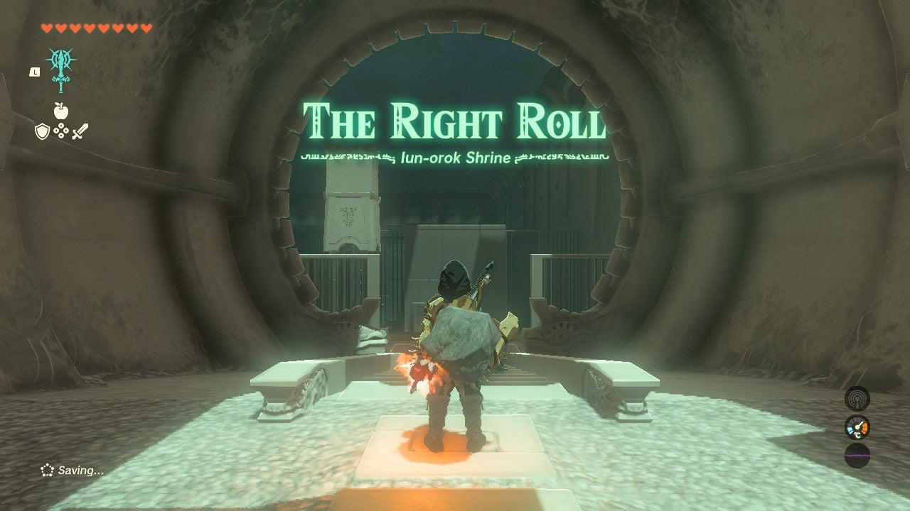

Use Ultrahand to pick up the iron ball and place it in the middle of the first ramp so that it rolls down toward the target. The target will turn green and lift when it's hit in the middle, allowing you to continue. 

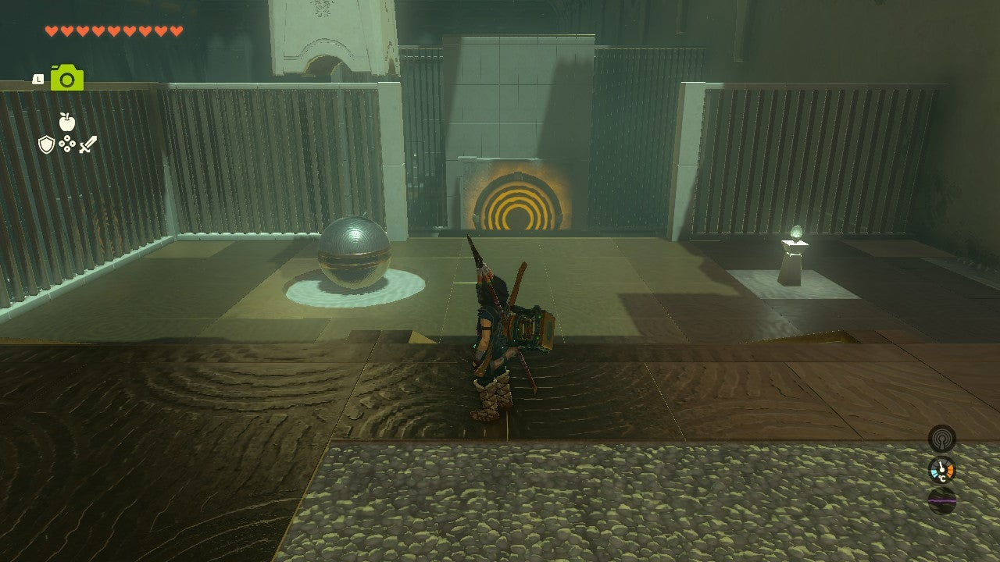

The next platform has two iron balls and a ramp that splits down the middle with long angled sides. One ball cannot roll down it. Fuse the two balls together and send them down to the target. This might take a try or two if they wobble too much while rolling. Once the target is hit (it doesn't need to hit the center) it'll lift and you can move forward. 

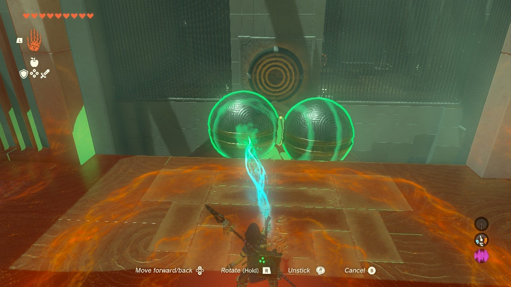

The next platform has three iron balls of varying sizes and to the left of them in the corner is the shrine's treasure chest. 

### How to Get the Treasure Chest

Grab the largest iron ball and put it on either side of the treasure chest's platform. Then, attach the middle-sized iron ball and fuse them. It should be approximately on the corner of the platform. Now, grab the small one and connect it to the middle-sized one, but do it so the new structure you're making wraps around the pillar, almost like an "L." 

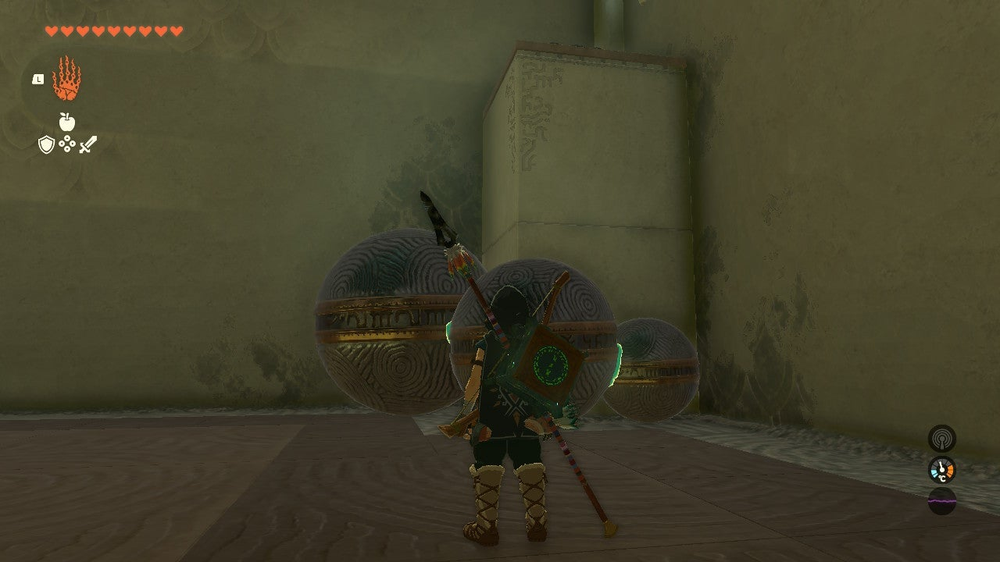

Use Ultrahand to lift the structure and hold it up for a few seconds so that if Link were standing on top of it, Link could walk forward without having to climb. After a few seconds let it down gently. 

Approach and climb the small iron ball then make your way to stand on the large one. Use Recall on the structure and it'll lift you up so that you can reach the treasure chest. 

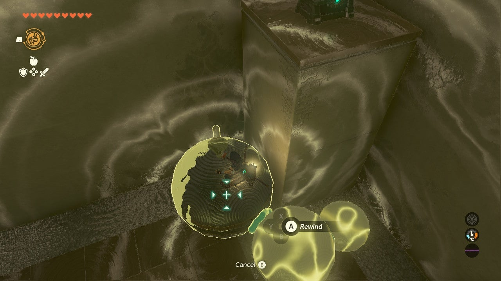

For this last challenge you'll need your little structure to swerve right as it rolls down but still gain speed. Put the large iron ball on the left, the small one in the center, and the middle in the right. Then, send them down with the right side going down first a little more than the left. 

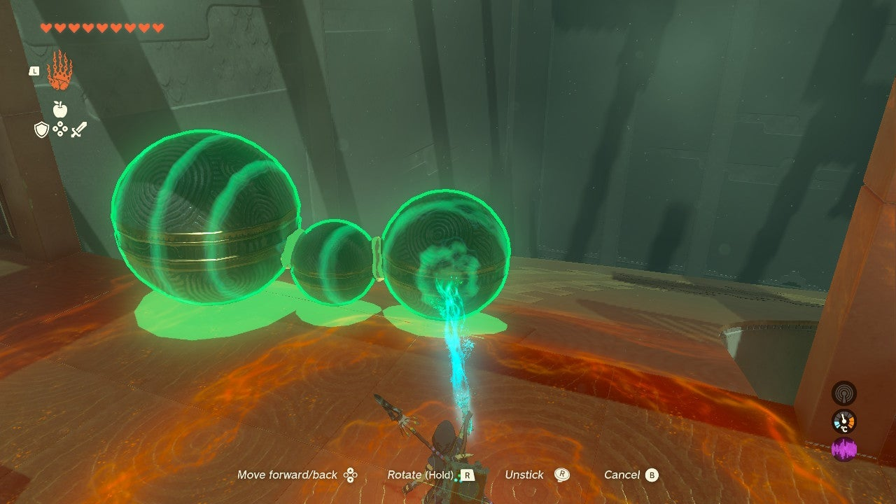

We also position the contraption so that it starts not from the center, but instead more on the left side of the ramp. It might take a few tries to get the angle right, but you've got this! 

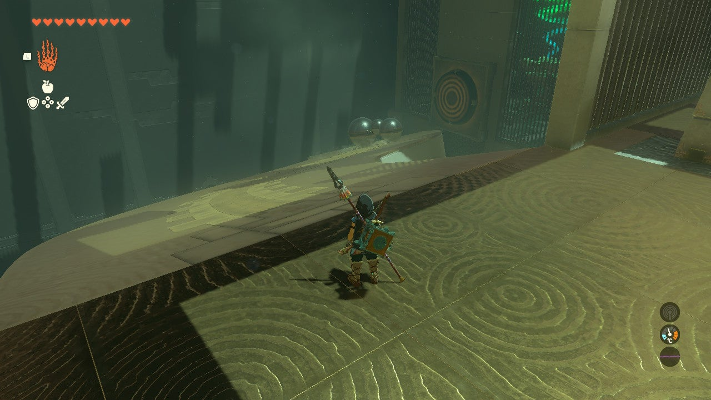

Once the three successfully hit the target the gate will open and you can leave the shrine.

Iun-orok Shrine

Congrats on solving the shrine and earning a Light of Blessing! Click or tap here to return to the rest of the Shrine Guides. You can also check out which shrines are nearby with our shrine map filter on our complete map of Hyrule.

### Up Next: Walkthrough

Previous

About IGN's Zelda TotK Guide Writers

Next

Walkthrough

### Top Guide Sections

  * Walkthrough
  * Zelda: Tears of The Kingdom Switch 2 Edition Guide
  * Zelda Notes Voice Memories
  * List of Side Quests and Side Adventures

### Was this guide helpful?

Leave feedback

Go to comments