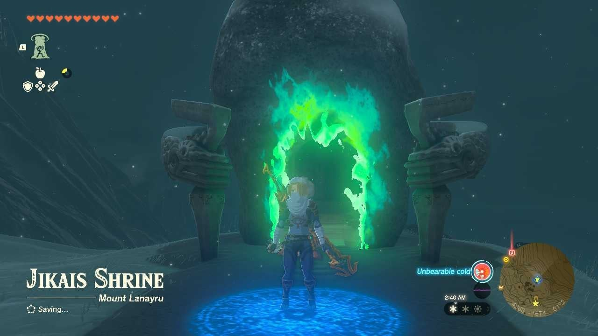
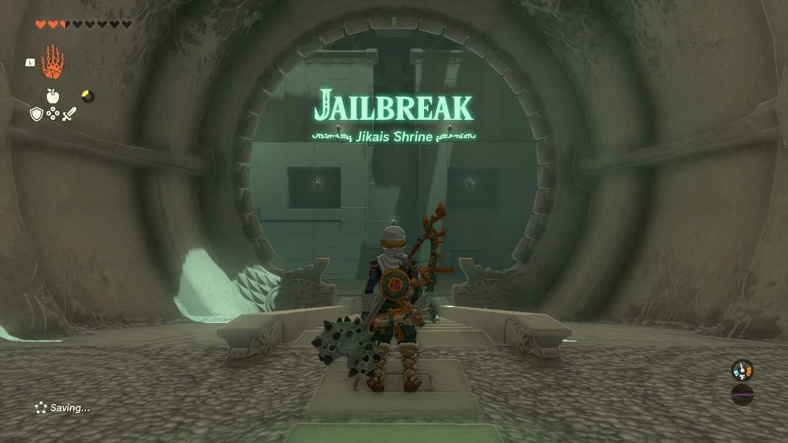
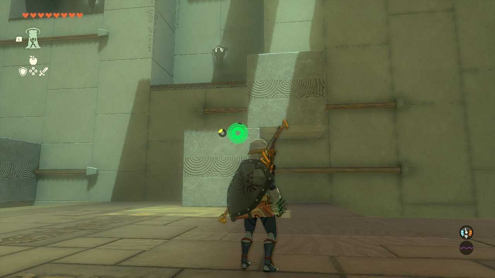
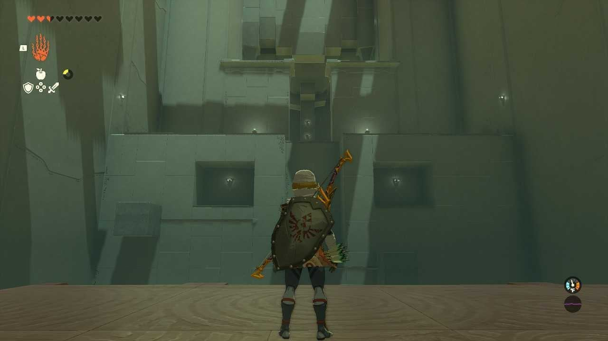
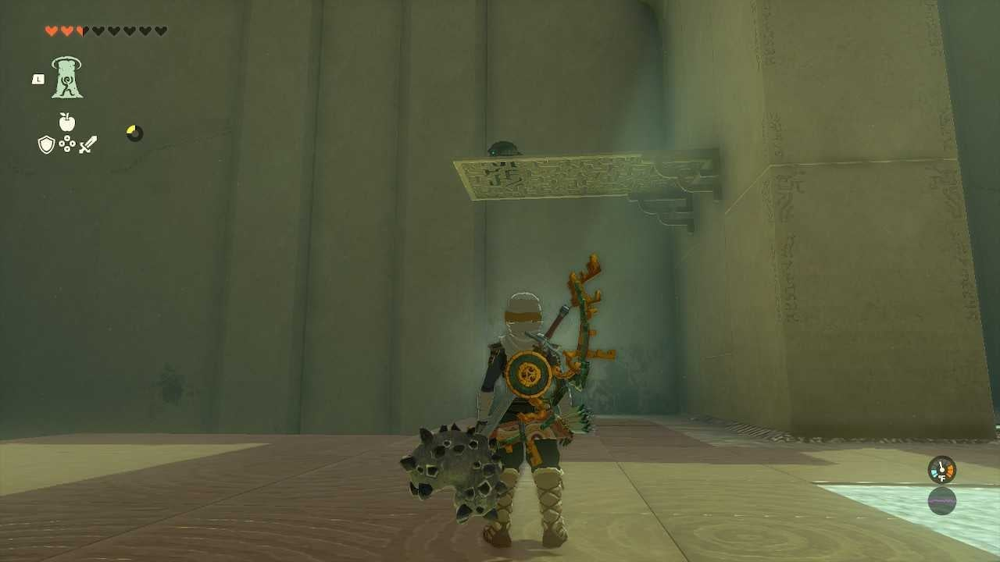
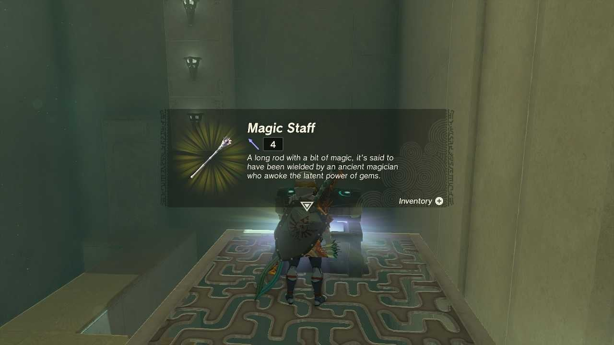
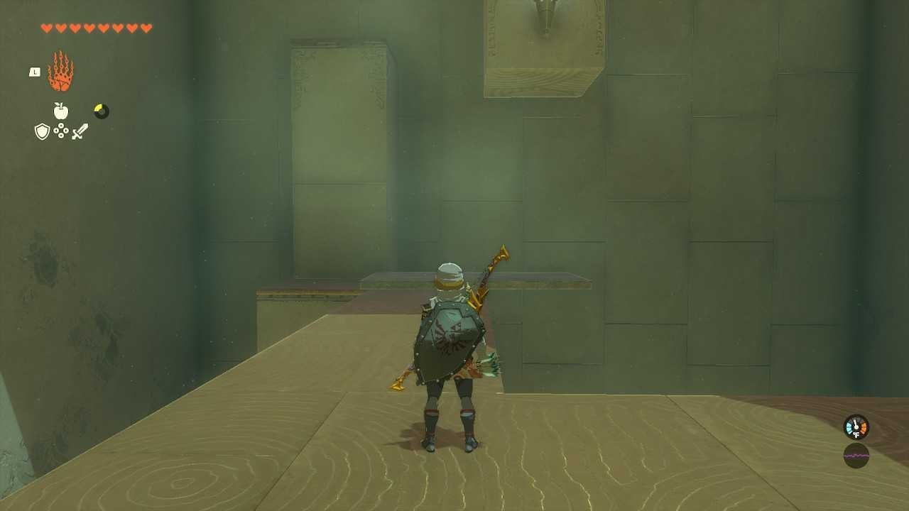
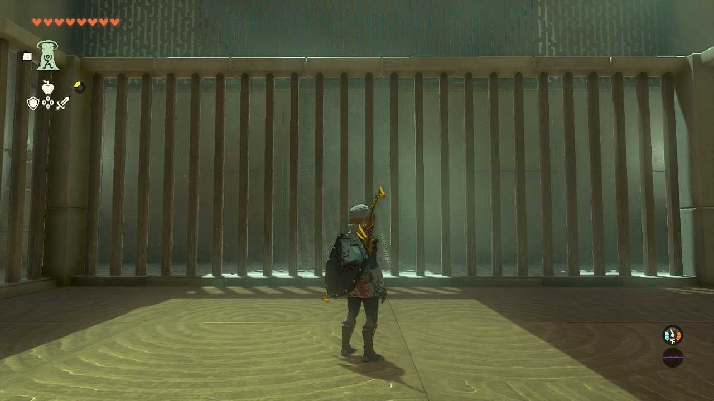
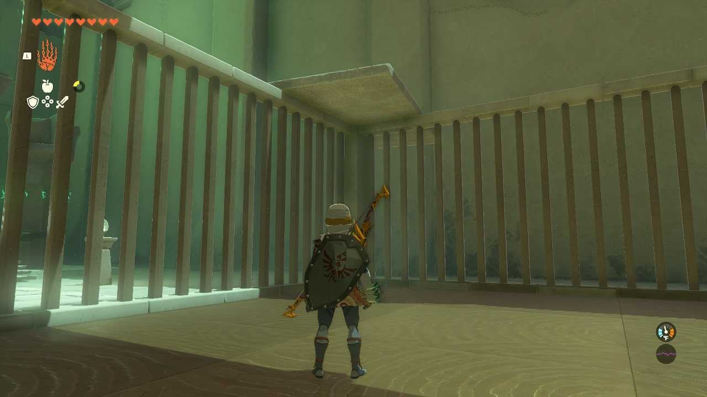

Jikais Shrine (Jailbreak) in The Legend of Zelda: Tears of the Kingdom is a shrine located in the Lanaryu Region. This page contains a guide for how to locate and enter the shrine, a walkthrough for the shrine itself, and puzzle solutions as well as treasure chest locations for the TotK Jikais shrine. 

### Treasure and Rewards

  * **Magic Staff**

##  Jikais Shrine Location

The Jikais Shrine is located just northeast of Walnot Mountain, the closest other point of interest is the Mount Lanayru Skyview tower to the northwest, make sure to bring warm clothing or foods to keep you warm as this is one of the coldest areas you will need to traverse to reach the shrine. 

  * **Coordinates:** 4268,-1671,0182

## Jikais Shrine Walkthrough

When you enter the first room you will see four blocks on tracks. Use **Ultrahand** to move the upper block on the right over the ground to where you can use Ascend to get on top of it. From there run and jump to the central platform in the recessed wall. From there use Ultrahand to pull the large block from the left side closer to the middle of the room. 

Jump to the large block and use Ultrahand again to pull the smaller block above towards you until you can use Ascend on it. If done right there should be a small alcove with a light you can walk into. Head into this alcove and use Ascend to reach the next area. 

## **Treasure Chest Location**

Immediately after entering the second room turn right and look up to see a chest on a thin platform. Use Ascend to reach the chest for a **Magic Staff.**

After claiming the treasure drop or paraglide down towards the narrow walkway that has two pillars and a rectangular block you can grab with Ultrahand. Maneuver it so that it is half on the platform and half hanging off towards the center of the room underneath the pillar on the right. Walk on the platform and Ascend through the pillar to the final room. 

When you reach the top you will be in a small jail, thus the shrine name. Simply look opposite the altar to see another rectangular block, use Ultrahand to grab it and position parallel to the ground above one of the corners of the jail. 

Afterward walk underneath the platform and use Ascend to escape the jail, then simply head to the altar to receive a Light of Blessing. 

Jikais Shrine

Congrats on solving the shrine and earning a Light of Blessing! Click or tap here to return to the rest of the Shrine Guides. You can also check out which shrines are nearby with our shrine map filter on our complete map of Hyrule.

### Up Next: Walkthrough

Previous

About IGN's Zelda TotK Guide Writers

Next

Walkthrough

### Top Guide Sections

  * Walkthrough
  * Zelda: Tears of The Kingdom Switch 2 Edition Guide
  * Zelda Notes Voice Memories
  * List of Side Quests and Side Adventures

### Was this guide helpful?

Leave feedback

Go to comments