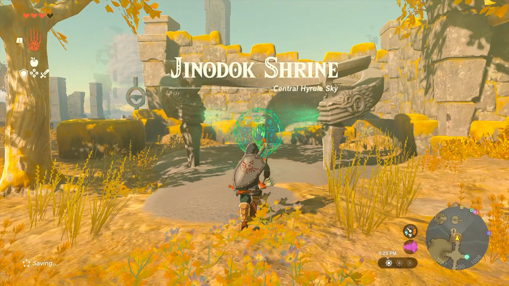
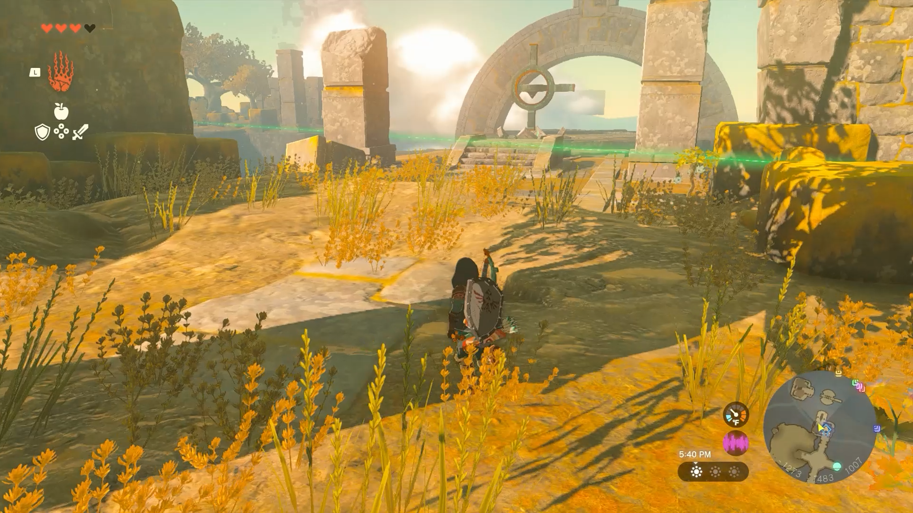
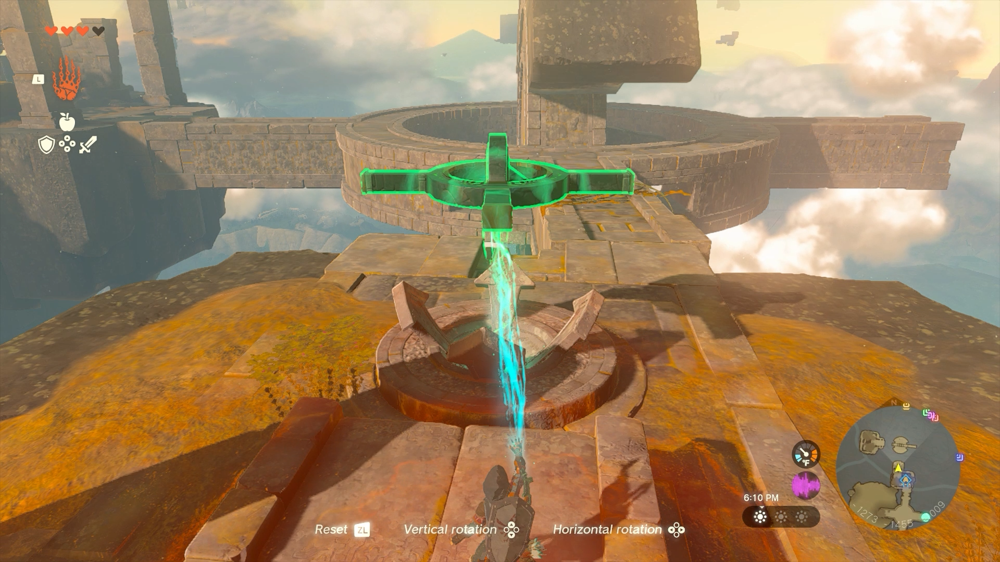
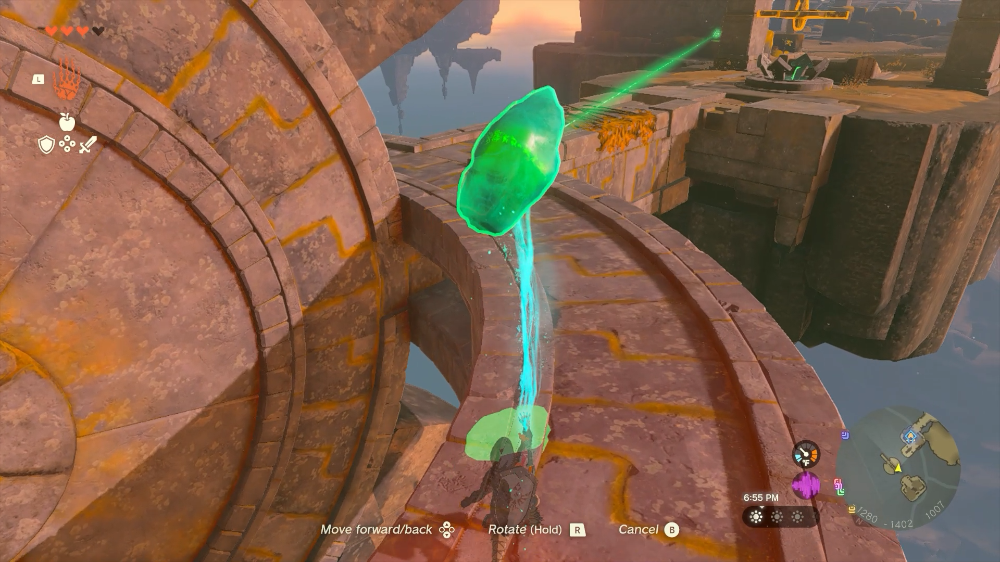
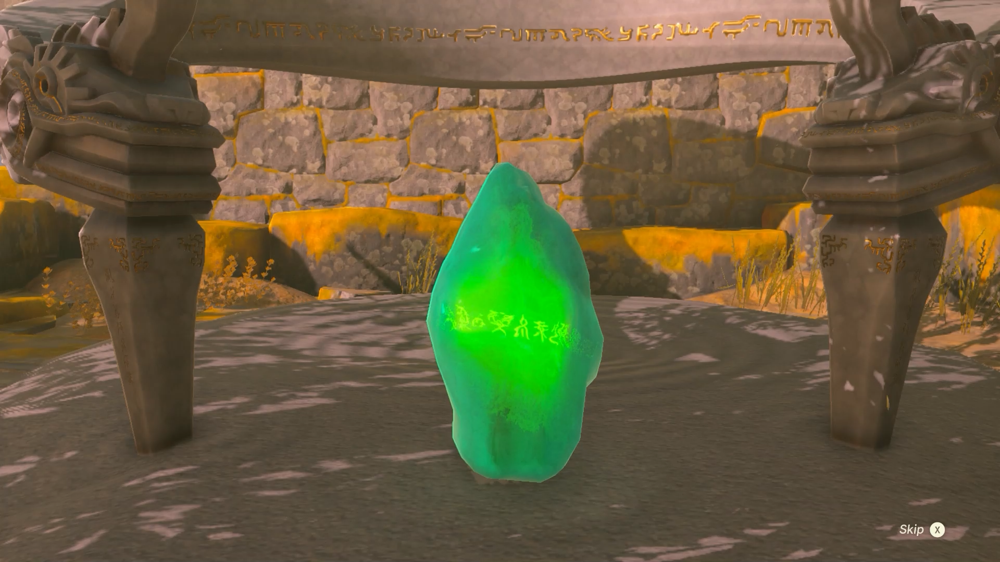
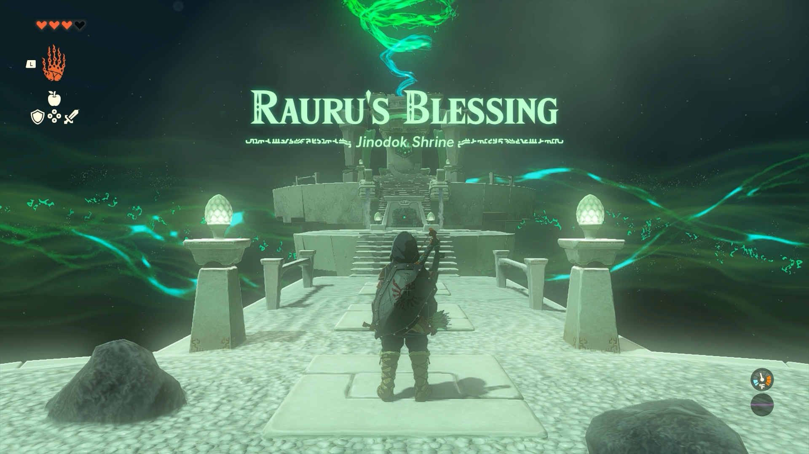

Jinodok Shrine (Rauru’s Blessing) in Zelda: Tears of the Kingdom is a shrine located on a sky island in the Central Hyrule Sky region. In order to access the shrine, you'll need to complete The South Hyrule Sky Crystal shrine quest. This page contains a guide for how to locate and enter the shrine, a walkthrough for the shrine itself, and puzzle solutions as well as treasure chest locations for the TotK Jinodok shrine. 

### Jinodok Treasure and Rewards

  * Diamond

## The South Hyrule Sky Crystal

Jinodok Shrine is located in the South Hyrule Sky Archipelago, west of Great Sky Island and southwest of Hyrule Field Skyview Tower. 

Approach the shrine location and activate the green hand for instructions. A green beam of light will point you in the direction of the sky crystal. 

Use Ultrahand to rotate the floating shape that matches the sky island in front of you. Position the shape so there are connecting pathways between the sky islands. 

Once in place, walk across the paths to find the sky crystal. Use Ultrahand to pick it up and carry it back to the shrine location. Jinodok Shrine will appear. 

  * Coordinates: -1256, -1486, 1008

The South Hyrule Sky Crystal

## Jinodok Walkthrough and Puzzle Solutions

Enter the shrine and you will be rewarded with Rauru’s Blessing. Head straight up the stairs to open the treasure chest with a Diamond inside. 

Continue up the next set of stairs to exit the shrine. 

Jinodok Shrine

Congrats on solving the shrine and earning a Light of Blessing! Click or tap here to return to the rest of the Shrine Guides. You can also check out which shrines are nearby with our shrine map filter on our complete map of Hyrule.

### Up Next: Walkthrough

Previous

About IGN's Zelda TotK Guide Writers

Next

Walkthrough

### Top Guide Sections

  * Walkthrough
  * Zelda: Tears of The Kingdom Switch 2 Edition Guide
  * Zelda Notes Voice Memories
  * List of Side Quests and Side Adventures

### Was this guide helpful?

Leave feedback

Go to comments