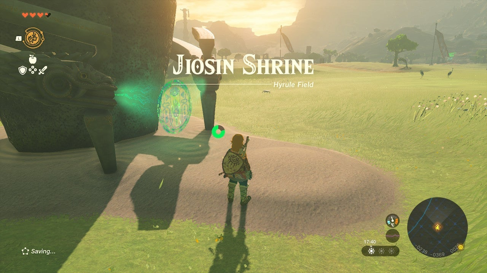

Jiosin Shrine “Shape Rotation” in The Legend of Zelda: Tears of the Kingdom is a shrine located in the Central Hyrule Region. This page contains a guide for how to locate and enter the shrine, a walkthrough for the shrine itself, and puzzle solutions as well as treasure chest locations for the TotK Jiosin shrine. 

### Treasure and Rewards

  * **Hasty Elixir**

##  Location/How to Reach

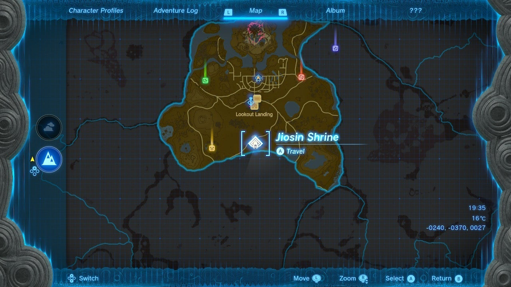

Jiosin Shrine is located on the ground in Central Hyrule in plain view, due south of Lookout Landing and Lookout Landing Skyview Tower. 

  * **Coordinates:** -3983, -1084, 0624

## Walkthrough and Puzzle Solutions

Walk through the portal and begin in the room to the left. Here you’ll find a long piece of stone in an X shape on its side, and a hole in the wall with a similar shape. Press and hold the L BUTTON to select Ultrahand and then tap L BUTTON and highlight the X block. Lift it into the air and run around the room so you can push it through the X-shaped hole. 

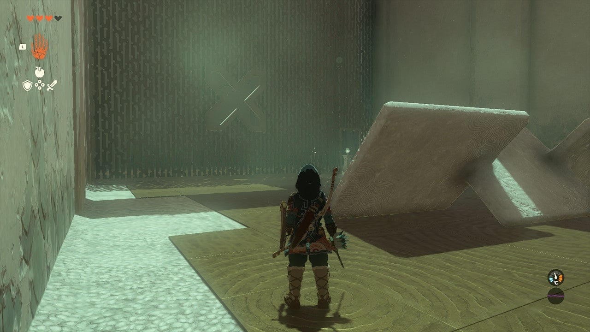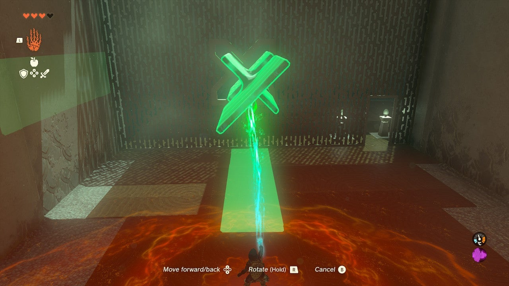

Note that you can press the R button while holding it and then use the D-pad to rotate the block in mid air. Pick up the X block again in the next room and use the R button in mid air to rotate it so the X is towards link. This will make it a lengthy bridge, and you can use it to cross the gap. 

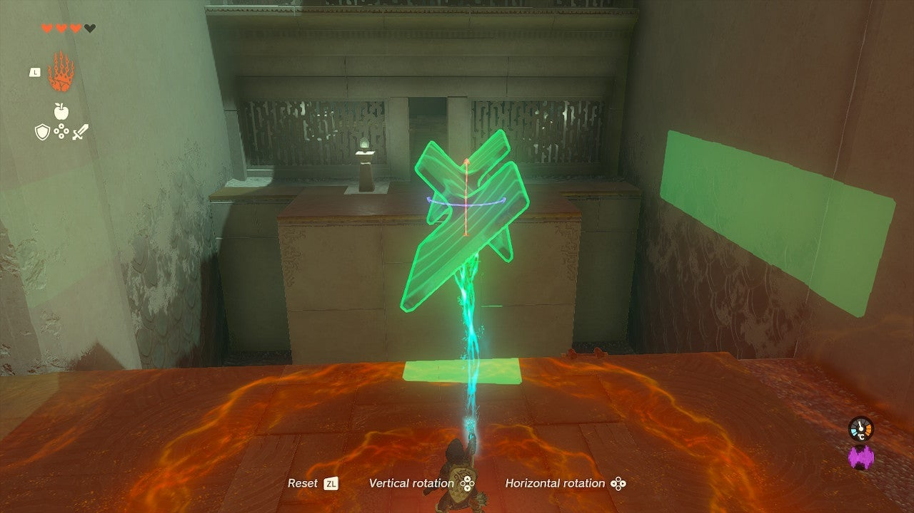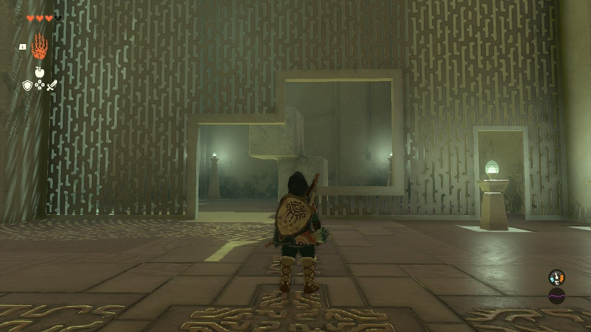

The X block will cast a green shadow on the ground. Use this to align the tips of the X block with the bridge. If you drop it, it’s easy to pick up in the chasm. And note that a ladder can get you up and out of the chasm. Cross the bridge, using Y to to jump over the small gap. 

In the next area, turn right. Two cubes here are fused into a new shape. Pick up the two cube block and walk it over to the gap. 

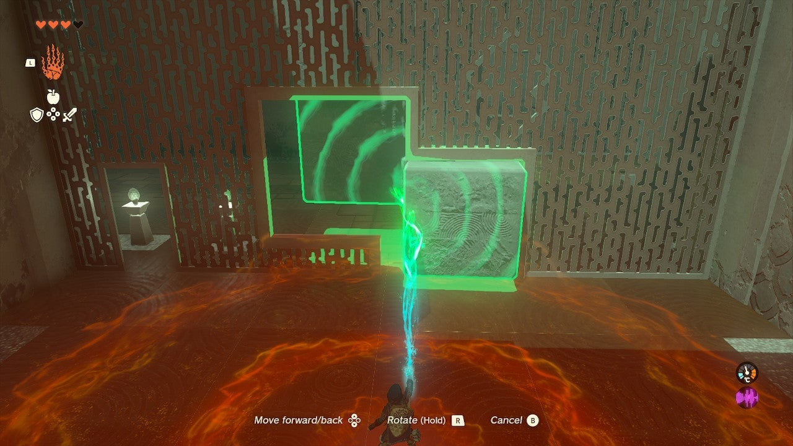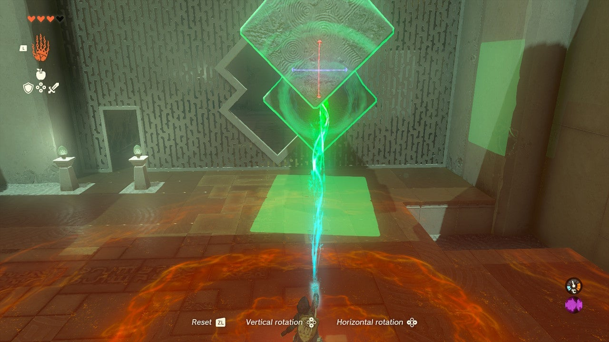

You will need to hold the R BUTTON and rotate these blocks until they can fit through the hole. It might take some experimentation, but they can fit in the configuration pictured. 

### Treasure Location

Before moving the double cube into the final room, look to the wall between the rooms with the double cube holes. You should be able to see platforms and a chest above them, Here you can turn the double cube on its side and nestle one cube in the divot beneath the platforms. See the picture. From here you can climb the blocks and leap the gap to the platforms with the treasure chest with a ‘’’Hasty Elixir’’’ inside. 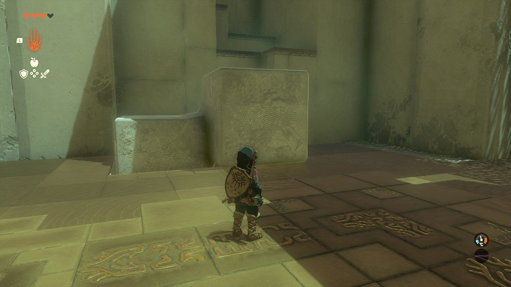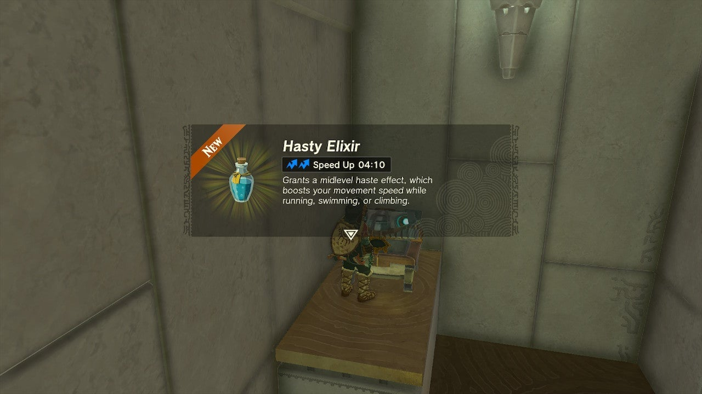

Across the room is another wall with a hole. Use the R BUTTON rotation again to spin the piece to fit through as shown in the picture below. 

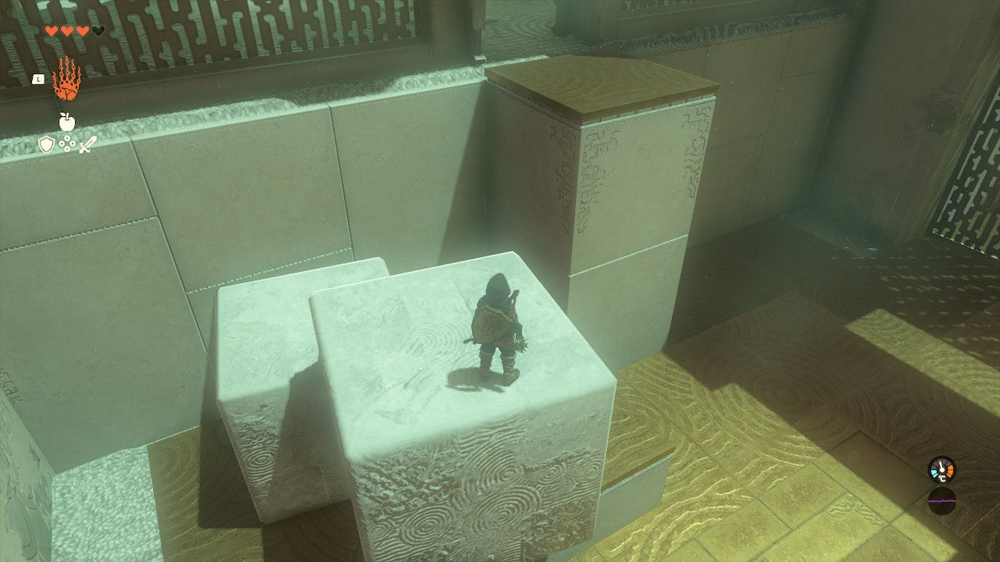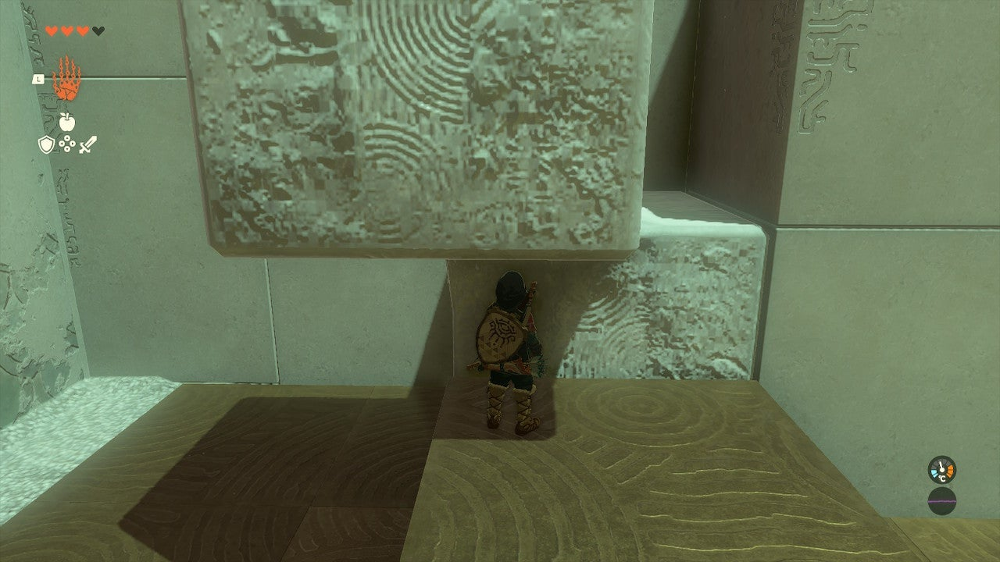

Now, drop the block next to the platforms leading to the glowing shrine exit – you can nestle one block behind the platform in the gap. You can drop the double cube on its “side” and jump up it, then jump the gap, or vertically and hit the R BUTTON to select Ascend allowing you to travel up through the block as shown in the picture. From here you can leap to the platform and exit the shrine. 

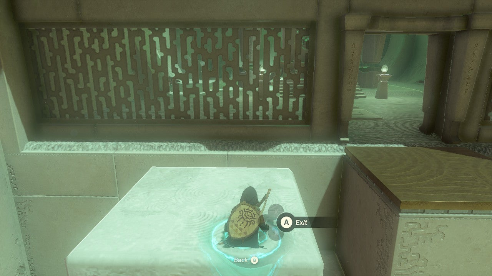

Jiosin Shrine

Congrats on solving the shrine and earning a Light of Blessing! Click or tap here to return to see the rest of the TotK Shrine Locations and Puzzle Solution Guides.

### Up Next: Walkthrough

Previous

About IGN's Zelda TotK Guide Writers

Next

Walkthrough

### Top Guide Sections

  * Walkthrough
  * Zelda: Tears of The Kingdom Switch 2 Edition Guide
  * Zelda Notes Voice Memories
  * List of Side Quests and Side Adventures

### Was this guide helpful?

Leave feedback

Go to comments