Jiotak Shrine (**Rauru’s Blessing**) in Zelda: Tears of the Kingdom is a shrine located in the Eldin Canyon region and is one of 152 shrines in TOTK (see all shrine locations). This page contains a guide for how to locate and enter the shrine, a walkthrough for the shrine itself, and puzzle solutions as well as treasure chest locations for the TotK Jiotak shrine. 

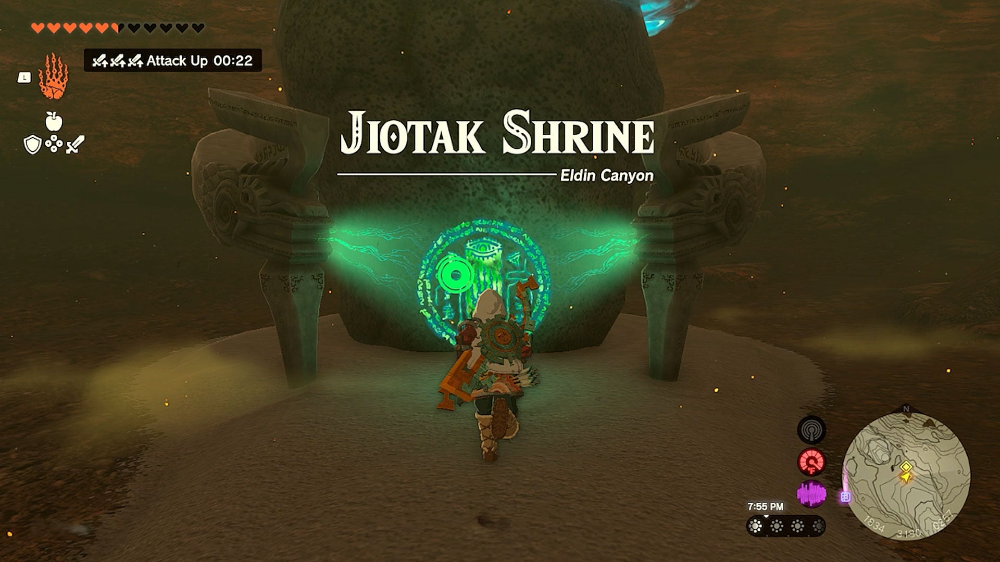

### Treasure and Rewards

  * Magic Staff

## Jiotak Shrine Location

The Jiotak Shrine is only reachable via a cave found north of Goron City, and slightly northwest of Death Mountain. On the map, you’ll see a small mountain in the foothills labeled Isle of Raba, this is where you’ll find the entrance to the cave. Because this is a cave near Death Mountain, you will immediately be suffering from Unbearable Heat the moment you jump in. Make sure to cook some Fireproof Elixirs by mixing a Fireproof Lizard with some monster parts, or equip Link with Flamebreaker Armor. 

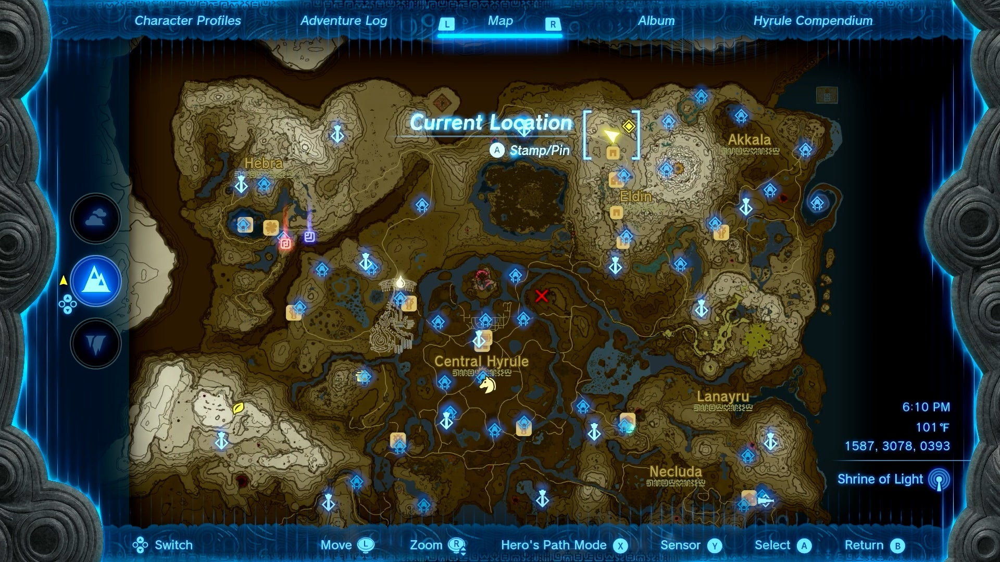

  * Cave Coordinates: 1587, 3078, 0393
  * Shrine Coordinates: 1833, 3179, 0257

## Jiotak Shrine Walkthrough

The Jiotak Shrine is a Rauru’s Blessing shrine, meaning the challenge is to find the shrine itself, as opposed to actually solving the shrine once inside. The shrine can be found in a cave just north of Goron City (see the Location and How to Reach section above for the cave’s exact location). You’ll know you’re at the right cave when you see a set of minecart tracks leading to the hole you’ll need to jump down. It’s also marked by a bright red torch. 

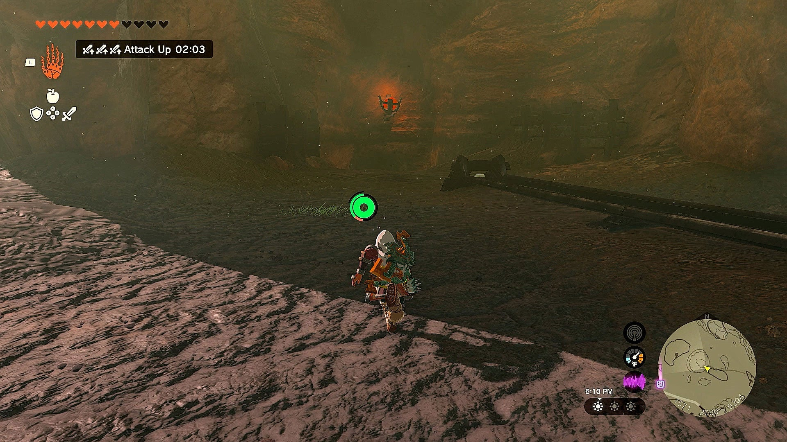

Before jumping into the cave, you’ll need to equip the Flamebreaker Armor or cook a Fireproof Elixir, as you’ll suffer from Unbearable Heat the moment you jump down. Also make sure to not have any wood shields, bows, or weapons equipped, as they’ll burn up in the heat. 

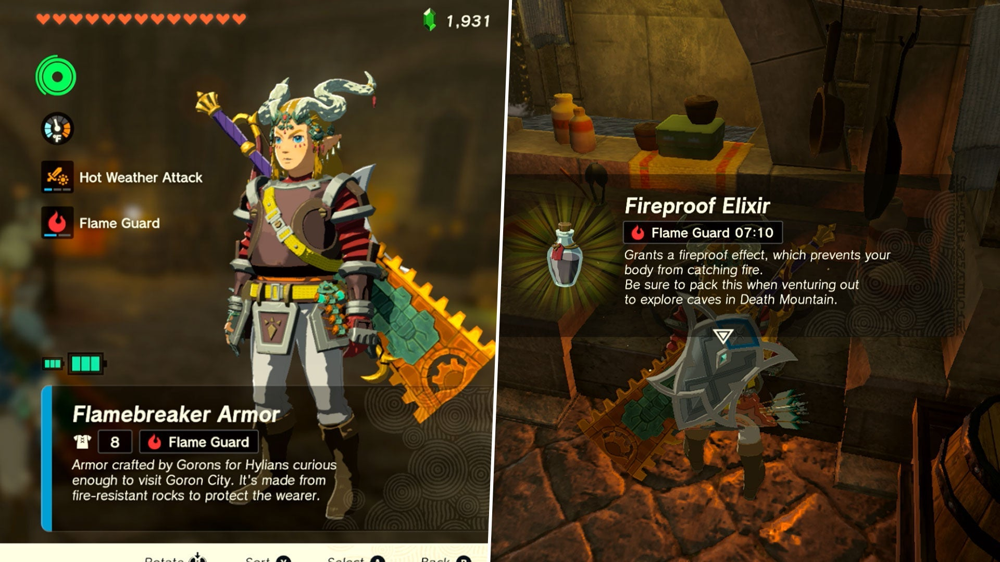

Once you’re sure you’re equipped to handle the heat, jump down the hole and use your paraglider for a safe landing. 

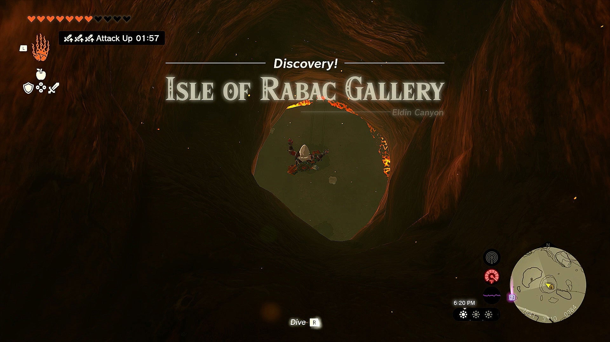

The first thing you’ll see when landing is a set of minecart tracks, a few minecarts, and some fans. Use Ultrahand to glue a fan to the back of a minecart, then place it on the tracks. Then jump inside and hit the fan to activate it and take off down the tracks. 

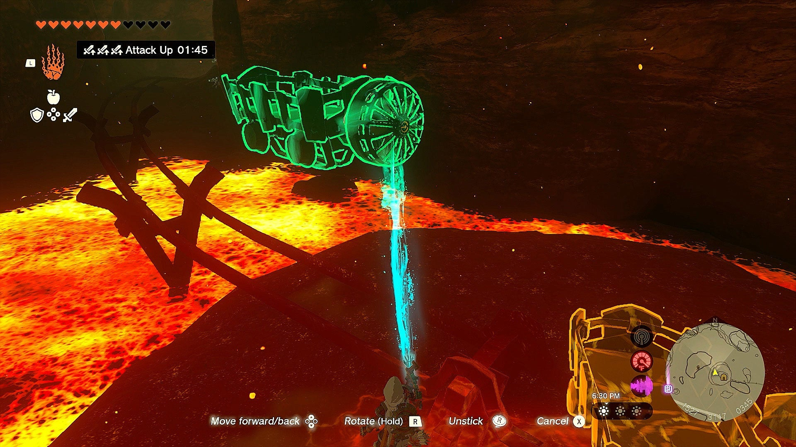

As you make your way through the winding cave on the minecart, you’ll encounter some flaming Kees, pull out your shield or slash them away to avoid taking damage. After a very short ride, you’ll turn around a bend and see a lava waterfall as well as a pool of lava, we recommend turning your minecart fan off at this point, not only to save battery but to slow down your minecart as you’re about to have to shoot a switch around the corner. 

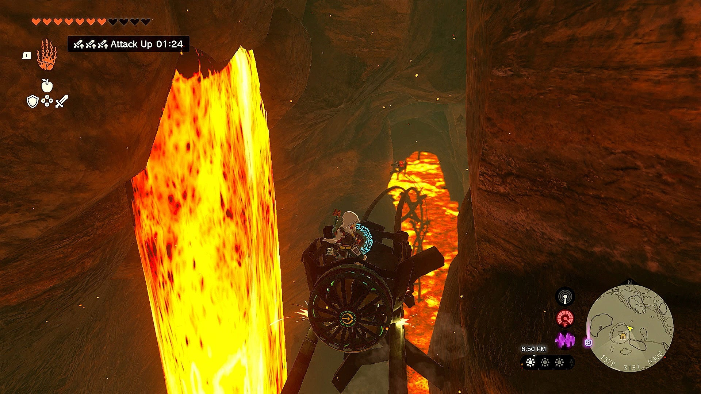

Ready your bow, and as your start to go around a bend on your left side, you’ll see a target switch. Shoot it, which will cause the tracks to change, allowing you to continue going left deeper into the cave. If you miss it (as the timing is very tight), that’s okay! You’ll instead go right, which is just a big circle that will bring you around to the switch again, this time with a much bigger opportunity to shoot the switch. 

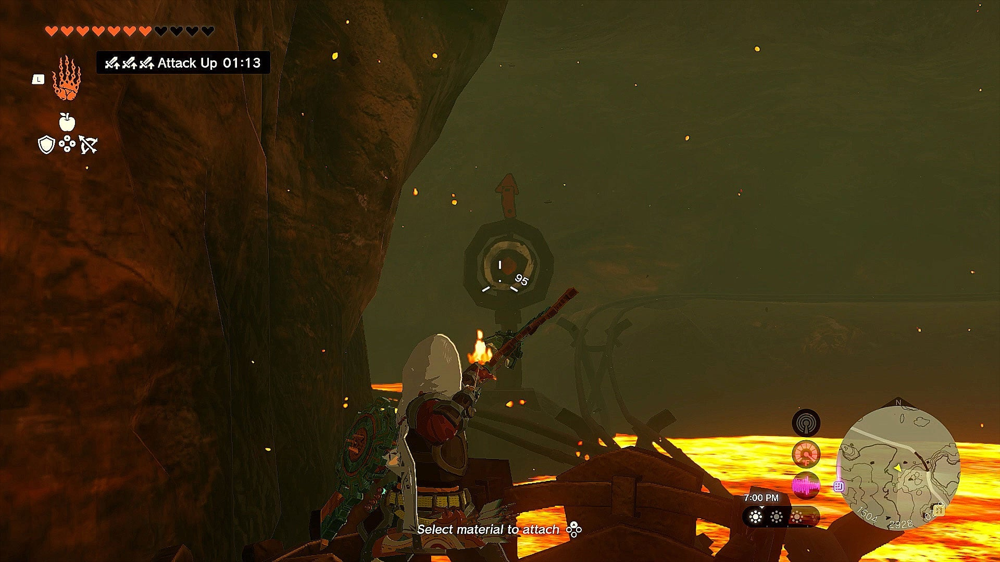

Once you’ve hit the switch successfully, hit the fan with a weapon to turn it back on. As you continue deeper into the cave, you’ll soon enter a giant opening with a lot going on. It’s filled with monsters, other minecart tracks, and a ton of switches. Luckily, this guide will show you how to avoid all of this confusion. Immediately to your right, you’ll spot a cave opening. This is not the cave we want. It does house a Bubbel Gem creature, but if you’re just looking for the Shrine, stay in the minecart. 

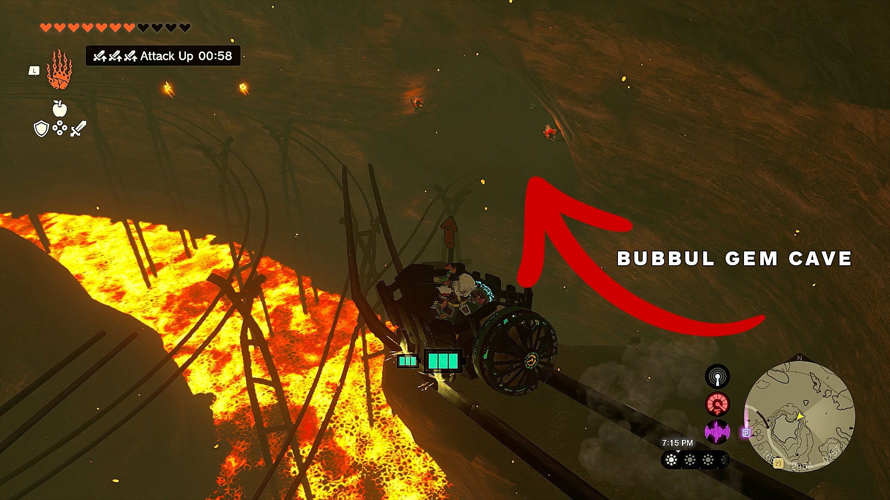

The minecart will fall onto another track, and you’ll be met with a few more pesky fire Kees. After another few moments, your cart will start to turn left to follow the tracks, and you’ll see another cave on your right, this time with the Shrine inside. 

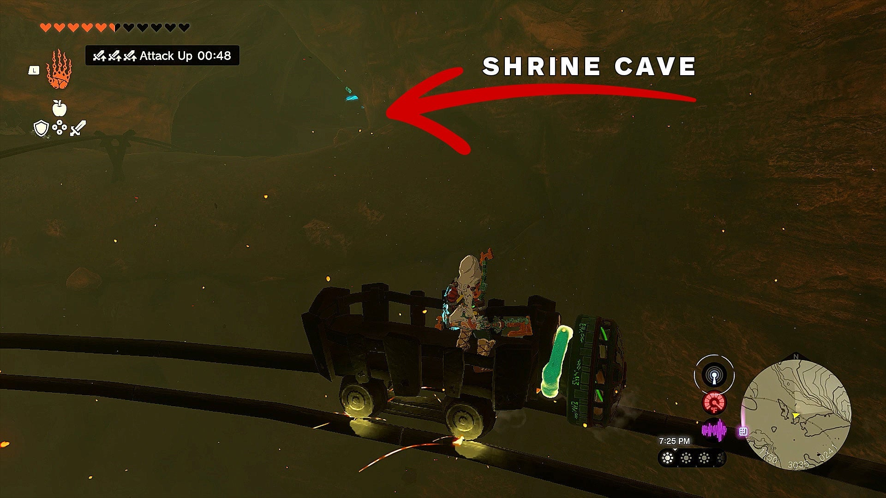

The moment you’re about even with the cave, jump out of your minecart towards it and activate your paraglider. You’ll likely land just below the cave, and then simply climb up onto the ledge. 

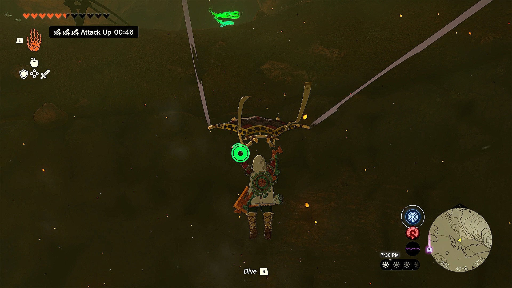

And that’s it, the Jiotak Shrine will be right in front of you, alongside a ton of Brightbloom Seeds to stock up on. Activate the shrine and run in. 

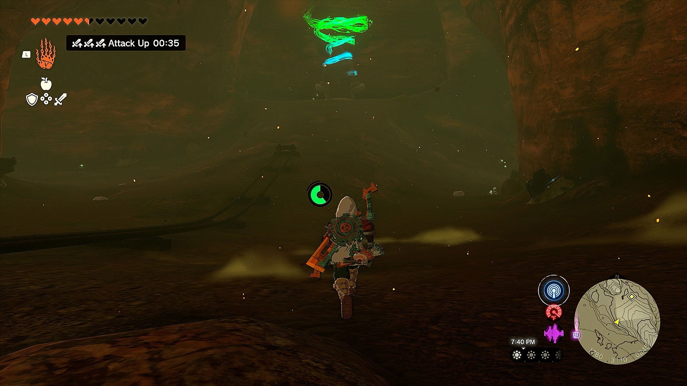

As we previously mentioned, this is a Rauru’s Blessing Shrine, meaning you just have to run up the stairs to grab the chest which contains a Magic Staff, then continue up the steps to be awarded your Light of Blessing! 

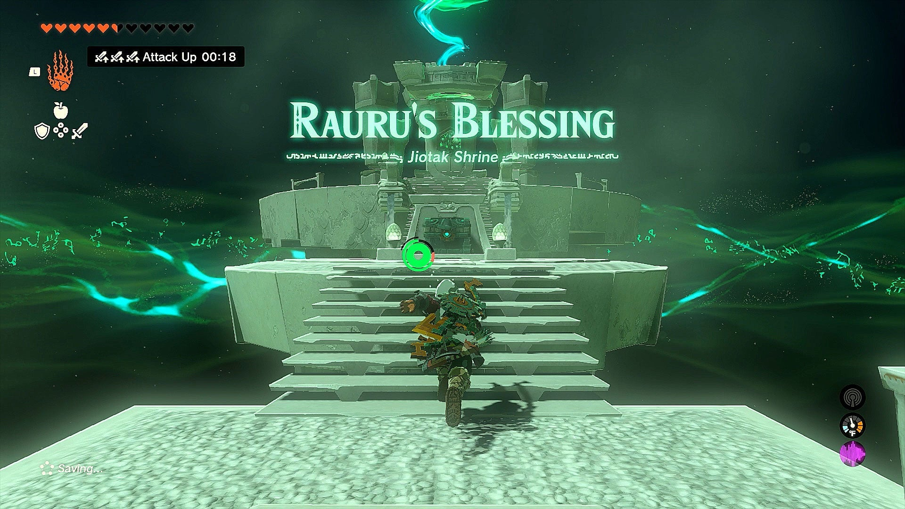

Jiotak Shrine

Congrats on solving the shrine and earning a Light of Blessing! Click or tap here to return to the rest of the Shrine Guides. You can also check out which shrines are nearby with our shrine map filter on our complete map of Hyrule.

### Up Next: Walkthrough

Previous

About IGN's Zelda TotK Guide Writers

Next

Walkthrough

### Top Guide Sections

  * Walkthrough
  * Zelda: Tears of The Kingdom Switch 2 Edition Guide
  * Zelda Notes Voice Memories
  * List of Side Quests and Side Adventures

### Was this guide helpful?

Leave feedback

Go to comments