Jirutagumac Shrine (**A Flying Device**) is a shrine located in the Lanayru Sky region inside a rotating sphere or orb in the Lanayru Sky archipelago in The Legend of Zelda: Tears of the Kingdom. It is one of 152 shrines in TotK (see all shrine locations). 

This page contains a guide for how to find and enter the Jirutagumac Shrine, a walkthrough for the shrine itself, and puzzle solutions and treasure chest locations for the TotK Jirutagumac Shrine. 

**Be sure to check out these other guides to help you through the other Shrines and find troublesome collectibles!**

****

  * Shrine filter on IGN's interactive map of Hyrule
  * All Shrine Locations and Solutions
  * List of Shrine Quests
  * Dragon Locations and Farming Guide
  * Korok Seed Locations

### Jirutagumac Shrine Treasure and Rewards

  * **Sage’s Will**
  * **Large Zonaite**

##  Jirutagumac Shrine Location in TOTK

To find Jirutagumac Shrine in Tears of the Kingdom, launch into the sky from the Upland Zorana Skyview Tower. Below, you will see a sphere with Jirutagumac Shrine within. 

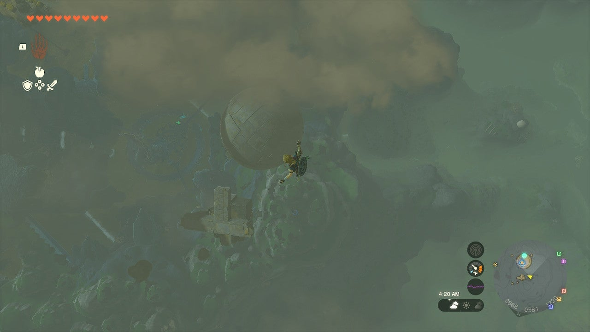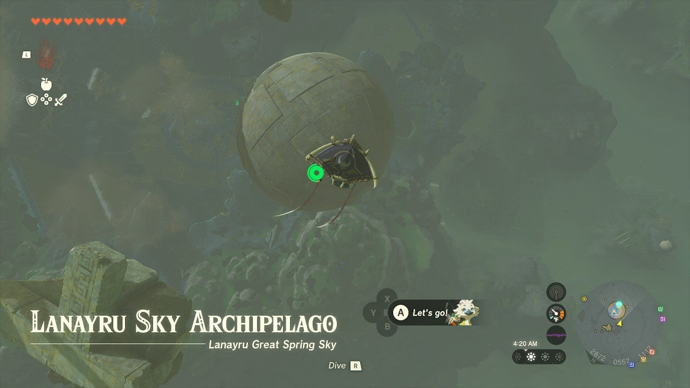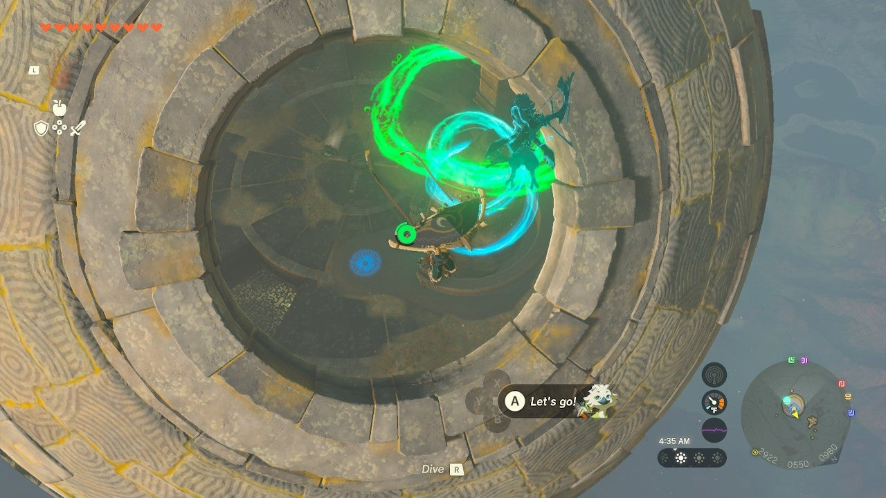

Paraglide around the shrine to find the hole in the side of it, which is rotating. Activate the Shrine pad. 

Step foot inside to see why: a fan is on the wheel handles, rotating the shell of the sphere. Remove this and you can position the opening manually with the wheel. 

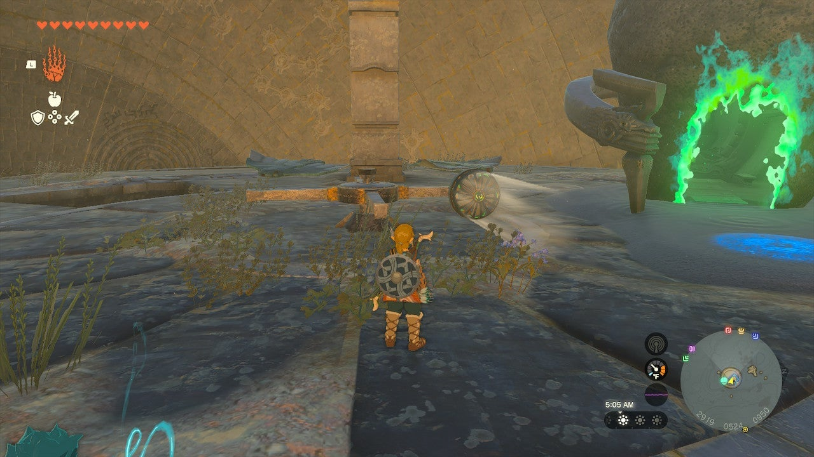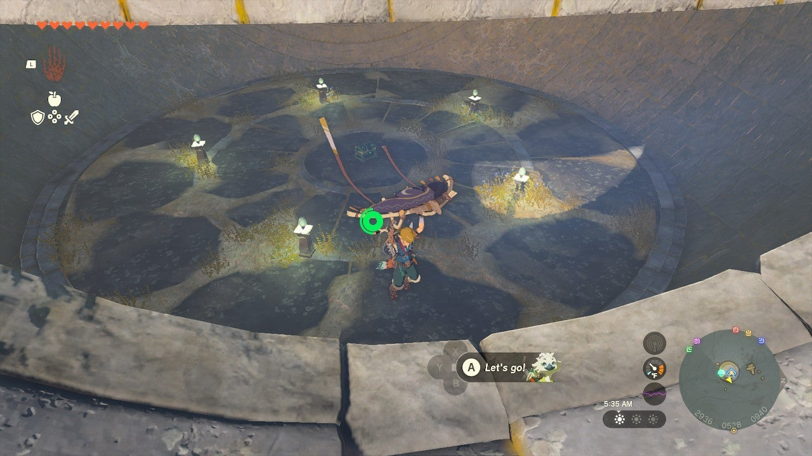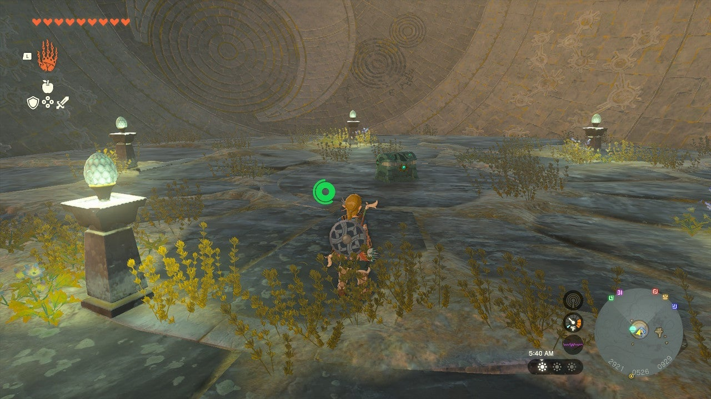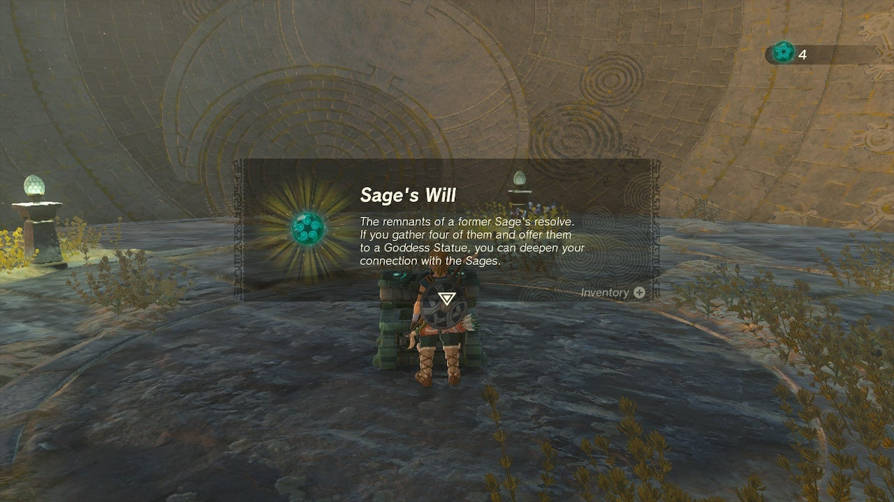

Do so and position the opening halfway above the floor. This will let you drop to the chest below the sphere’s floor by exiting the sphere opening and paragliding back through to the lower level. The chest here holds a **Sage’s Will**. 

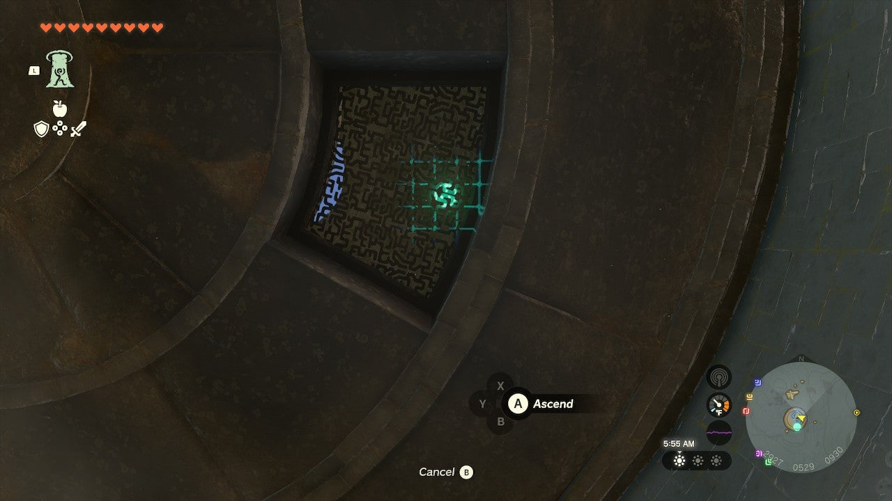

Now, ascend through the metal grate to the shrine level. 

  * Coordinates: 2911, 0525, 0929

## Jirutagumac Shrine Walkthrough

Jirutagumac Shrine involves lots of Wings and gliding. Start by going for the chest you can see on a high platform along the right wall. 

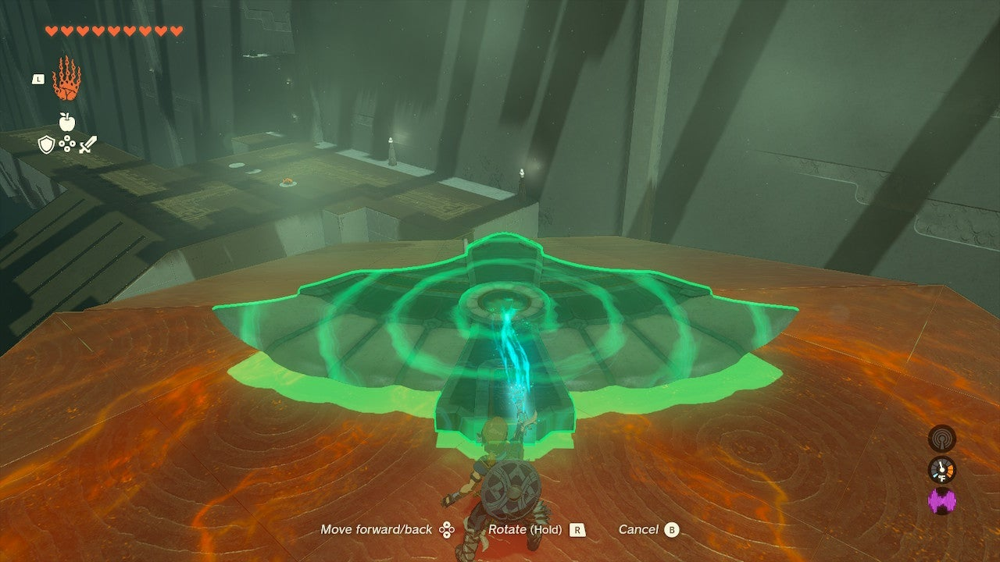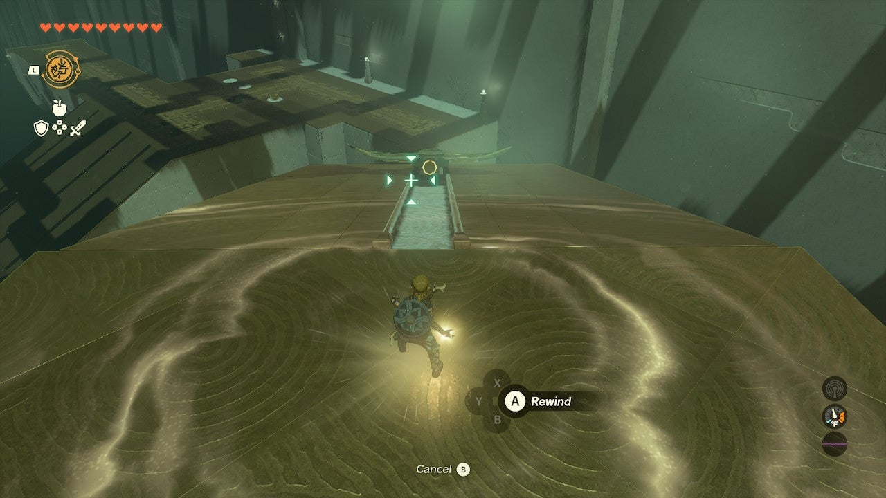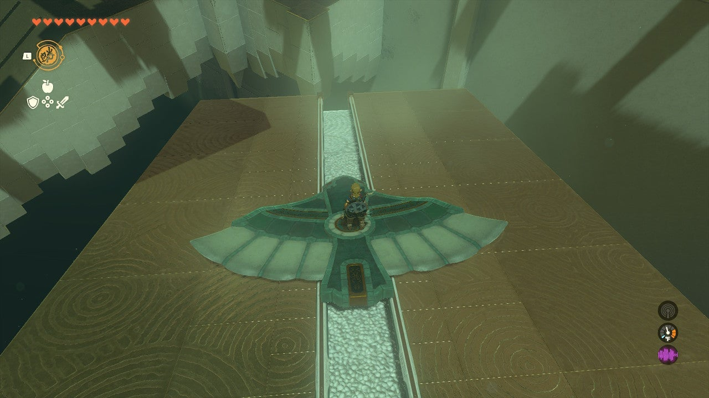

## Treasure Chest Location

To get to this, you need to use a Wing to travel over to this area. Place a wing using Ultrahand on the right ramp and hold it there for a few seconds – let go and quickly switch to Recall. Recall the wing to the previous place and climb on. 

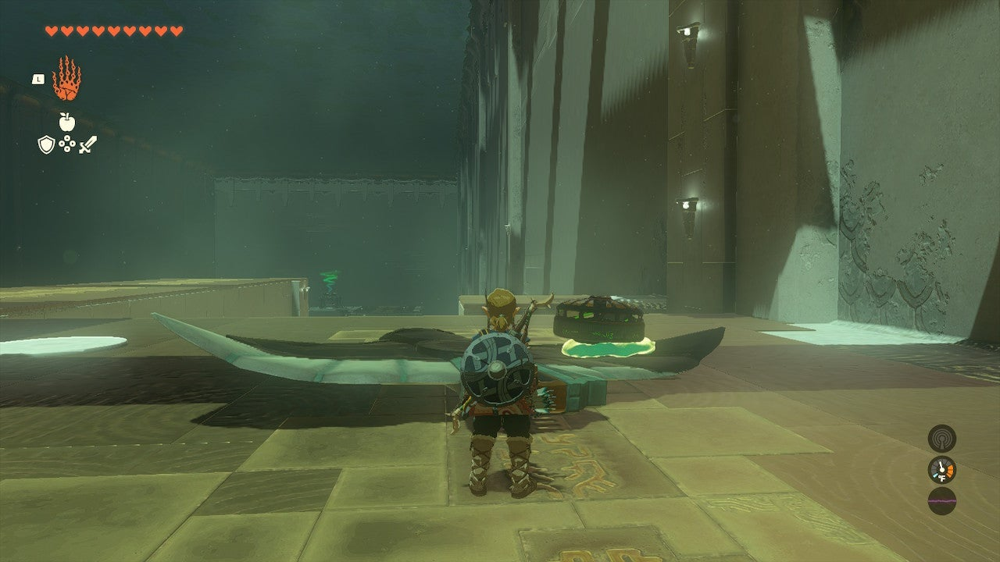

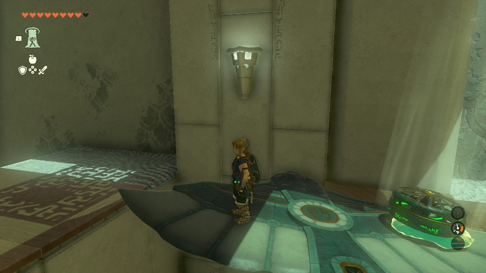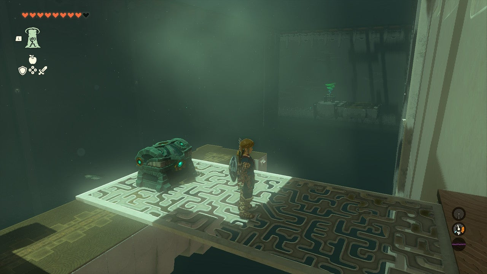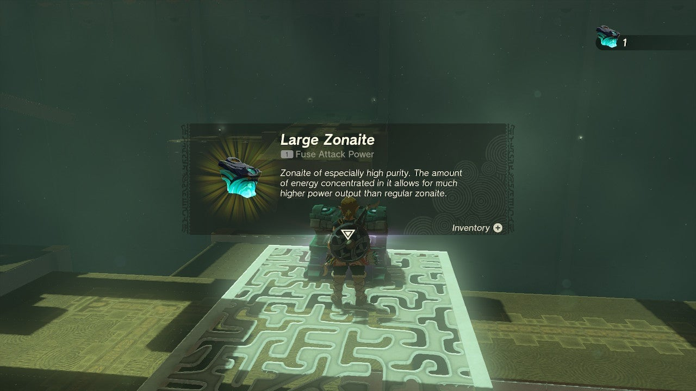

Undo Recall and float over to the chest area on the Wing. Ram it into the ground. 

You need to Ascend up to the chest platform, but there’s a big gap under it. To bridge the gap so you can Ascend, attach the nearby fan to the find, pointing the blades and air steam UP. 

This will pin the Wing to the ground. You can now move the other end of the wing under the platform and over the gap. Walk out on it and Ascend up to the chest. Now, take your Wing and Fan down to the middle lower platform. You need to build a plane to get you to the distant runway and shrine exit. 

To do so you have most of the parts, but not all – you need wheels. 

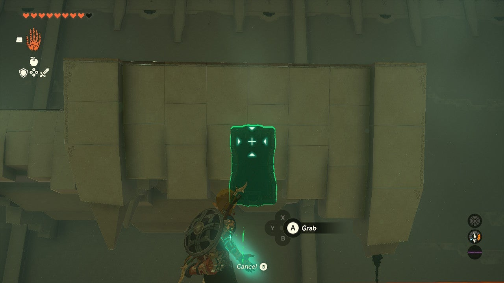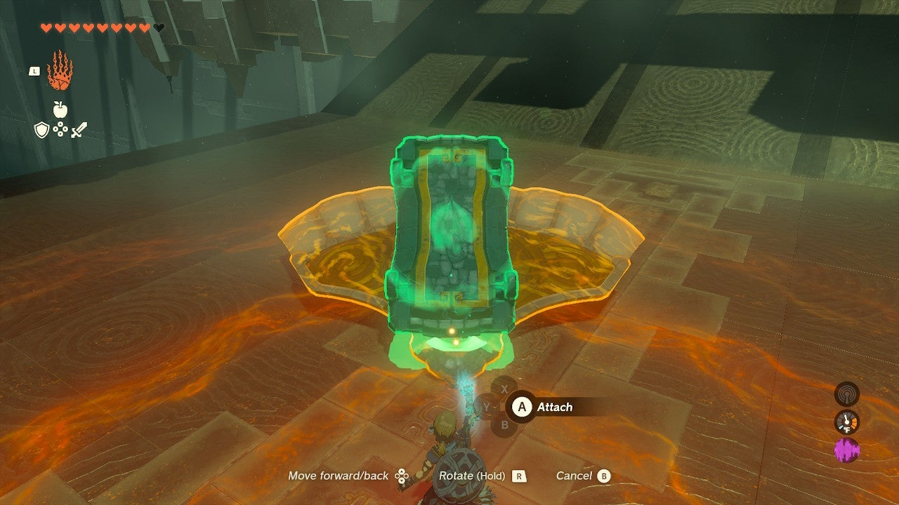

The Carts are dropping off the edge of the cliff on the other side of the center platform, Use Ultrahand to grab one mid-fall (you can use Recall to make this easier). 

Attach a Cart to the bottom of the Wing (you might need to turn it over to get it centered), and a Fan to the rear, top. 

This is your plane. Aim it at the exit and activate it. 

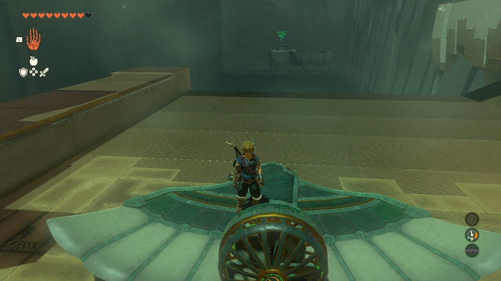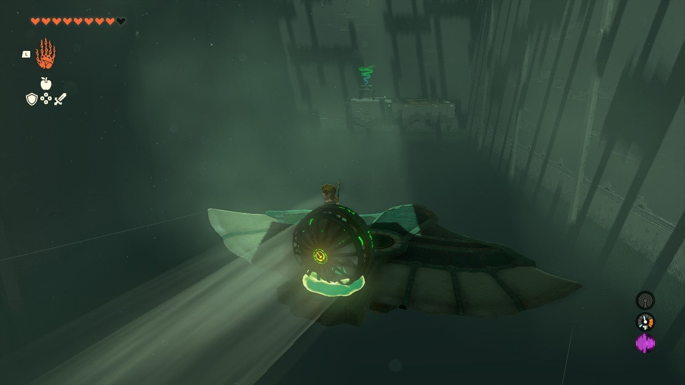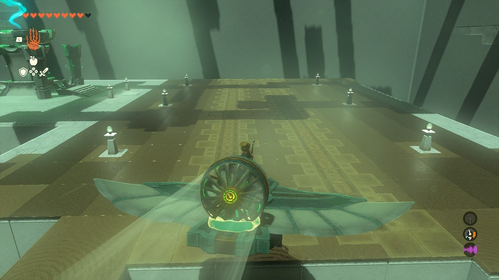

It will roll off towards the distant area. Walk on the wings on either side to guide it left or right. Don’t walk on the nose or it might sink. 

Jump off the plane at the end of your ride or nosedive it into the runway. Exit the shrine.

Jirutagumac Shrine

Congrats on solving the shrine and earning a Light of Blessing! Click or tap here to return to the rest of the Shrine Guides. You can also check out which shrines are nearby with our shrine map filter on our complete map of Hyrule.

### Up Next: Walkthrough

Previous

About IGN's Zelda TotK Guide Writers

Next

Walkthrough

### Top Guide Sections

  * Walkthrough
  * Zelda: Tears of The Kingdom Switch 2 Edition Guide
  * Zelda Notes Voice Memories
  * List of Side Quests and Side Adventures

### Was this guide helpful?

Leave feedback

Go to comments