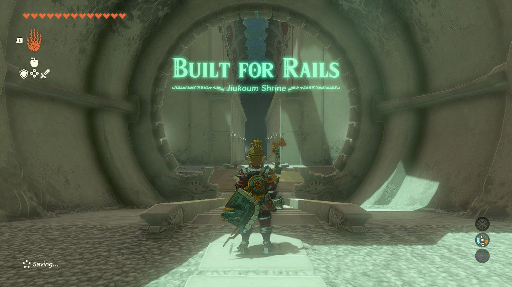

**Jiukoum Shrine (Built for Rails)** in The Legend of Zelda: Tears of the Kingdom is a shrine located in the Faron Region. It is one of 152 shrines in TOTK (see all shrine locations). This page contains a guide for how to locate and enter the shrine, a walkthrough for the shrine itself, and puzzle solutions as well as treasure chest locations for the TotK Jiukoum shrine. 

Be sure to check out these other guides to help you through the other Shrines and find troublesome collectables! 

  * Shrine filter on IGN's interactive map of Hyrule
  * All Shrine Locations and Solutions
  * List of Shrine Quests
  * Dragon Locations and Farming Guide
  * Korok Seed Locations

### Treasure and Rewards

  * **Sticky Elixir**

##  Jiukoum Shrine Location

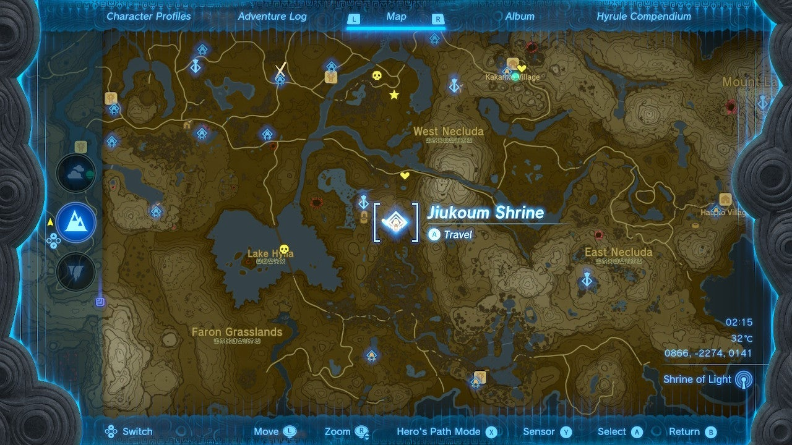

Jiukoum Shrine is quite near the Popla Foothills Skyview Tower on the surface in northwest Faron. It is just east of the tower, you can’t miss it as it is in plain sight. 

  * Coordinates: 0866, -2274, 0141

## Jiukoum Shrine Walkthrough and Puzzle Solutions

The rails in Jiukoum Shrine have little friction so any platform you place on them will slide, making a good vehicle to surf the rails. 

Use Ultrahand to stick the two panels together to the left of the first track and make one long rectangle that can span the track width. 

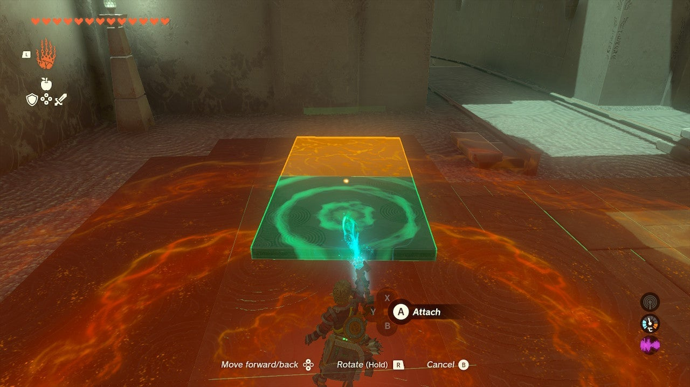

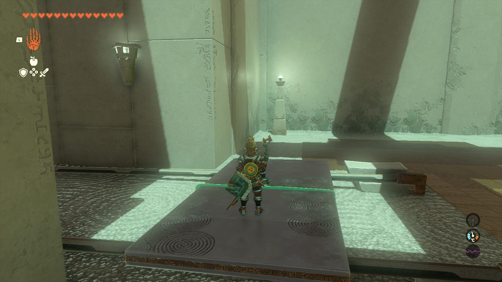

Set this on the track and get on and it will carry you to the next landing. 

Quickly use Ultrand to grab the panel sliding away on the next rail. 

## Treasure Chest Location

There’s a chest up on a ledge across a small abyss, Stick all of your panels together end-to-end to make a long bridge and ramp to the chest with the **Sticky Elixir** inside. 

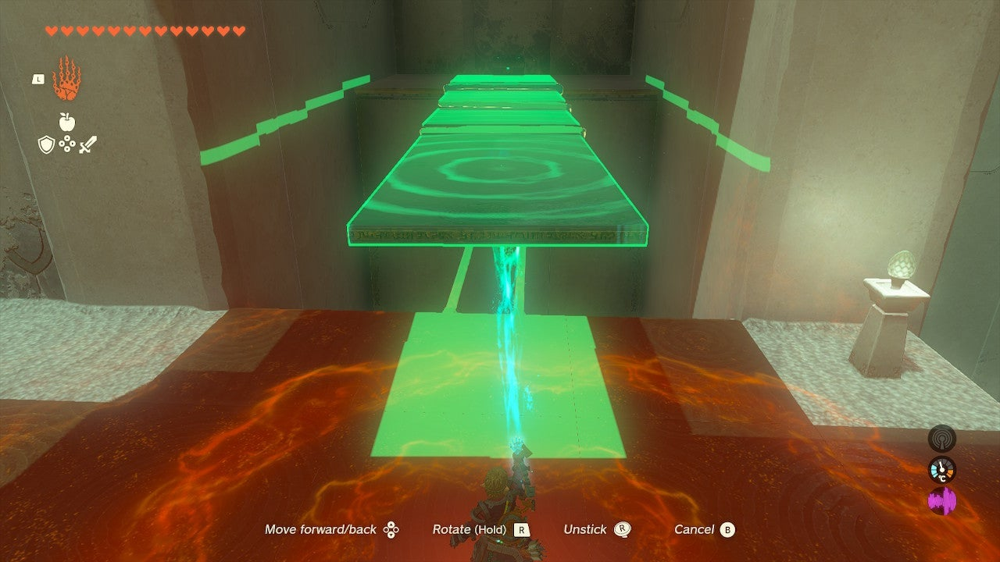

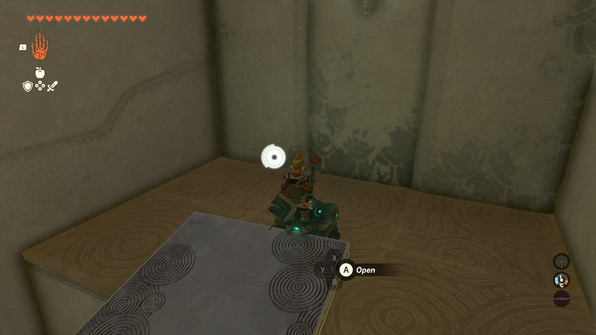

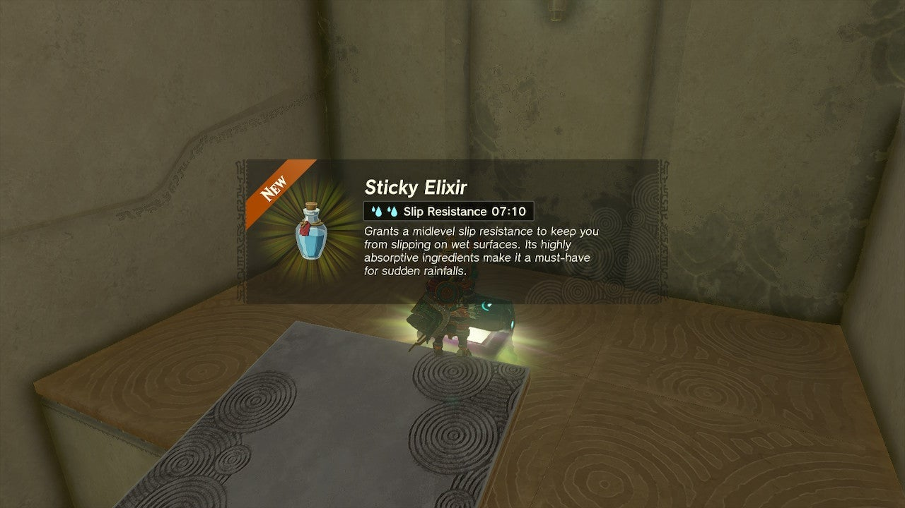

In the next area, use the panels to make a sort of T shape with two legs about ¼ of the way into the long top panel. This will give you a panel to ride the rails on but protect it from moving too far left or right and tumbling off. 

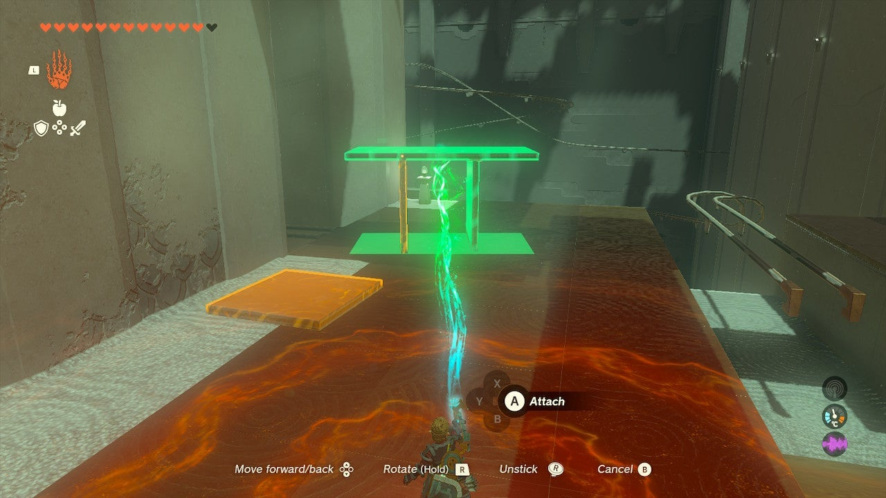

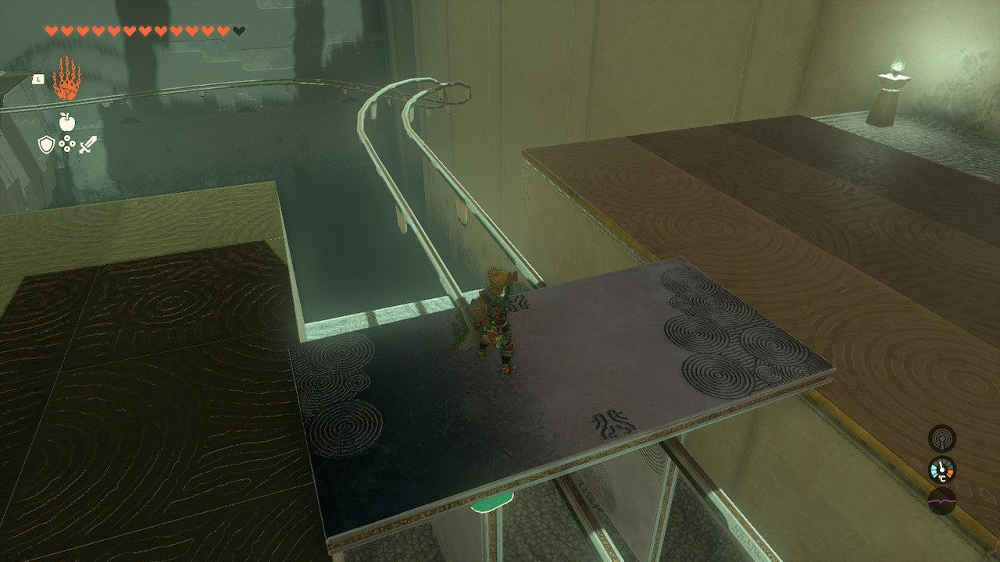

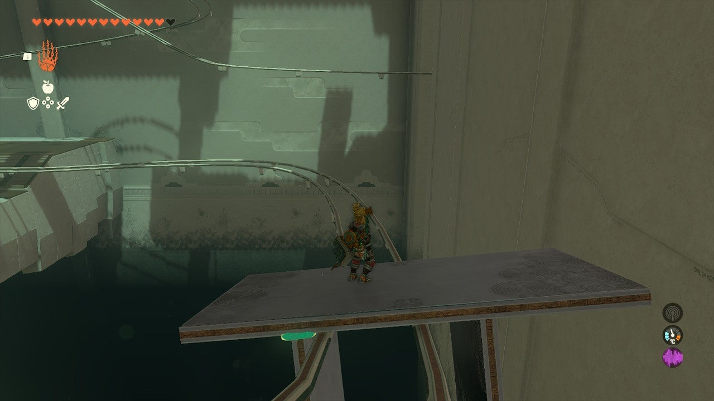

In the final track area, a double track becomes a single track and it moves uphill. You’ll need both momentum, and a device that will fit both tracks. 

Make the same device (or use the same device) in the next area but attach fans evenly to the top AND a single fin right to the middle, making a boxy M shape. Make sure the blades are pointing backwards from the next rail. 

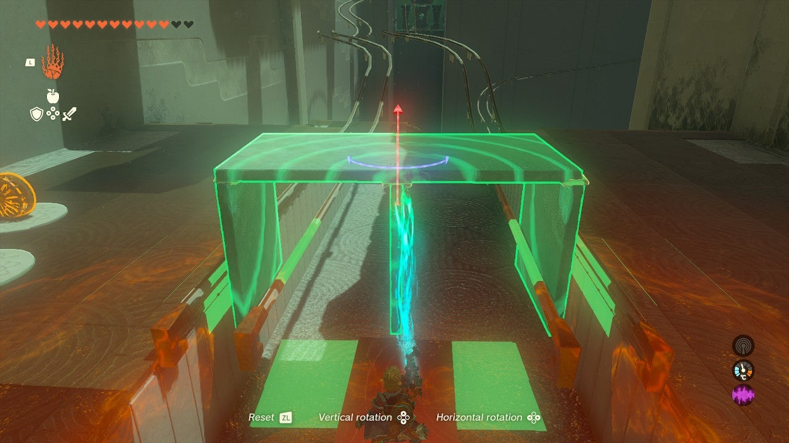

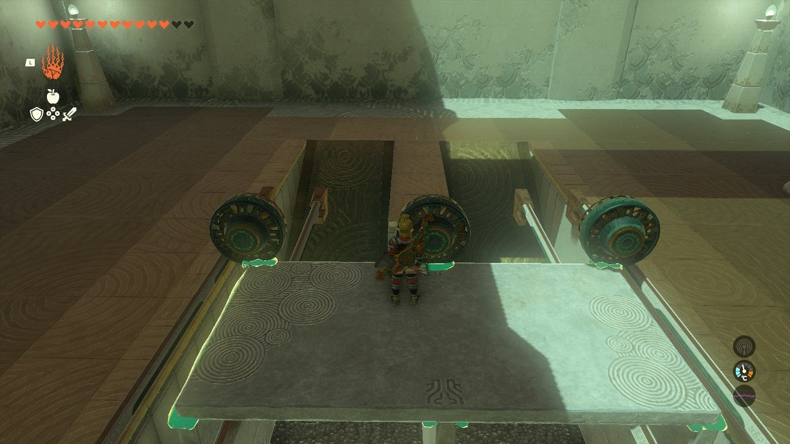

Hop on, activate the fans and ride it up and to the exit. 

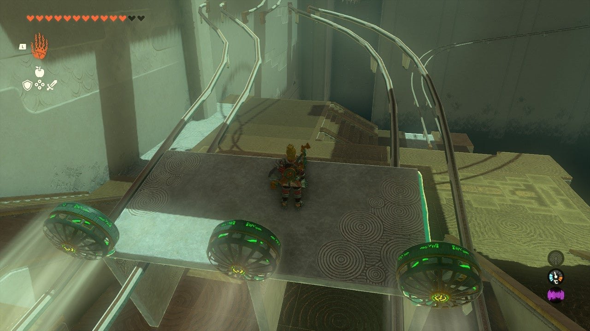

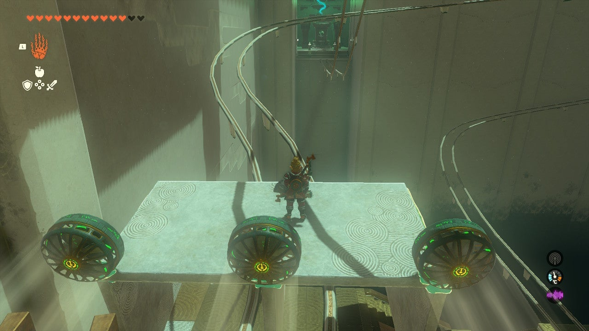

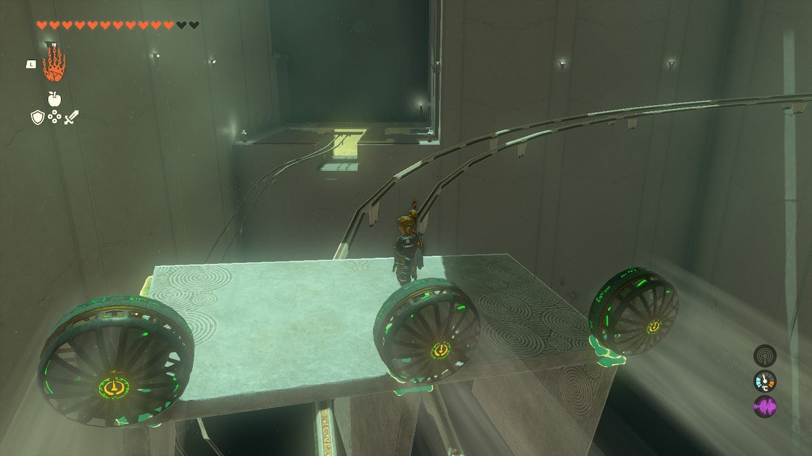

Jiukoum Shrine

Congrats on solving the shrine and earning a Light of Blessing! Click or tap here to return to the rest of the Shrine Guides. You can also check out which shrines are nearby with our shrine map filter on our complete map of Hyrule.

### Up Next: Walkthrough

Previous

About IGN's Zelda TotK Guide Writers

Next

Walkthrough

### Top Guide Sections

  * Walkthrough
  * Zelda: Tears of The Kingdom Switch 2 Edition Guide
  * Zelda Notes Voice Memories
  * List of Side Quests and Side Adventures

### Was this guide helpful?

Leave feedback

Go to comments