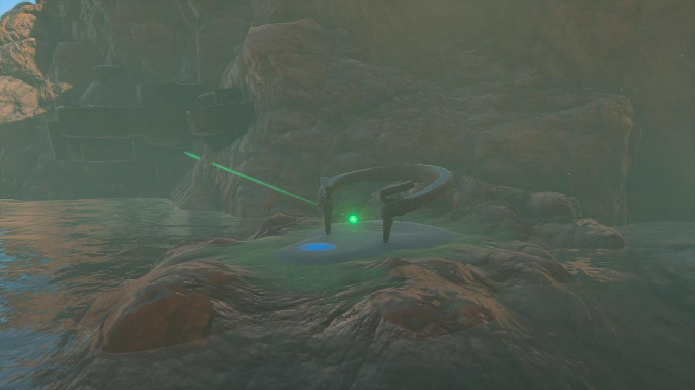
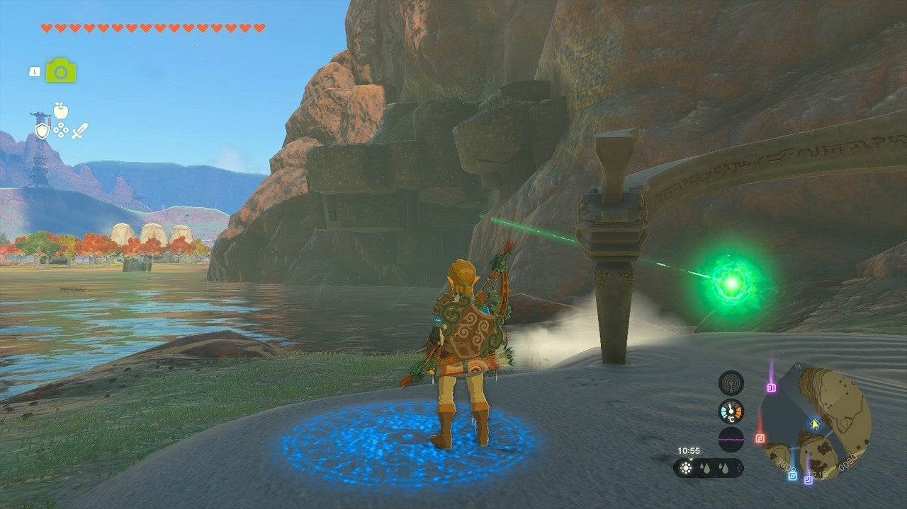
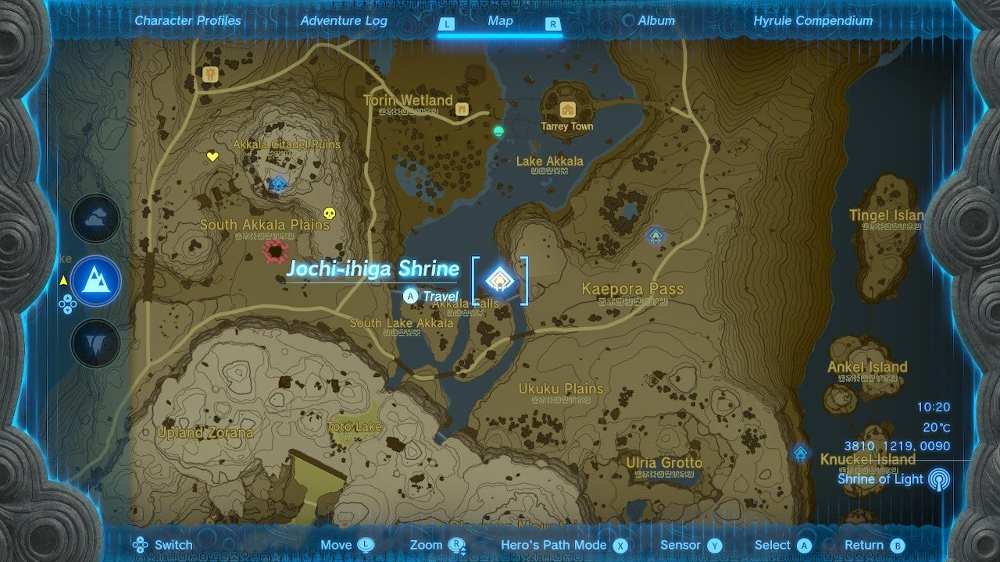
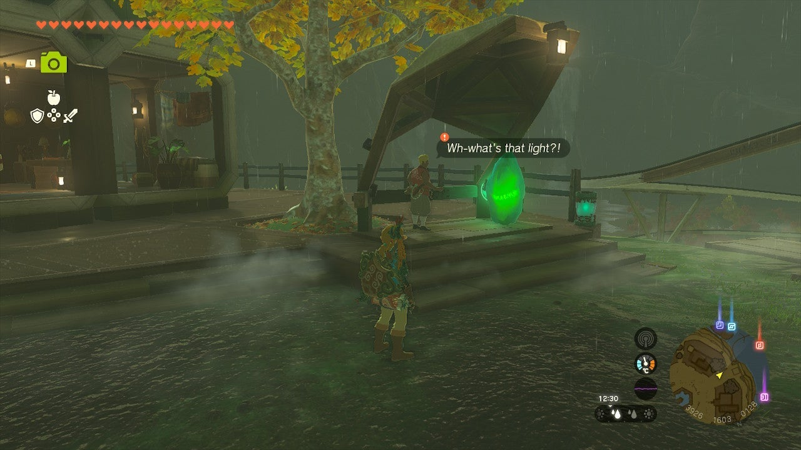
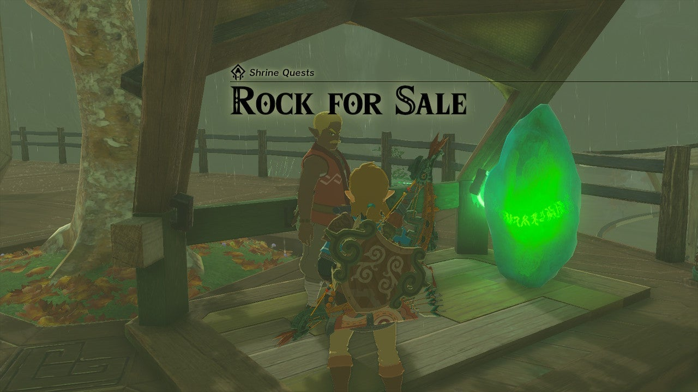
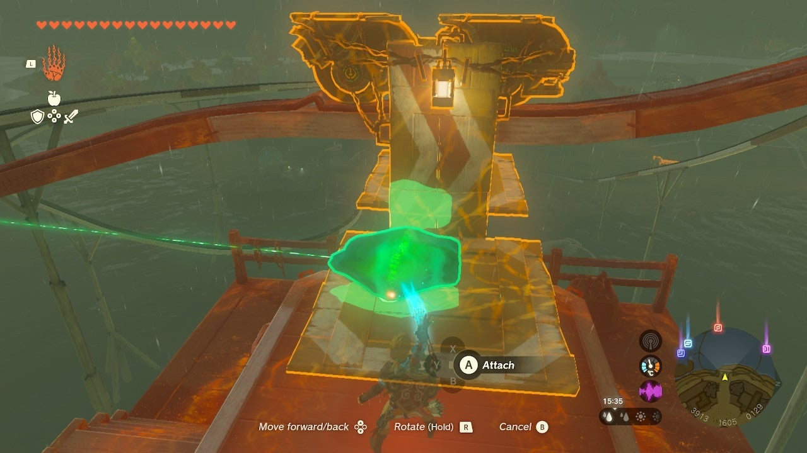
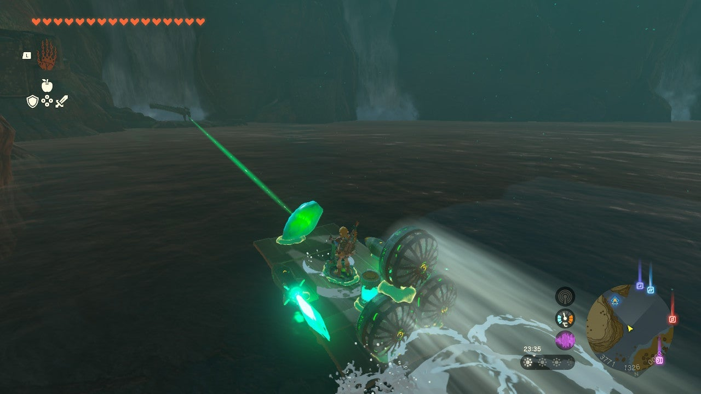
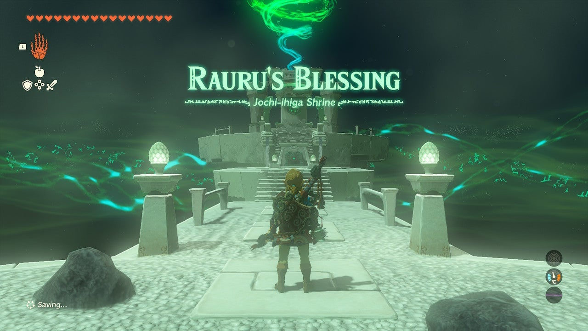

Jochi-ihiga Shrine (**Rauru's Blessing**) in Zelda: Tears of the Kingdom is a shrine located in the Akkala region and is one of 152 shrines in TOTK (see all shrine locations). This page contains a guide for how to locate and enter the shrine, a walkthrough for the shrine itself, and puzzle solutions as well as treasure chest locations for the TotK Jochi-ihiga shrine. 

### Treasure and Rewards

  * Diamond

## Jochi-ihiga Shrine Location

The Jochi-ihiga shrine is between Zora's Domain and Tarrey Town on a small section of land near the base of the Akkala Falls. 

  * Coordinates: 3809, 1219, 0090

## Rock for Sale Walkthrough

The shrine's crystal is missing! In order to retrieve it you're going to have to go to Tarrey Town, which is northeast of the shrine. Walk toward the back of the town to find a man called Hagie looking at the "weird rock." 

If this is your first time talking to him he'll tell you that you need to pay a one-time fee of 20 rupees to use the railcar that leads to the construction site. Instead, choose **What's that rock?**

Hagie says he found it buried at the construction site. He asks for 100 rupees. **You can choose "Not for that price!" or opt to pay the 100 rupees. Either way, Ruli will shout from afar and shock Hagie, asking him if he's trying to sell junk at high prices again.**

Thanks to Ruil, you'll only need to pay **50 rupees** to get the shrine crystal. With the shrine rightfully yours you can take it back to the shrine base. 

There are lots of ways you can get it there. Consider using a neat fused flying device if you've got one prepped with Autobuild. If not, you can take the railcar. Attach the stone to the car and ride down to the construction site. 

If you don't have many Zonai Devices at your disposal, you can walk just north of the railcar's stopping dock to find planks and other materials. There are various Zonai Devices around the construction site too. 

Present the shrine crystal to the shrine's base and you'll be able to enter. 

Rock for Sale

### Inside Jochi-ihiga Shrine

The main challenge was retrieving the shrine crystal, so for this shrine you're rewarded with a Rauru's Blessing. Collect the treasure from the treasure chest (Diamond) and then leave with the Light of Blessing. 

Jochi-ihiga Shrine

Congrats on solving the shrine and earning a Light of Blessing! Click or tap here to return to the rest of the Shrine Guides. You can also check out which shrines are nearby with our shrine map filter on our complete map of Hyrule.

### Up Next: Walkthrough

Previous

About IGN's Zelda TotK Guide Writers

Next

Walkthrough

### Top Guide Sections

  * Walkthrough
  * Zelda: Tears of The Kingdom Switch 2 Edition Guide
  * Zelda Notes Voice Memories
  * List of Side Quests and Side Adventures

### Was this guide helpful?

Leave feedback

Go to comments