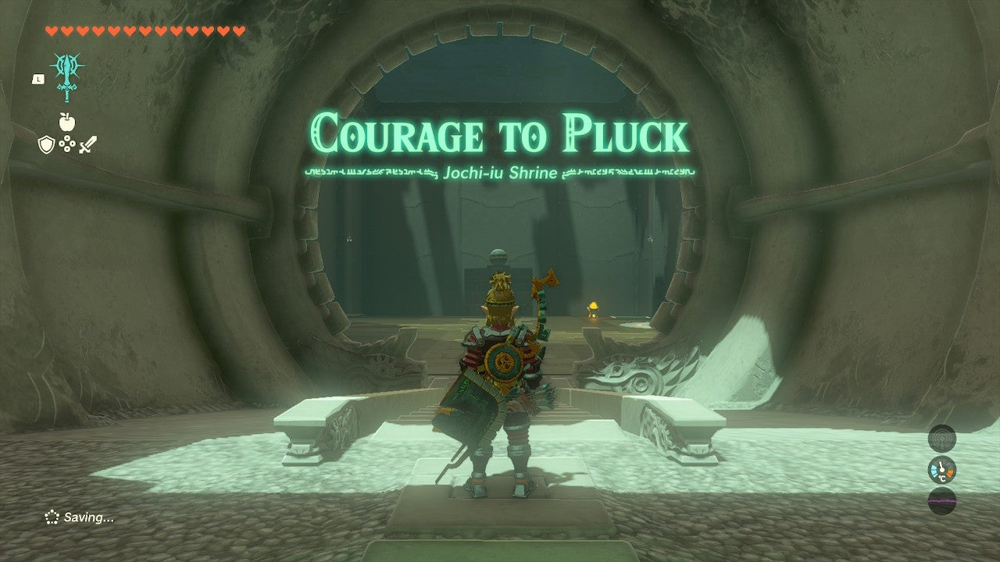

Jochi-iu Shrine (Courage to Pluck) in The Legend of Zelda: Tears of the Kingdom is a shrine located in the Akkala Region and is one of 152 shrines in TOTK (see all shrine locations). This page contains a guide for how to locate and enter the shrine, a walkthrough for the shrine itself, and puzzle solutions as well as treasure chest locations for the TotK Jochi-iu shrine. 

## Jochi-iu Shrine Treasure and Rewards

  * Large Zonaite
  * Zonaite Bow

## Jochi-iu Shrine Location/How to Reach

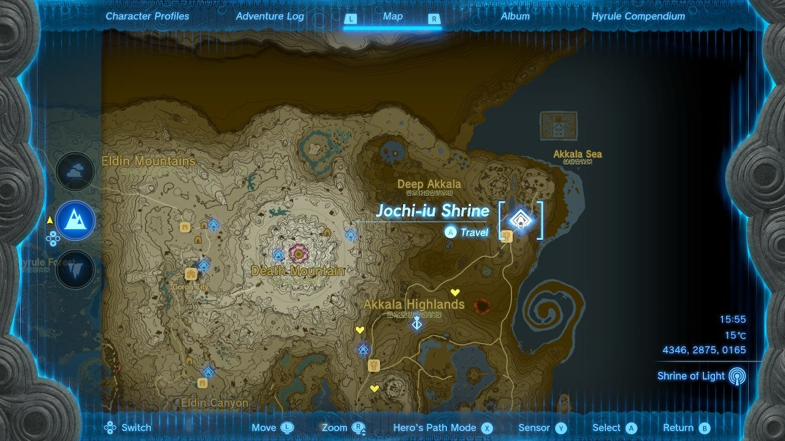

Jochi-iu Shrine is in plain sight on the furthest northeast corner of Hyrule and Akkala. It serves as the fast travel point for East Akkala Stable

  * Coordinates: 4346, 2875, 0165

## Jochi-iu Shrine Walkthrough and Puzzle Solutions

Jochi-iu Shrine is a massive Jenga game, but before you get too excited the real goal here is not to topple the tower or climb it: You just need to get the green platform powered so it takes you to the sphere for easy moving to the target, a depression circled in orange by the exit door. If you touch the stack it will dump you and all the blocks into the abyss, so stay away! 

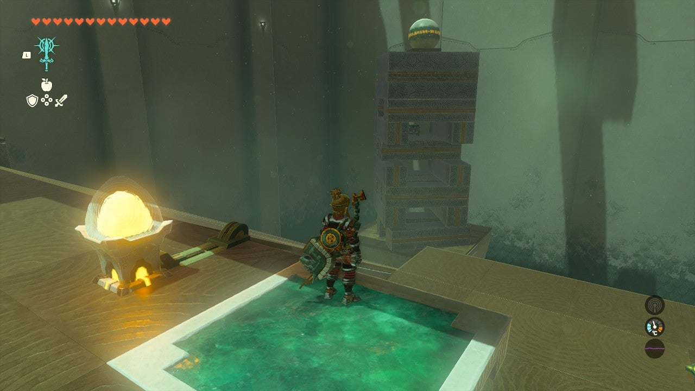

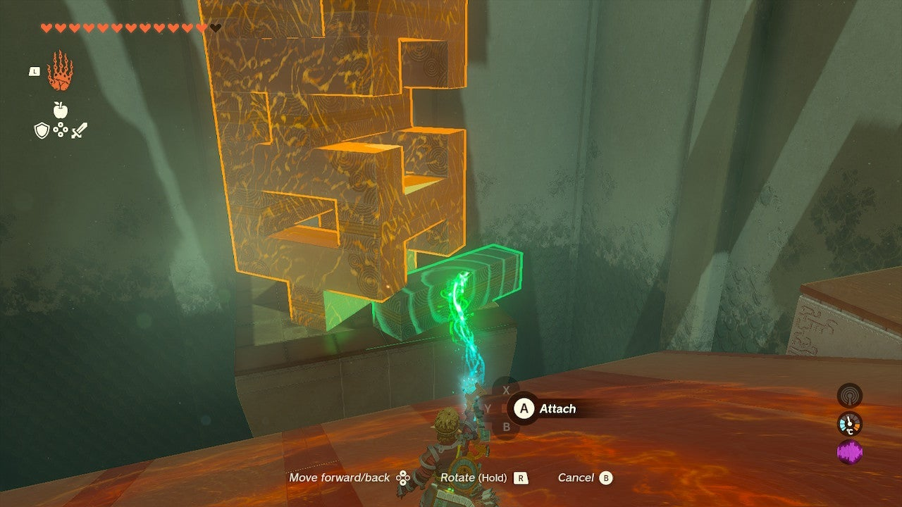

There are several blocks you can safely remove from the edge of the ramp: From the bottom, a few rows up – pull the center beams if there are two holding the stack on either side, or the side beams if there is a center beam. Do not pull the beam holding the treasure chest in the stack! We will get to that… 

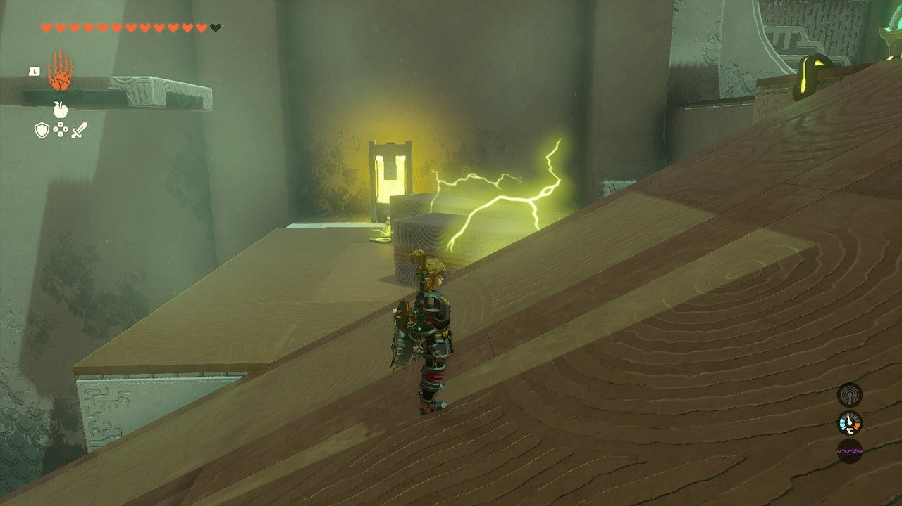

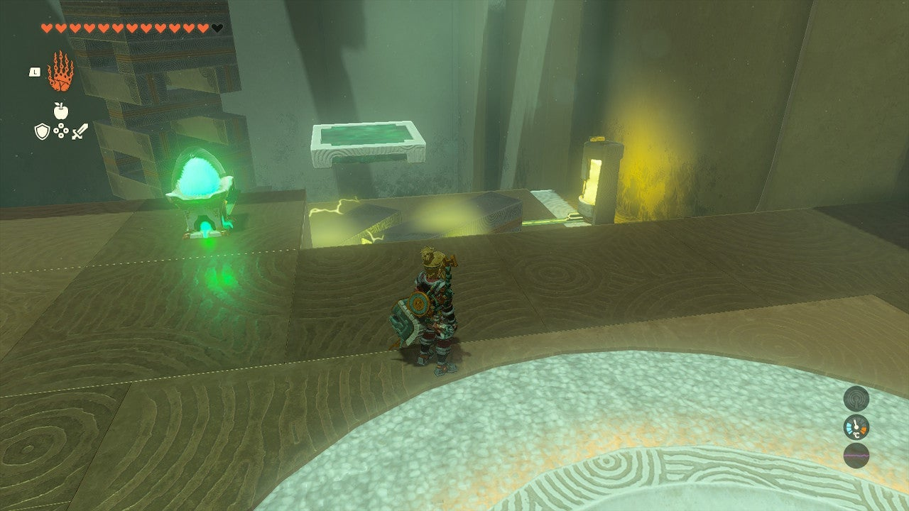

You can’t nudge or knock this over very easily so just use Ultrahand and stack your beams to the right by the power supply. With two you can lay them on the yellow power supply pad, and stretch the electric current to the elevator charge pad. 

This will start the platform moving. Hop on it and grab the sphere with Ultrahand when you get near and ride the platform back to safe ground. Put the sphere in the target. 

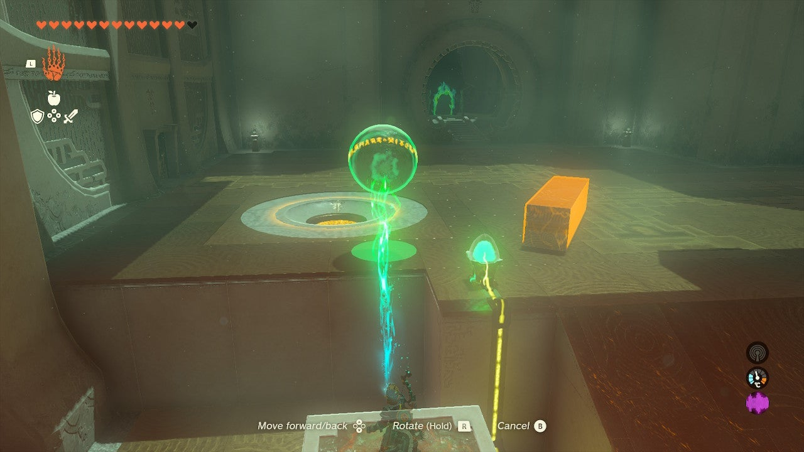

## Treasure Location

Also in the stack is a chest. You can stand right at the corner of the platform nearest the stack and activate Ultrahand. Wait for the split second you cn get the chest in your crosshairs and activate it to snatch it out from the stack. Dump it safely on land. Inside is a **Large Zonaite**. 

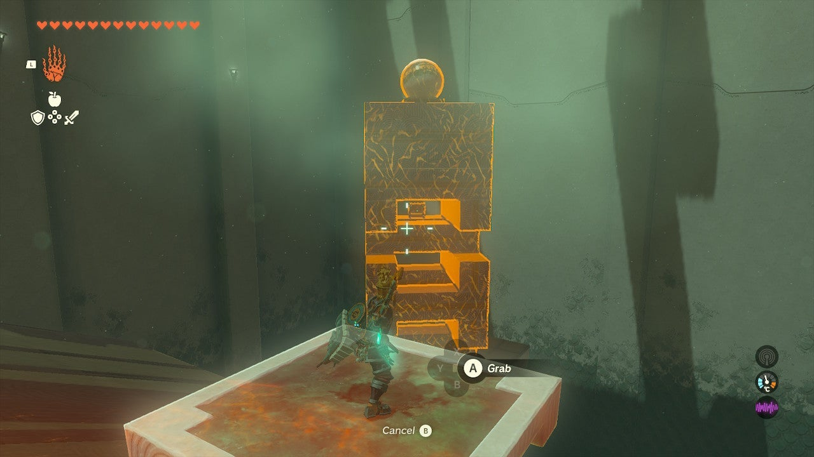

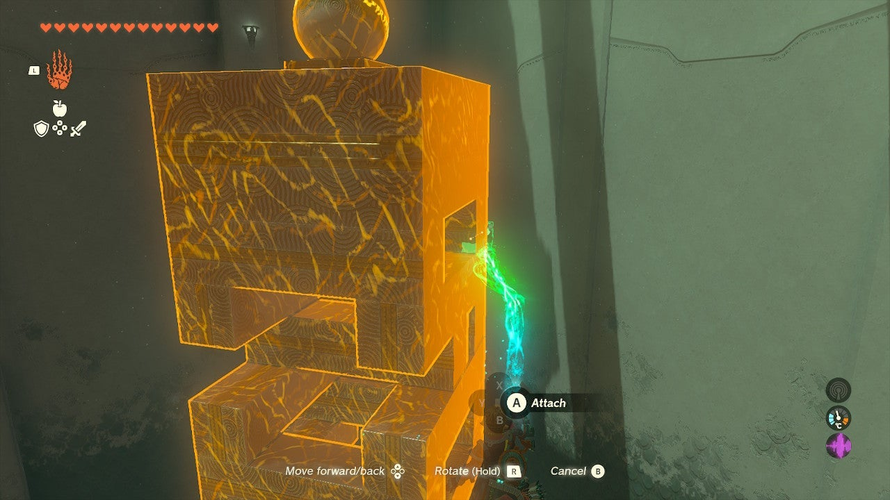

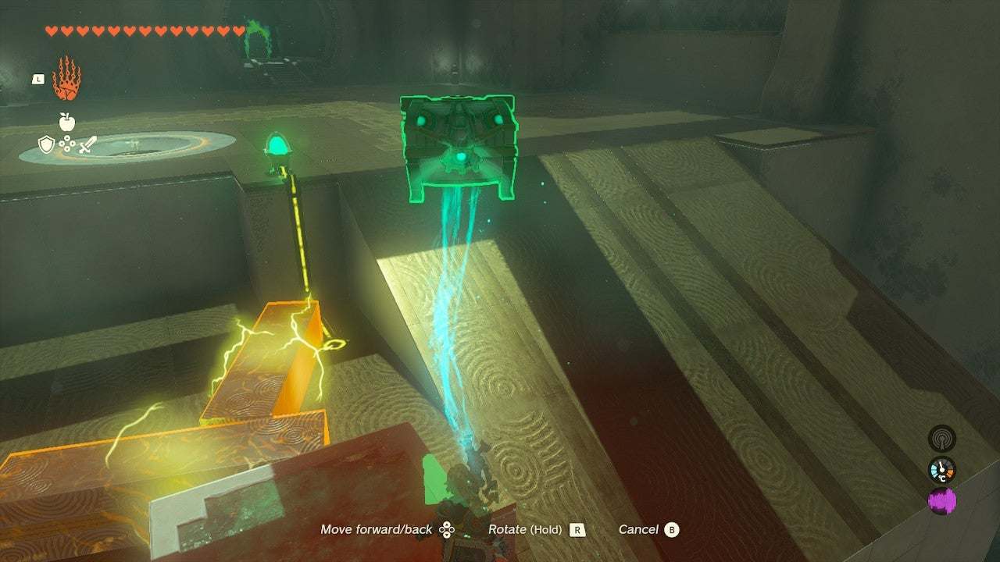

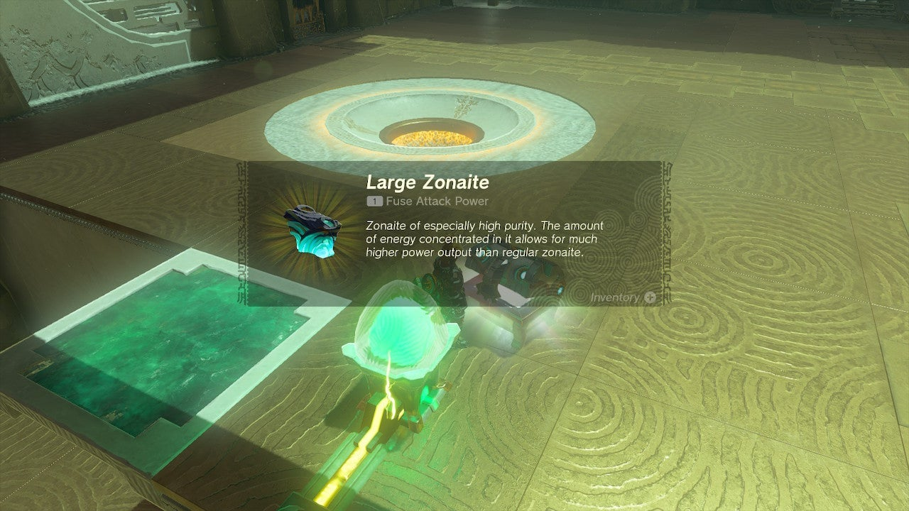

Don’t leave yet! More treasure! 

## Treasure Location

There is a rare second chest in Jochi-iu Shrine. On a ledge opposite the exit is a chest. To reach it, you’ll need to two beams. Put one on the ground and attach another to it as a 45 degree angled-ramp. Place this near the ledge and you can run up the beam to the chest with a Zonaite Bow inside. 

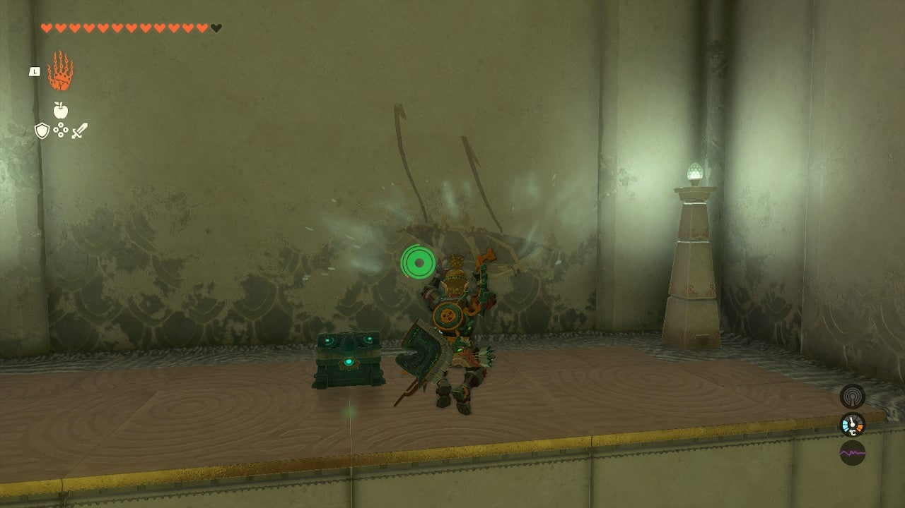

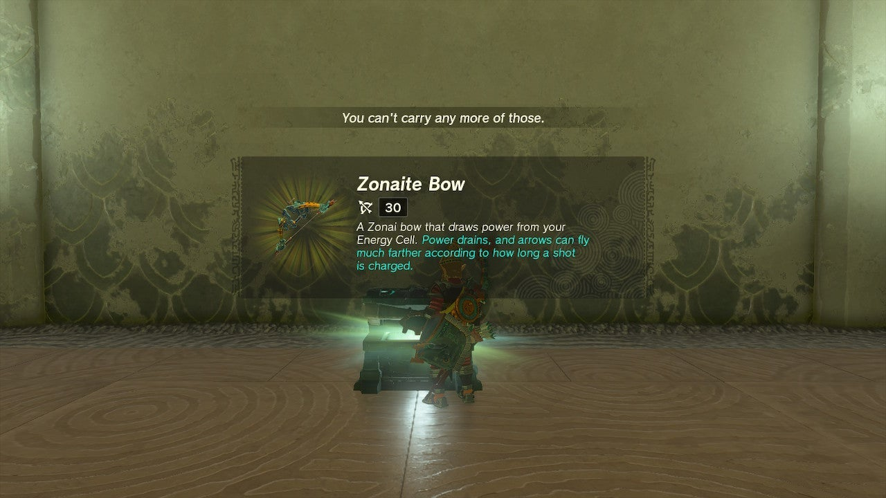

Jochi-iu Shrine

Congrats on solving the shrine and earning a Light of Blessing! Click or tap here to return to the rest of the Shrine Guides. You can also check out which shrines are nearby with our shrine map filter on our complete map of Hyrule.

### Up Next: Walkthrough

Previous

About IGN's Zelda TotK Guide Writers

Next

Walkthrough

### Top Guide Sections

  * Walkthrough
  * Zelda: Tears of The Kingdom Switch 2 Edition Guide
  * Zelda Notes Voice Memories
  * List of Side Quests and Side Adventures

### Was this guide helpful?

Leave feedback

Go to comments