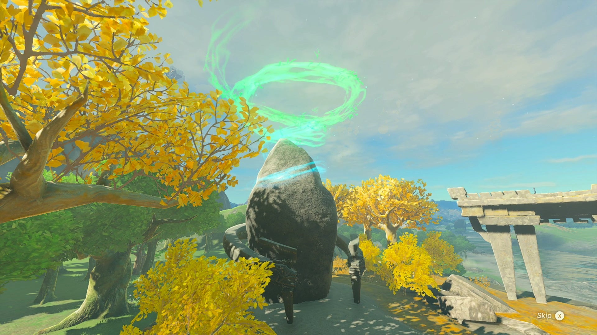
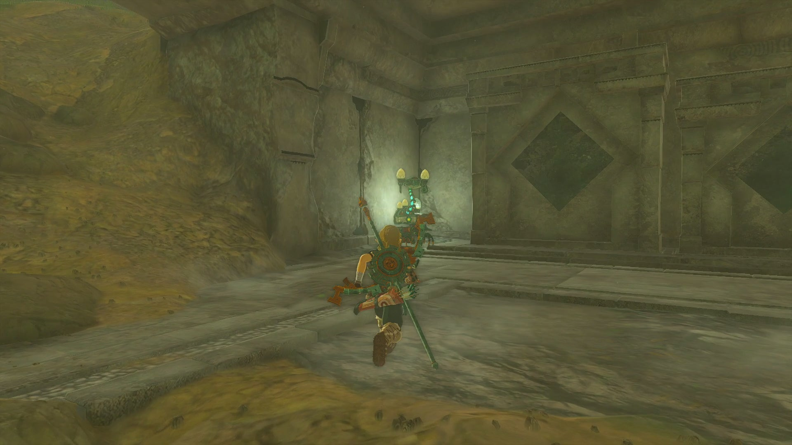
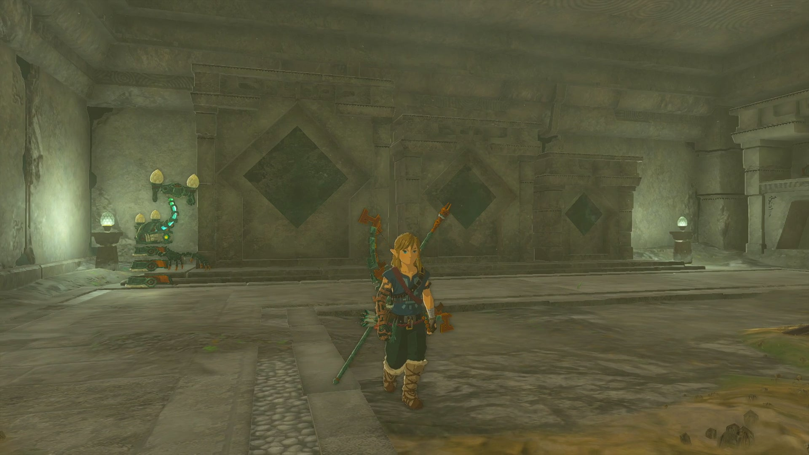
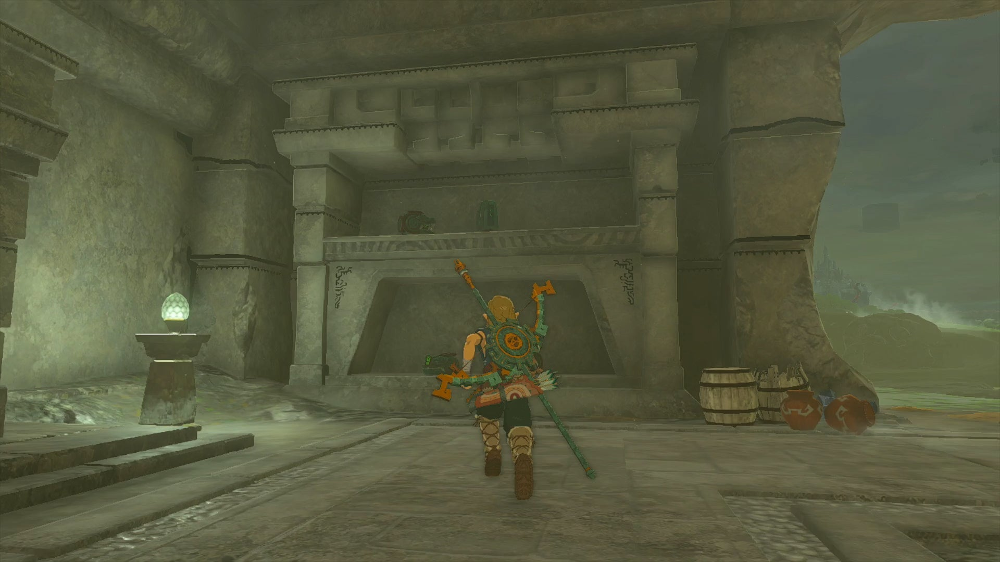
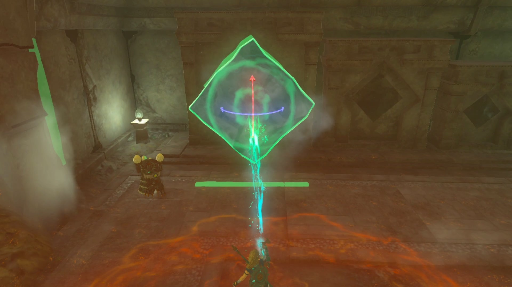
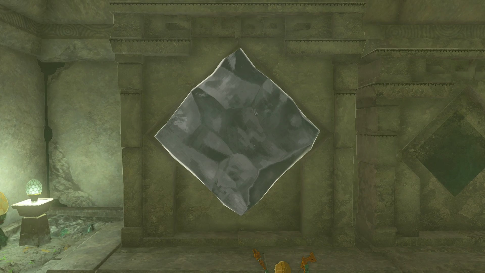
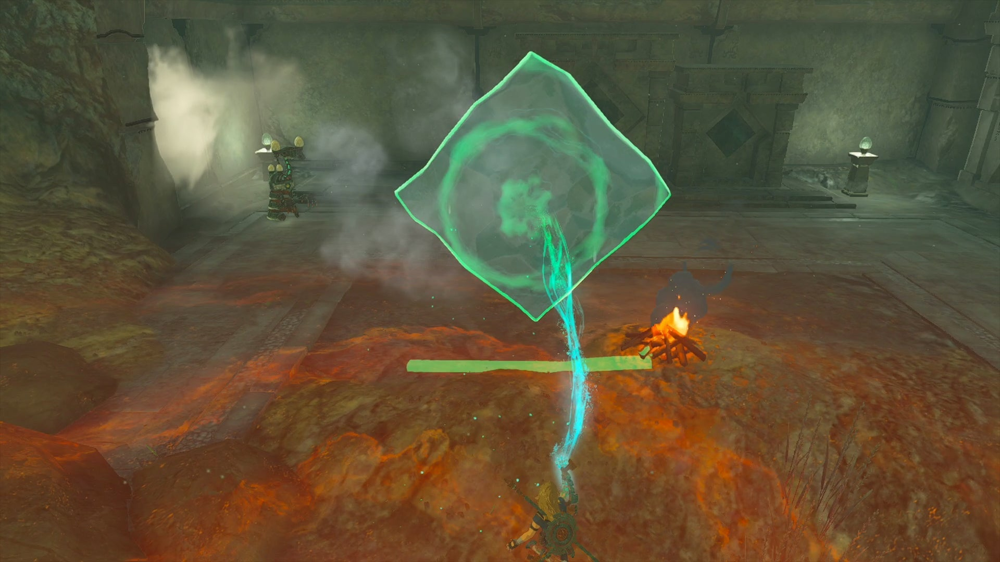

Jochisiu Shrine (Rauru’s Blessing) in Zelda: Tears of the Kingdom is a shrine located in the **West Necluda** region. You must complete the Keys Born of Water Shrine Quest in order to access the shrine. This page contains a guide for the shrine quest along with additional details about the TotK Jochisiu Shrine. 

### Treasure and Rewards

  * Big Battery

## Location/How to Reach

Jochisiu Shrine is located in the West Necluda region just south of the Squabble River. In order to uncover the shrine, you must complete the "Keys Born of Water" Shrine Quest by slotting blocks of ice into three uniquely shaped pedestals. 

  * Coordinates: 0933, -1903, 0030

## Keys Born of Water Walkthrough

The Jochisiu Shrine is hidden just across from the Squabble River. You’ll find a stone building with a Steward Construct standing within. 

The Steward Construct will introduce the “Keys Born of Water” Shrine Quest and present the following hint; “Give keys born of water to the three altars. The sacred shrine will appear.” 

You’ll notice three diamond-shaped slots to the right of the Steward Construct. These are the openings that need to be filled in order to uncover the shrine. 

On the top shelf of this room, grab the Zonai Frost Emitter and bring it to the edge of the river. 

Activate it to freeze a block of water, and use your Ultrahand ability to position it into the largest of three slots. 

Then activate the campfire in this room for the other two blocks of ice. 

Repeat the steps involved to create the first block of ice, but instead holding it over the campfire to shrink its size slightly. 

Insert the smaller block into the second altar. 

And for the third and final water key, repeat these steps but make the block of ice even smaller. 

Once all three water keys have been placed, the Jochisiu Shrine will reveal itself. 

Keys Born of Water

Make your way inside to receive a Big Battery and a Light of Blessing. 

Jochisiu Shrine

Congrats on solving the shrine and earning a Light of Blessing! Click or tap here to return to the rest of the Shrine Guides. You can also check out which shrines are nearby with our shrine map filter on our complete map of Hyrule.

### Up Next: Walkthrough

Previous

About IGN's Zelda TotK Guide Writers

Next

Walkthrough

### Top Guide Sections

  * Walkthrough
  * Zelda: Tears of The Kingdom Switch 2 Edition Guide
  * Zelda Notes Voice Memories
  * List of Side Quests and Side Adventures

### Was this guide helpful?

Leave feedback

Go to comments