Jogou Shrine (Rauru's Blessing) in The Legend of Zelda: Tears of the Kingdom is a shrine located in the Lanayru area. 

Like many, this shrine is hidden underground, specifically beneath the **Lanayru Road East.** This page contains a guide for how to locate and enter the shrine, a walkthrough for the shrine itself, and puzzle solutions as well as treasure chest locations for the TotK Jogou shrine. 

### Treasure and Rewards

  * Bubbul Gem
  * Hearty Elixir

## Location/How to Reach

Somewhere below is Lanayru Road East's shrine. The shrine finder will beep all the way in Naydra Snowfield too. This shrine is underground and can only be accessed through the Lanayru Road East Cave, which has two entrances. 

### Option 1

The first and easiest is in the **waterway below the Lanayru Road - East Gate**. Glide down and you'll see a large opening marked by a luminous ore deposit. This path does have more immediate opposition than the other entrance. 

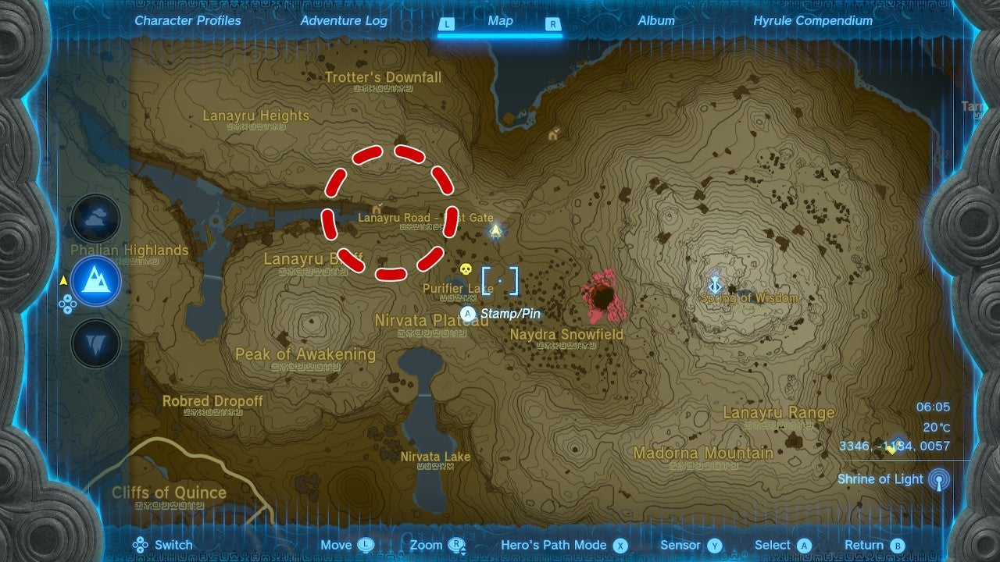

There's an Octorok in the water, and just beyond are Horriblin with a Rock Like. After shooting the Octorok, try to either block the line of sight of the Rock Like or destoy it first. Use an explosive to destroy its rock shell then we'd recommend freezing it. That'll leave it open for damage! 

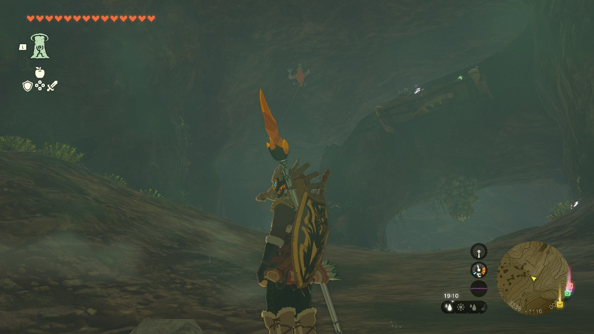

When you've cleared all the enemies in this side of the cave, you can proceed forward to an even larger cavern. A**Boss Bokoblin patrols** the area followed by a line of five smaller Bokoblin trailing behind it. You'll find the shrine in the middle of the path the circle. 

### Option 2

The other entrance is northeast to the road. Climb the hill that acts as a barrier between the road and the water to the north and descend down to the sky lone, large structure. 

Look east, and you'll see a Blupee standing before the entrance of a massive cave. That's Lanayru Road East Cave. Glide down and enter. Inside you're greeted by an Octorok which can be quickly destroyed with an arrow to its puffy body. 

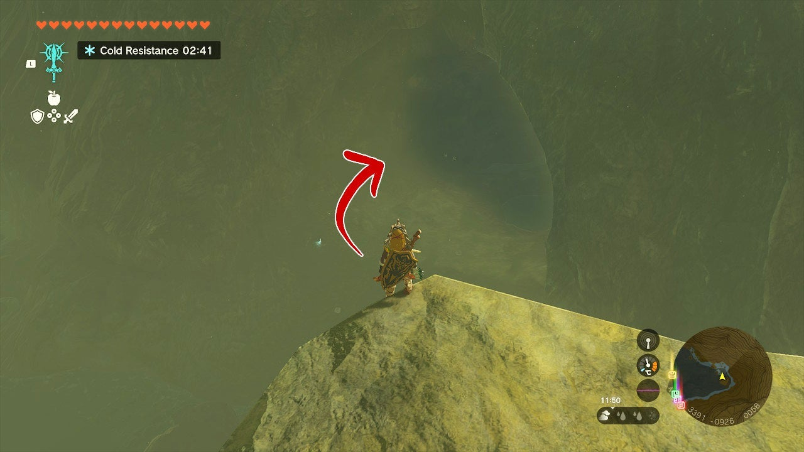

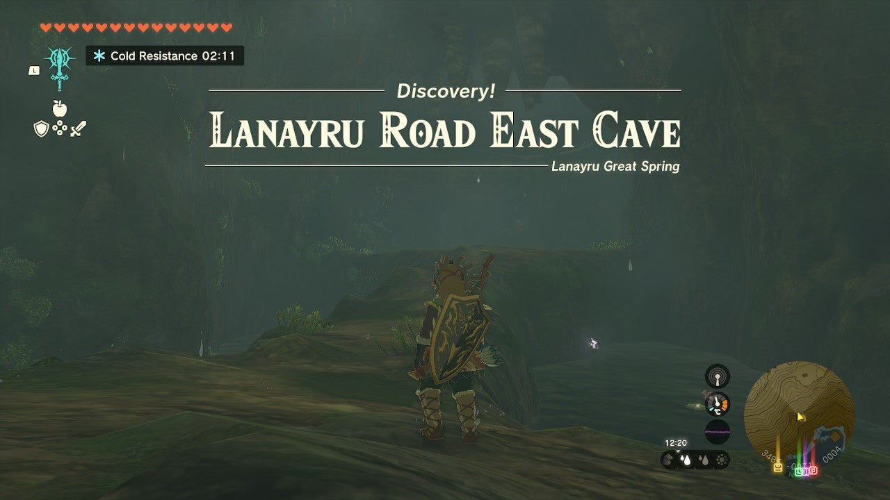

Cross the natural path until you hit a wall. Slay the two Chuchus that pop up, then use Ascend to get up to the next area. You can also climb the wall, but only if you have a way to stick to it as the wall is slick. 

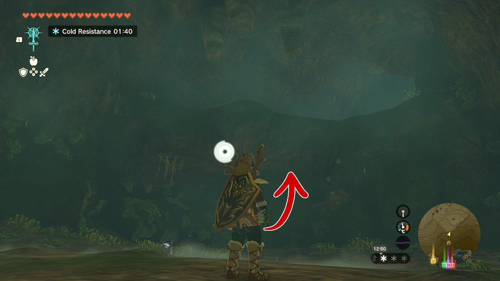

Above is a hill with several large boulders. Up and to the right is a Rock Like that's intent on knocking you down! Use a bomb arrow to destroy its rock shell. Carefully make your way up to it and slay it. You can also dodge it, but the you'd miss out on the rare ore deposit right next to it! 

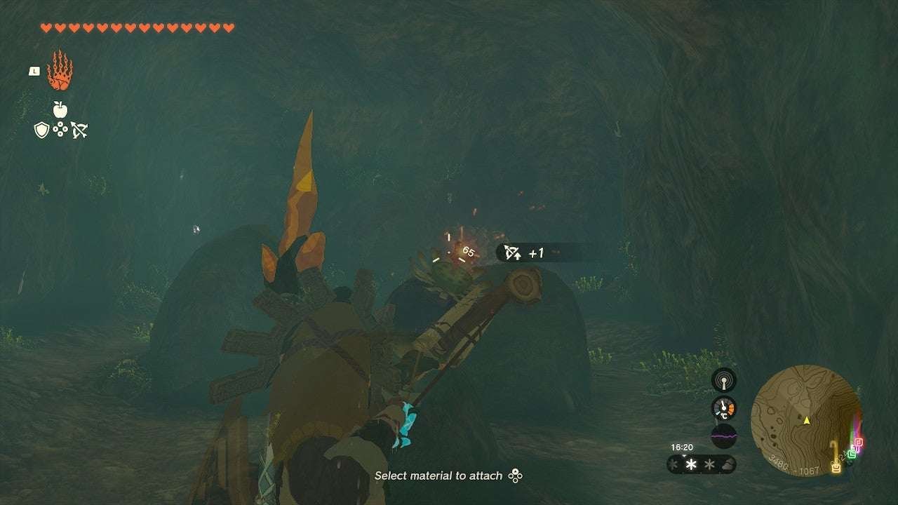

You're not out of the woods (or to the shrine) yet. The next cavern is massive and has a Boss Bokoblin followed by a line of five smaller Bokoblin trailing behind it. The shrine is in the middle of the path the circle. 

### Getting to the Shrine

It's in your best interest to slay the Bokoblin procession. We'd recommend using things like Yellow Chuchu Jelly and Shock Fruit on an arrow to get the group to drop their weapons. A Muddle Bud is a great tool here too if you have one. Remember that since the cave is damp, fire won't be as effective. If you manage to land a good bomb, you can also knock some a the small Bokoblin into the water which will kill them instantly. 

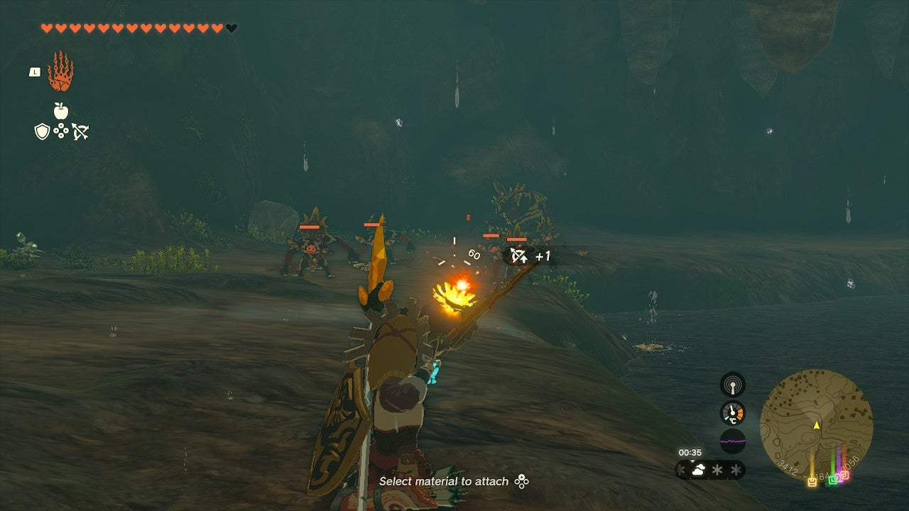

Be careful of the water. Some Octorok are in there. 

Once the room is clear you can enter a cave off the path on the east side to slay the **Bubbulfrog** and collect its Bubbul Gem. 

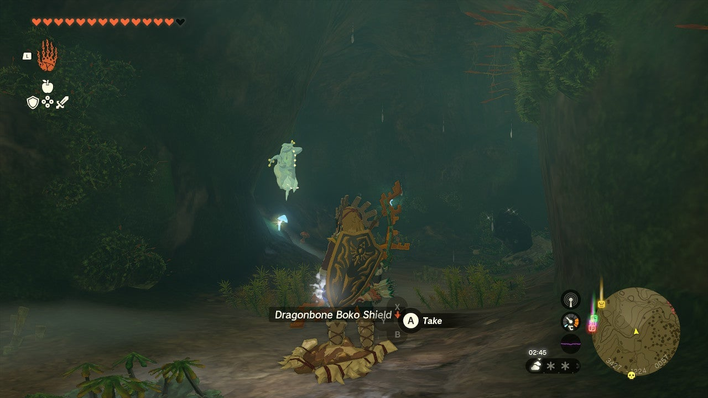

On the south side of the cave where the Bokoblin mostly paced,**you'll find a rare ore deposit** , and most importantly, and **explodable path on the back of the shrine island.**

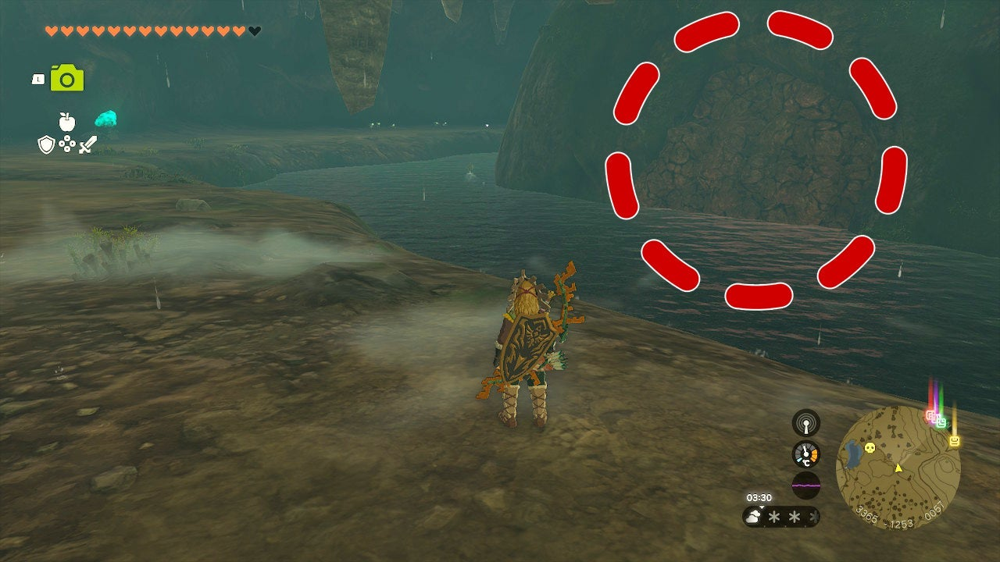

Destroying the rocks there will allow you to swim up to the shrine. If you're out of bomb flowers and the one near the rare ore deposit doesn't cut it, you can use the Traveler's Spear and Soldiers spear to craft a Rock Sledge.**You can throw the Rock Sledge at the wall to destroy it!** This is also a nice way to save your bombs for later. 

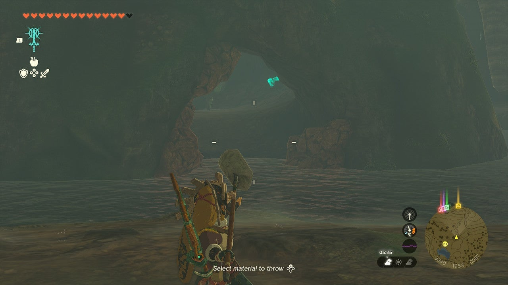

With the back of the island open you can swim up to the shrine. 

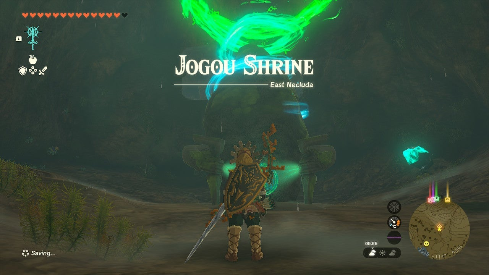

  * Coordinates: 3346, -1184, 0057

## Inside Jogou Shrine

This shrine's challenge was finding and getting to it! You're welcomed by Rauru's Blessing. Collect the treasure from the treasure chest (Hearty Elixir) and exit with your new Light of Blessing. 

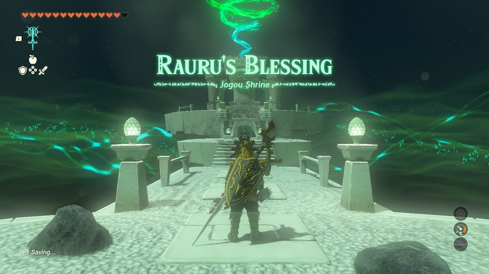

Jogou Shrine

Congrats on solving the shrine and earning a Light of Blessing! Click or tap here to return to the rest of the Shrine Guides. You can also check out which shrines are nearby with our shrine map filter on our complete map of Hyrule.

### Up Next: Walkthrough

Previous

About IGN's Zelda TotK Guide Writers

Next

Walkthrough

### Top Guide Sections

  * Walkthrough
  * Zelda: Tears of The Kingdom Switch 2 Edition Guide
  * Zelda Notes Voice Memories
  * List of Side Quests and Side Adventures

### Was this guide helpful?

Leave feedback

Go to comments