Jojon Shrine (Proving Grounds: Rotation) in The Legend of Zelda: Tears of the Kingdom is one of many Central Hyrule shrines, specifically in**Hyrule Field's Crenel Peak**. The path to this shrine is hidden in a cave system under the hill. Be sure to take the easy way to the shrine and learn about the challenges awaiting you by using this guide. 

### Treasure and Rewards

  * Magic Rod

## How to Find the Crenel Peak Shrine

  * Coordinates: 1205, 0315, 0028

**There are two entrances to this shrine** , one way easier than the other. For the easy one, **go toward Moor Garrison Ruins**(southeast of Crenel Peak) and just north of it on the slope of Crenel Peak you'll find **an entrance to Crenel Peak Cave**. 

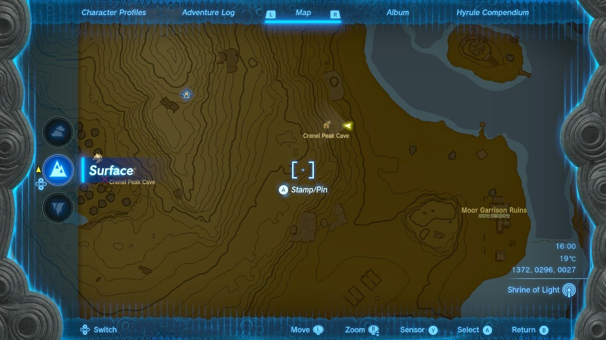

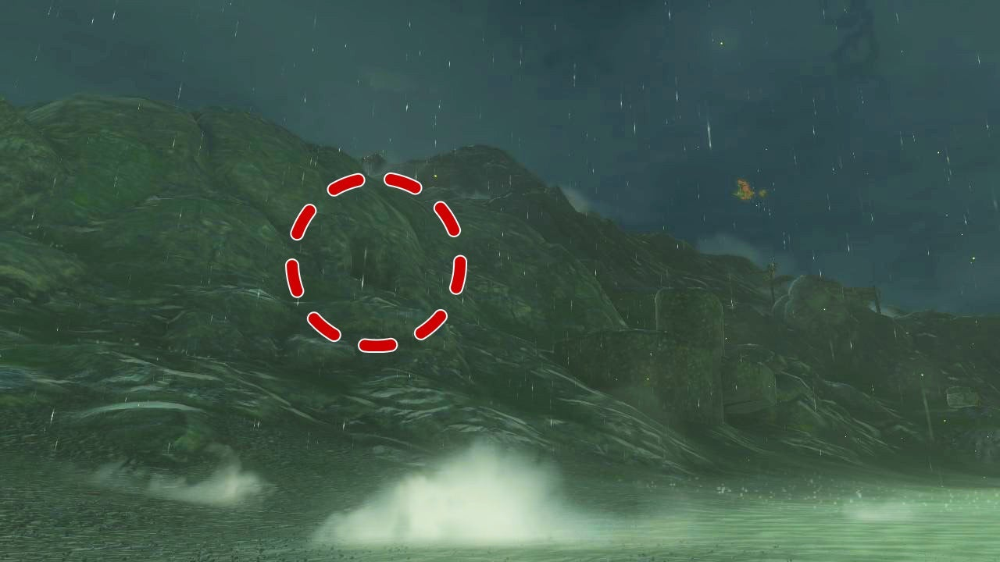

Walk on in, swim past the pod home to a glowing cave fish, then fight the Blue Horriblin. Use arrows to knock it off the ceiling and kill it quickly. With it dead, you can destroy the rock wall on the right for a shorter path to the shrine, or, work through the rock wall on the left to find a Bubbulfrog. If you go straight ahead you'll have to cross some more water. Keep destroying the rock walls straight ahead and you'll make your way to the Jojon Shrine. 

Tip: Don't forget you can use Claymores or other weapons fused with rocks to make rock hammers. Use these to destroy rock walls rather than using your Bomb Flowers.

### Approaching from the west side of Crenel Peak Shrine

Crenel Peak Cave west entrance is more of a combat and resource challenge, but it's easier to find since it's just off the road. 

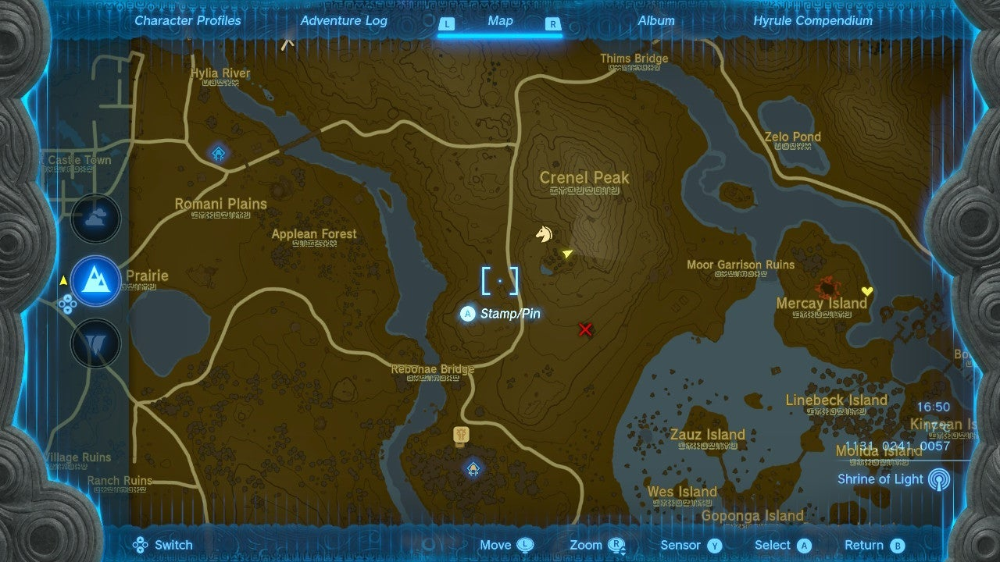

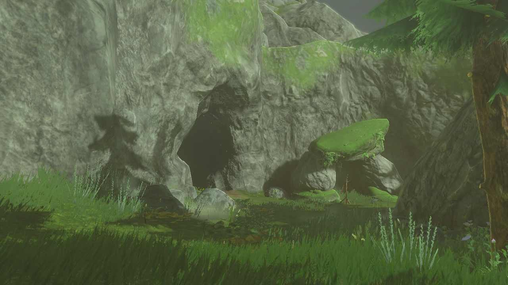

You'll come across this cave entrance in an inlet littered with Armoranth. The cave entrance is hard to miss, as are the enemies just beyond it. You'll see a Bomb Flower at the cave's entrance. 

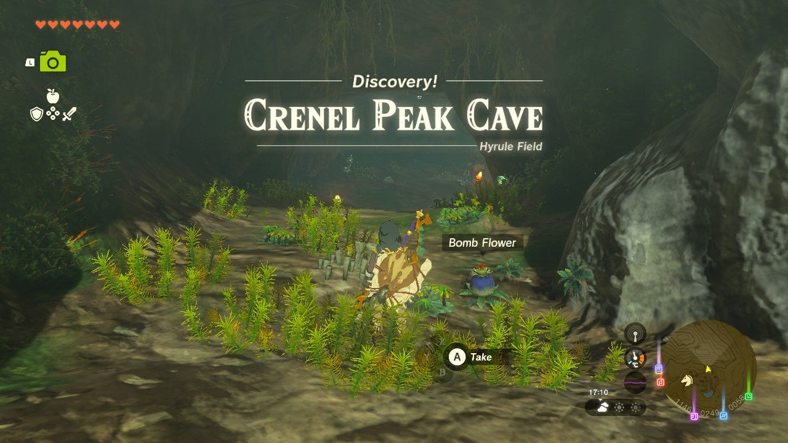

A Blue Boss Bokoblin lounges on the right side of the cave while three standard Blue Bokoblin watch meat roast. If you've got a Muddle Bud on you, you can use that first on the Boss Bokoblin to have it begin the fight by attacking its companions. It won't last too long though. Use the Bomb Flower you found at the entrance of the cave and explode any Bokoblin still standing. If you're not quite ready to rush all the Bokoblin, you can use your arrows combined with whatever you have in your bag to sow chaos. 

With all the Bokoblin down, explore the small cave to collect the items strewn about it. You'll find a standard treasure chest to the right of the fire pit. Open it to find five more Bomb Flower. 

Just beyond the ore deposits and Brightbloom Seeds are hanging vines. To get past them you'll need to cut them down with a blade or set them on fire. 

If you don't have a blade handy, you can use a wooden weapon or one of the wooden weapons dropped by the Bokoblin to create a makeshift torch by swinging it in the fire pit. Then, step right up to the vines. Hitting them doesn't set the vines on fire, rather you just need to let them catch fire by proximity. Step back and you'll see them burning. If you don't, adjust your angle so that the fire is touching the vines. 

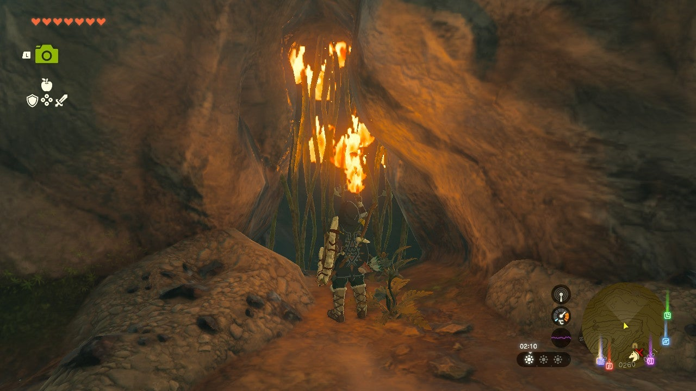

Once the vines are down you can step into the darker cave beyond. Grab a sticky lizard or two if you can catch them. Rather than using your bombs to destroy the rock wall beyond, we recommend using a Rusty Claymore fused with any of the rocks around the cave. The Boss Bokoblin should have dropped a Rusty Claymore already. If you don't see one, destroy the first and second rock walls with bombs and you should see a Rusty Claymore drop. Use the fusion to destroy the four sets of walls, and after the fourth, you'll find two diverging paths. 

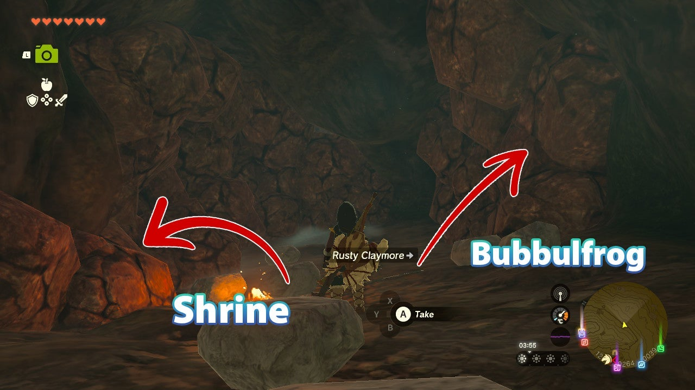

The path on the right is not toward the shrine (you'll hear the beeping stop if you face it) and requires two bombs to get through its next section. However, just beyond you'll find a Bubbulfrog. Take it out to get a special reward and then you can proceed to the next rock wall if you wish to continue this way. 

**More on what lies ahead below:**

There are several layers of rock to work through here. Go ahead and destroy the paths on the left first and the first on the split right to free up a few more rusty claymores for your use. Then, you'll come across tight quarters with Blue Horriblin. Use arrows to knock it down and make attacking it easy. 

The path to the left splits again after the wall is destroyed. The right path that dips into the water is an optional path. It's best to leave that alone rather than wasting bombs on it if you haven't figured out how to destroy it already (it's a cave hall that loops from the path on the right). 

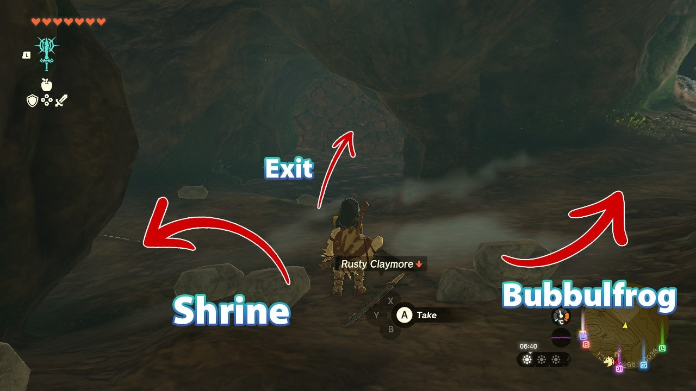

The leftmost path is home to a few more sticky lizards, Giant Brightbloom Seed, Luminous Stone, Brightcap mushrooms, and finally the Crenel Peak Shrine, Jojon Shrine. 

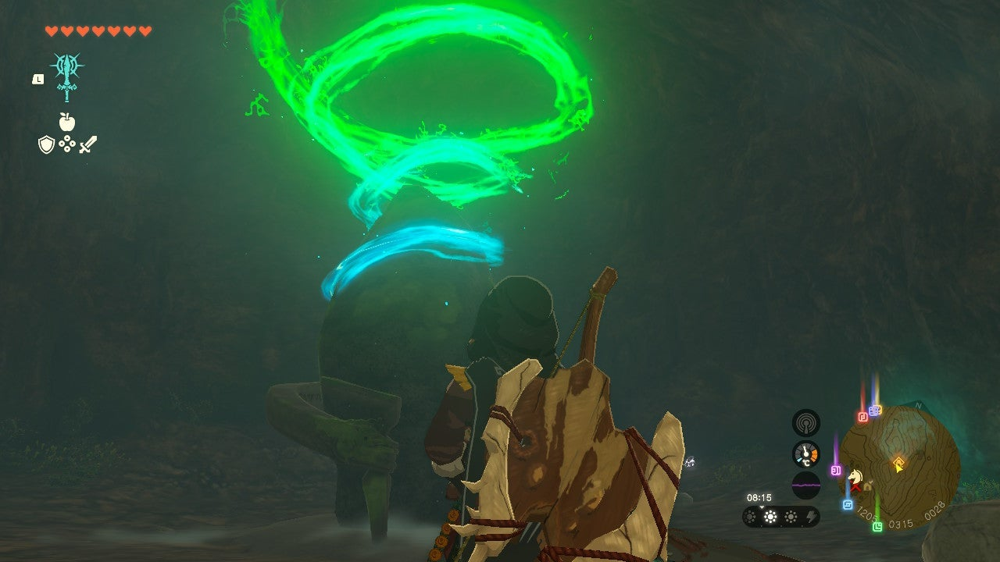

## Jojon Shrine Walkthrough and Puzzle Solutions

Jojon Shrine challenges you to another Proving Grounds challenge, meaning all materials, equipment, and food are gone but will be returned at the end of the challenge, once you destroy all Constructs. 

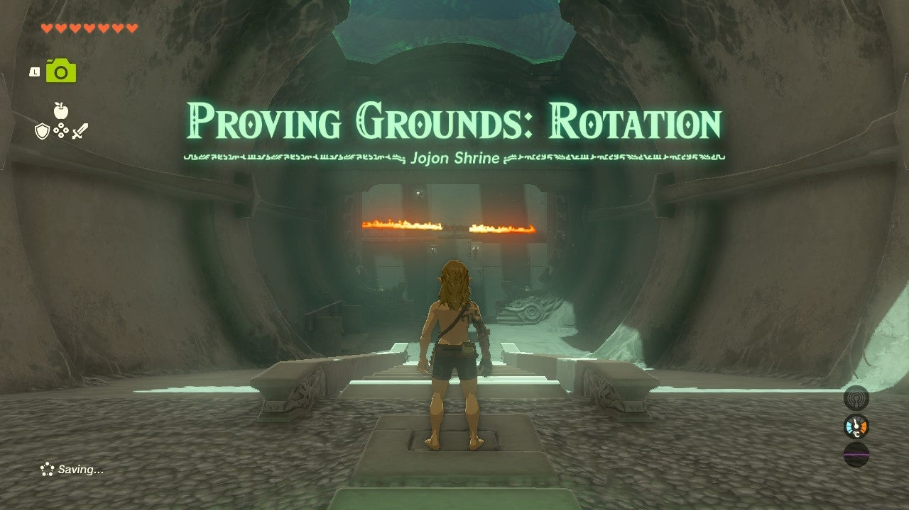

This one is Proving Grounds: Rotation. On the left of the entry path is a miniscule selection of weapons (wooden stick, thick stick, and an old wooden shield) that you'll want to collect to face off against the few constructs roaming the shrine. If you alert them they'll start shooting at you, so be careful. 

**Tip** : Fuse the thick stick and the wooden stick to make a good old Wooden-Stick Stick. It does 9 damage.

Carefully cross to the first turning gear and clear the Zonai Soldier Construct on the left, just to get it out of the way. It has a rusty Halberd that it's more useful than your Wooden-Stick Stick, but it's an option. Step back onto the first gear and cross to the next one where you'll fight another Construct. It may drop its bow, but that's okay. Run across to the right platform and use Ultrahand to toss away the flame emitter tower. 

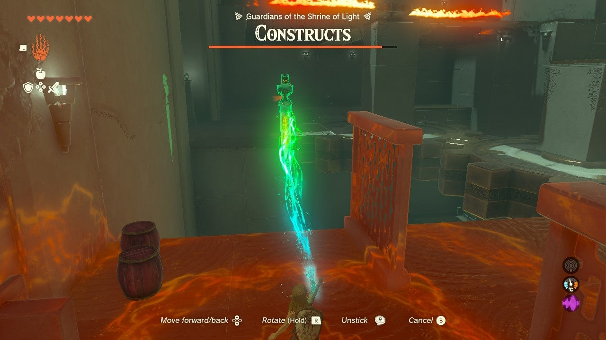

Beyond it walking toward the entrance you'll see an area that's home to two explosive barrels (careful with those) and two Rusty Halberd. Consider fusing the Rusty Halberd with a Rusty Broadsword if you've got one. If you don't yet, you'll want to take on the Construct below. 

Below the turning cogs, you'll find a Construct armed with a Rusty Broadsword and a Zonaite Shield. Again, the Wooden-Stick Stick comes in handy here with its increased attack and weapon typing. Just be careful not to get hit by the second flame emitter structure down here. In another corner (forward left side) you'll find the Construct Bow, arrows, another Rusty Broadsword, and Bomb Flowers. **Use Ascend below the cogs to get back up.** You can also use the Zonai Spring by hitting it. 

To get to the second floor make your way to the right platform with the Halberds and explosive barrels. **Use Recall on the turning cog to turn it into a personal lift.** Be ready to fight as soon as you get to the top, though. 

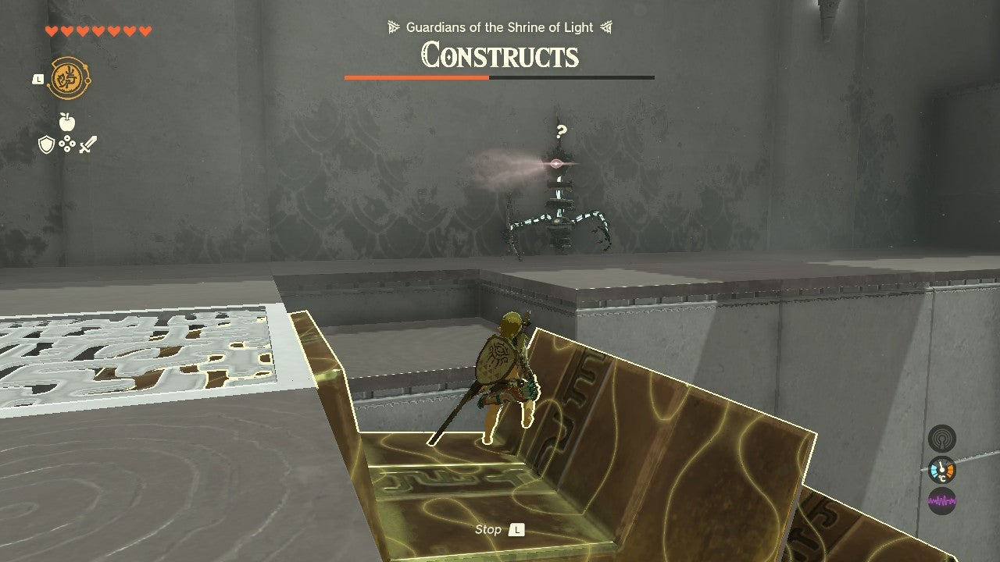

The soldier ahead is armed with fire arrows. After it's dealt with you have some relative safety. Grab the arrows and bow and make sure you have your best bow equipped. Face the right side of the room (you can mostly just ignore the spinning fire in the middle of the room) and you'll see the final Construct. 

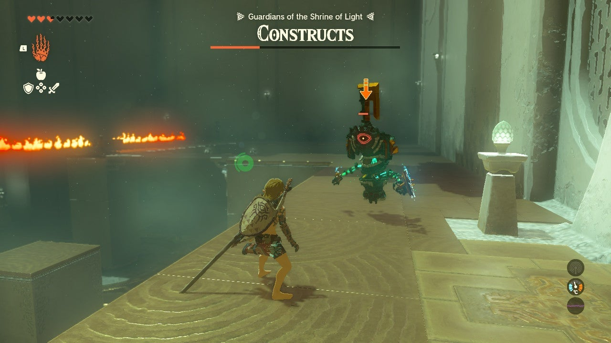

This one is best to start fighting by shooting it with an arrow at a distance. A shot right in the eye will stun it, so try to get those before it pulls up its shield! This Soldier Construct is the kind that twirls aggressively for a few seconds and can do a ton of damage if you're not careful. If you use a heavier weapon you can knock it down to a lower floor, enabling you to pick it off from a distance. Otherwise keep locked on and dodge its attacks. Once this final Construct is eliminated your items are returned and the exit door opens. 

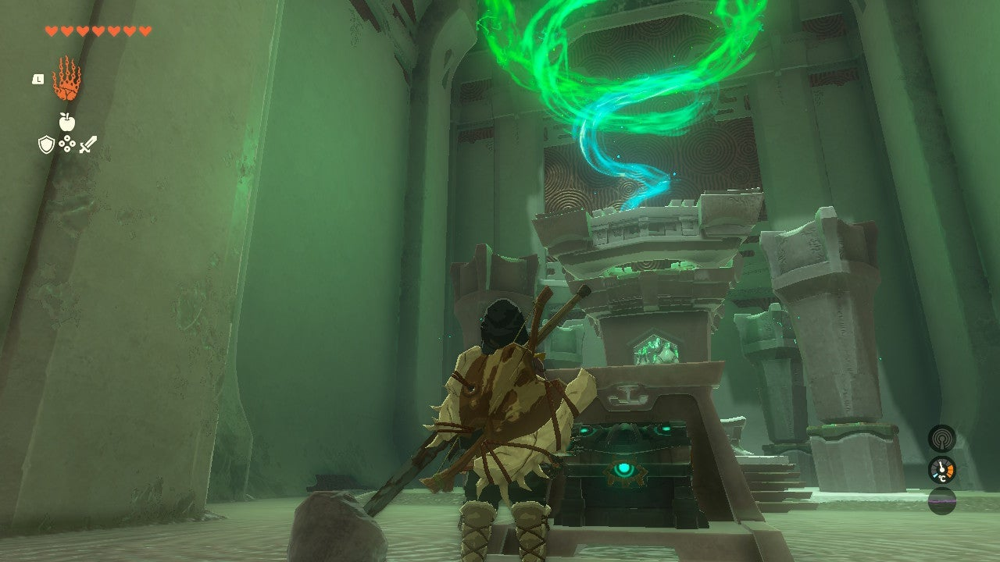

In the room beyond you'll find the shrine's treasure chest with a Magic Rod. Step up the stairs and receive your Light of Blessing as well as a swift boot out of the shrine. 

Jojon Shrine

Click or tap here to return to see the rest of the Shrine Guides.

### Up Next: Walkthrough

Previous

About IGN's Zelda TotK Guide Writers

Next

Walkthrough

### Top Guide Sections

  * Walkthrough
  * Zelda: Tears of The Kingdom Switch 2 Edition Guide
  * Zelda Notes Voice Memories
  * List of Side Quests and Side Adventures

### Was this guide helpful?

Leave feedback

Go to comments