Joju-u-u Shrine (Building Bridges) in The Legend of Zelda: Tears of the Kingdom is a shrine located in the **Necluda** Region. This page contains a guide for how to locate and enter the shrine, a walkthrough for the shrine itself, and puzzle solutions as well as treasure chest locations for the TotK Joju-u-u shrine. 

### Treasure and Rewards

  * Large Zonaite

## Location/How to Reach

Joju-u-u Shrine is southwest of Popla Foothills Skyview Tower in **East Faron** it is near the southern coast of Hyrule and serves as the fast travel point for Lakeside Stable. It is visible from afar and up on a cliff high above the stable. 

  * Coordinates: 1516, -3576, 0142

## Walkthrough and Puzzle Solutions

Run across the first bridge. 

The second bridge is broken in two, and most of it lies in the chasm below. Equip Ultrahand and grab the bridge and bring it to you. Now, select the final link in it and extend the bridge out and connect it to the far side. You must connect that final link or it will not work. 

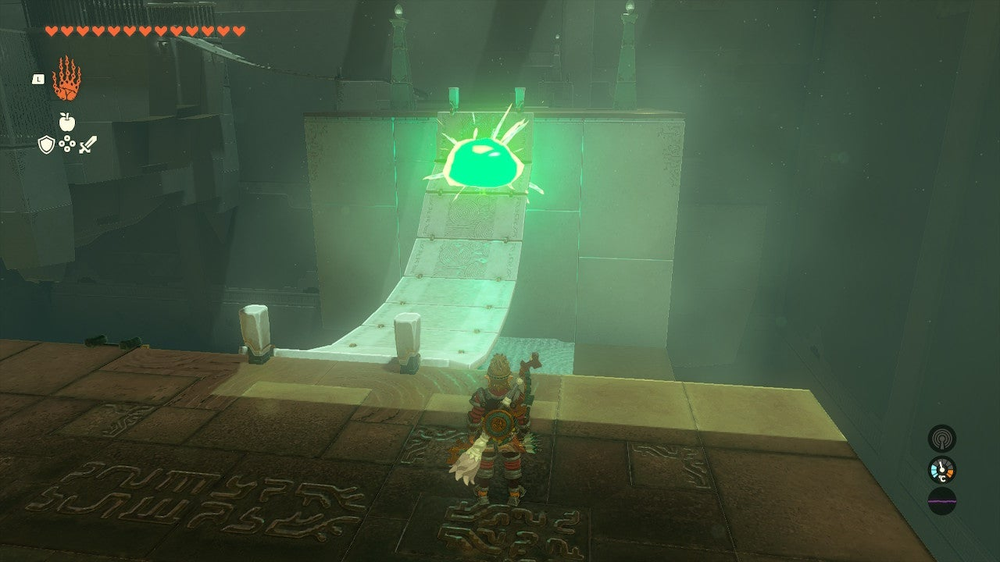

Similarly for the next bridge, hop down and grab the panel/link third from the loose end. Use Ultrahand to paste this horizontally on the pad on the far side. This thick glue and tautness will keep the bridge up. You can cross to the middle and hope to the path to the next puzzle. 

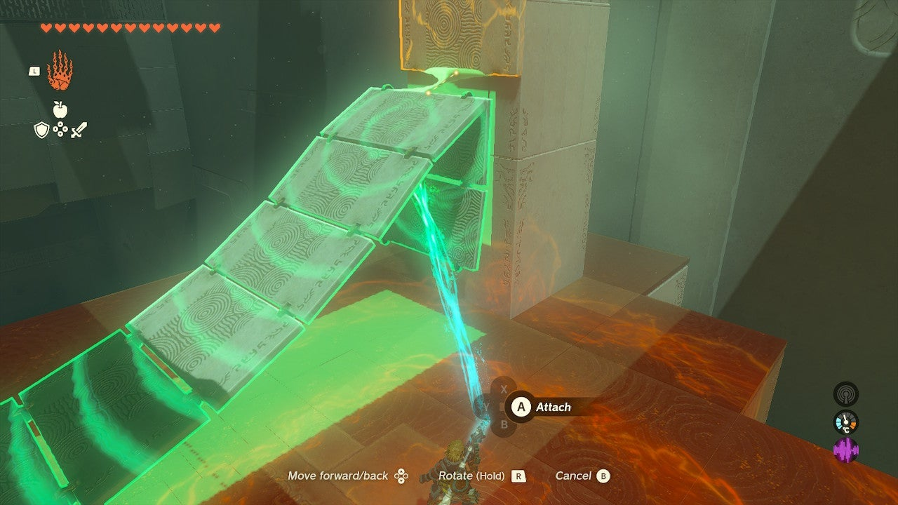

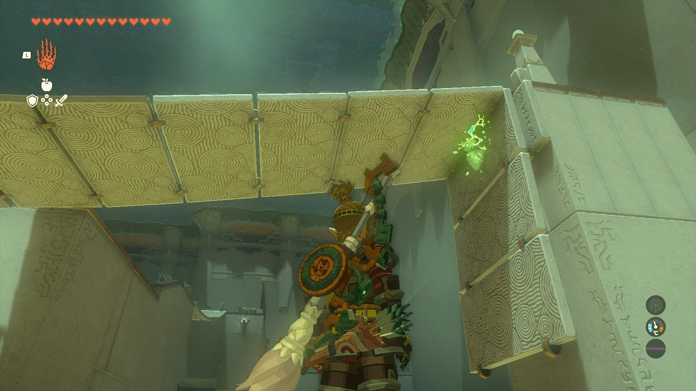

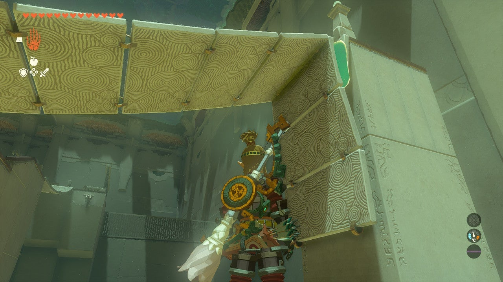

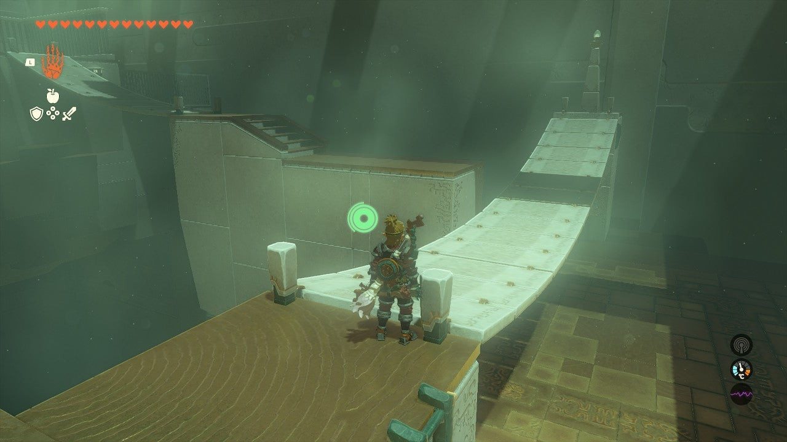

The next area doesn’t have a pad to attach the limp bridge to. Instead, look for a block on the far side of the gap. Attach this as a counterweight to the loose end of the bridge. Lift the weighted end up and over the bar to pull it taught. Use this to get to the exit. But don’t leave yet! 

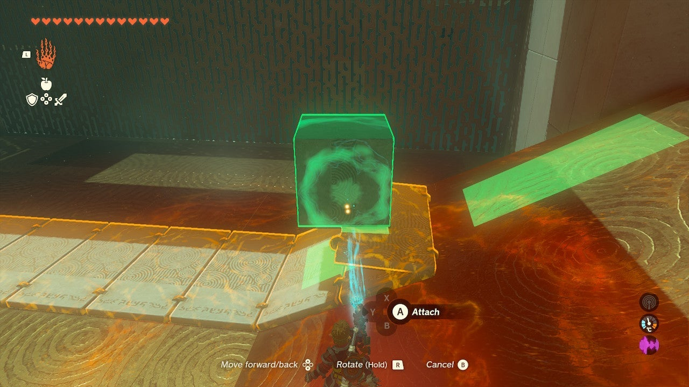

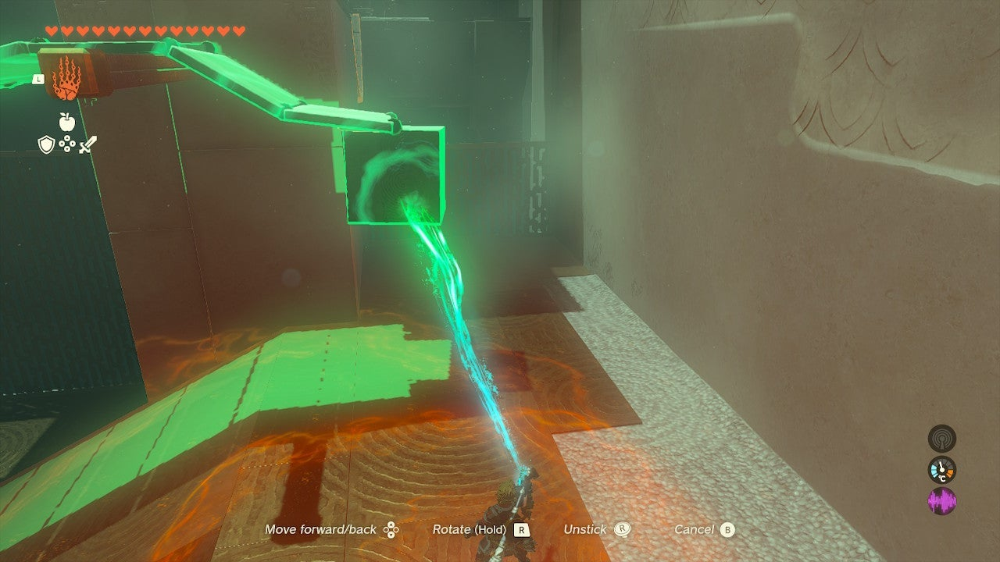

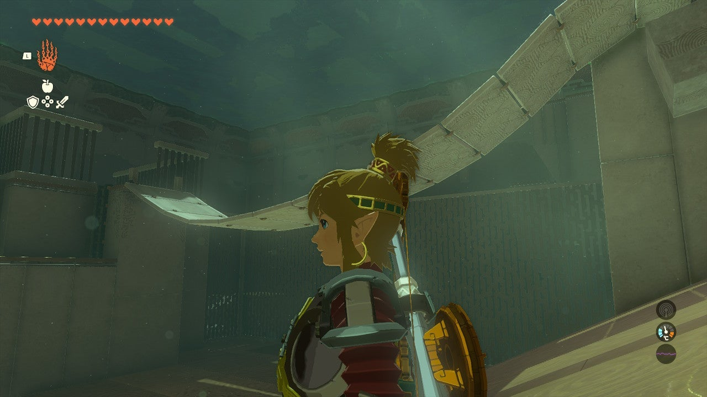

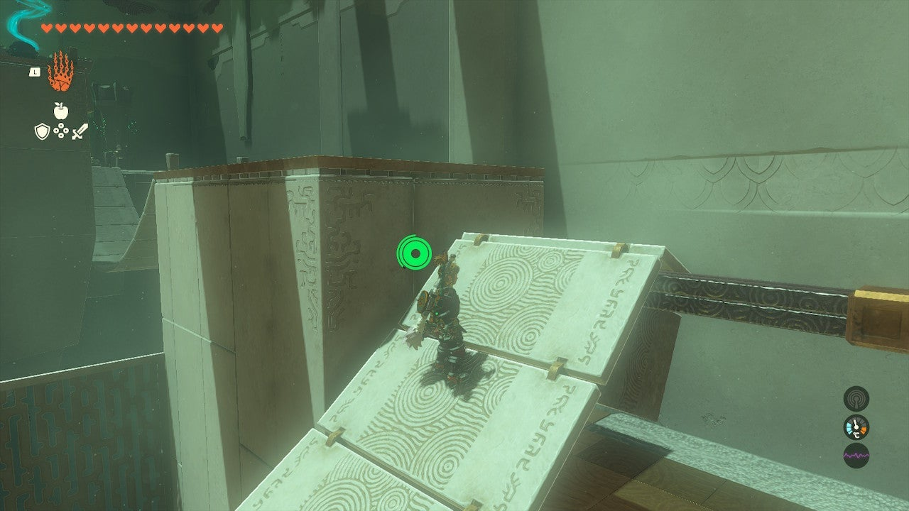

## Treasure Chest Location

On the far side of the final bridge, turn around and look for a chest high on a ledge. You must lift the center of the slack bridge up with Ultrahand and connect it to the hanging pad below the chest. Inside the chest is a Large Zonaite. 

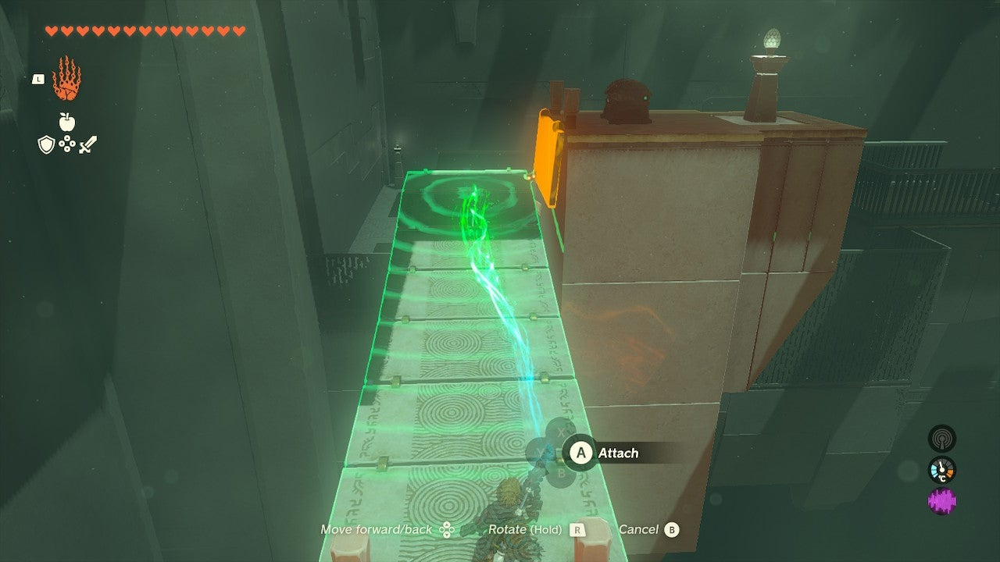

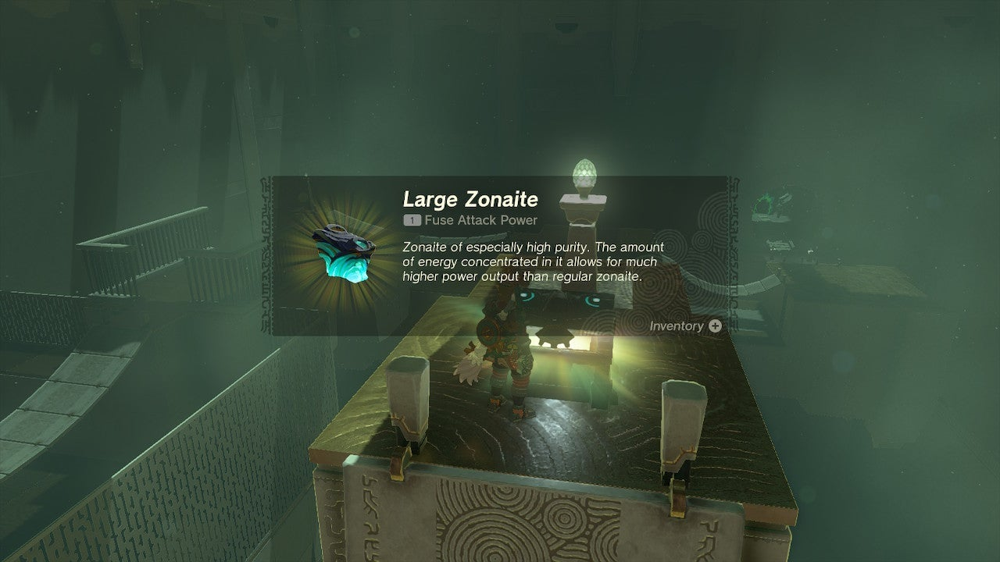

Joju-u-u Shrine

Congrats on solving the shrine and earning a Light of Blessing! Click or tap here to return to the rest of the Shrine Guides.

### Up Next: Walkthrough

Previous

About IGN's Zelda TotK Guide Writers

Next

Walkthrough

### Top Guide Sections

  * Walkthrough
  * Zelda: Tears of The Kingdom Switch 2 Edition Guide
  * Zelda Notes Voice Memories
  * List of Side Quests and Side Adventures

### Was this guide helpful?

Leave feedback

Go to comments