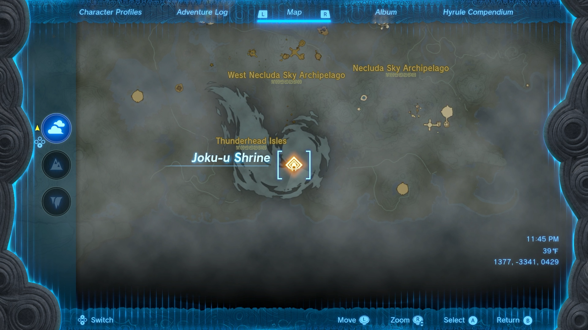
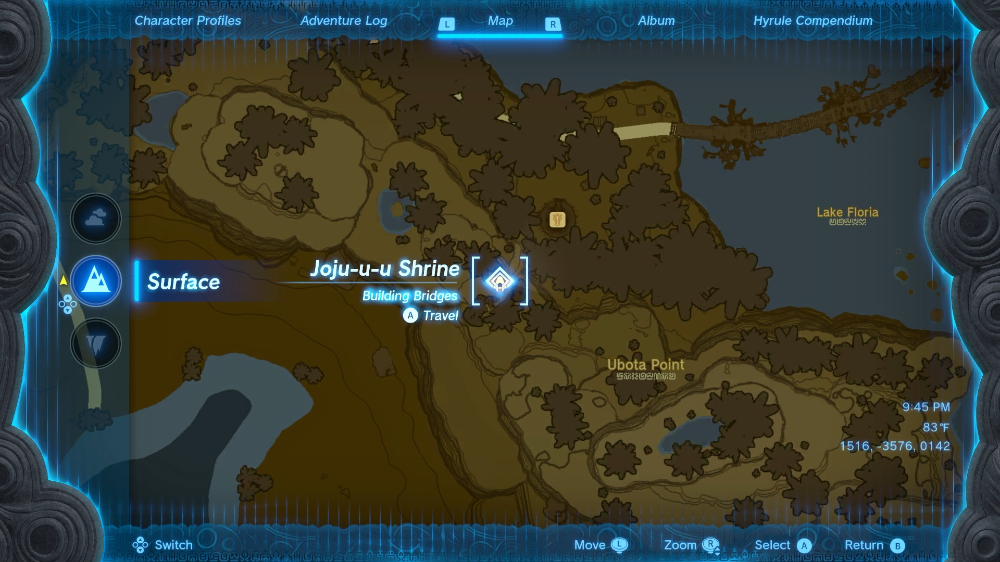
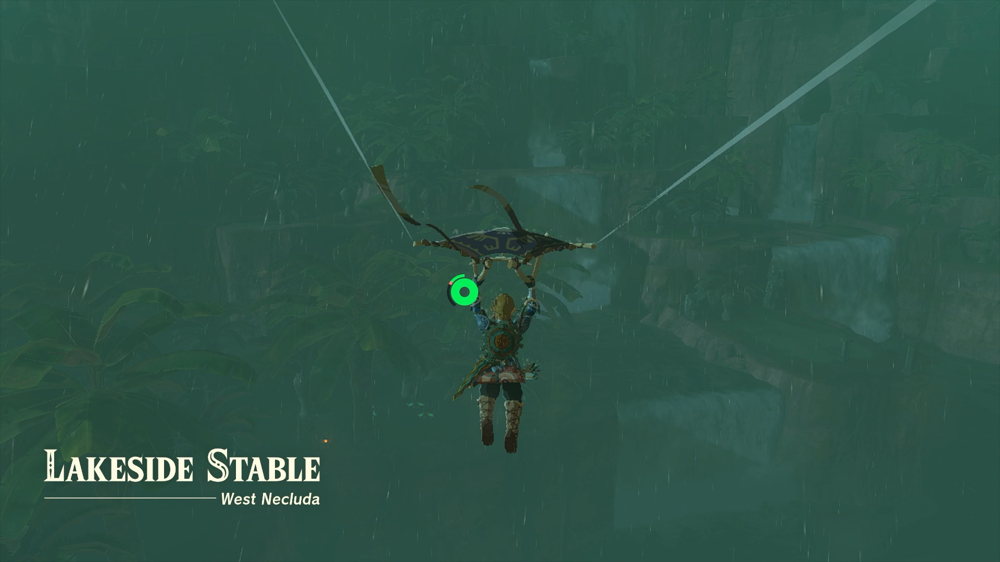
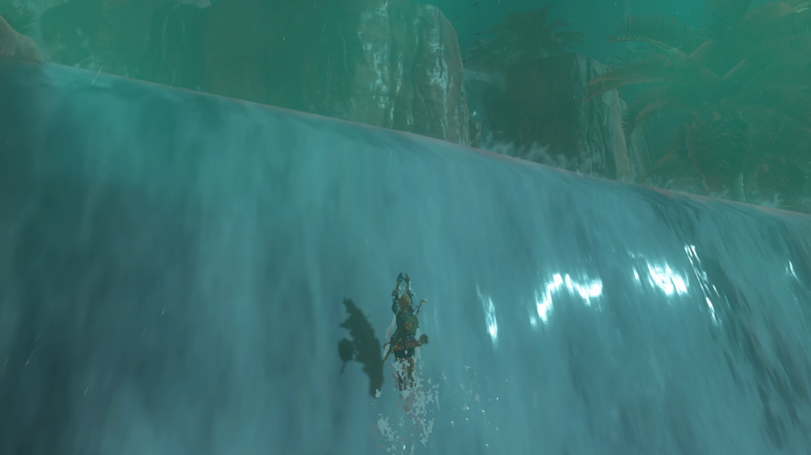
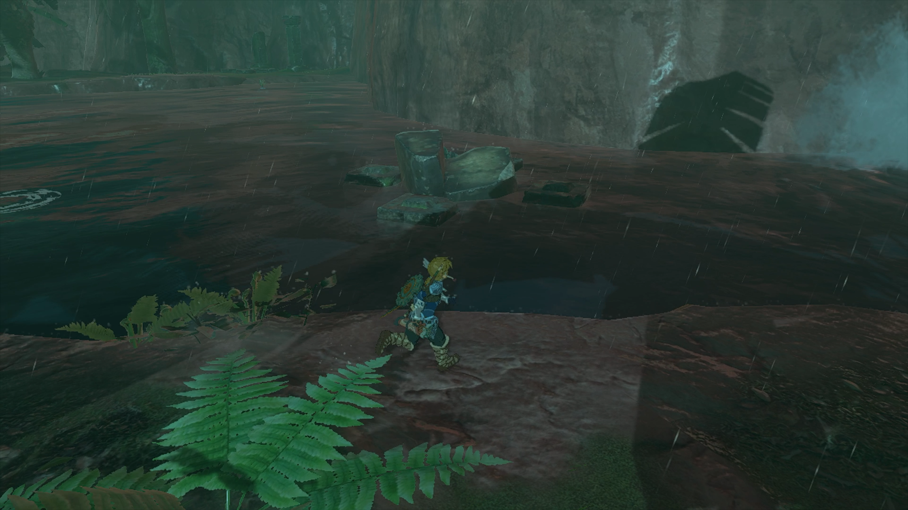
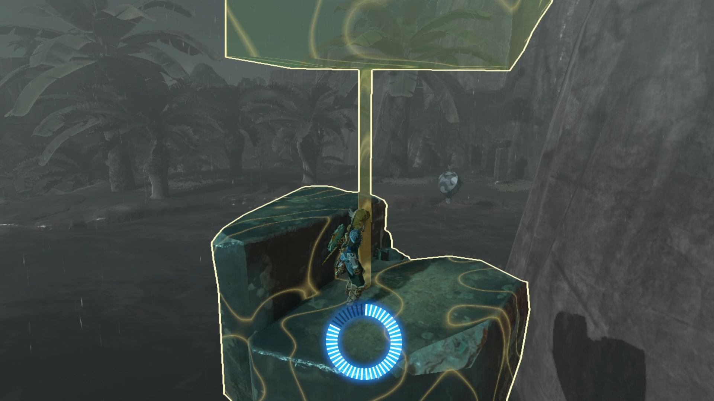
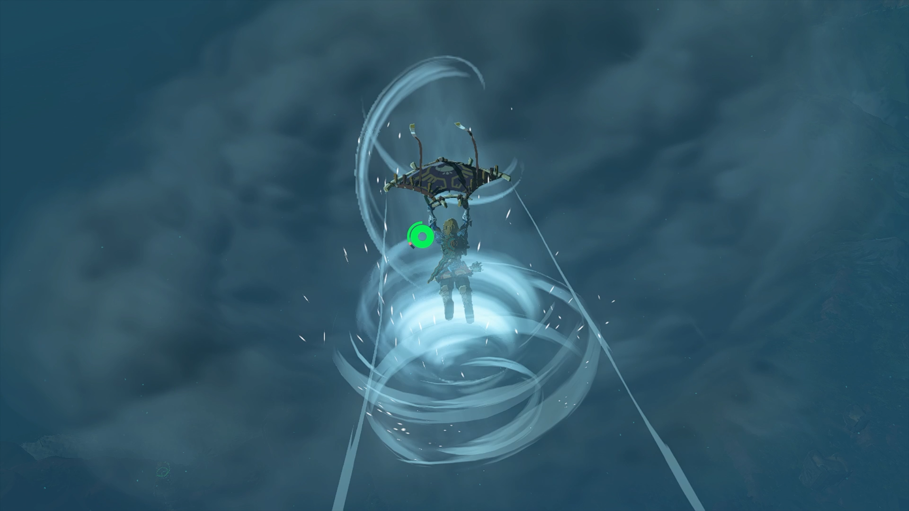
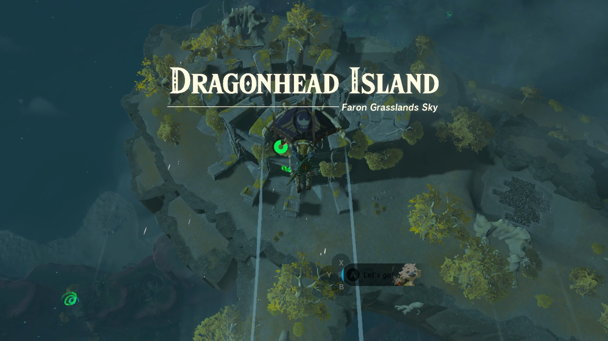
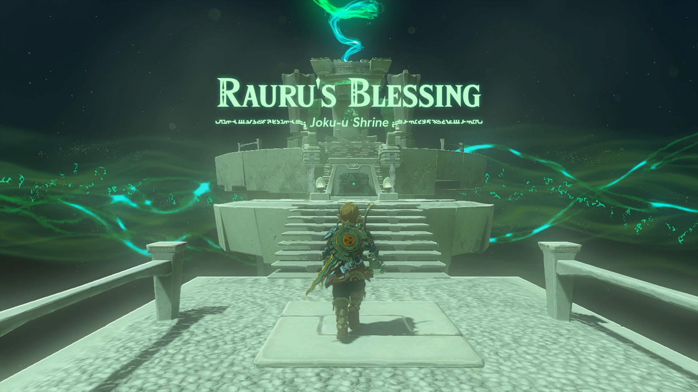

Joku-u Shrine (Rauru’s Blessing) in Zelda: Tears of the Kingdom is a shrine located on Dragonhead Island in the Faron Grasslands Sky region. This page contains a guide for how to locate and enter the shrine, a walkthrough for the shrine itself, and puzzle solutions as well as treasure chest locations for the TotK Joku-u shrine. 

### Joku-u Treasure and Rewards

  * Diamond

## Joku-u Location/How to Reach

Joku-u Shrine is located in the Thunderhead Isles, southwest of Rabella Wetlands Skyview Tower. This is in the middle of the giant storm in Faron Sky. 

One way to reach this shrine is to start at the Joju-u-u Shrine near Lakeside Stable. Paraglide to the waterfalls across the lake. If you have Zora Armor, Link can swim up the waterfall. 

As you continue north towards Corta Lake, a block will fall from the sky into the water. Climb on top of the block and use Recall to ride it back to the top of its path. 

Use your Paraglider to enter the storm. Remove any metal gear you have equipped to avoid getting electrocuted. Approach the opening in Dragon Island and gently land inside the hole to find the Joku-u Shrine. 

  * Coordinates: 1377, -3341, 0429

## Joku-u Walkthrough and Puzzle Solutions

Enter the shrine and you will be rewarded with Rauru’s Blessing. Head straight up the stairs to open the treasure chest with a Diamond inside. 

Continue up the next set of stairs to exit the shrine. 

Joku-u Shrine

Congrats on solving the shrine and earning a Light of Blessing! Click or tap here to return to the rest of the Shrine Guides. You can also check out which shrines are nearby with our shrine map filter on our complete map of Hyrule.

### Up Next: Walkthrough

Previous

About IGN's Zelda TotK Guide Writers

Next

Walkthrough

### Top Guide Sections

  * Walkthrough
  * Zelda: Tears of The Kingdom Switch 2 Edition Guide
  * Zelda Notes Voice Memories
  * List of Side Quests and Side Adventures

### Was this guide helpful?

Leave feedback

Go to comments