Joku-usin Shrine (**Short Circuit**) in Zelda: Tears of the Kingdom is a shrine located on the Thunderhead Isle sky island and is one of 152 shrines in TOTK (see all shrine locations). This page contains a guide for how to locate and enter the shrine, a walkthrough for the shrine itself, and puzzle solutions as well as treasure chest locations for the TotK Joku-usin shrine. 

### Treasure and Rewards

  * Electro Elixir

## Joku-usin Shrine Location

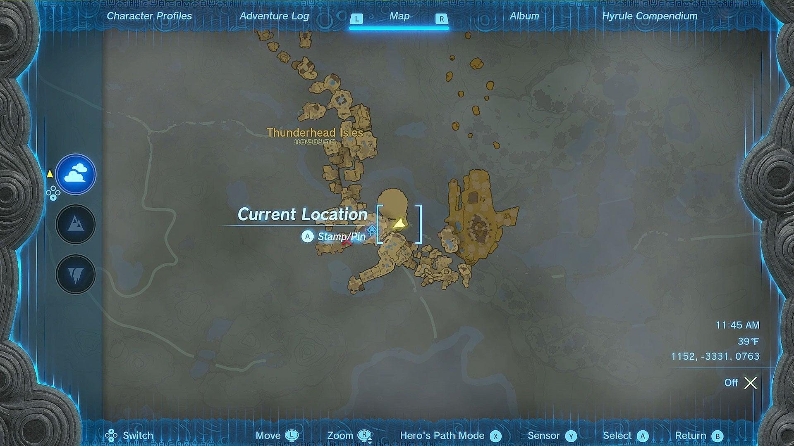

Joku-usin Shrine is located on Thunderhead Isle, above the Faron Region. The Thunderhead Isle’s are nearly impossible to navigate until you’ve finished the Tap to Reveal Main Story Quest, which is a very late-game story quest. Once that’s complete, the storm will clear up, allowing you to visit the island and have a much easier time finding the Shrine. 

  * Coordinates: 1074, -3346, 0786

## Joku-usin Shrin Walkthrough

The Joku-usin Shrine could be considered an end game Shrine, as it requires you to have made significant progress in the main story quest. While we won't spoil the events that are required for you to reach this Shrine, you’ll need to have made partial progress through the main story quest: Secret of the Ring Ruins. 

If you haven’t finished that quest, then finding this Shrine will be incredibly difficult as the Sky Islands where the Shrine is located – Thunderhead Isles – will be completely engulfed in a storm, making it near impossible to see anything. 

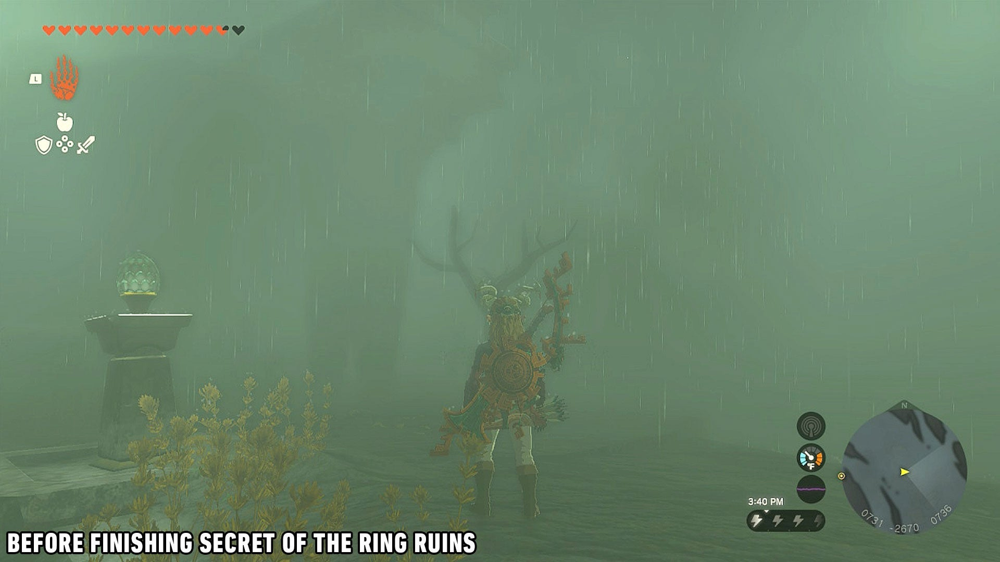

If you have finished the Secret of the Ring Ruins quest, at least far enough where the storm has cleared up, then this guide will show you exactly how to access the Joku-usin Shrine. 

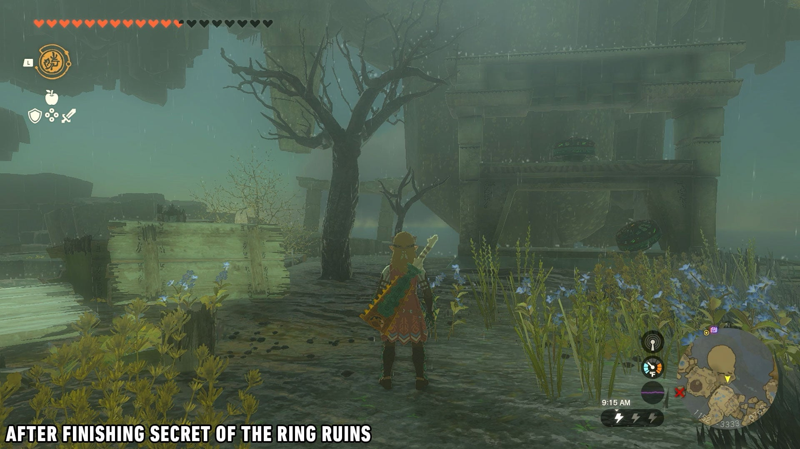

First, you’ll want to teleport to the Nachoyah Shrine, which was one of the first Shrines you complete on the Great Sky Island. Once there, leave the Shrine building, climb on top, and head to the southern part of the Great Sky Island. 

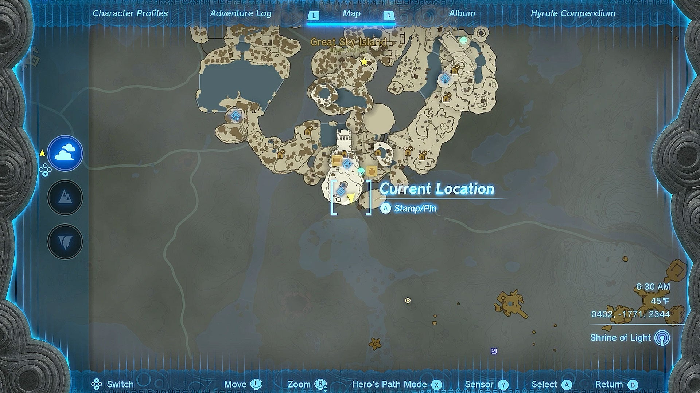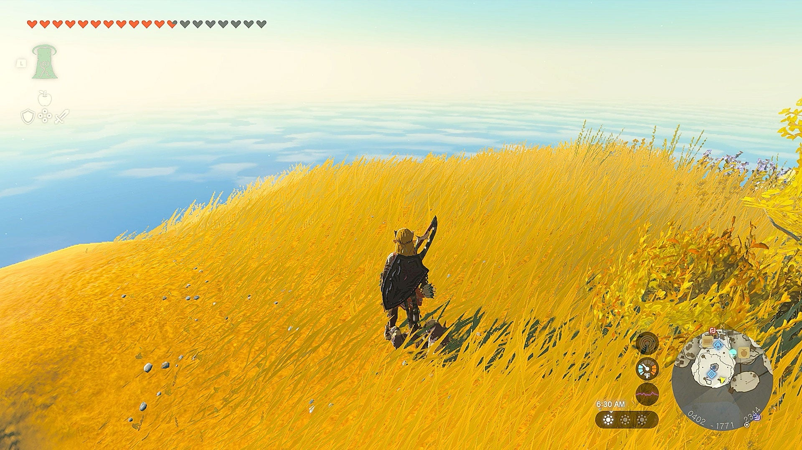

Once there, you’ll need to do a few things. First, remove all of your metal gear, as the Thunderhead Isles will still be stormy and will zap you with lightning if you’re wearing anything conductive. Next, you can jump off the south part of the island and start paragliding towards the Thunderhead Isle, using Tulin’s Sage of Wind ability to gust you towards the island. Wearing the Glider Armor Set will also get you over there fairly easily since Thunderhead Isle is much lower than Great Sky Islands. Another method to get to the island quicker would be to build a Wing with some Fans to glide over to the island. The Wing will disappear right when you’re above the island. Either way, you’re looking to land in a very specific spot. 

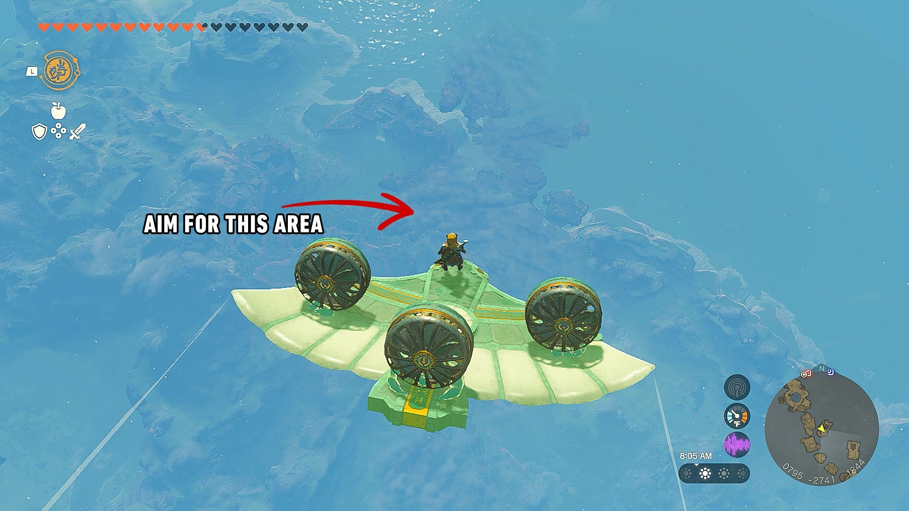

Once you're over Thunderhead Isle, it'll be very cloudy, making it hard to see the ground. Dive down until it clears up, and if you're in the right area as the picture shows above, you'll want to land on the island next to the big Flux Construct arena. 

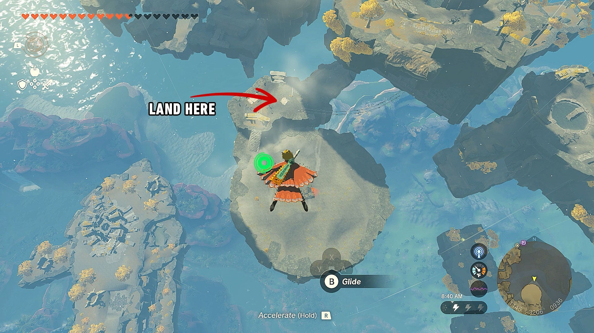

Once you’re there, you’ll see a railing, but no minecart! Instead, you’ll want to use the premade boards the game already has laying there. Pick up the board with Ultrahand and have it positioned in a way where the bottom piece will fit in between the rails so it will follow the rails and won’t fall off – almost like a rudder. 

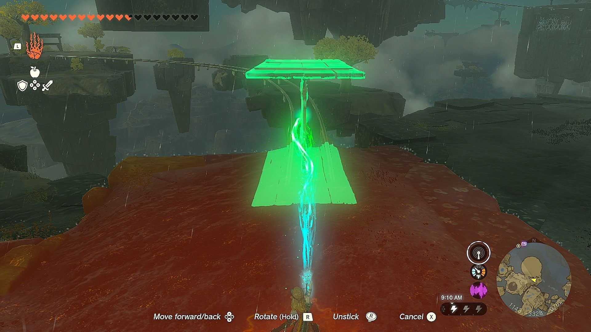

Once done, grab a couple of fans off the shelf and place them on the makeshift board minecart to propel you down the tracks. 

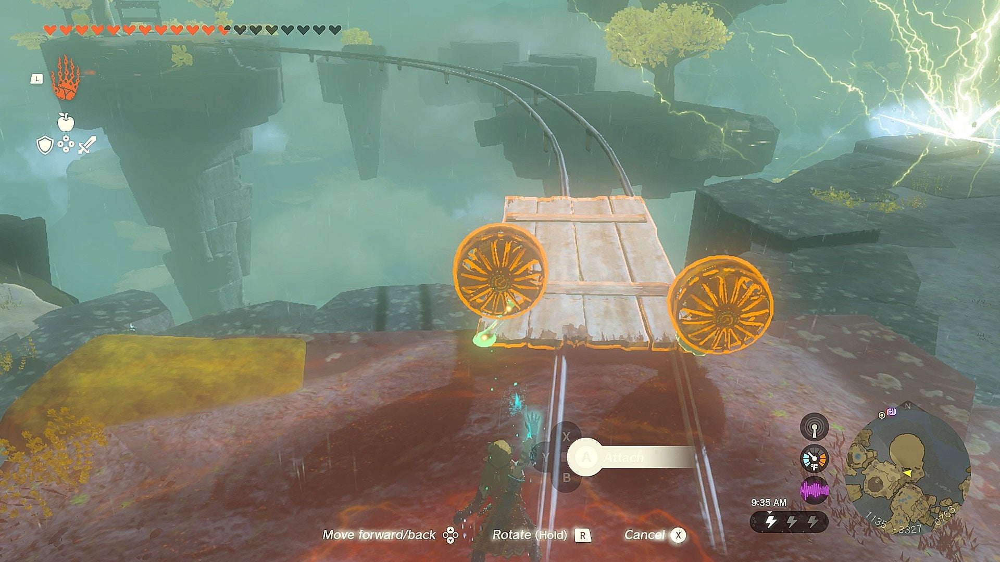

As you begin down the tracks, have your Ascend ability at the ready, as you’re going to use it to **Ascend** through the ceiling above you halfway through the ride to get up into the room the Shrine is located in. You’ll know you’re at the right spot when the ceiling gets much lower. So once the cart is under this spot, use Ascend to climb up through. 

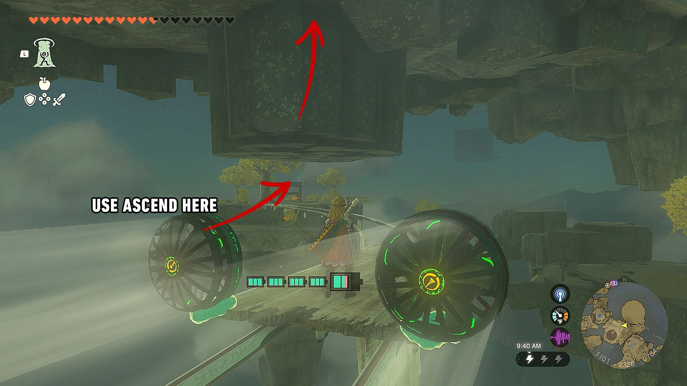

Once you’re up there, you’ll see the Shrine in the room with you. Run in, and get ready for a Proving Grounds! 

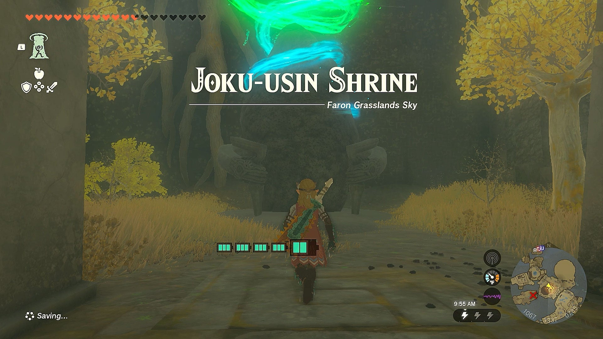

Once inside the Shrine, you’ll lose access to all of your gear, as this is a Proving Grounds Shrine, meaning you’ll have to fight with what's lying around or grab what's left from slain enemies. When you get to the end of the first hallway, you’ll find a long stick and a wooden stick laying on the shelf to your left. It isn’t much, but it’s what we have for now. 

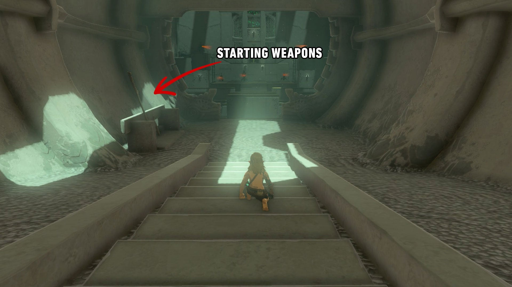

As you run into the almost maze-like Shrine, you’ll see two constructs following each other around. These are incredibly easy constructs to take down, as one is a melee one and the other is a ranged bow user. Using line of sight, you can easily hide from the bow use, and take the first one down with your long stick. 

The melee construct will drop a shield and a Soldier Construct Horn. Use Fuse to attach the Construct Horn to your wooden stick, and then use it to take down the bow construct. Loot that construct, and you should now have a few weapons and a bow. Good start! 

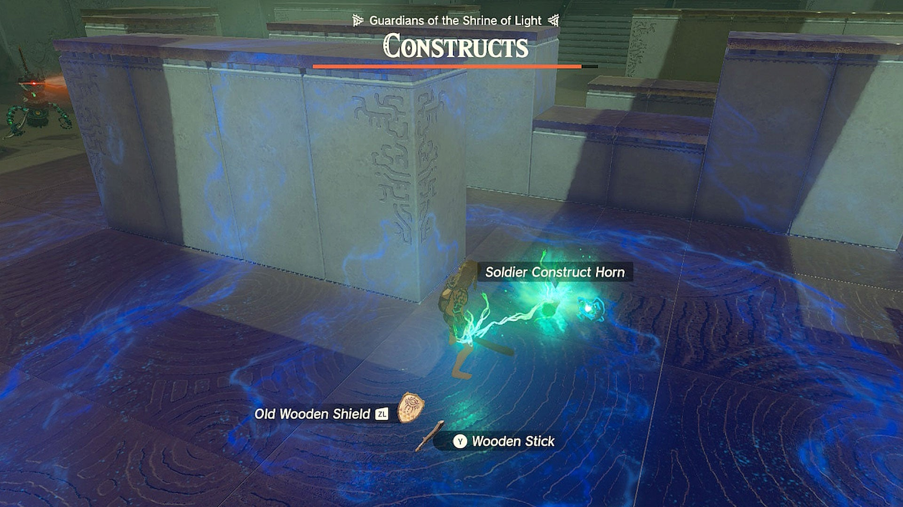

Right after taking down the two constructs, you’ll see a couple of small trees that have a few Shock Fruits on them. Grab those, as you’re going to use them to take down the next two constructs. 

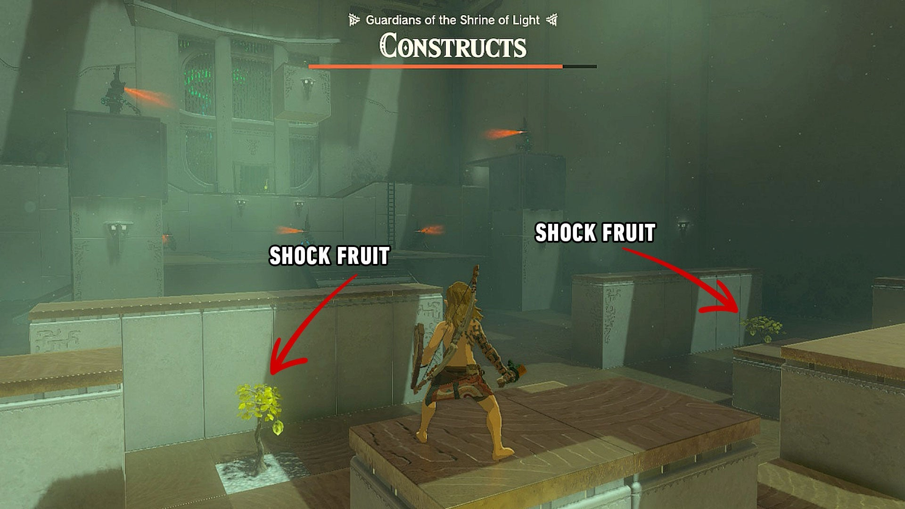

As you get past the maze, you’ll see two ranged constructs atop two pillars. You’ll notice that they’re actually sitting on top of a pillar with metal panels at the top. Aim your bow at the cubes and fuse your arrow with the shock fruit. This will cause the cube to become electrified, killing the construct above it. Do this for both constructs. 

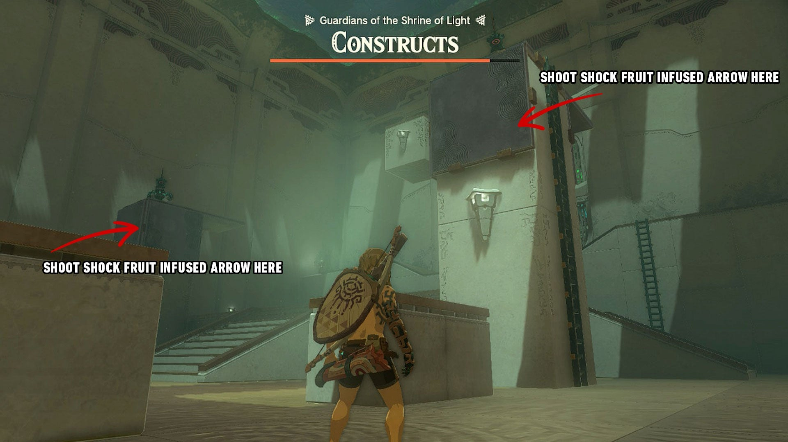

Once they’re down, you’ll see a few more constructs up a set of stairs, and a couple ladders leading up to a ledge where a Shock Emitter awaits. 

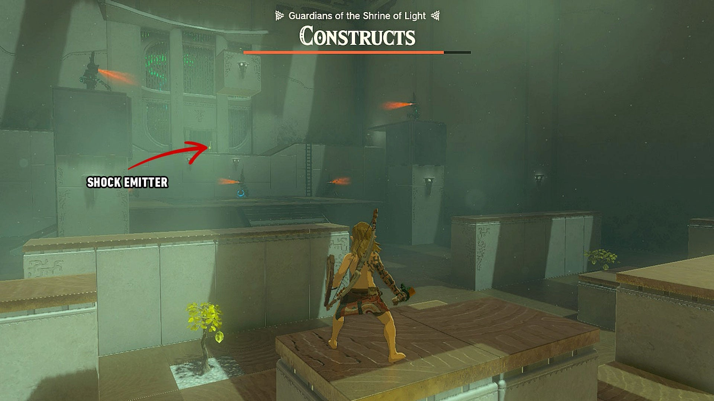

Run straight for one of the ladders and climb up. Once there, Fuse one of your remaining weapons with the Shock Emitter, and then look down where the constructs were patrolling. You’ll see that they’re patrolling on a platform with the inside edges of it being made up of more of those metal plated. 

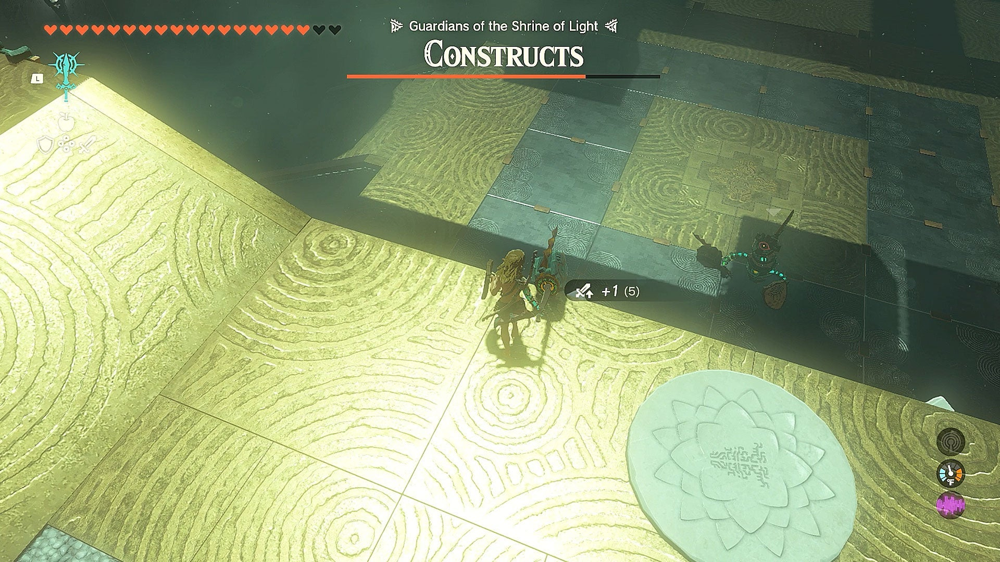

You know what to do next – jump down and use your new Shock Emitter-fused weapon to take down the constructs. Not only will the Shock Emitter attachment stun the enemies, causing them to drop their weapons, but the swings will also cause the cubes on the floor to become conductive, shocking, and stunning any other constructs. A few moments of this, and every construct should fall pretty quickly. A good thing to remember is that the shock won't hurt Link, so don't be afraid to just stand on the plates and swing wildly. 

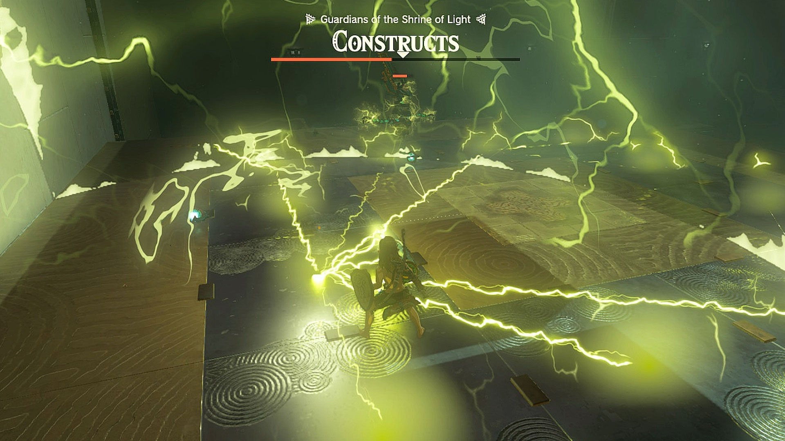

Once they’re all defeated, the gate up on the ledge where you got the Shock Emitter will open, granting you a chest that contains an Electro Elixir (shocker), and the well-earned Light of Blessing! 

Joku-usin Shrine

Congrats on solving the shrine and earning a Light of Blessing! Click or tap here to return to the rest of the Shrine Guides. You can also check out which shrines are nearby with our shrine map filter on our complete map of Hyrule.

### Up Next: Walkthrough

Previous

About IGN's Zelda TotK Guide Writers

Next

Walkthrough

### Top Guide Sections

  * Walkthrough
  * Zelda: Tears of The Kingdom Switch 2 Edition Guide
  * Zelda Notes Voice Memories
  * List of Side Quests and Side Adventures

### Was this guide helpful?

Leave feedback

### In This Guide

The Legend of Zelda: Tears of the KingdomNintendo EPD

Initial Release: May 12, 2023

Learn more

Go to comments