The Joniu Shrine (Rauru's Blessing) in Zelda: Tears of the Kingdom is the maddening shrine below the **Upland Zorana Skyview Tower.** It is one of 152 shrines in TOTK (see all shrine locations). This page contains a guide for how to locate and enter the shrine, a walkthrough for the shrine itself, and puzzle solutions as well as treasure chest locations for the TotK Joniu shrine. 

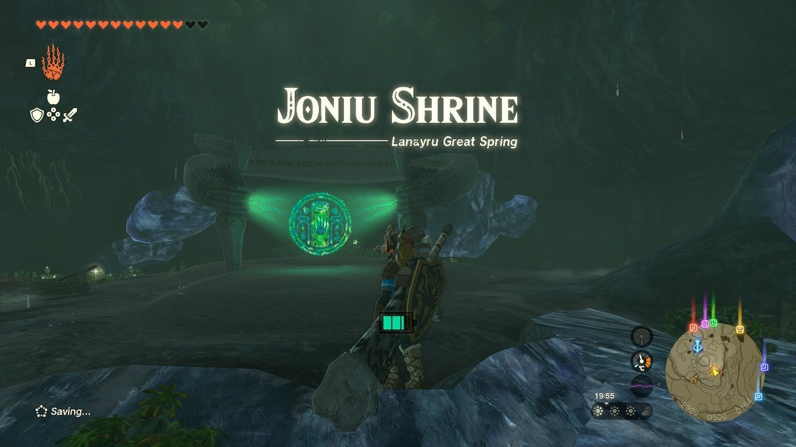

Be sure to check out these other guides to help you through the other Shrines and find troublesome collectables! 

  * Shrine filter on IGN's interactive map of Hyrule
  * All Shrine Locations and Solutions
  * List of Shrine Quests
  * Dragon Locations and Farming Guide
  * Korok Seed Locations

### Treasures and Rewards

  * Bubbulgem
  * Large Zonai Charge

### Joniu Shrine Location

If you've been searching for the shrine beneath the Zora Skyview Tower, you're almost there. This is one of the many shrines hidden within a cave. **Specifically, you're looking for Ralis Channel**. You can find it quickly by looking for**Ralis Pond** south of Upland Zorana Skyview Tower. It has two entrances and either will get you to the shrine. 

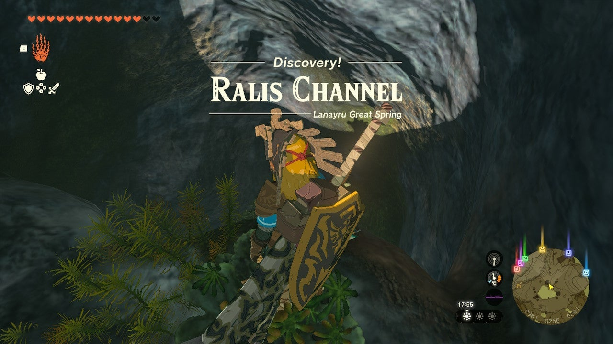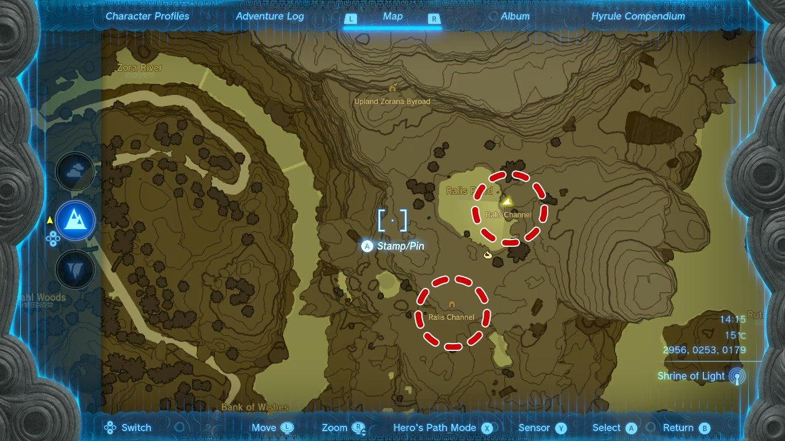

Inside you'll find a river rushing south. You'll need to build a raft with enough power to ride against the current, even better if you can control its direction. 

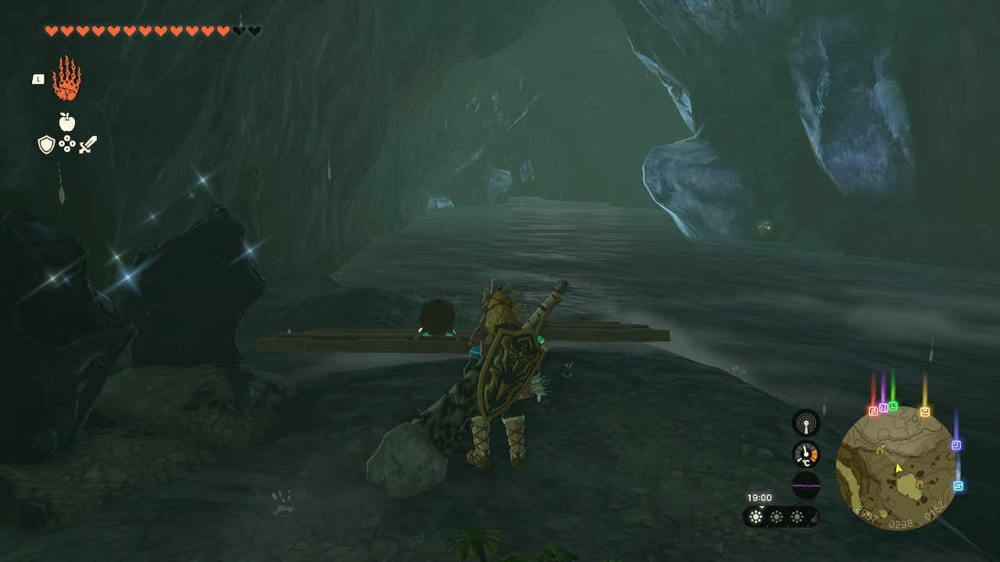

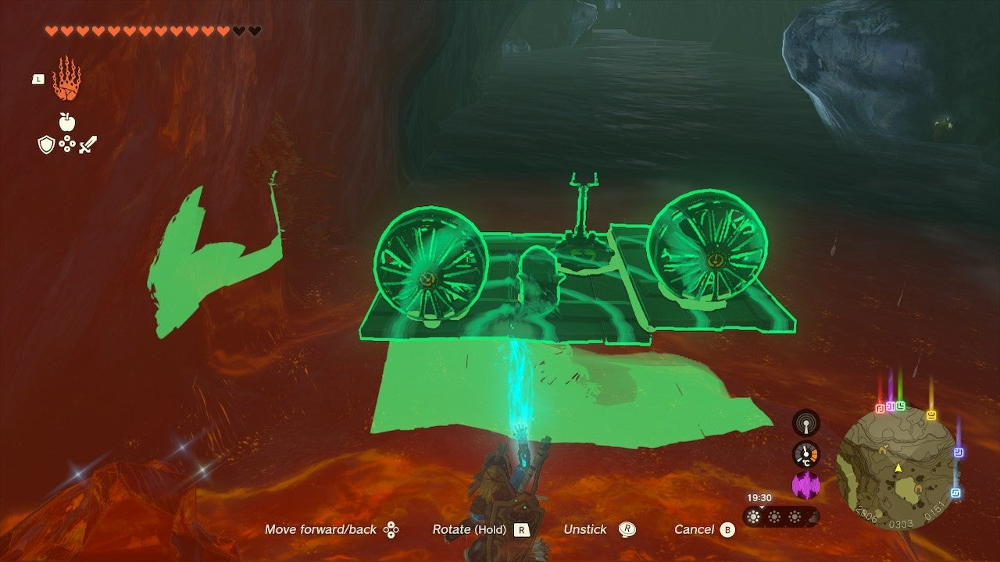

Once you have the Zonai Devives good to go, you can ride your craft up the river to discover the shrine. **Note that you can get the Joniu Shrine's shrine crystal at the end of the river before making your way over to the shrine**. 

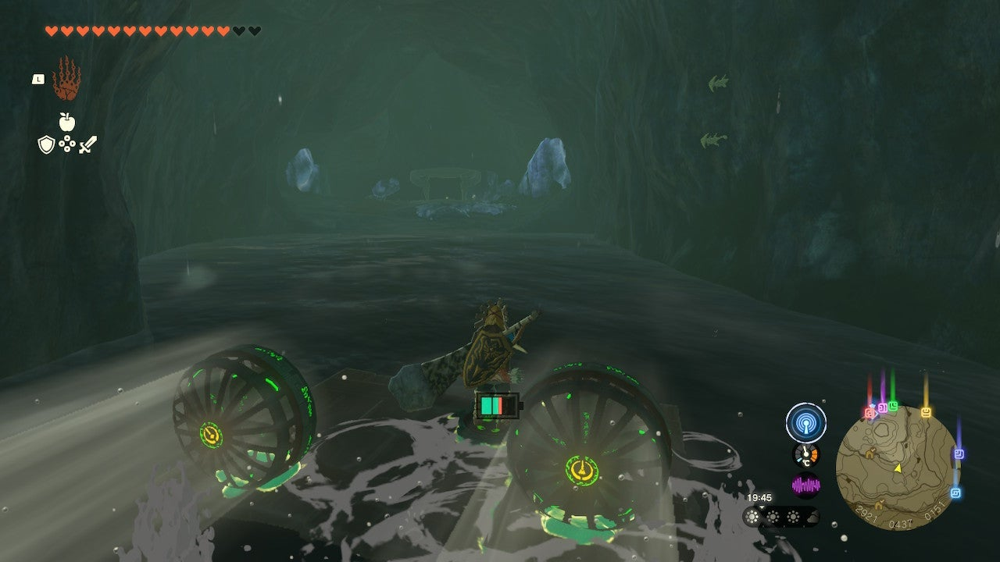

**Coordinates** : 2918, 0505, 0155 

### The Ralis Channel Crystal

After engaging the shrine, you'll learn that you need to retrieve its crystal. If you didn't bring it with you from the south side of the cave, you'll need to go back to the cave opening. Near the shrine you'll find a wooden platform, a sail, a fan, and a Korok Frond. Build yourself a raft with the materials and ride the current down the river. You can coast, but the fan will make the ride down the river faster. 

The **Bubbulfrog** is hidden in a cove on the east side of the cave.  
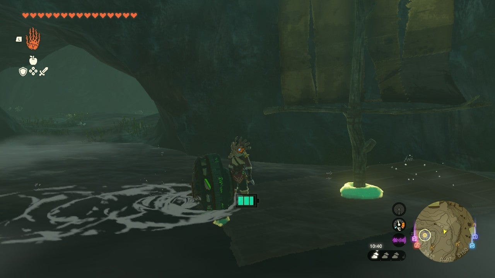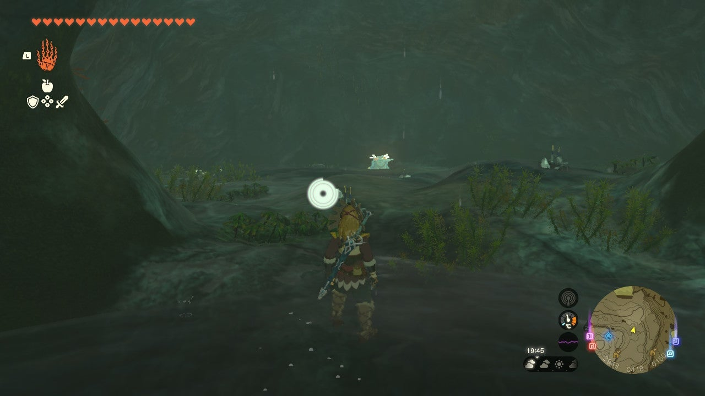

Once you've reached the entrance, you can make another raft using the plentiful materials here. There are more fans, a rocket, and steering sticks. Fuse the shrine crystal with the raft and hop on when you're satisfied with your creation. Sail up the river back to the shrine. 

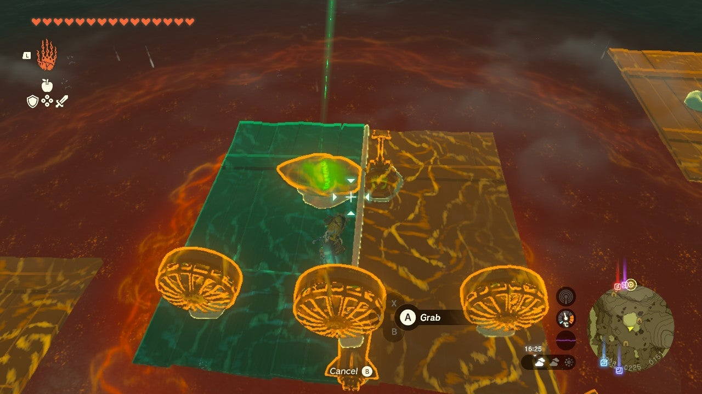

Our battery had yet to be upgraded and with three fans (one from the front of the cave that we broght back) and a rocket, we had _just_ enough power to reach the river bank. Don't forget you can use Zonai Charge if you start running out of energy before you've reached the end of the river. 

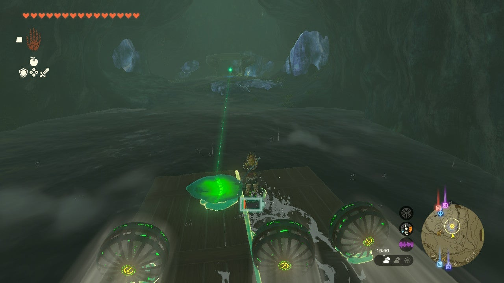

Detatch the shrine crystal and return it to the shrine. 

The Ralis Channel Crystal

### Inside Joniu Shrine

As a Rauru's Blessing shrine all you need to do is collect the treasure (Large Zonai Charge) and the Light of Blessing. 

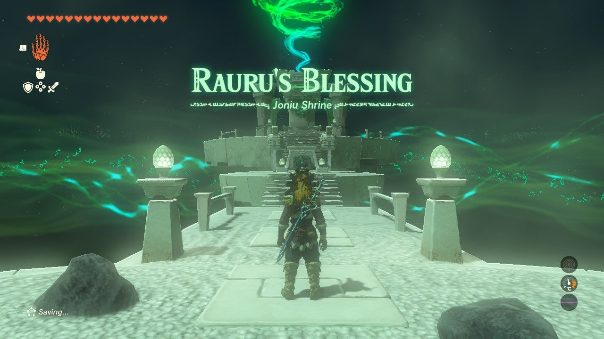

Joniu Shrine

Congrats on solving the shrine and earning a Light of Blessing! Click or tap here to return to the rest of the Shrine Guides. You can also check out which shrines are nearby with our shrine map filter on our complete map of Hyrule.

### Up Next: Walkthrough

Previous

About IGN's Zelda TotK Guide Writers

Next

Walkthrough

### Top Guide Sections

  * Walkthrough
  * Zelda: Tears of The Kingdom Switch 2 Edition Guide
  * Zelda Notes Voice Memories
  * List of Side Quests and Side Adventures

### Was this guide helpful?

Leave feedback

Go to comments