Jonsau Shrine (**Deep Force**) in Zelda: Tears of the Kingdom is a shrine located in the Lanayru region and is one of 152 shrines in TOTK (see all shrine locations). This page contains a guide for how to locate and enter the shrine, a walkthrough for the shrine itself, and puzzle solutions as well as treasure chest locations for the TotK Jonsau shrine. Check out more TOTK shrine locations here. 

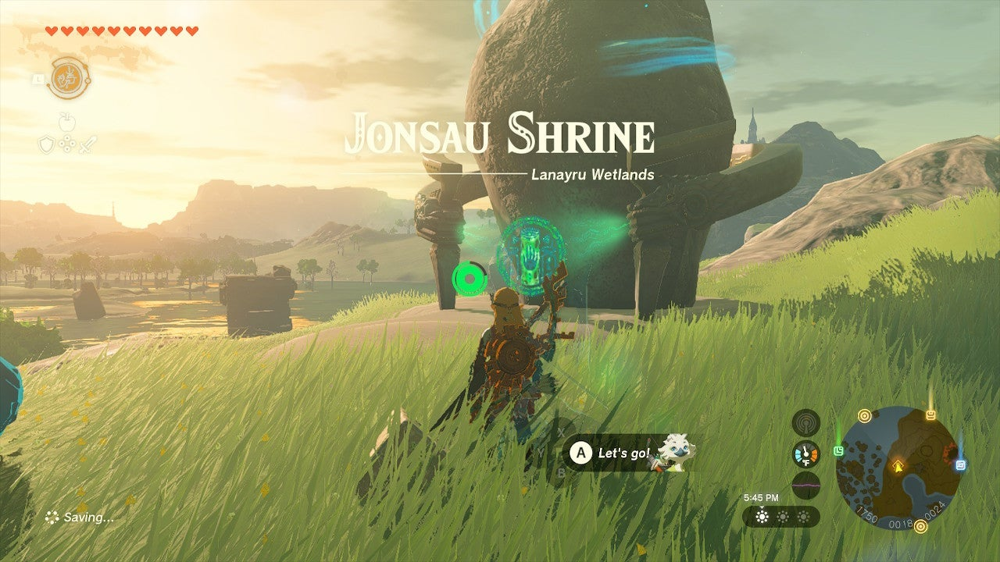

### Treasure and Rewards

  * Strong Construct Bow

## Jonsau Shrine Location

Jonsau Shrine is on the surface in plain sight due east of Lookout Landing and northeast of the Wetland Stable in the Lanayru Wetlands. You can paraglide most of the way there from the Sahasra Slope Skyview Tower. Jonsau Shrine serves as the fast travel point for the Depths entrance on Mercay Island. 

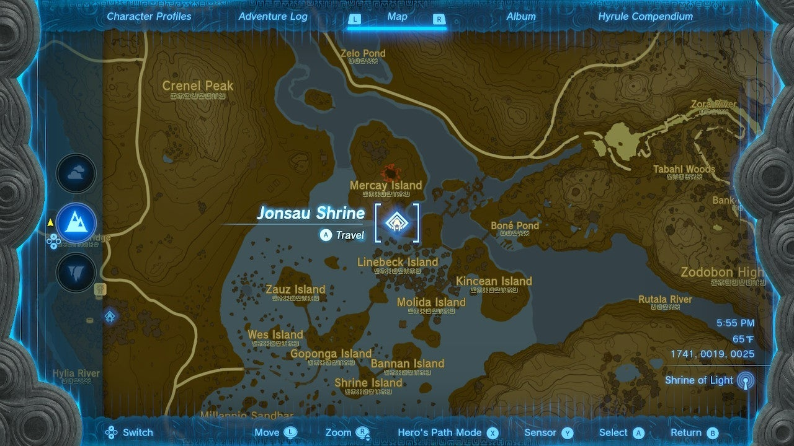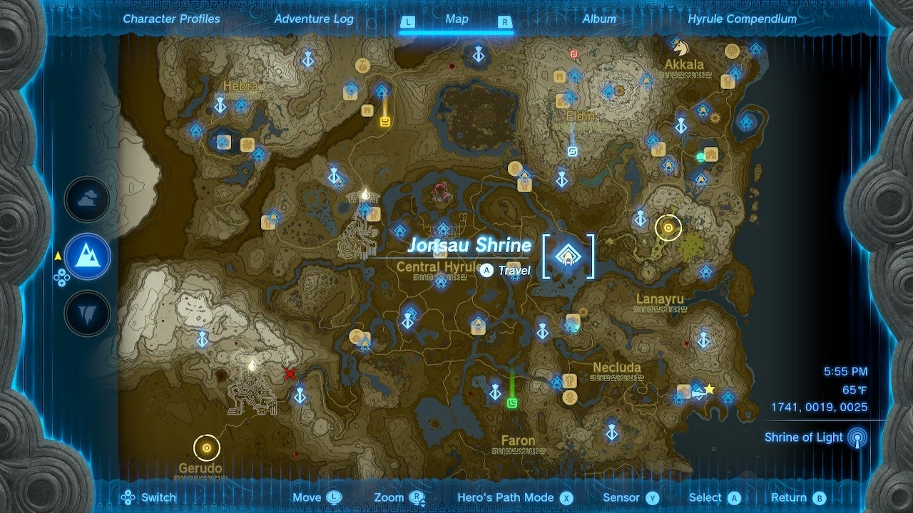

  * Coordinates: 1741, 0019, 0025

## Jonsau Shrine Walkthrough

The Jonsau Shrine is all about buoyancy or ... floatiness. The yellow balls are lighter than water and so they float. In the first room, note the target on the ceiling above the water. 

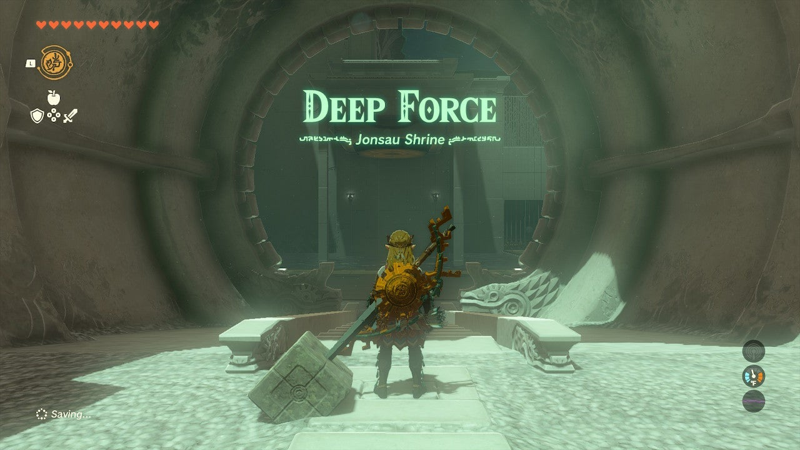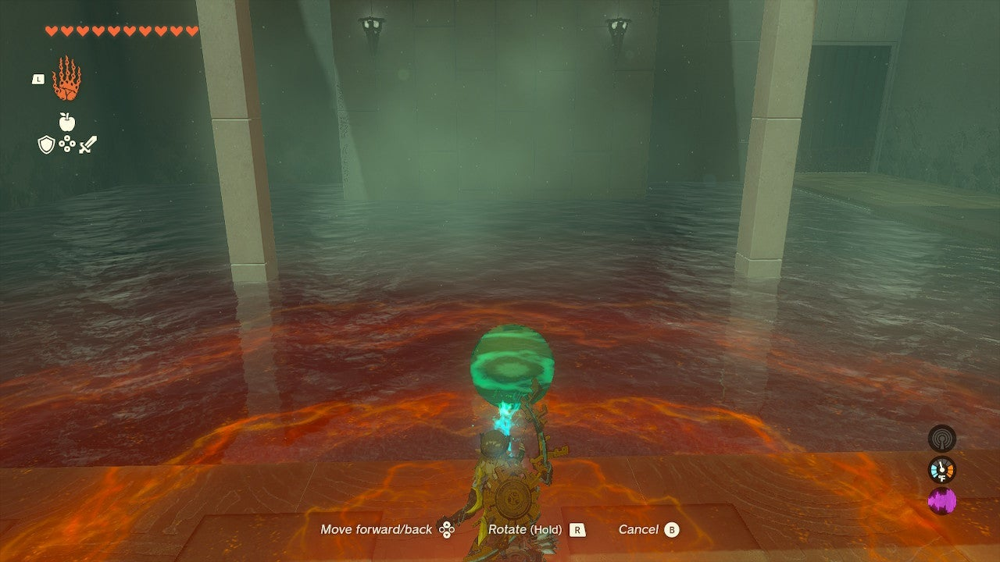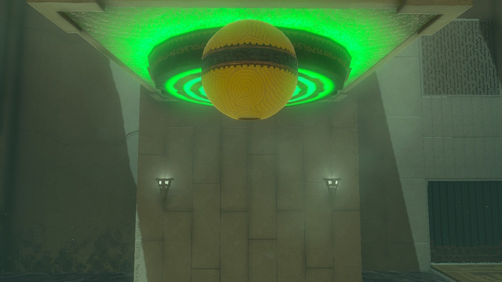

Grab the yellow ball with Ultrahand and hold it out and over the water by using the D-pad, then press it under the water (locate it under the target) and let go of Ultrhand. 

It will be pushed up to the surface and continue up into the air, smashing the target. Deep Force! 

## Treasure Chest Location

There is an easy chest to miss – but it’s also easy to get – in the next room. Look in the pool with Ultrahand activated to see a chest you can simply lift out of the water with Ultrahand. Inside is a Strong Construct Bow. 

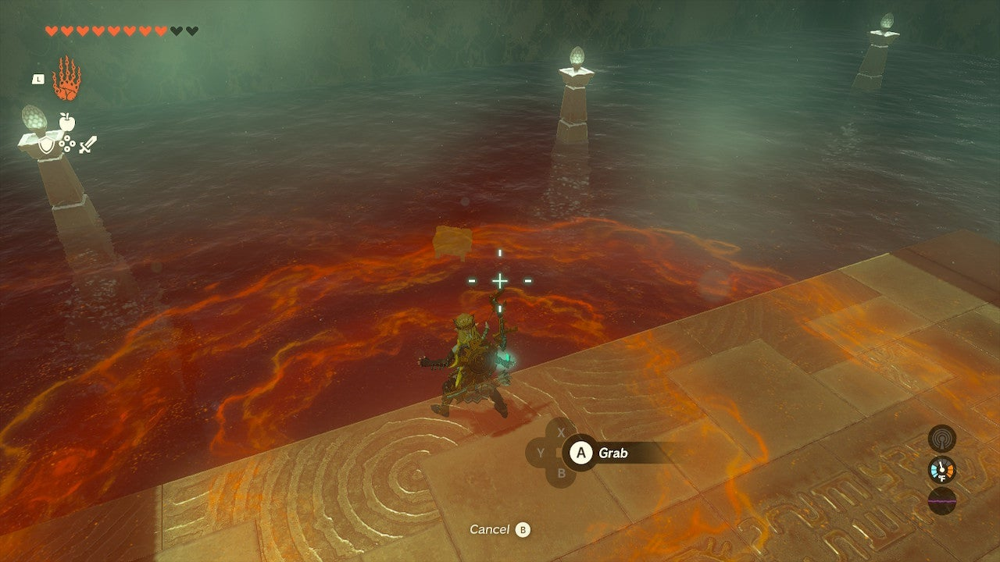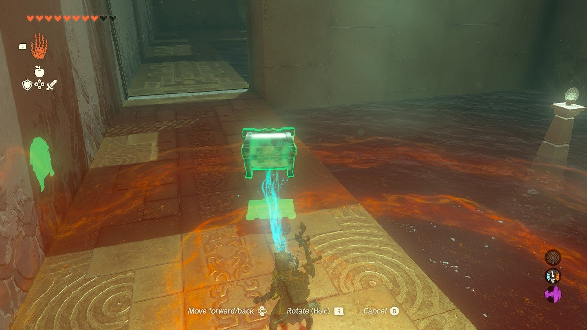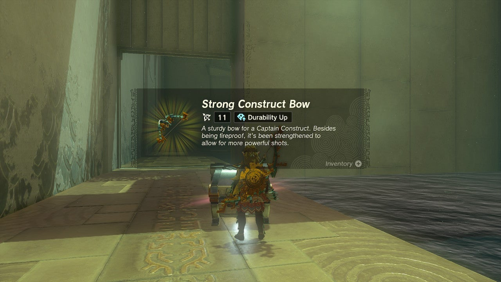

Kill the construct and move into the next room. 

Here a yellow slab must be used to hit the target above – just like the yellow ball. The only difference is that you have to rotate it, using R, to be vertical first. 

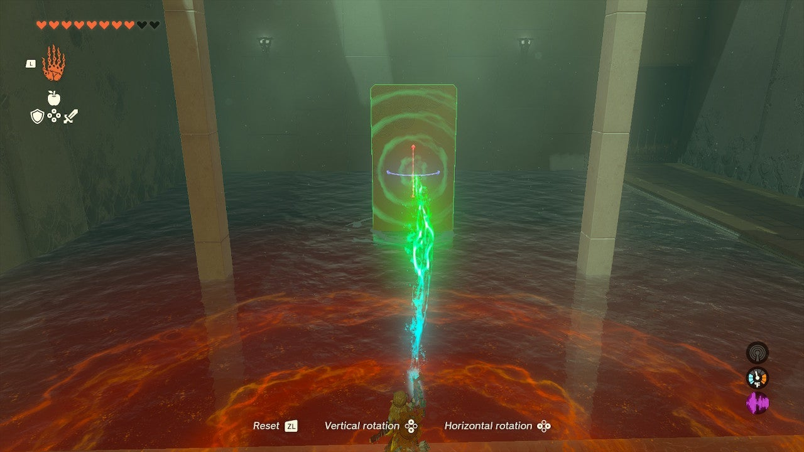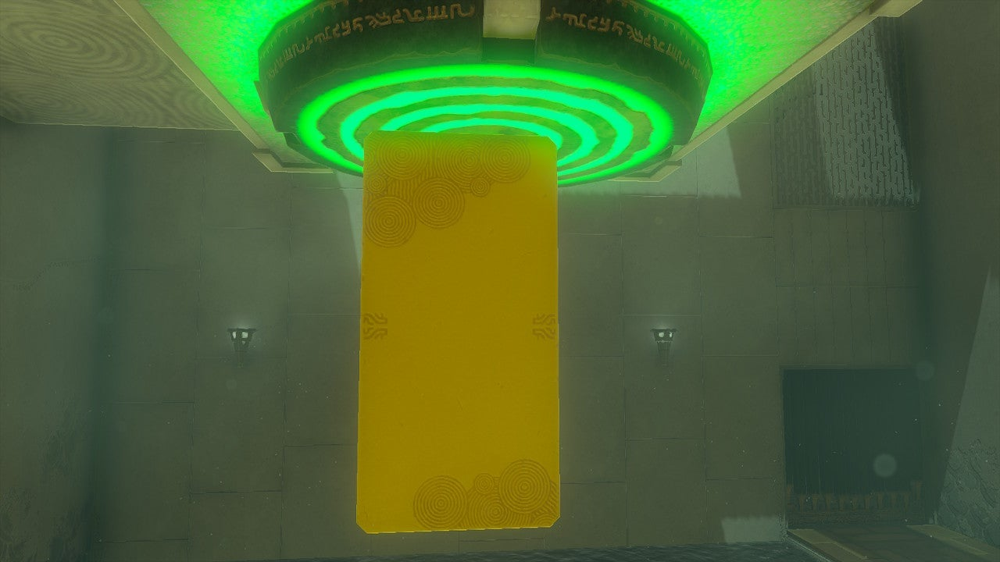

Plunge it down and let it go under the target to open the door. 

Now, grab the yellow rectangle and bring it to the next room. This makes the final room much easier: Drop the yellow slab in the water so it floats like platform. Now hop on it and Ascend through any part of the top area to get up and over the final fence to the exit. 

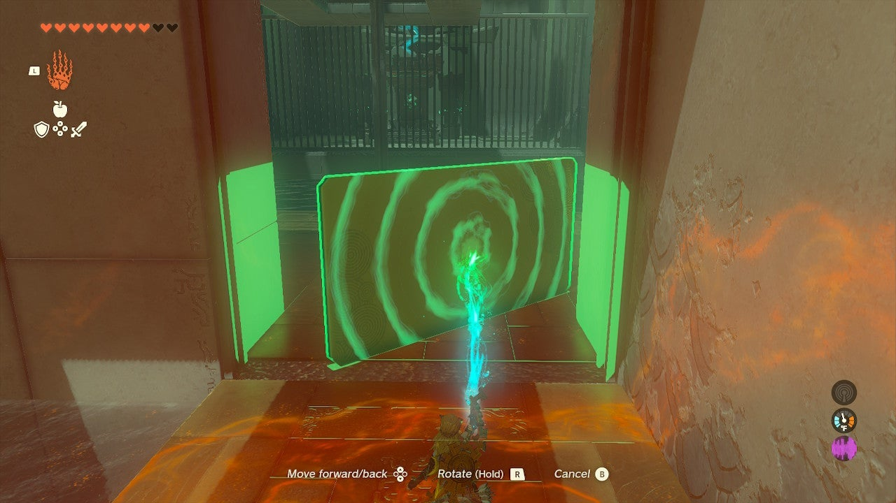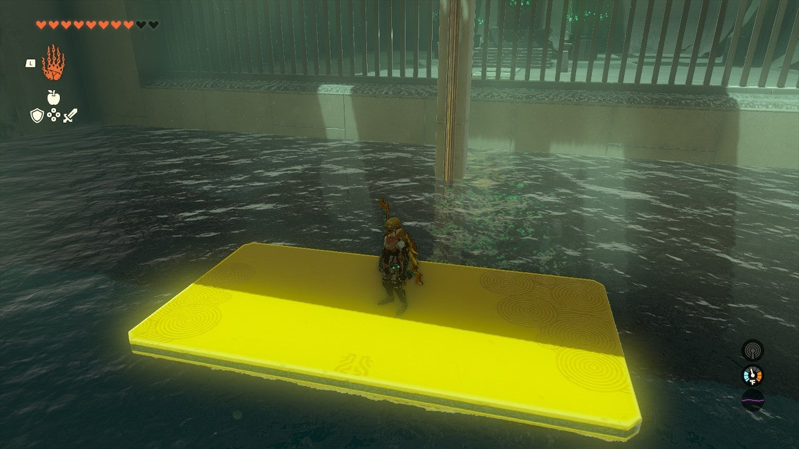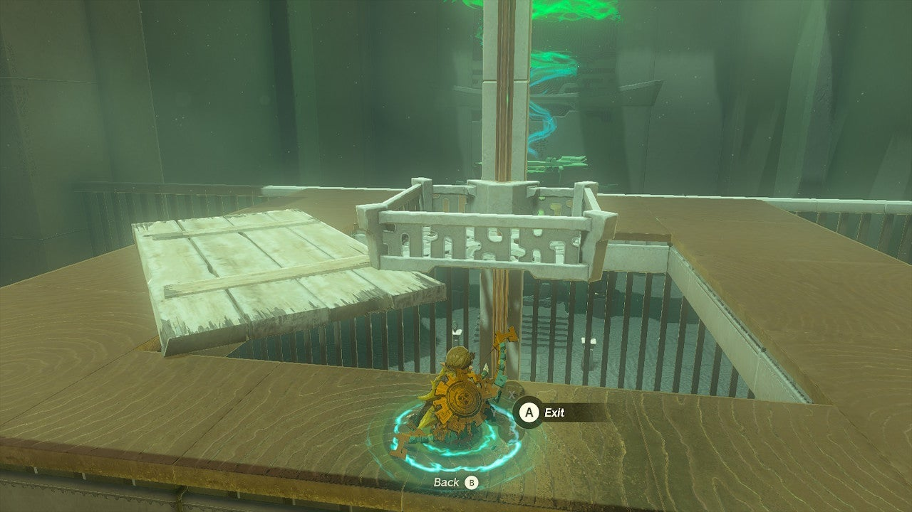

Exit the shrine. 

Jonsau Shrine

Congrats on solving the shrine and earning a Light of Blessing! Click or tap here to return to the rest of the Shrine Guides. You can also check out which shrines are nearby with our shrine map filter on our complete map of Hyrule.

### Up Next: Walkthrough

Previous

About IGN's Zelda TotK Guide Writers

Next

Walkthrough

### Top Guide Sections

  * Walkthrough
  * Zelda: Tears of The Kingdom Switch 2 Edition Guide
  * Zelda Notes Voice Memories
  * List of Side Quests and Side Adventures

### Was this guide helpful?

Leave feedback

Go to comments