Josiu Shrine (Rauru’s Blessing) in Zelda: Tears of the Kingdom is a shrine located in the Necluda Sky in the North Necluda Sky Archipelago and is one of 152 shrines in TOTK (see all shrine locations). In order to access this shrine you'll need to complete The North Necluda Sky Crystal Shrine Quest. Below you'll find directions on how to get to Josiu Shrine along with a walkthrough of the shrine quest. 

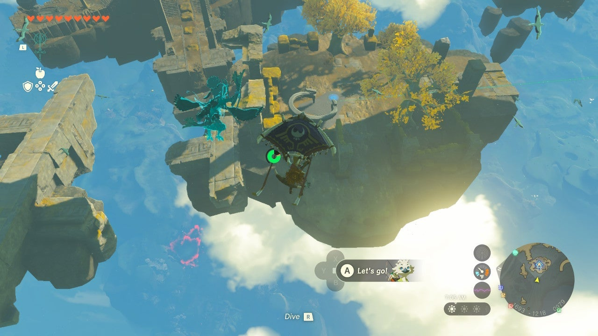

### Treasure and Rewards

  * Large Zonai Charge

## Josiu Shrine Location

Josiu Shrine is in the North Necluda Sky Archipelago. From the Sahasra Slope Skyview Tower, launch into the air and paraglide east. You’ll immediately come to some small bits of floating island that lead to larger ones below. From here you can easily glide to the larger island with the Shrine pad. 

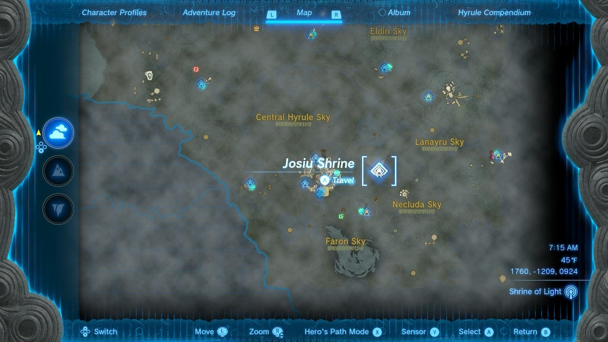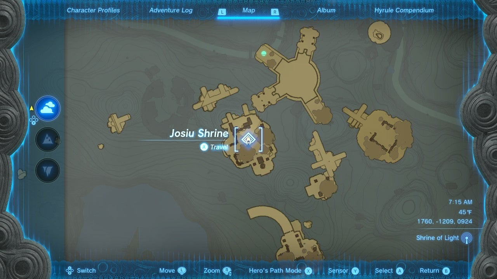

Activate the Shrine pad so you will have a fast travel method back here. This also begins the North Necluda Sky Crystal Shrine Quest. 

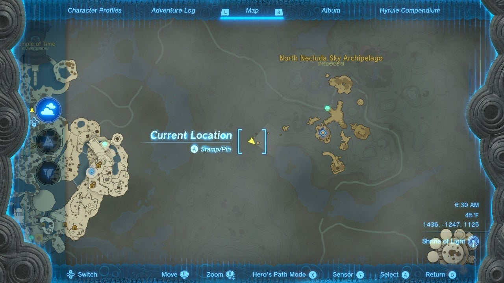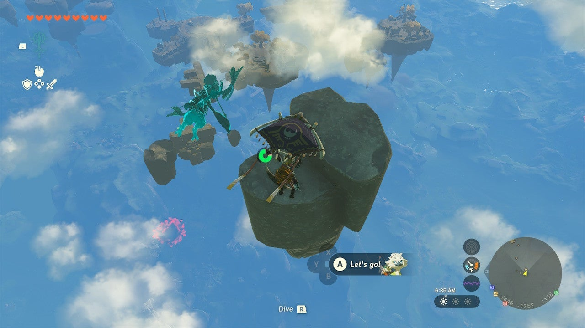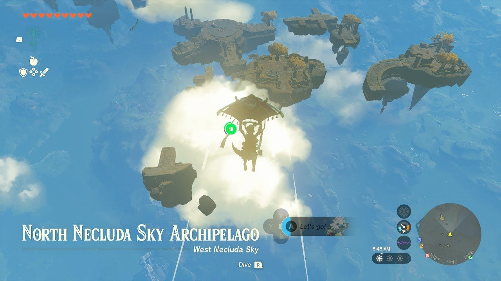

  * Coordinates: 1760, -1209, 0924

## The North Necluda Sky Crystal Shrine Quest Walkthrough

Josiu Shrine seems incredibly difficult at a glance but really it’s just a simple rotational puzzle. A green crystal is on a nearby island, with a laser pointed right at it (remember to activate the Shrine pad to get this laser). Between you and the island is a device you can manipulate with Ultrahand. 

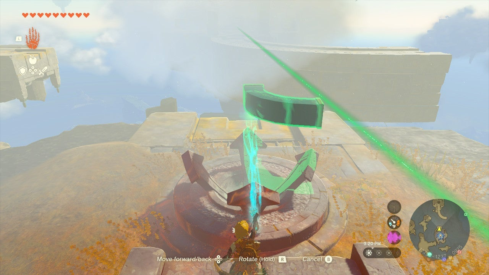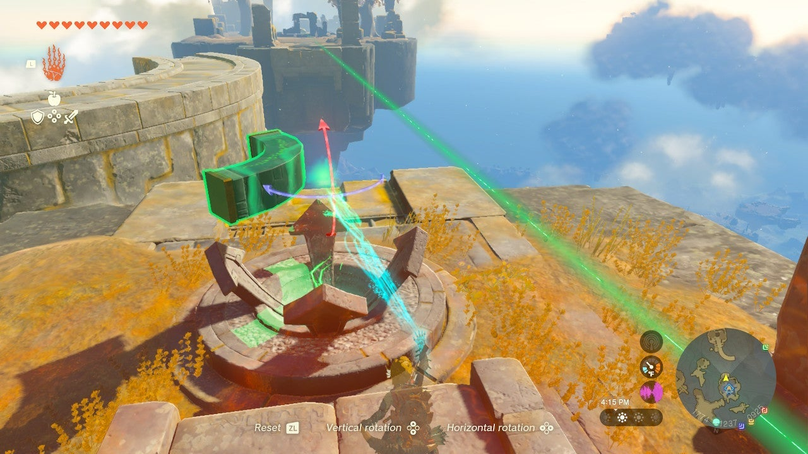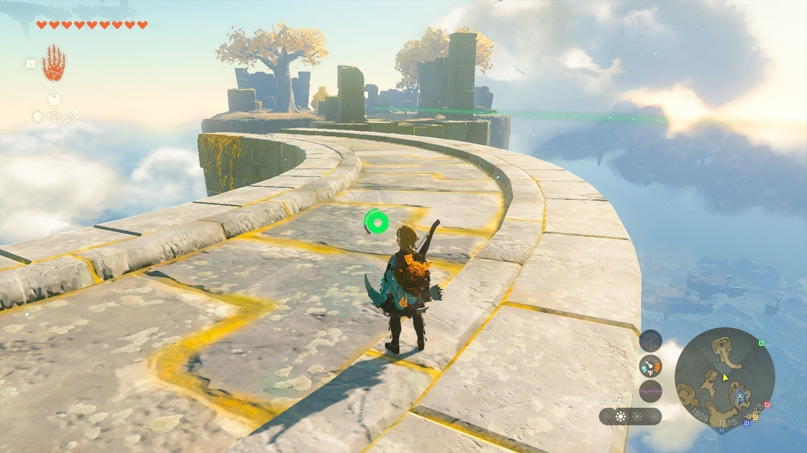

Activate Ultrahand and aim it at the green glowing device. You can freely rotate the curved stone walkway. 

Place it exactly between the islands, lengthwise. You can now hop and paraglide to it to cross it. If you fail, just warp back to the Shrine pad. 

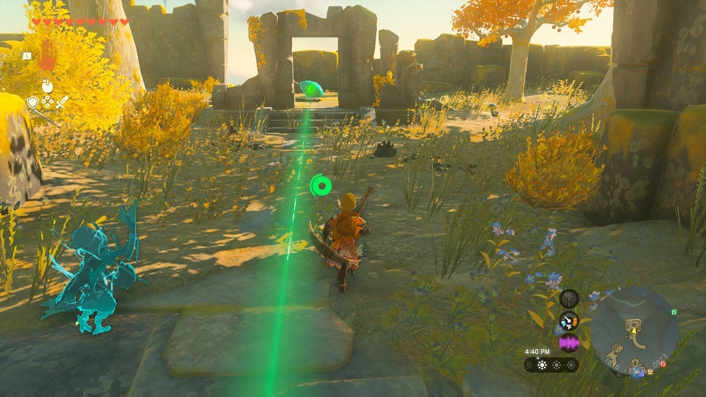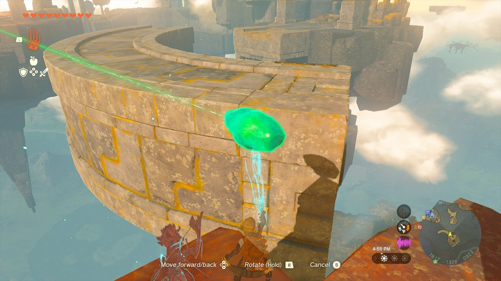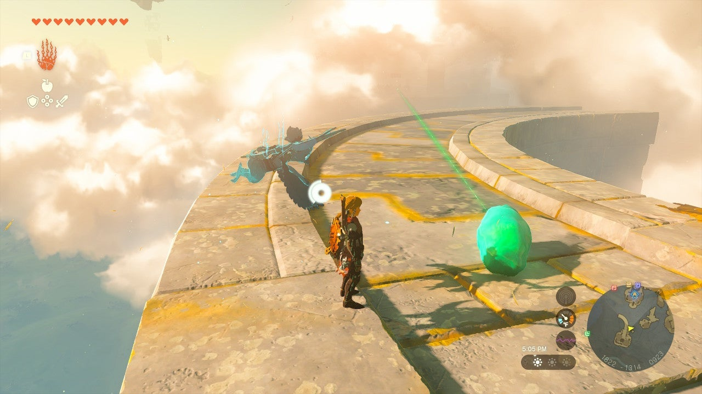

Use this manner to get across to the green crystal, then pick up the crystal with Ultrahand and put it in the CENTER of the rotating platform. 

Do not put it on an edge, it WILL fall off when you move the platform if you do! At the center of the platform’s rotational movement, it will stay still. 

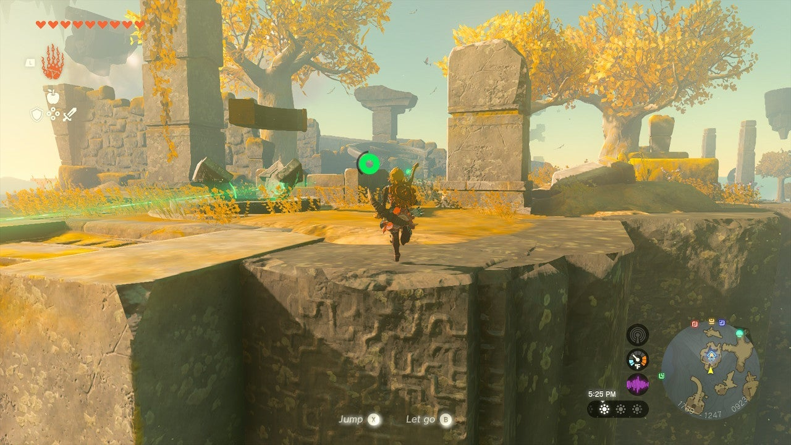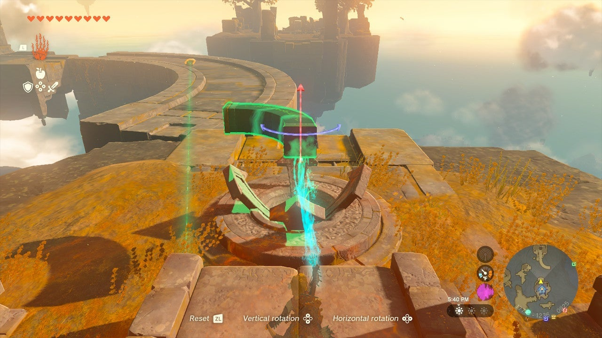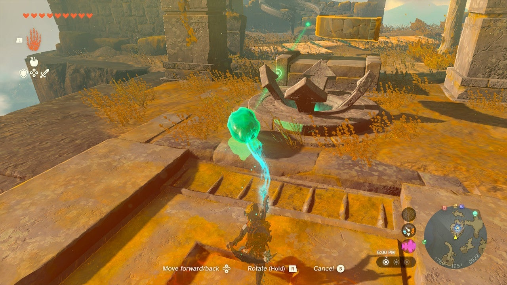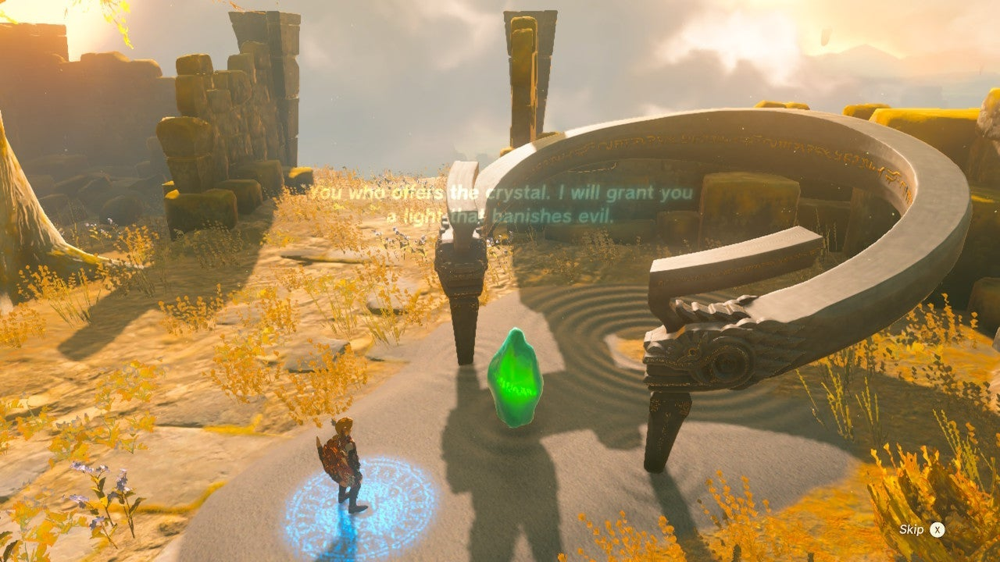

Jump and paraglide back over to the Shrine island and bring the rotating piece and the green crystal to you. 

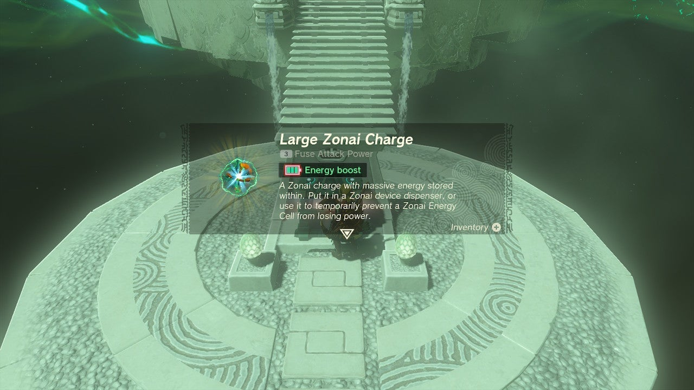

Bring the crystal to the shrine platform with Ultrahand to finish the North Necluda Sky Crystal Shrine Quest and open the Shrine. 

The North Necluda Sky Crystal

Inside is a chest with a Large Zonai Charge. 

Josiu Shrine

Congrats on solving the shrine and earning a Light of Blessing! Click or tap here to return to the rest of the Shrine Guides. You can also check out which shrines are nearby with our shrine map filter on our complete map of Hyrule.

### Up Next: Walkthrough

Previous

About IGN's Zelda TotK Guide Writers

Next

Walkthrough

### Top Guide Sections

  * Walkthrough
  * Zelda: Tears of The Kingdom Switch 2 Edition Guide
  * Zelda Notes Voice Memories
  * List of Side Quests and Side Adventures

### Was this guide helpful?

Leave feedback

Go to comments