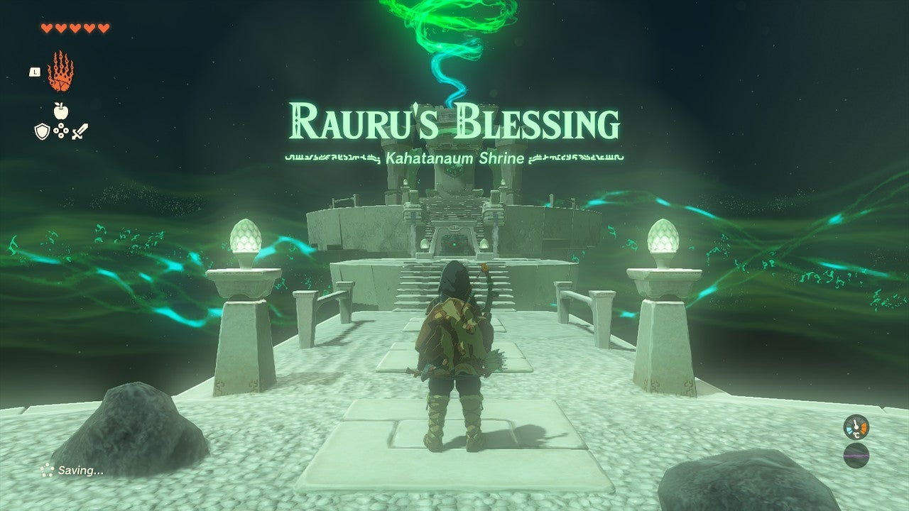
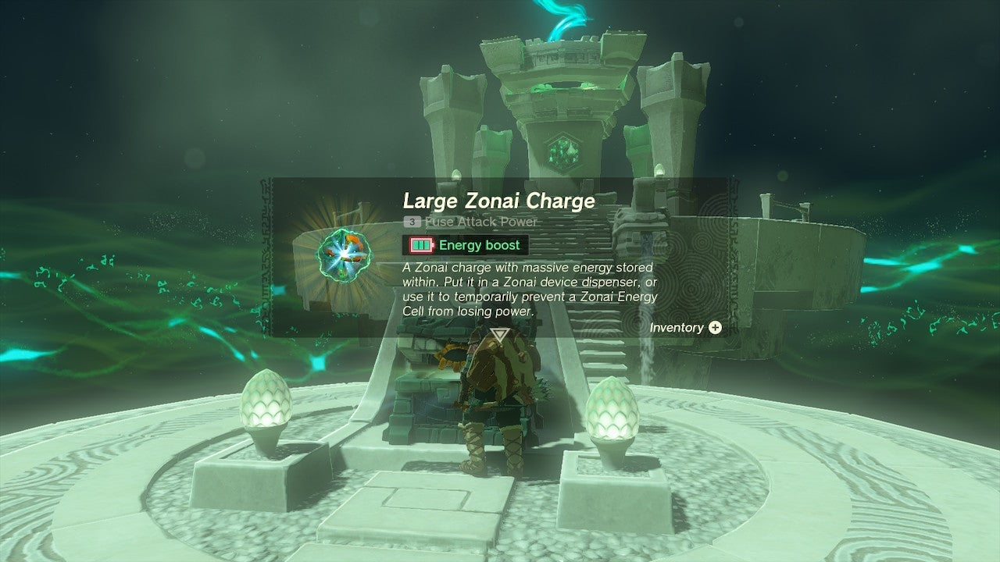

Kahatanaum Shrine (**Rauru’s Blessing**) in The Legend of Zelda: Tears of the Kingdom is a shrine located in the Hebra Sky Region and is one of 152 shrines in TOTK (see all shrine locations). 

### Treasure and Rewards

  * Large Zonai Charge

## Kahatanaum Shrine Location

The Kahatanaum Shrine is located high above Hebra peak in the Sky in the Rising Island Chain of the Hebra Sky – it is related to the Tulin of Rito Village quest. This shrine serves as the second waypoint on the quest and simply contains a treasure chest with a Large Zonai Charge. 

  * Coordinates: -3295, 3430, 1347

Kahatanaum Shrine

Click or tap here to return to the rest of the Shrine Guides.

### Up Next: Walkthrough

Previous

About IGN's Zelda TotK Guide Writers

Next

Walkthrough

### Top Guide Sections

  * Walkthrough
  * Zelda: Tears of The Kingdom Switch 2 Edition Guide
  * Zelda Notes Voice Memories
  * List of Side Quests and Side Adventures

### Was this guide helpful?

Leave feedback

Go to comments