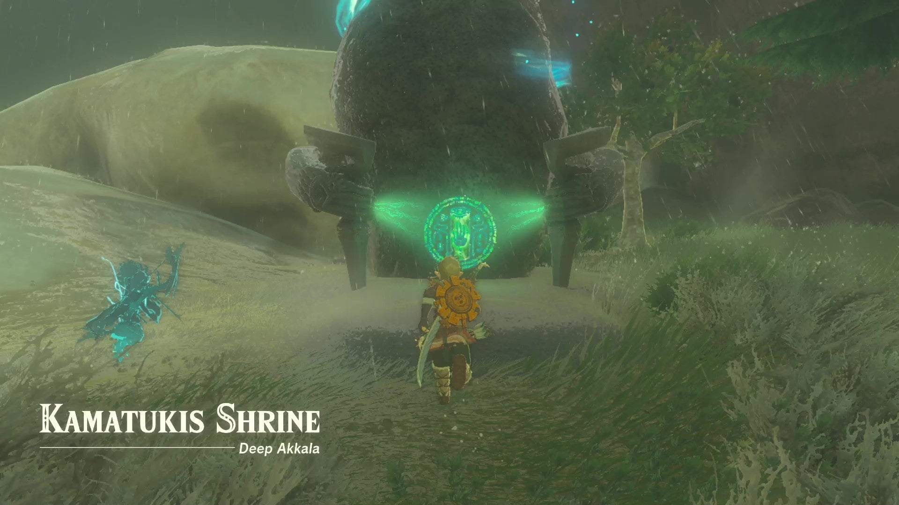
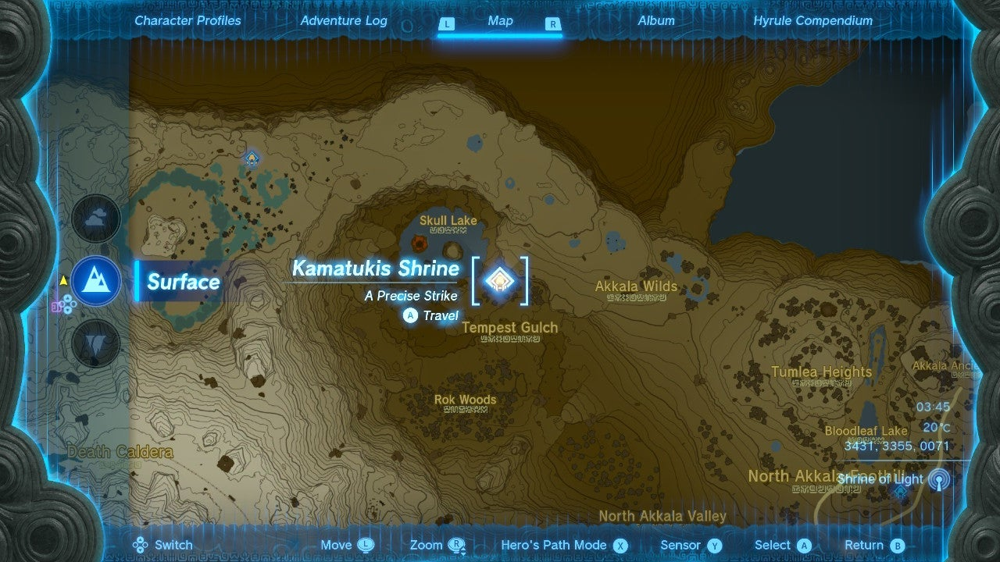
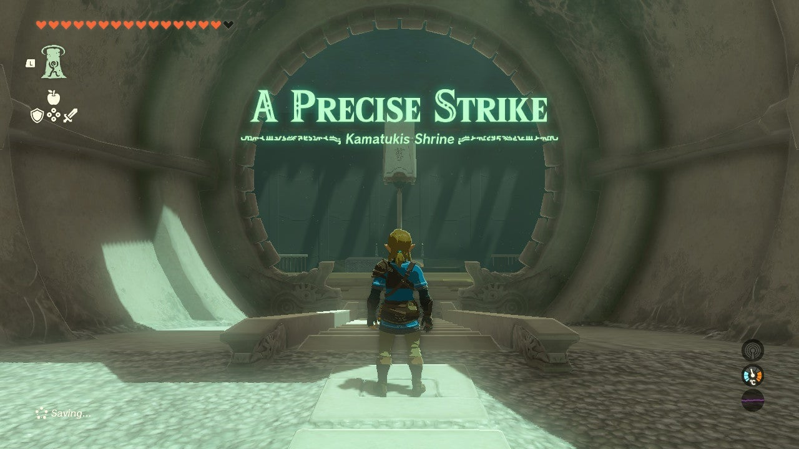
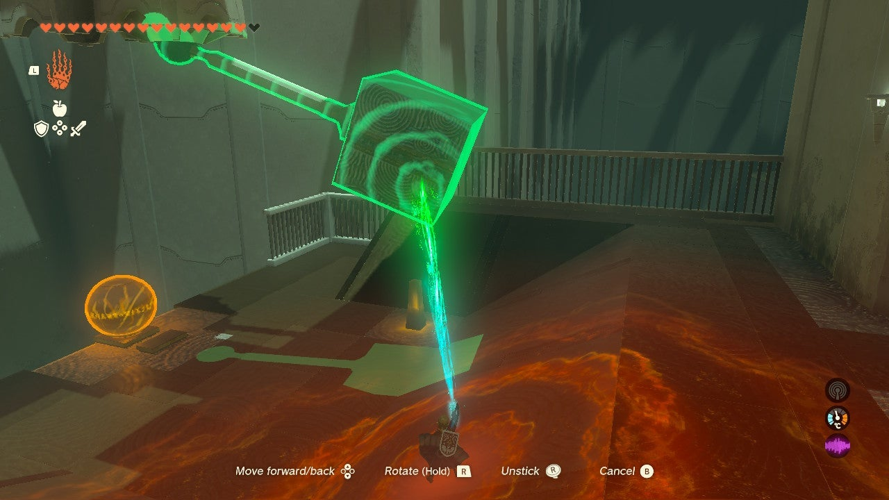
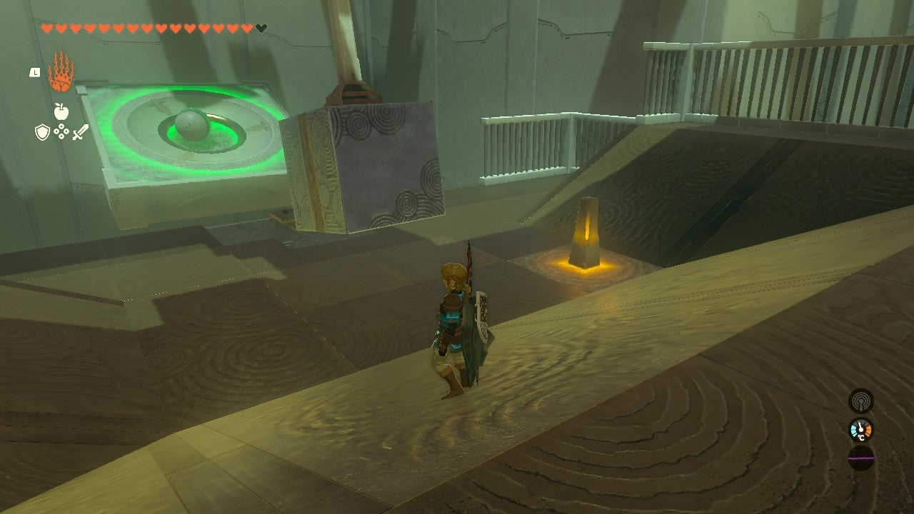
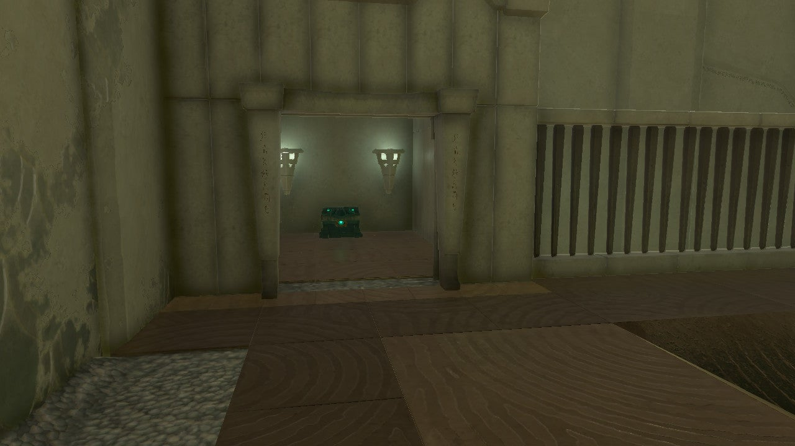
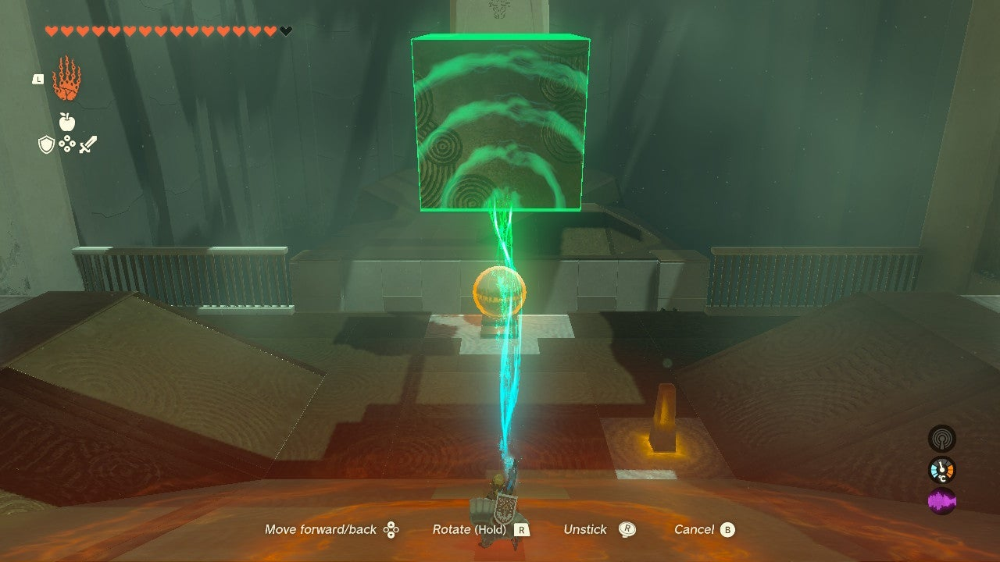
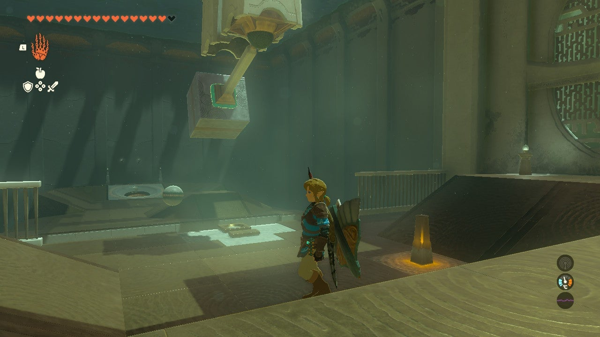
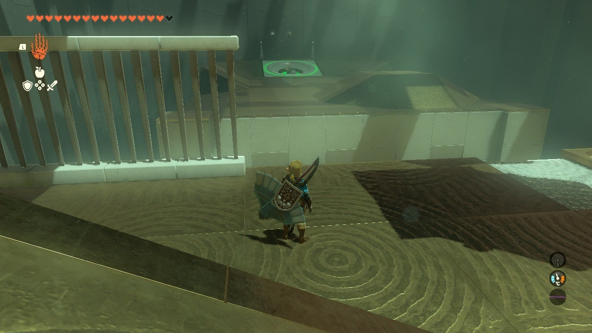
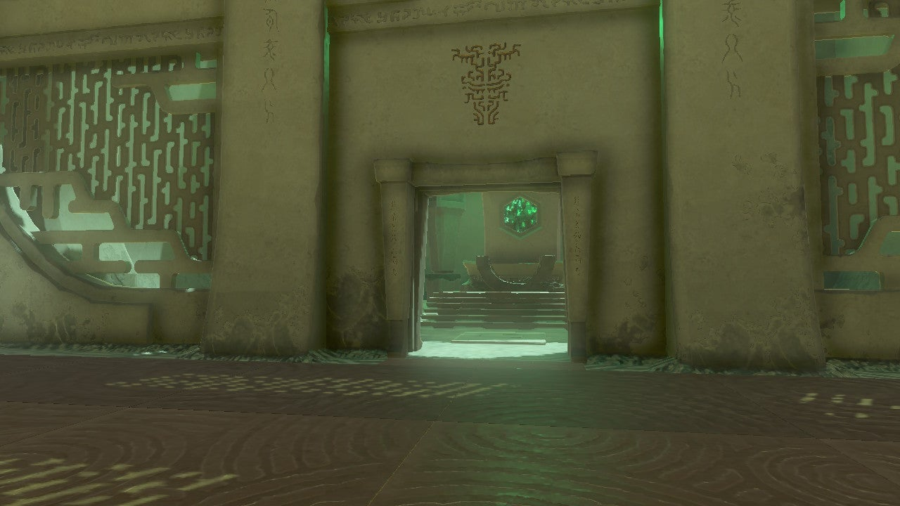

Kamatukis Shrine (**A Precise Strike**) in Zelda: Tears of the Kingdom is a shrine located in the Akkala region, specifically in Deep Akkala and is one of 152 shrines in TOTK (see all shrine locations). This page contains a guide for how to locate and enter the shrine, a walkthrough for the shrine itself, and puzzle solutions as well as treasure chest locations for the TotK Kamatukis shrine. 

### Treasure and Rewards

  * Mighty Zonaite Longsword

## Kamatukis Location

The Kamatukis shrine is on the southeast side of Skull Lake in Tempest Gulch. This location is northeast of Death Mountain and directly north (though far north) of the Ulri Mountain Skyview Tower. 

  * Coordinates: 3430, 3356, 0071

## A Precise Strike Walkthrough

Upon entering the shrine you'll find yourself in a large room with the exit to the right and a smaller room puzzle on the left. 

Let's head left first and get the shrine's treasure chest. 

### How to Get the Treasure Chest

Your goal is to get the ball into the moving port platform across the gap. It's too far for you to drop the ball in with Ultrahand. Instead, you need to fuse the metal iron box to the pendulum above it. 

Pull it back as shown below when the platform is approaching the center. You need to pull it back just the right amount. Too high forces the ball to move too quickly and it may bounce off the moving platform. 

If you miss the target or if the ball rolls out, you can use the switch to resummon the ball. You'll need to stop the pendulum so it doesn't accidentally knock off the ball after its been resummoned. 

Once the ball lands in its spot the gate to the treasure chest room opens. Inside the treasure chest you'll find a Zonaite Longsword. 

To exit the shrine, go back to the **main room**. Like before, attach the iron box to the pendulum. This time you'll want to pull the cube all the way back and up, as shown below. 

Release it and the ball goes flying and should roll into the target. If you need to try again you can hit the switch to the right of the pendulum to summon a new ball. 

With the gate open you can claim your Light of Blessing and exit the shrine. 

Kamatukis Shrine

Congrats on solving the shrine and earning a Light of Blessing! Click or tap here to return to the rest of the Shrine Guides. You can also check out which shrines are nearby with our shrine map filter on our complete map of Hyrule.

### Up Next: Walkthrough

Previous

About IGN's Zelda TotK Guide Writers

Next

Walkthrough

### Top Guide Sections

  * Walkthrough
  * Zelda: Tears of The Kingdom Switch 2 Edition Guide
  * Zelda Notes Voice Memories
  * List of Side Quests and Side Adventures

### Was this guide helpful?

Leave feedback

Go to comments