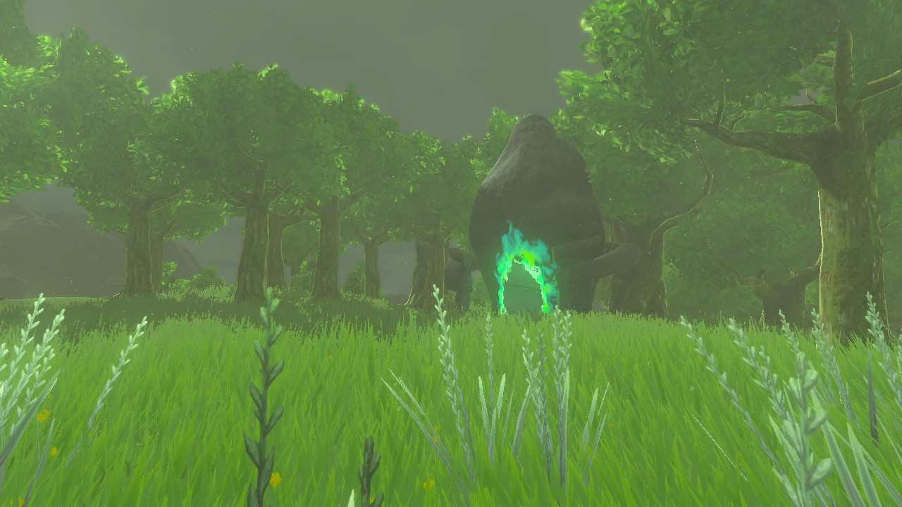
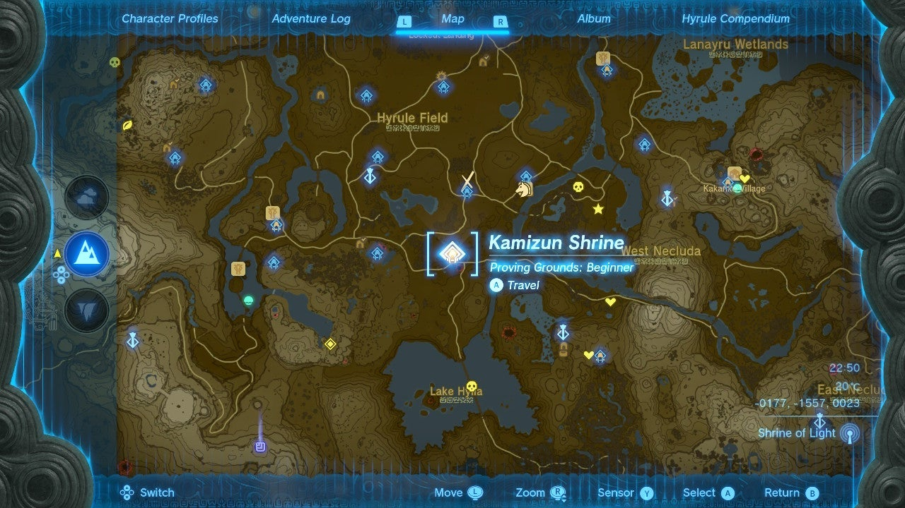
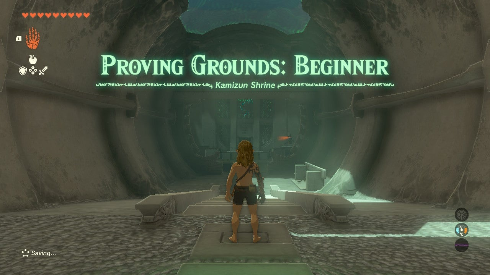
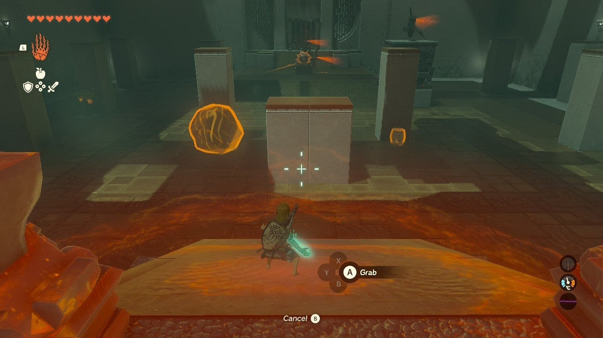
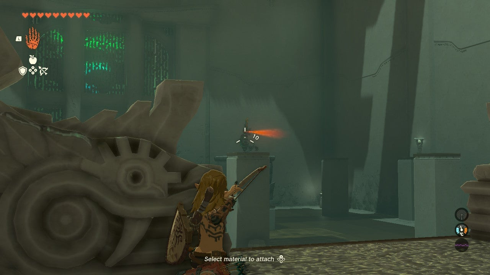
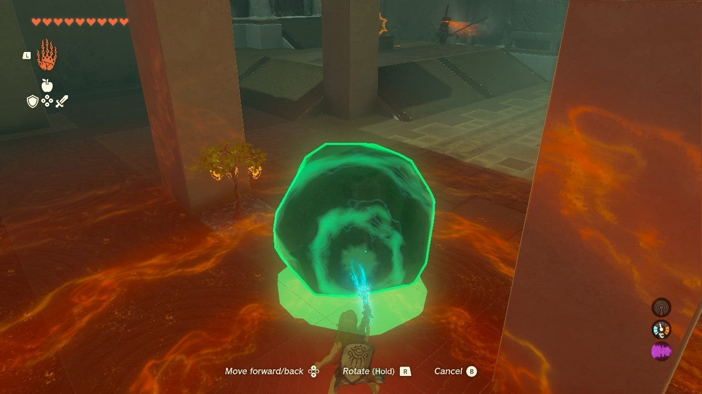
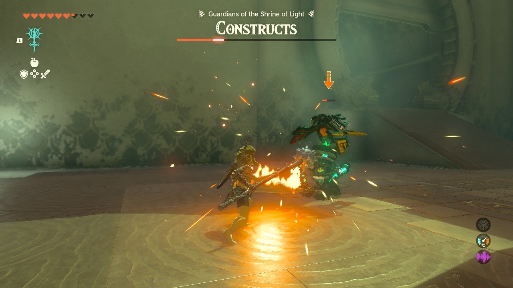
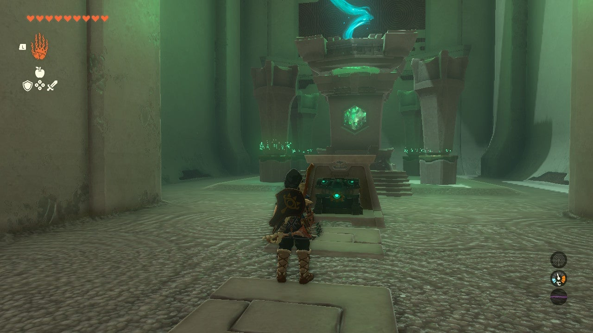

Kamizun Shrine (**Proving Grounds: Beginner**) in The Legend of Zelda: Tears of the Kingdom is a shrine located in the Central Hyrule Region's Hyrule Field and is one of 152 shrines in TOTK (see all shrine locations). This page contains a guide for how to locate and enter the shrine, a walkthrough for the shrine itself, and puzzle solutions as well as treasure chest locations for the TotK Kamizun shrine. 

### Treasure and Rewards

  * Spring Shield

## Kamizun Shrine Location

This shrine is nestled in the trees west of the East Post Ruins, just north of the road. 

  * Coordinates: -0177, -1557, 0023

## Kamizun Shrine Walkthrough

Kamizun Shrine challenges you to a Proving Grounds challenge, meaning all materials, equipment, and food are gone but will be returned at the end of the challenge, once you destroy all Constructs. You'll have to use what's provided instead and get crafty with your abilities. 

You'll find the following on the right wall near the entrance of the shrine: 

  * x10 Arrows
  * Old Wooden Bow
  * Old Wooden Shield
  * Wooden Stick

Up ahead in the challenge room are four Zonai Soldier Constructs you need to defeat. If you use Ultrahand, you'll also see a barrel behind a pillar on the right, a large stone on the left, a spike ball near the constructs in the middle, and a fire fruit plant on the far left to make fire arrows. You have limited resources, so make them count! 

We recommend taking out the soldier construct on the right that stands atop the platform first so that you won't have one constantly targeting you with arrows as you face the others. If you land all your regular shots you'll take it out with four arrows. 

You can also use a bit of stealth by moving slowly with the boulder and Ultrahand. It's crafty, but a goofy way to get to the Fire Fruit without getting spotted. 

Once all four of the constructs are defeated your items will be returned to you. Pass through the gate to get the shrine's treasure (Spring Shield) and collect your Light of Blessing. 

Kamizun Shrine

Congrats on solving the shrine and earning a Light of Blessing! Click or tap here to return to the rest of the Shrine Guides. You can also check out which shrines are nearby with our shrine map filter on our complete map of Hyrule.

### Up Next: Walkthrough

Previous

About IGN's Zelda TotK Guide Writers

Next

Walkthrough

### Top Guide Sections

  * Walkthrough
  * Zelda: Tears of The Kingdom Switch 2 Edition Guide
  * Zelda Notes Voice Memories
  * List of Side Quests and Side Adventures

### Was this guide helpful?

Leave feedback

Go to comments