Karahatag Shrine (**Drifting Flame**) in Zelda: Tears of the Kingdom is a shrine located in the Southern Oasis in the Gerudo Desert region and is one of 152 shrines in TOTK (see all shrine locations). This page contains a guide for how to locate and enter the shrine, a walkthrough for the shrine itself, and puzzle solutions as well as treasure chest locations for the TotK Karahatag shrine. 

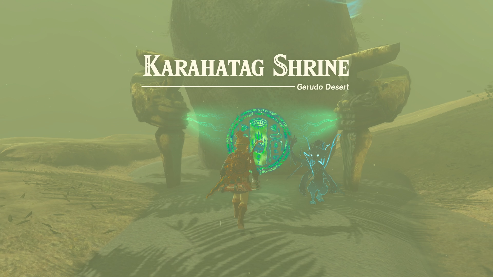

### Karahatag Treasure and Rewards

  * Construct Bow

## Karahatag Location

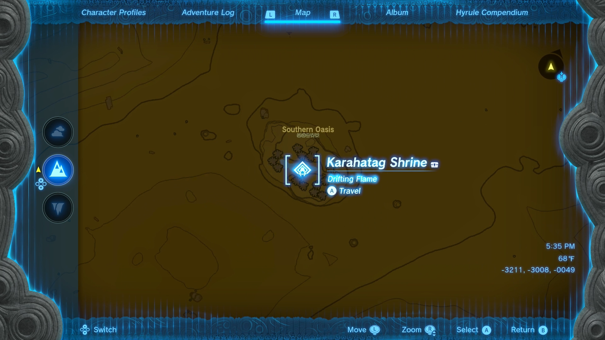

Karahatag Shrine is located in the Southern Oasis in Gerudo Desert, southwest of Gerudo Canyon Skyview Tower. Climb the ledge at the Southern Oasis to find the shrine. 

  * Coordinates: -3728, -3625, 0043

## Karahatag Walkthrough and Puzzle Solutions

In the first room, pick up and equip the torch. Light the torch by hitting the flame. Aim for the hole in the hanging pillar, and throw your lit torch to hit it and open the door. 

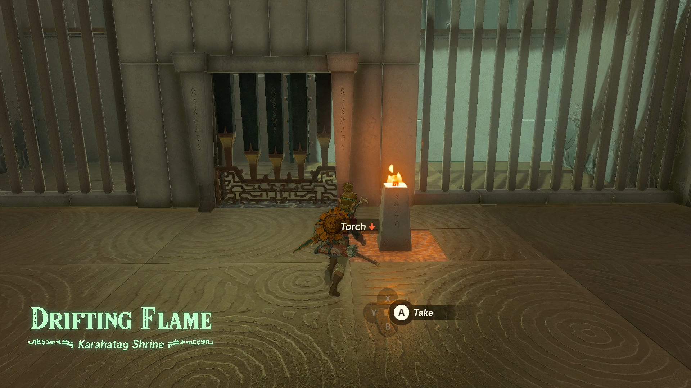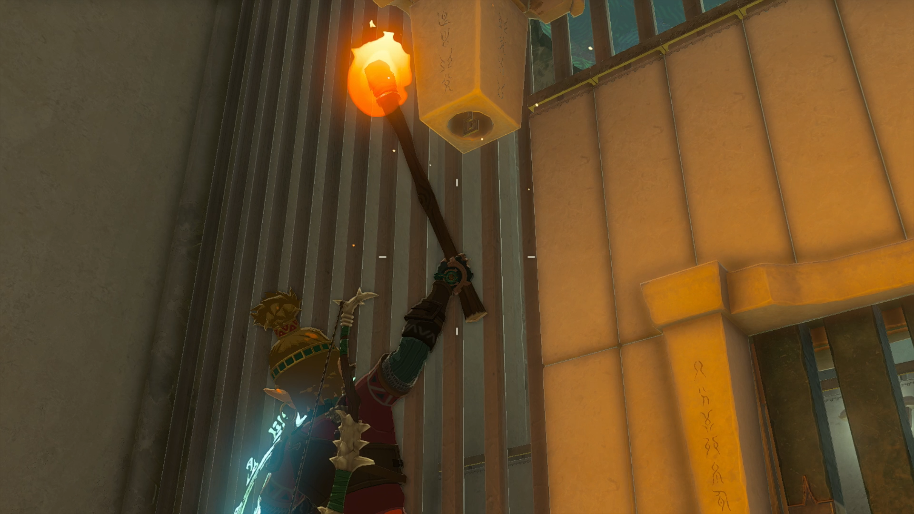

Enter the next room and climb up the ladder. Run past the square button and head to the lit flame on the right. Turn back to face the room you came from, and use the Paraglider to travel to the area below the platform. You’ll find a treasure chest with a Construct Bow of varying quality inside. 

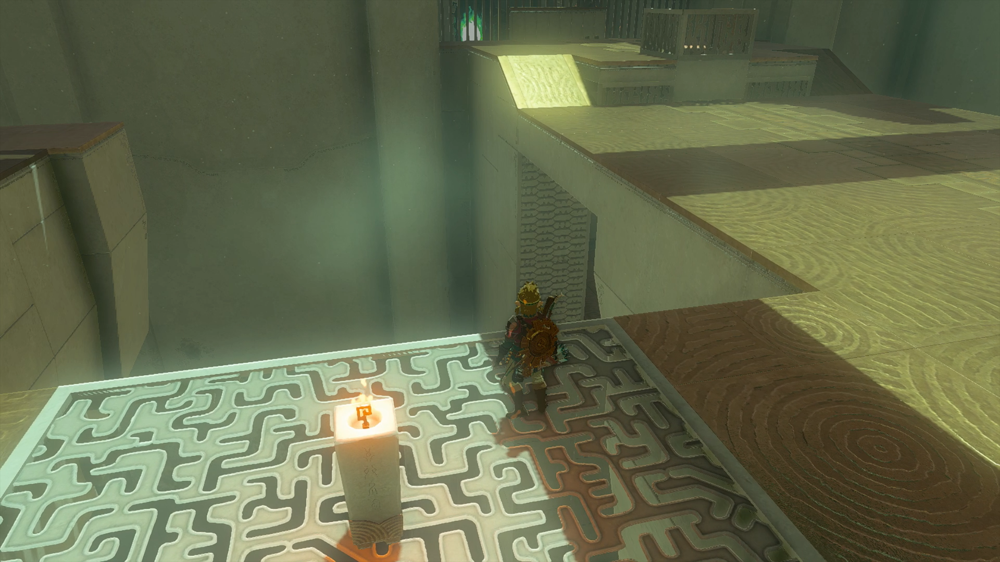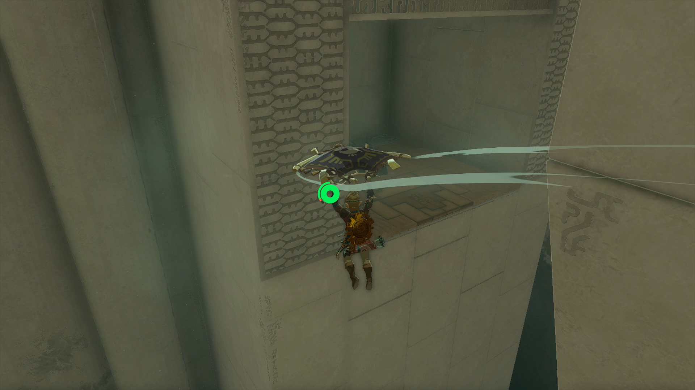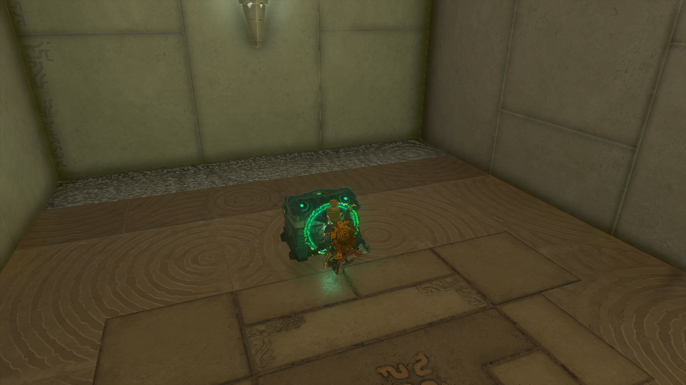

Ascend back up to the level above. 

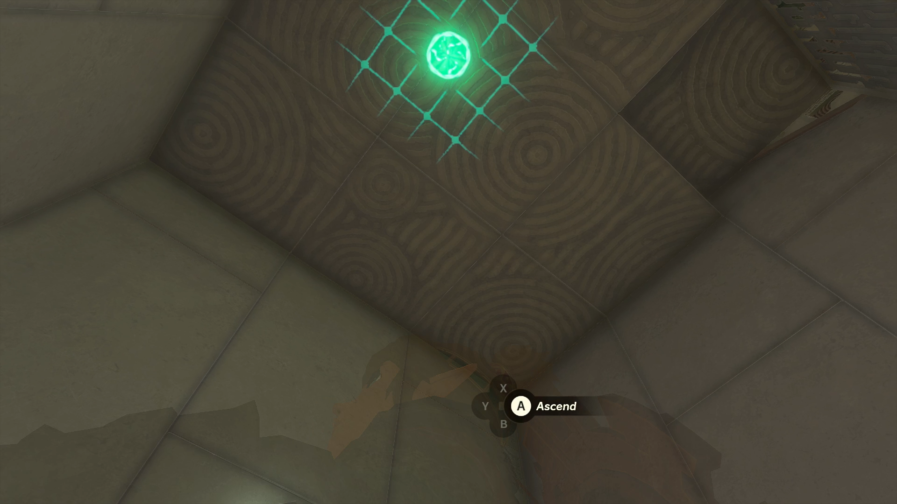

To solve this puzzle, use Ultrahand to grab and move the flame to the square under the hanging pillar on the right. Continue holding the object with Ultrahand and lift it up into the opening. 

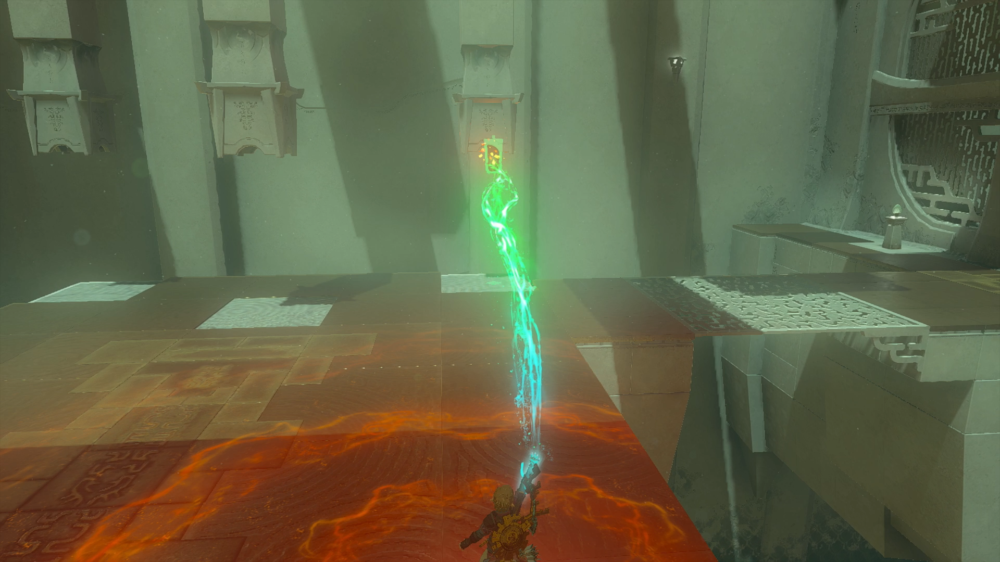

Set down the flame back on the square, and head to the floor button behind you. Step on the button and quickly use Recall on the flame to reverse the object along its previous path. Stay standing on the button as the flame makes its way back up to light the pillar. 

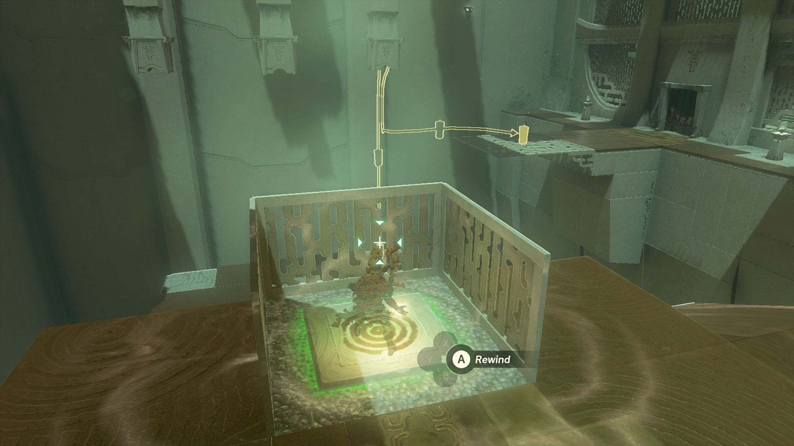

Repeat this process for the middle pillar and the left pillar. 

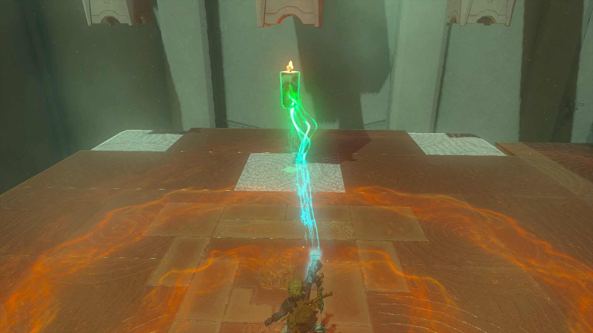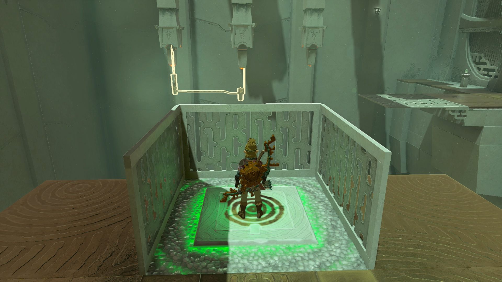

Once you light all three pillars with the flame, the door will open. Exit the shrine. 

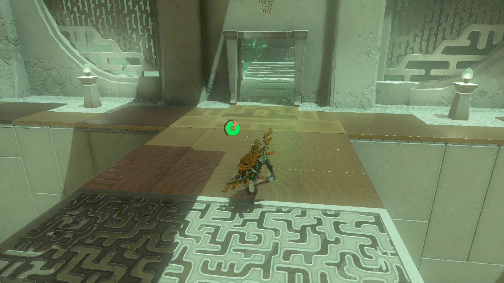

Karahatag Shrine

Congrats on solving the shrine and earning a Light of Blessing! Click or tap here to return to the rest of the Shrine Guides. You can also check out which shrines are nearby with our shrine map filter on our complete map of Hyrule.

### Up Next: Walkthrough

Previous

About IGN's Zelda TotK Guide Writers

Next

Walkthrough

### Top Guide Sections

  * Walkthrough
  * Zelda: Tears of The Kingdom Switch 2 Edition Guide
  * Zelda Notes Voice Memories
  * List of Side Quests and Side Adventures

### Was this guide helpful?

Leave feedback

Go to comments