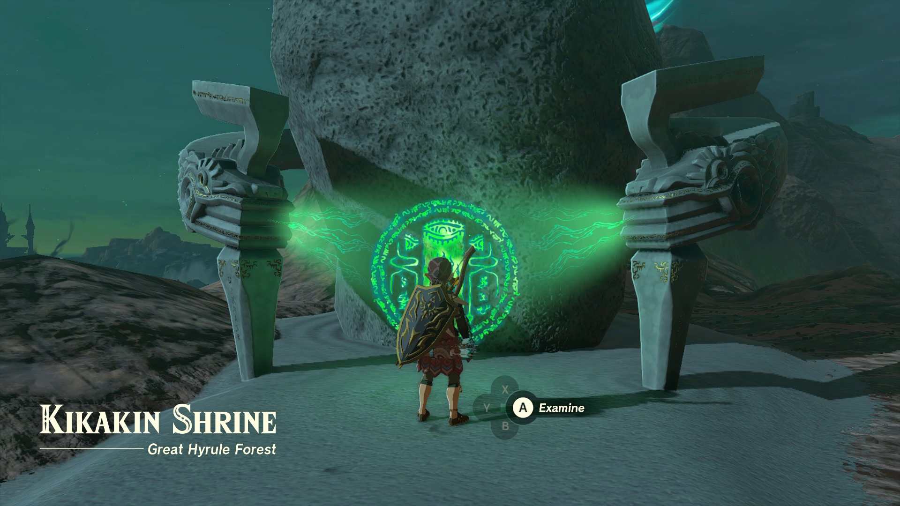

Kikakin Shrine (Shining in Darkness) in The Legend of Zelda: Tears of the Kingdom is a shrine located in the Great Hyrule Forest region. This page contains a guide for how to locate and enter the shrine, a walkthrough for the shrine itself, and puzzle solutions as well as treasure chest locations for the TotK Kikakin shrine. 

### Treasure and Rewards

  * Opal
  * Luminous Stone
  * Amber
  * Zonaite Bow

## Location/How to Reach

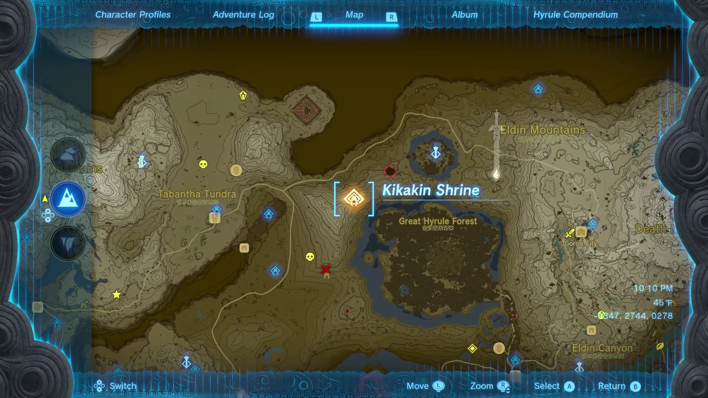

The Kikakin Shrine is located northwest of the Great Hyrule Forest, on top of the mountain range northeast of Mount Drena. 

  * Coordinates: -0396, 2735, 0287

## Walkthrough and Puzzle Solutions

The Kikakin Shrine is an unusual one. Shrouded in darkness, and maze-like, it can be hard to find your way around without a map, so we made one! 

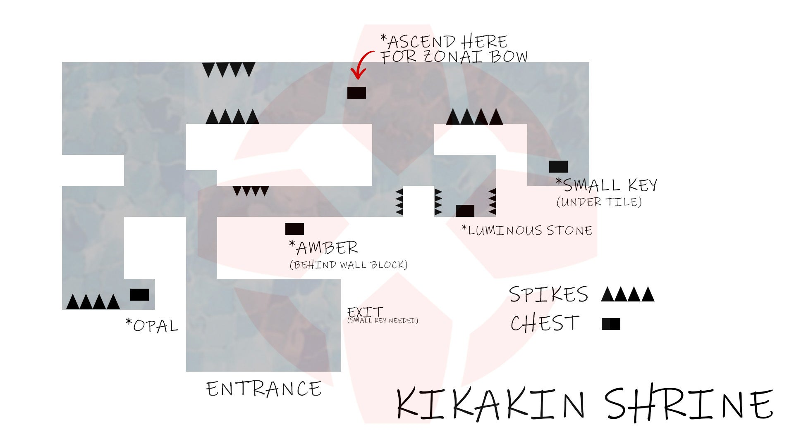

Another odd thing about this shrine is that there are five treasure chests, instead of the usual singular one. One of those chests contains a small key that you need to complete the shrine, and the other four contain various valuable stones (an opal, a luminous stone, and an amber) and a Zonaite Bow. 

Upon entering the shrine, you’re given a singular Zonai Device, a Light. You can use Ultrahand to control the Light, hold it above Link’s head, or fuse it to a shield to hold in front of you. 

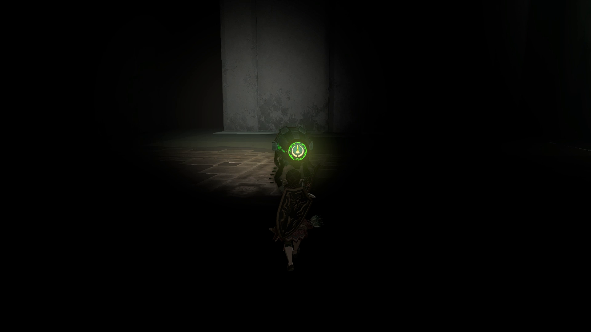

But honestly, the much easier way to solve this shrine is to use Brightbloom Seeds. When you throw a Brightbloom Seed, it illuminates a great area around it, so it makes it perfect to make your way around this shrine. If you don’t have any, we recommend grabbing some in a cave, where they usually grow. But you can still complete this shrine without them if you prefer. 

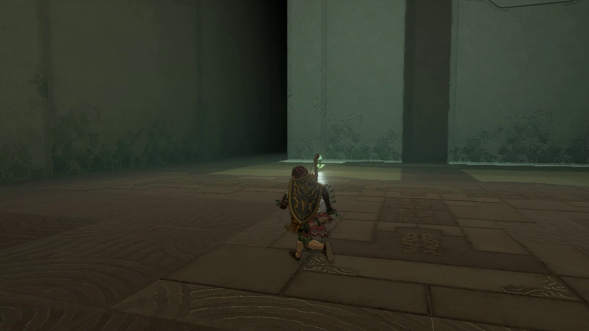

Keep in mind that if you fuse the Light to something else, it will wear down the durability of it, so you can lose your Light AND your shield with no way to see around you, so use caution! 

After you enter the shrine, you’ll see a large room in front of you with the final shrine exit on your right side. Continue forward from the entrance while hugging the left wall, and take the first left. 

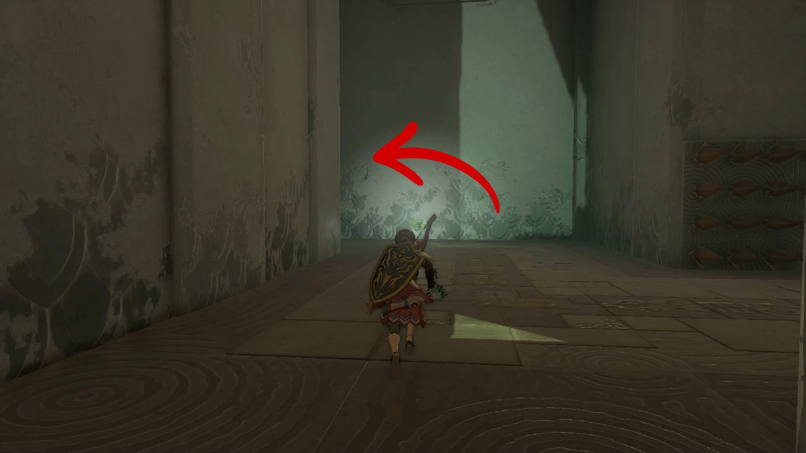

Take one more left, and you’ll see a chamber with three laser beams in front of you. If you trigger one of the beams, the spiked wall at the end of the chamber will begin to move towards you, so just go around them! 

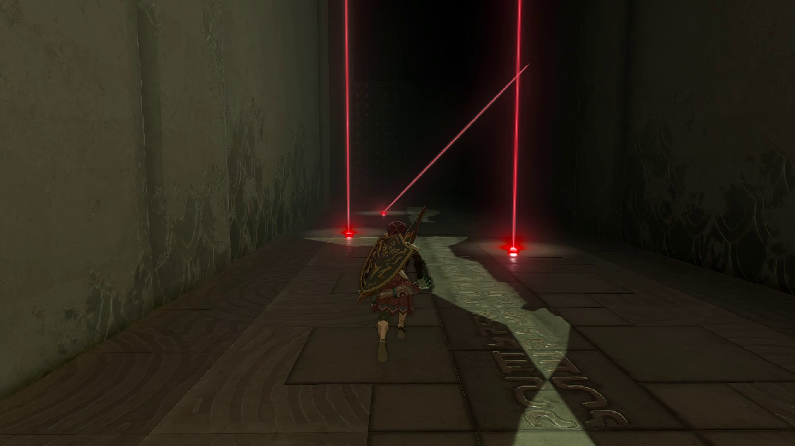

Keep going past the lasers until you see a small alcove on your left with a chest containing an opal. 

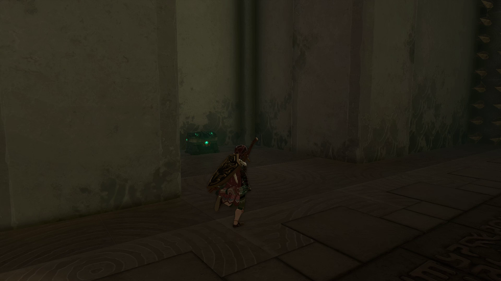

Exit the chamber the same way you came in, past the lasers. As soon as you’re past the lasers, turn back right and go straight. At this point, the way back to the entrance hall is on your right, and a wall of spikes is on your left. 

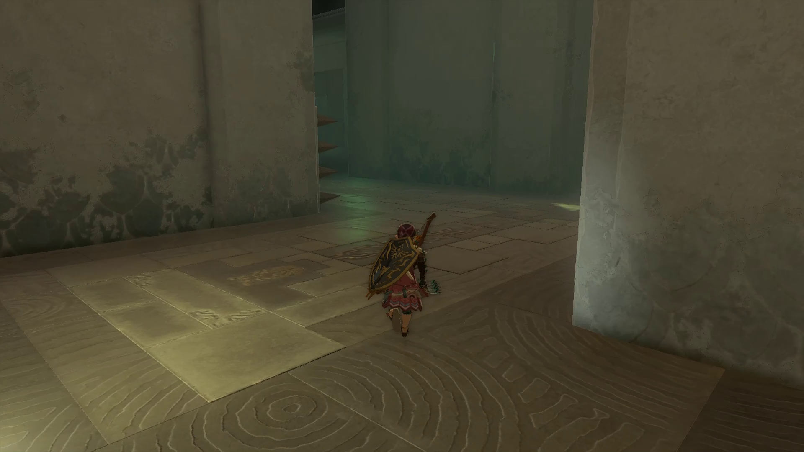

On the right side of the hallway (across from the wall of spikes), you’ll see a pattern on the wall. Activate Ultrahand and pull the block out of the wall, revealing a treasure chest behind it. Use the block to climb up to the chest and grab an amber. 

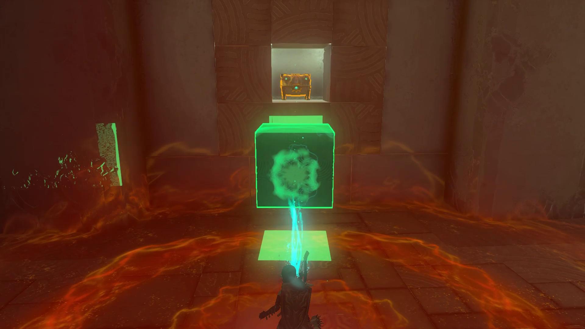

Drop back down into the hallway, and take a right. You’ll come to a dead end with spikes in front of you. 

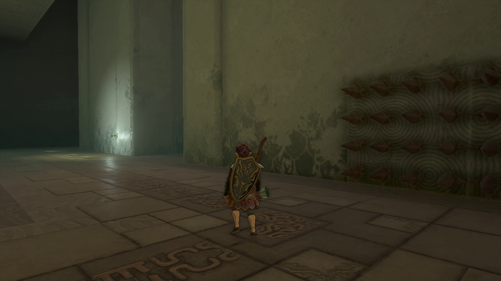

Take a left at the spikes and continue on until you reach the wall in front of you, with a path leading in either direction. Take a left first, and look up. When you’re right next to a hole in the low ceiling, use Ascend. 

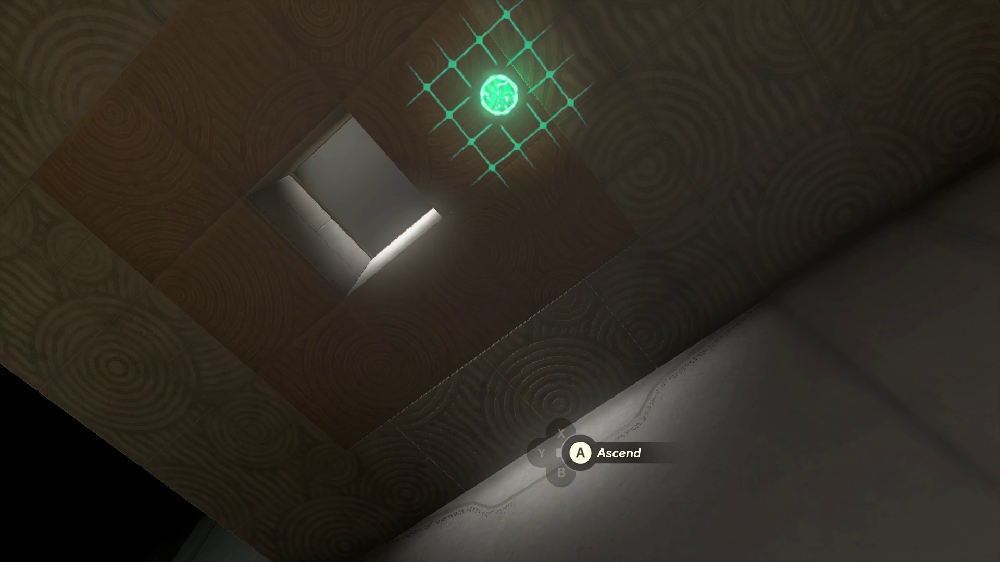

On top of this new platform there will be another Zonai light and a treasure chest containing the Zonaite Bow. 

Drop back down through the hole in the platform, and you’ll be in a hallway between two sets of moving spikes, one set on just one wall, and another set on both walls. Go in the direction towards the one set of moving spikes. 

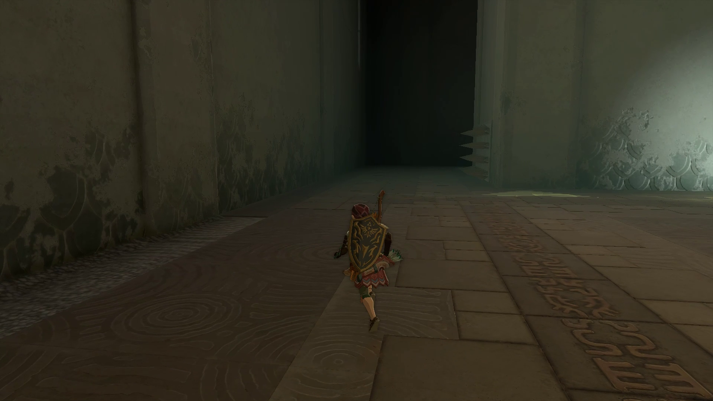

The spikes will be moving in and out towards you from your right side. Take the next right after the spikes, and you’ll see a floor tile in the middle of a pattern. 

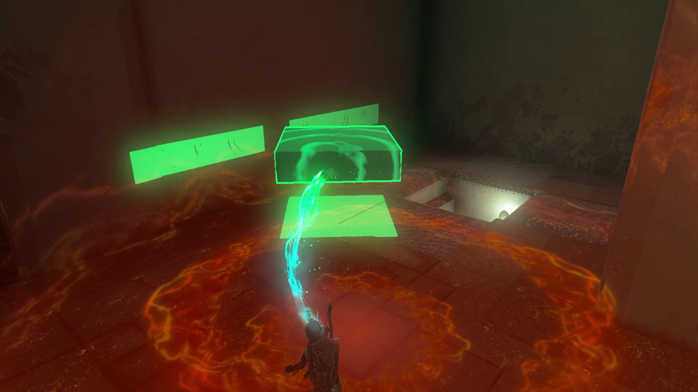

Use Ultrahand to move the tile and open the chest underneath for the Small Key that will let you complete the shrine. But we still have one more treasure to get before then! 

Turn around and go back down the hallway, this time, with the moving spikes on your left. Take your first left after the spikes, and immediately take another left to enter the last treasure chamber. 

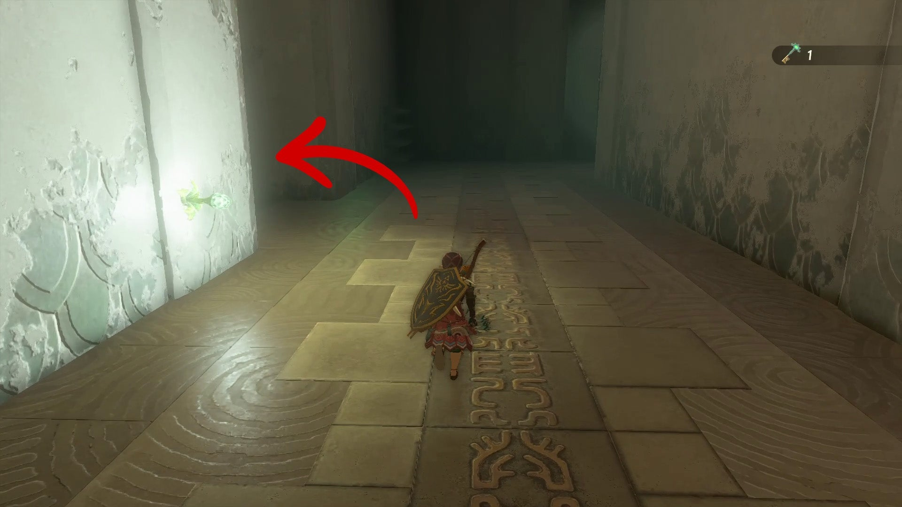

This time, both walls have moving spikes, so be careful not to run into them. Grab the luminous stone from the chest and turn around. 

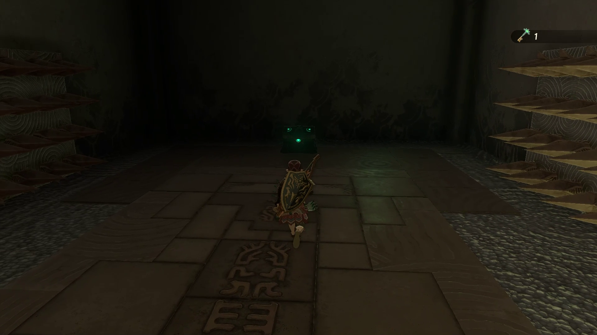

Take a left after getting through the double wall of spikes, and then take another left at the intersection. You should see a wall of spikes on your left side. Take a right down the hallway (the wall where you pulled the block out should be on your left) and continue on until you can make another left. 

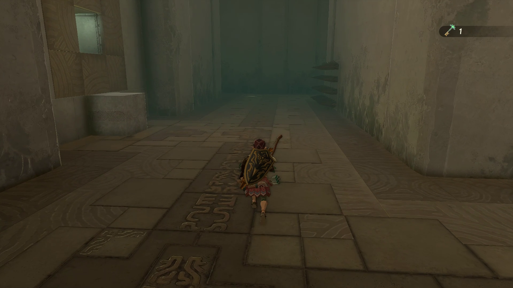

You’re back in the entrance hall now! Go to your left and you’ll see the door that the Small Key opens, and the exit of the shrine. 

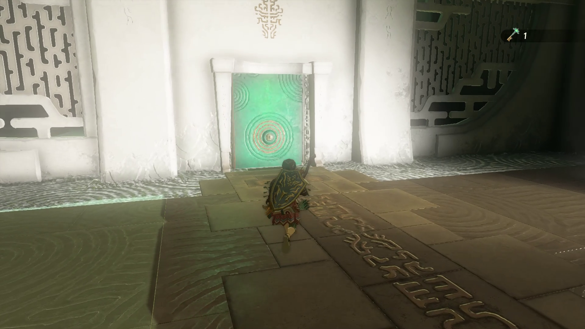

You did it! Go on through and collect your Light of Blessing! You certainly earned it… 

Kikakin Shrine

Congrats on solving the shrine and earning a Light of Blessing! Click or tap here to return to the rest of the Shrine Guides. You can also check out which shrines are nearby with our shrine map filter on our complete map of Hyrule.

### Up Next: Walkthrough

Previous

About IGN's Zelda TotK Guide Writers

Next

Walkthrough

### Top Guide Sections

  * Walkthrough
  * Zelda: Tears of The Kingdom Switch 2 Edition Guide
  * Zelda Notes Voice Memories
  * List of Side Quests and Side Adventures

### Was this guide helpful?

Leave feedback

Go to comments