Kimayat Shrine (**Proving Grounds: Smash**) in Zelda: Tears of the Kingdom is a shrine located in the Deep Akkala region and is one of 152 shrines in TOTK (see all shrine locations). This page contains a guide for how to locate and enter the shrine, a walkthrough for the shrine itself, and puzzle solutions as well as treasure chest locations for the TotK Kimayat shrine. 

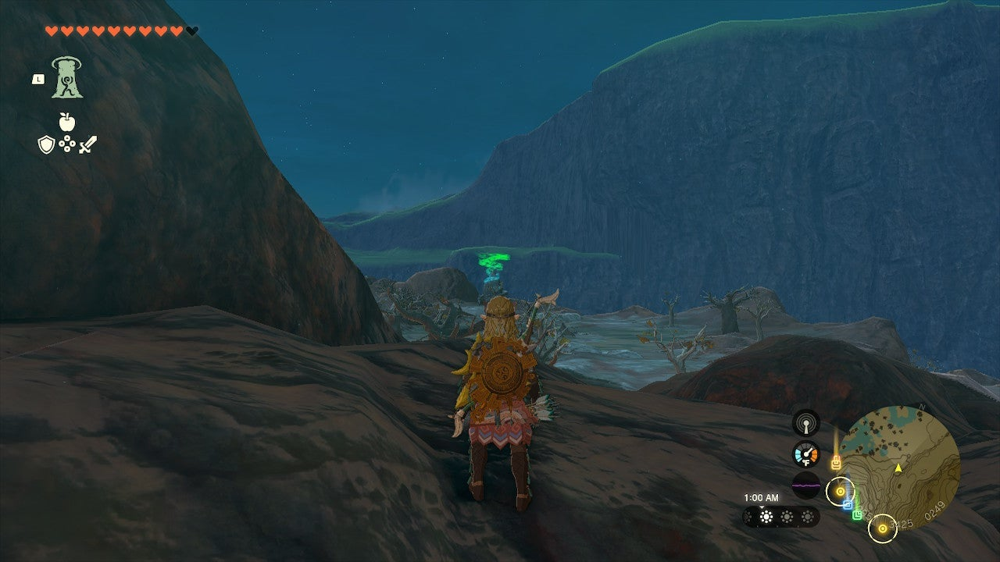

This page contains a guide for how to locate and enter the shrine, a walkthrough for the shrine itself, and puzzle solutions as well as treasure chest locations for the TotK Kimayat shrine. 

### Treasure and Rewards

  * **Captain II Reaper**

##  Kimayat Shrine Location

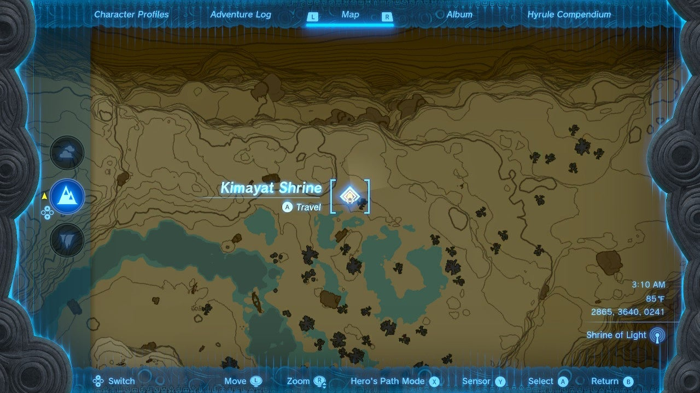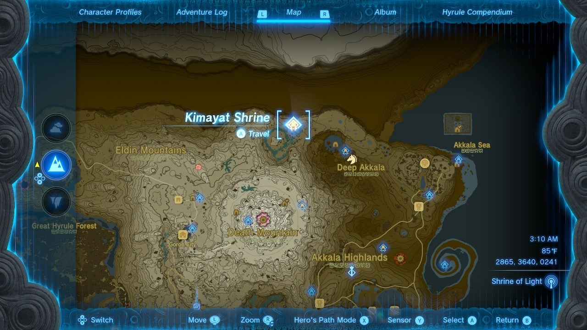

Kimayat Shrine is in plain sight on the surface just north and east of the Death Mountain peak. It will be a hike to reach it from any tower. If you have access to Momosik Shrine on Death Mountain you can float down from there. Otherwise, it is a long journey from Ulri Mountain Skyview Tower to far north Deep Akkala. 

  * Coordinates: 2863, 3637, 0241

## Kimayat Shrine Walkthrough

Kimayat Shrine challenges you to another Proving Grounds challenge, meaning all materials, equipment, and food are gone but will be returned at the end of the challenge, once you destroy all Constructs. 

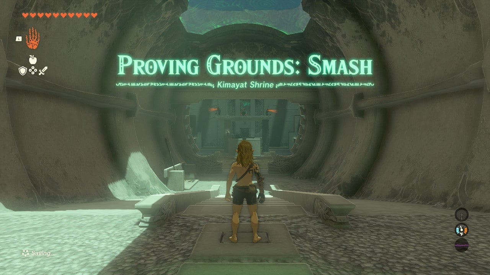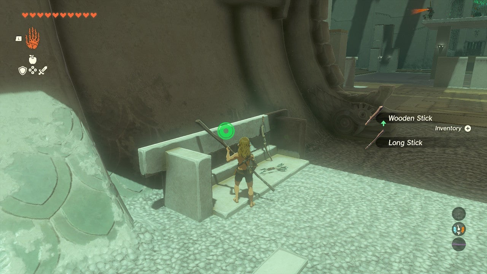

The goal of this shrine is to take care of the roving constructs first, then use Ice Fruit to make an ice platform in the pool under the center platform to reach the cracked column and destroy it to kill the remaining archers. Easy, right? 

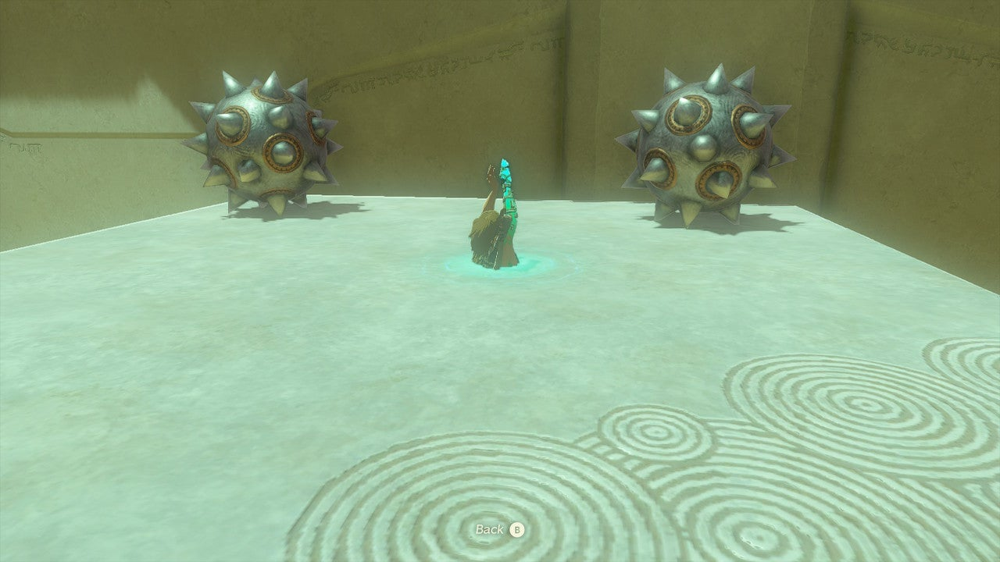

Don’t waste any Ice Fruit! It’s located in the corners of the room. Start by getting your first weapons on the left side of the hallway at the start, and then stay left and hug the wall, running from enemies until you reach the platform with the slab above and two spiked balls above that. Ascend up. 

Fuse a stick with one of the spiked balls here. 

Now you will want to keep moving to avoid the archers, and keep Ascending up through this platform, paragliding off, and using slow motion to headshot the constructs below. 

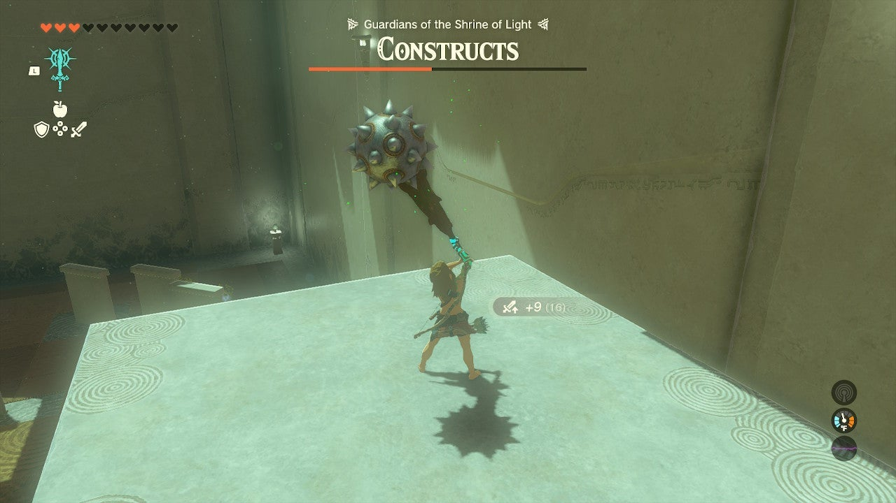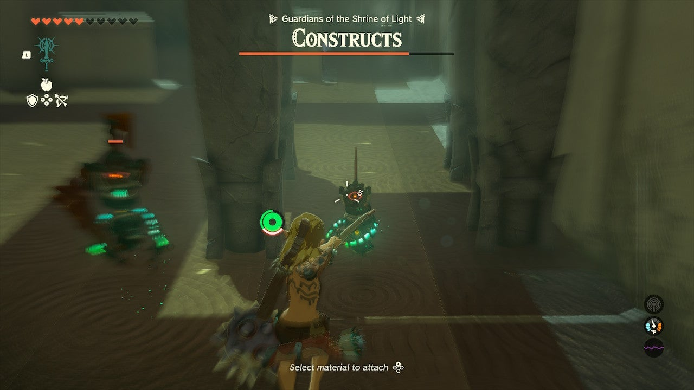

Knock a group down and then you can finish them off with the spiked club. Ascend up if they pursue you and repeat. 

You can do this on both sides of the arena to kill all four roving constructs. The archers should be leaving you tons of arrows as they miss you from a distance. 

Now, fuse an Ice Fruit to an arrow and fire it at the base of the cracked stone pillar. Swim over. 

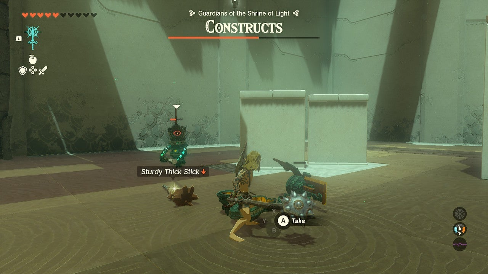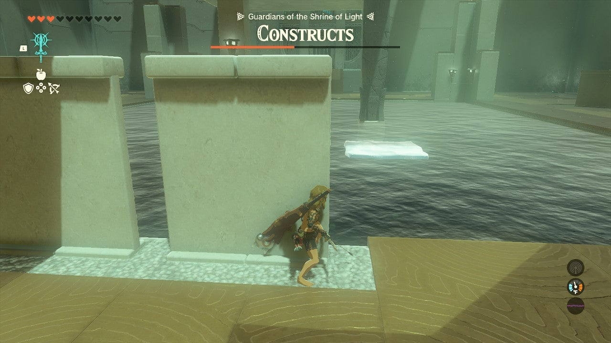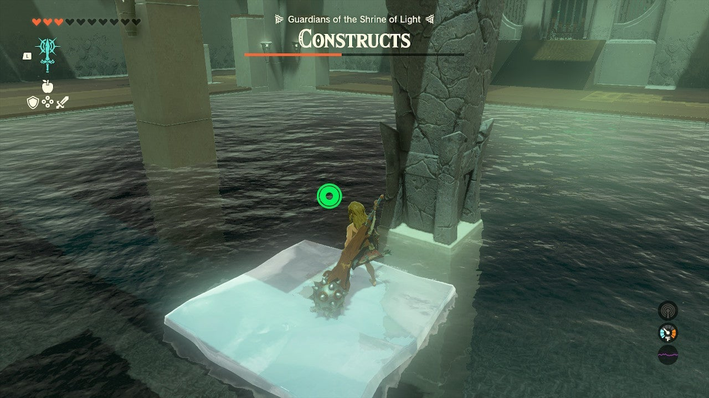

Climb on the platform and attack the stone pillar with your spike club to bring it down and finish the combat challenge. Smash! 

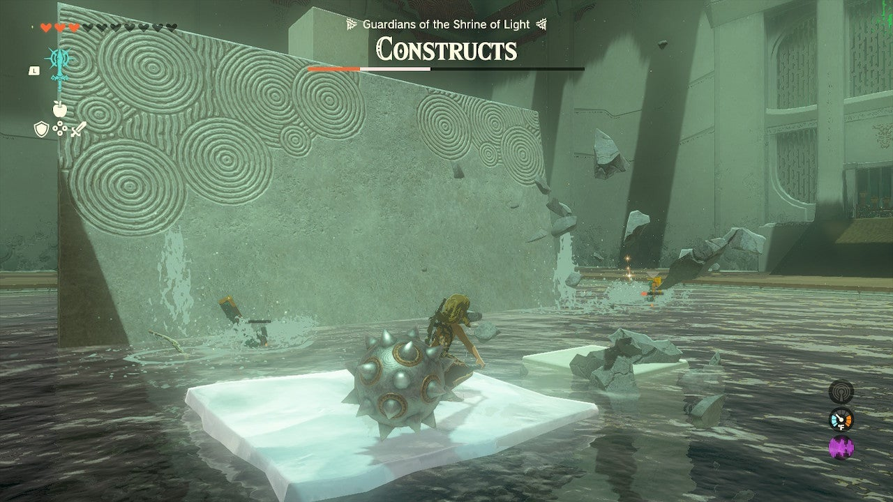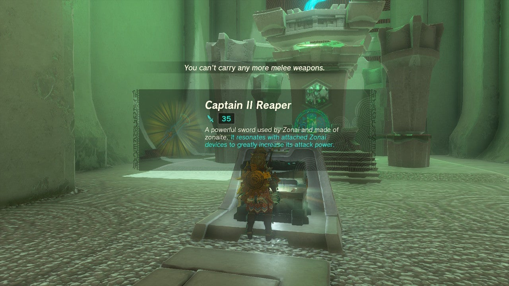

Don’t forget to open the chest and claim your **Captain II Reaper** on your way to the exit. 

Kimayat Shrine

Congrats on solving the shrine and earning a Light of Blessing! Click or tap here to return to the rest of the Shrine Guides. You can also check out which shrines are nearby with our shrine map filter on our complete map of Hyrule.

### Up Next: Walkthrough

Previous

About IGN's Zelda TotK Guide Writers

Next

Walkthrough

### Top Guide Sections

  * Walkthrough
  * Zelda: Tears of The Kingdom Switch 2 Edition Guide
  * Zelda Notes Voice Memories
  * List of Side Quests and Side Adventures

### Was this guide helpful?

Leave feedback

Go to comments