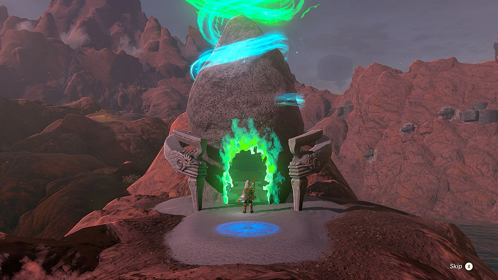
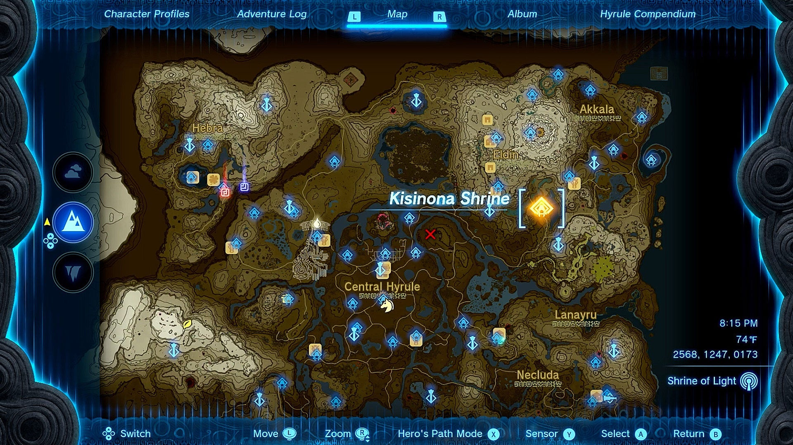
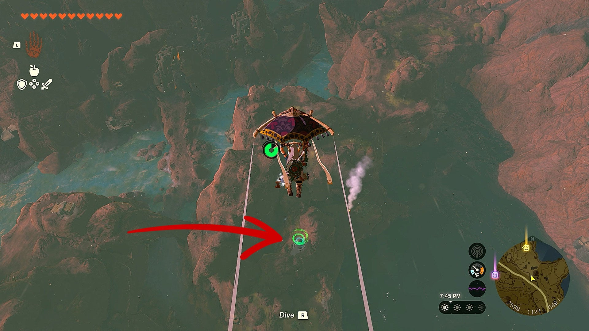
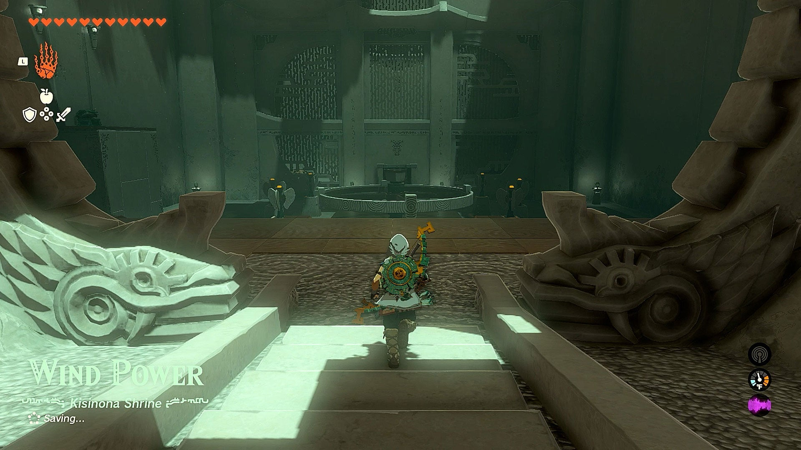
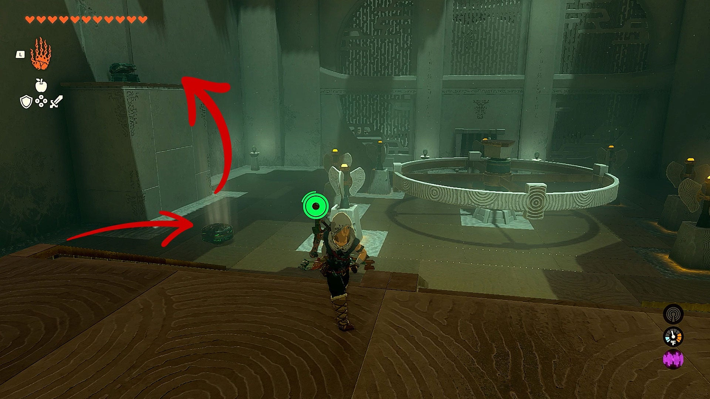
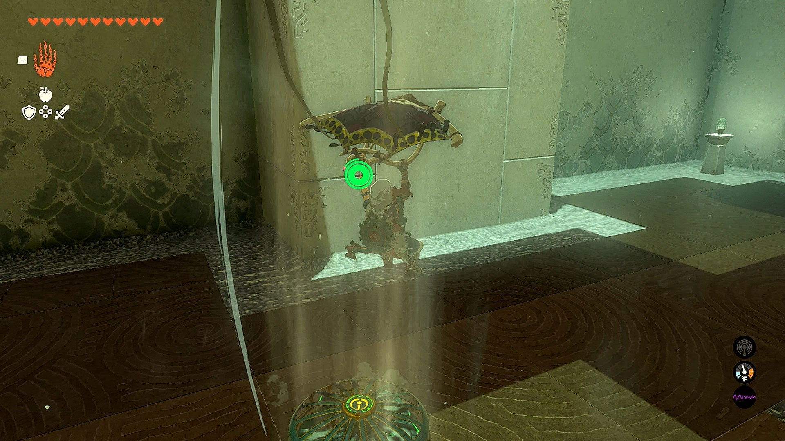
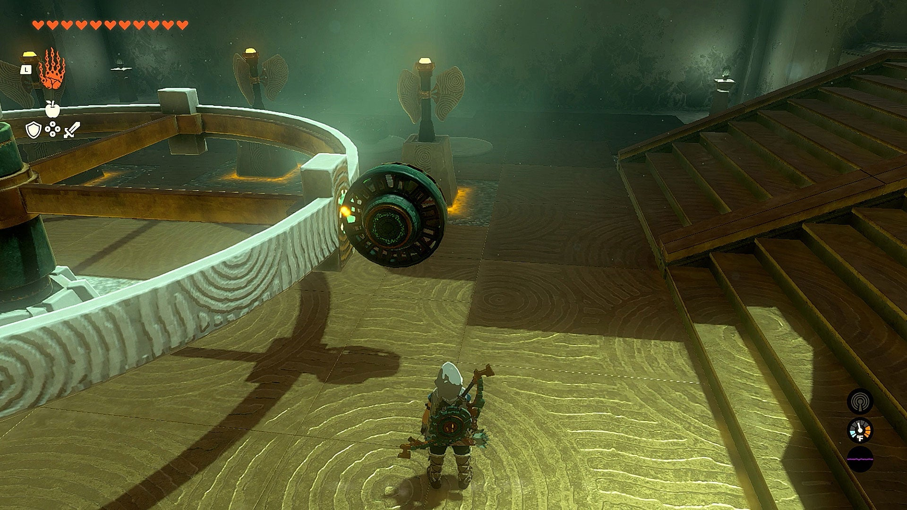
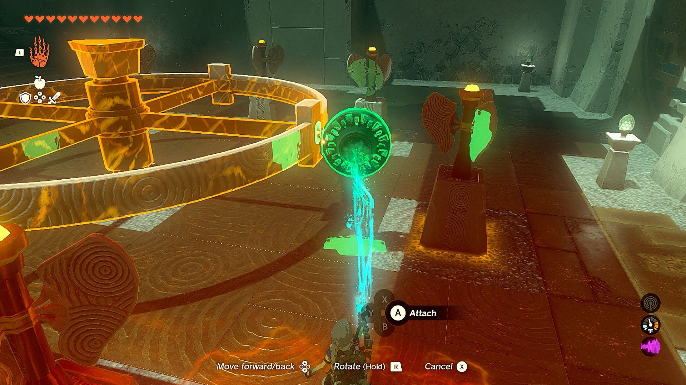
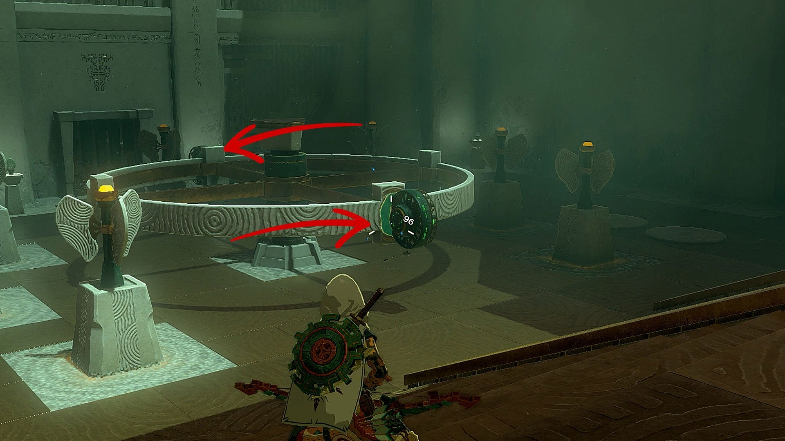
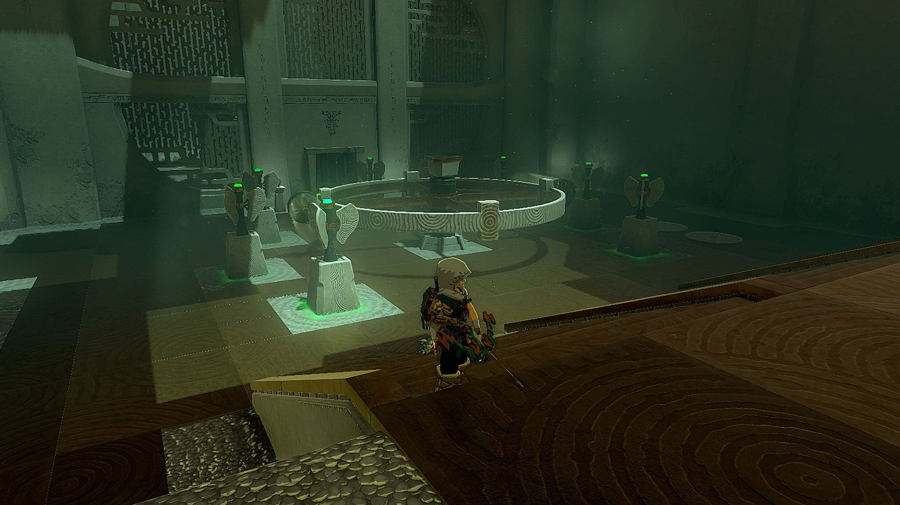

Kisinona Shrine (**Wind Power**) in Zelda: Tears of the Kingdom is a shrine located in the Eldin Canyon region and one of 152 shrines in TOTK (see all shrine locations). This page contains a guide for how to locate and enter the shrine, a walkthrough and puzzle solutions for the shrine itself, as well as how to get the treasure chest inside. 

### Treasure and Rewards

  * Mighty Construct bow

## Kisinona ShrineLocation

Kisinona Shrine is located in the Eldin Canyon region, northeast of Central Hyrule. It is just slightly northwest of Upland Zorana Skyview Tower. 

  * Coordinates: 2568, 1247, 0173

## Kisinona Shrine Puzzle Walkthrough

Entering the Kisinona Shrine is a very simple task, as it’s easily located at the top of some foothills between Lake Ferona and Cephla Lake. 

Once inside, you’ll see that the Shrine is just one giant room. You’ll see a spinning wind turbine and a few fans laying on the ground to the right. The chest is on the left side of the room. 

Using **Ultra Hand** , grab one of the fans and place it near the edge where the chest sits. Have it blow upwards. 

Hit it to activate the fan, and then jump and use your paraglider to have the updraft from the fan blow you into the air, where you can land on the chest platform and open the chest which contains a Contruct Bow. 

Now onto the big wind turbine. You need it to spin and activate all the surrounding pillars within a short amount of time. You’ll need both fans to accomplish this. Using **Ultra Hand** , grab one fan, have it fan forward, and attach it to the side of the wind turbine. 

Now take the other fan, and do the extract same thing, but on the opposite side of your first fan. 

Now activate the device by hitting it with a weapon or shooting it with your arrow, and when done correctly, the device will spin and activate all of the pillars quickly. Doing this will open the door, allowing you to walk inside and claim the Light of Blessing! 

Kisinona Shrine

Congrats on solving the shrine and earning a Light of Blessing! Click or tap here to return to the rest of the Shrine Guides. You can also check out which shrines are nearby with our shrine map filter on our complete map of Hyrule.

### Up Next: Walkthrough

Previous

About IGN's Zelda TotK Guide Writers

Next

Walkthrough

### Top Guide Sections

  * Walkthrough
  * Zelda: Tears of The Kingdom Switch 2 Edition Guide
  * Zelda Notes Voice Memories
  * List of Side Quests and Side Adventures

### Was this guide helpful?

Leave feedback

Go to comments