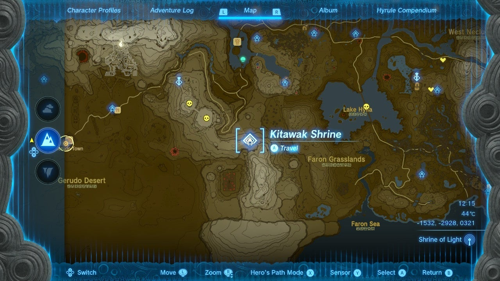
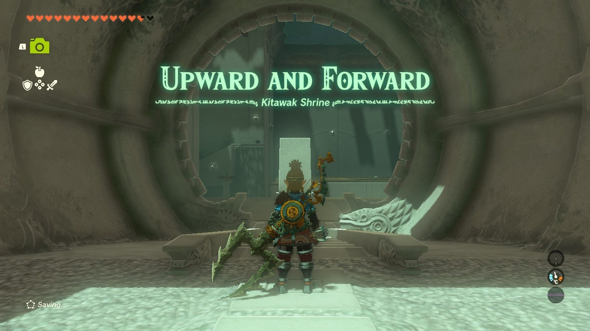
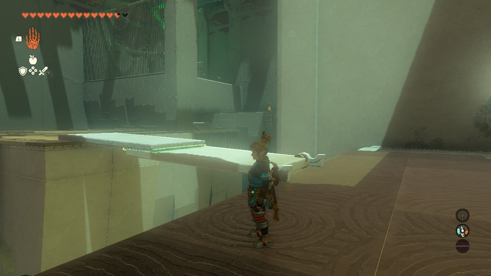
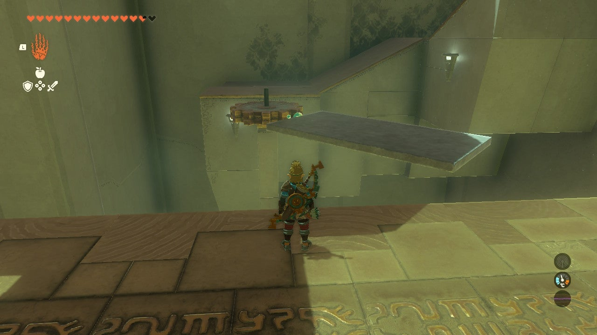
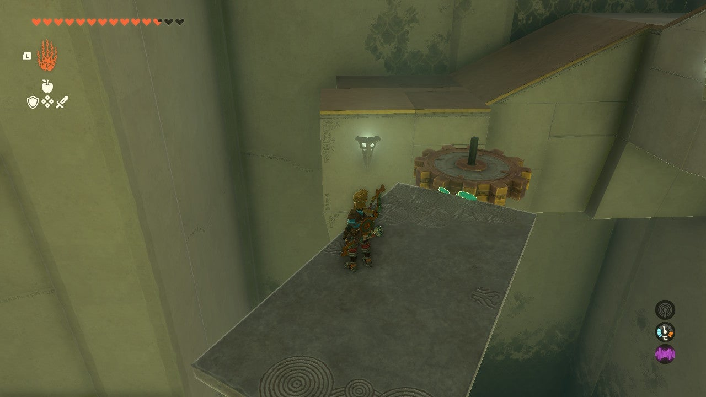
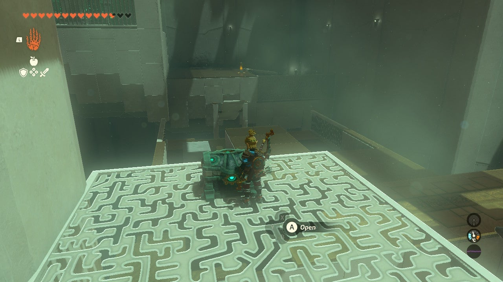
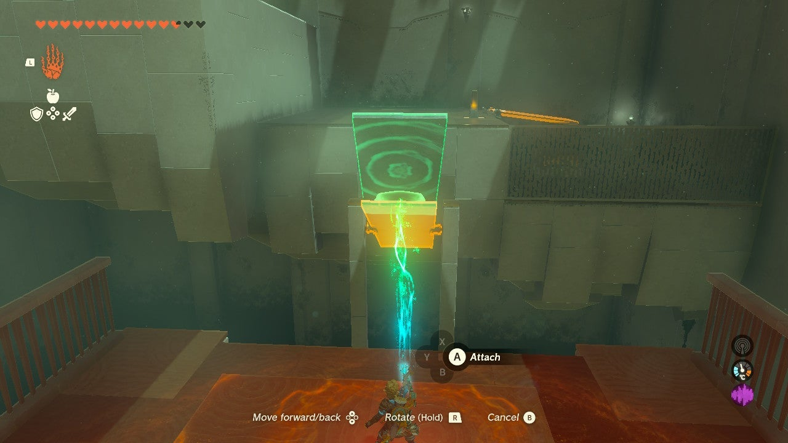
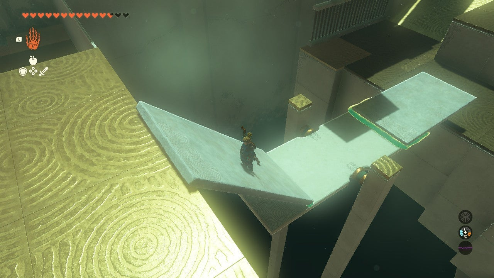
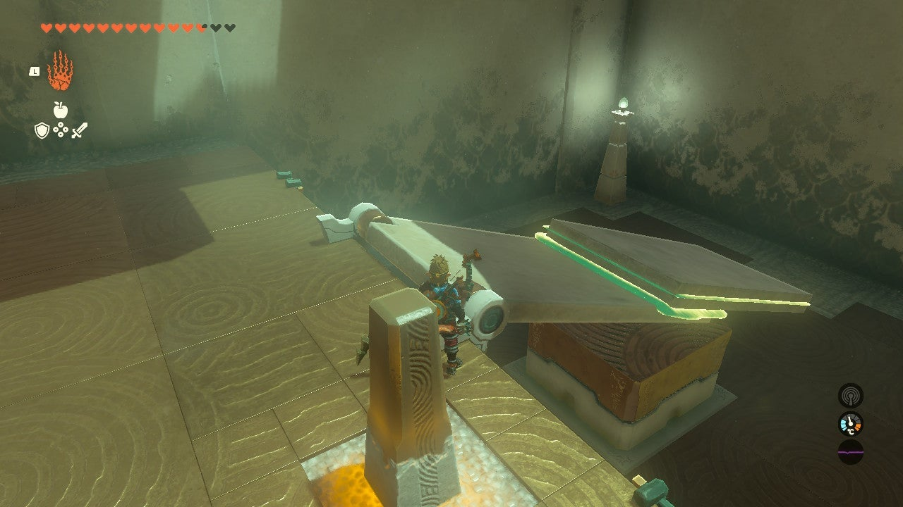
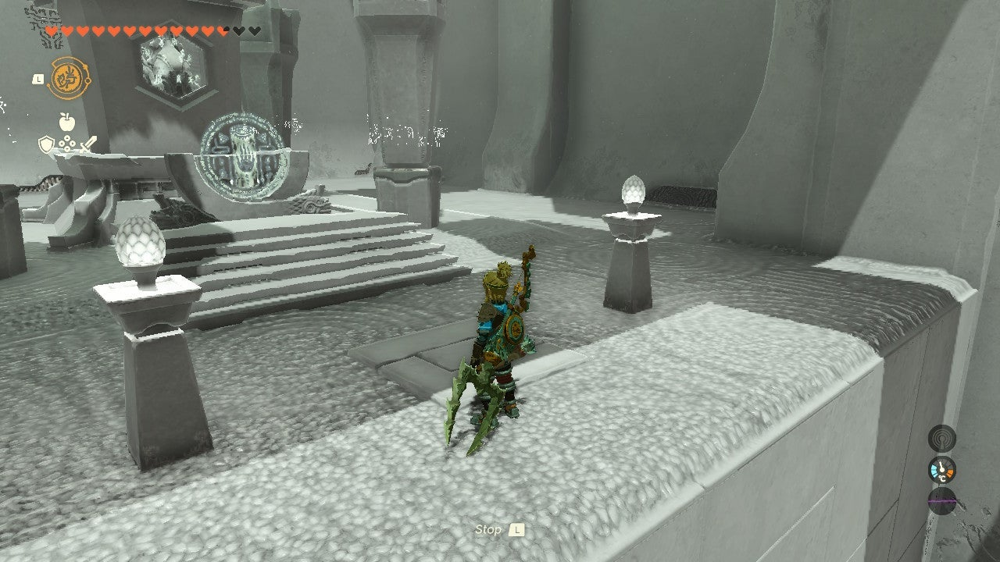

Kitawak Shrine (**Upward and Forward**) in The Legend of Zelda: Tears of the Kingdom is a shrine located in the Gerudo Highlands and one of 152 shrines in TOTK (see all shrine locations). This page contains a guide for how to locate and enter the shrine, a walkthrough for the shrine itself, and puzzle solutions as well as treasure chest locations for the TotK Kitawak shrine. 

### Treasure and Rewards

  * x10 Arrows

## Kitawak Shrine Location

Kitawak shrine sits atop the East Gerudo Mesa along the Gerudo Highlands. 

**Note** : You'll need Heat Resistance armor or elixir to get to this area.

  * **Coordinates** : -1529, -2928, 0321

## Kitawak Shrine Puzzle Walkthrough

Let's get started. The introduction puzzle in the Kitawak shrine requires you to use the stone slab platform leaning on the right wall and attach it to the other that stands upright before the gap. 

You can push the one standing up with Ultrahand, but it won't stay don't without added weight. Ensure you attach the free one on the farther edge of the platform so that it creates a bridge long enough to cross once it all falls forward. 

### How to Get the Kitawak Shrine Treasure Chest

After completing the first puzzle and crossing your platform, look left. You'll see a solo spinning gear that stands before a platform going up. At its top is the chest. To get to it, detach the stone slab platform from the bridge you just crossed. Attach it to the outer rim of the gear. Wait for it to come back around, hop on, then cross to the lone treasure chest platform. 

You'll find x10 Arrows in the chest. Not the most exciting, but they're always helpful to have. Glide down and it's time to move onto the next puzzle. 

First, go ahead and detach that first stone slab from the spinning gear. Walk over to the side of the room to the right of the entrance. This time the new platform target is suspended in the air and acts like a seesaw. 

Stand atop the higher ledge that overlooks the gap and attach a stone slab to the seesaw so that it tilts toward you and **lands on the ground**. This can be done from the lower ground, but it's a little easier to see what you're doing with Ultrahand when you're higher up. 

Next, use Ultrahand to pick up the second stone slab and hold it directly in front of you. Turn it vertically once so that it creates a ramp. Slowly walk across the platform and attach it to the far end of the seesaw **to create a bridge that goes up**. It's ok if it doesn't completely touch the wall! The seesaw component will tilt forward as you walk up the new ramp. 

You're close to the exit. For this final part, turn back to the ramp you made and pull free both stone slabs. Bring them to your platform and stack them on each other. Then, lift the weighty pair and attach them to the flipper slab angled down, **toward its last third**. 

You've gotta fling yourself across and up to the wall with the shrine exit! Hit the power pillar to launch the platform up (no need to be on it yet, let's save some arrows!). 

Go stand on the edge of your latest construction, use Recall on the base flipper stone slab, and get ready to glide once you're flung into the air. 

Land on the platform of the shrine exit and you can collect your Light of Blessing. 

Kitawak Shrine

Congrats on solving the shrine and earning a Light of Blessing! Click or tap here to return to the rest of the Shrine Guides. You can also check out which shrines are nearby with our shrine map filter on our complete map of Hyrule.

### Up Next: Walkthrough

Previous

About IGN's Zelda TotK Guide Writers

Next

Walkthrough

### Top Guide Sections

  * Walkthrough
  * Zelda: Tears of The Kingdom Switch 2 Edition Guide
  * Zelda Notes Voice Memories
  * List of Side Quests and Side Adventures

### Was this guide helpful?

Leave feedback

Go to comments