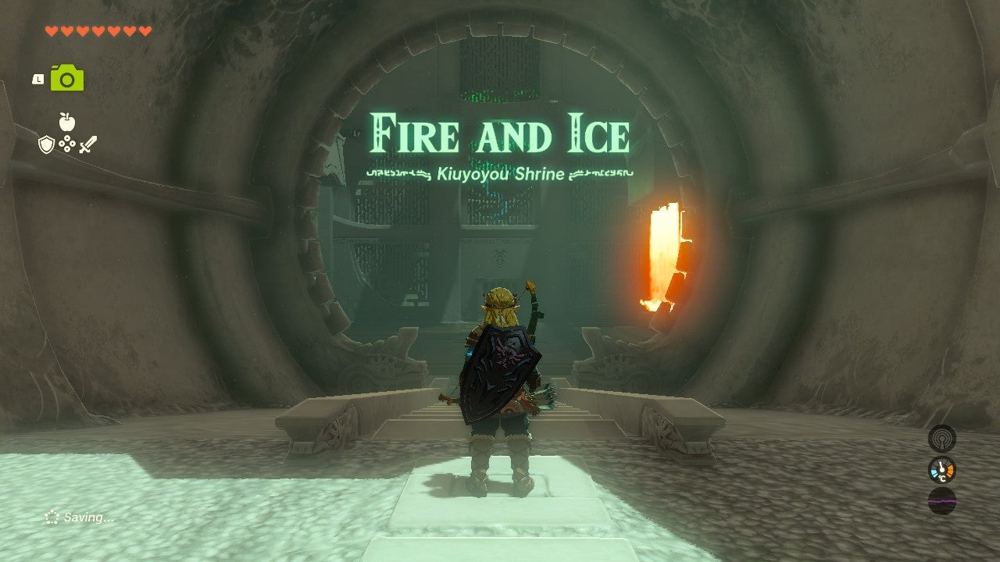
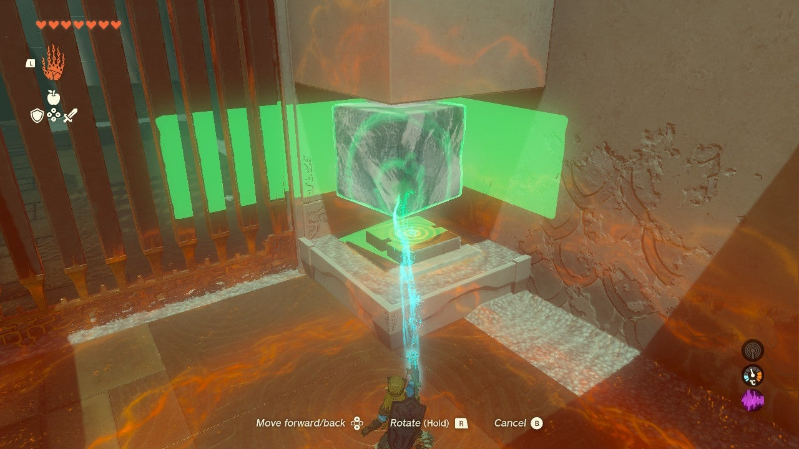
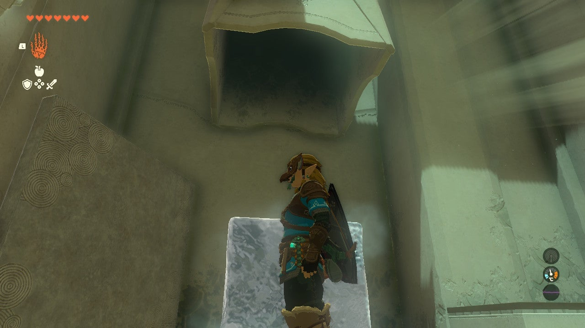
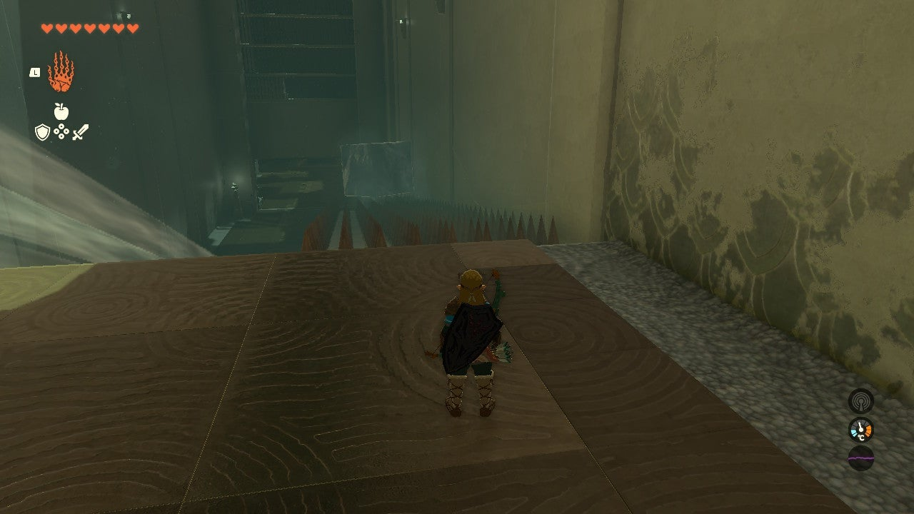
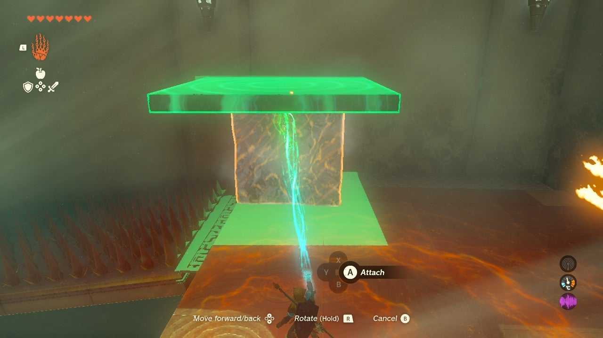
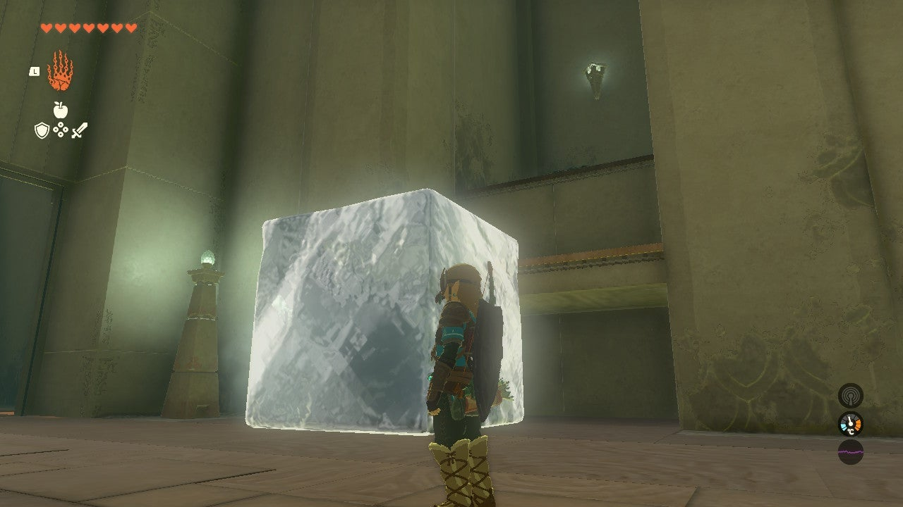
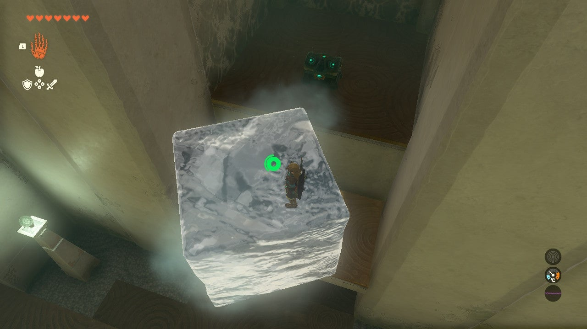
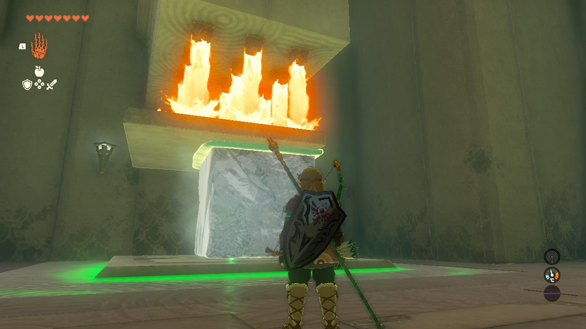

Kiuyoyou Shrine (Fire and Ice) in The Legend of Zelda: Tears of the Kingdom is a shrine located in the **Hyrule Ridge and Tabantha Frontier** Region, specifically in Great Hyrule Forest's Rowan Plain. This shrine sits oddly on the border between the regions. 

This TotK guide teaches you how to locate and enter the Kiuyoyou Shrine and includes a walkthrough for the shrine itself and puzzle solutions, as well as treasure chest locations. 

Kiuyoyou Shrine Treasure and Rewards

Zonaite Spear

## Kiuyoyou Shrine Location in Zelda TotK

The Kiuyoyou Shrine is located on the Rowan Plain in The Legend of Zelda: Tears of the Kingdom, far northeast from Lindor's Brow Skyview Tower. 

  * **Coordinates** : -1105, 2086, 0104

Go To Map

Hyrule Map

## Fire and Ice Kiuyoyou Shrine Walkthrough and Puzzle Solutions

In the left corner of the room, you'll see a button that needs to be weighed down in order to open the large gate next to it. Use Ultrahand to grab the large ice block and dip it **briefly** in the columns of flames on the other side of the room to melt it so that it's small enough to fit into the button's alcove. 

Place the ice block on the button to open the gate. 

Next, ride the air current up the long room to the higher platform. You'll see the gigantic ice cubes continuously dropping and melting in a fire. Use Ultrahand and you'll see a large metal plate right next to the ice cube machine. 

Use it to**block the fire right after an ice cube completely melts** to get a full-sized one. 

Use Ultrahand to drag the ice cube to the spike ramp and let it go. It'll slide down unharmed. 

Wait a few moments and a second ice cube appears. Move it away from the fire, but don't let it slide down yet. **Use Ultrahand to move the large metal plate and attach it to the top of the ice.** Then, slide the combination down on the ramp. 

You cannot slide the metal plate down on its own. 

Glide down and use the first of the two ice cubes to reach the **treasure chest** by climbing the ice to get to the first higher ledge then using Ultrahand to grab the ice and move it to the ledge. 

Climb it again to reach the chest. 

Now, back to the ice and metal plate. Grab the structure with Ultrahand and, ensuring the ice is covered by the metal plate, put it under the first set of fire plumes. 

With the ice protected the combined weight of your structure will push down a hidden large button that releases the gate to the exit. 

Proceed through the open doorway and collect your Light of Blessing.

Kiuyoyou Shrine

Click or tap here to return to see the rest of the Shrine Guides.

### Up Next: Walkthrough

Previous

About IGN's Zelda TotK Guide Writers

Next

Walkthrough

### Top Guide Sections

  * Walkthrough
  * Zelda: Tears of The Kingdom Switch 2 Edition Guide
  * Zelda Notes Voice Memories
  * List of Side Quests and Side Adventures

### Was this guide helpful?

Leave feedback

Go to comments