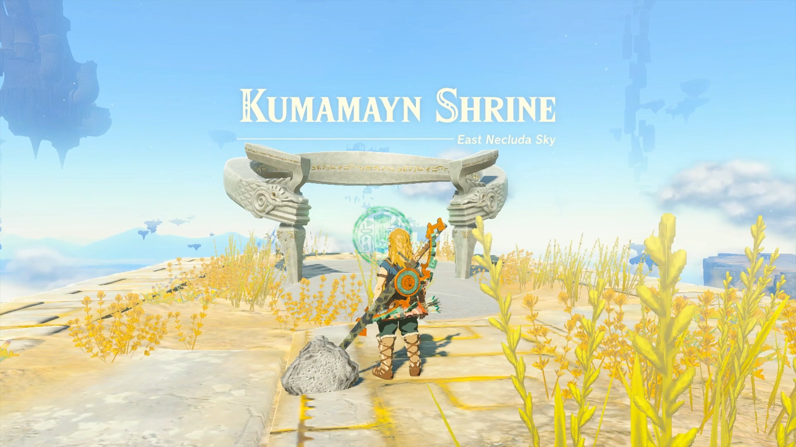

Kumamayn Shrine (Rauru’s Blessing) in Zelda: Tears of the Kingdom is a shrine located on a sky island in the East Necluda Sky region. This page contains a guide for how to complete The Necluda Sky Crystal shrine quest for the TotK Kumamayn shrine. 

### Kumamayn Treasure and Rewards

  * Zonaite Bow

## Kumamayn Location/How to Reach

Kumamayn Shrine is located in the Necluda Sky Archipelago, east of Rabella Wetlands Skyview Tower. 

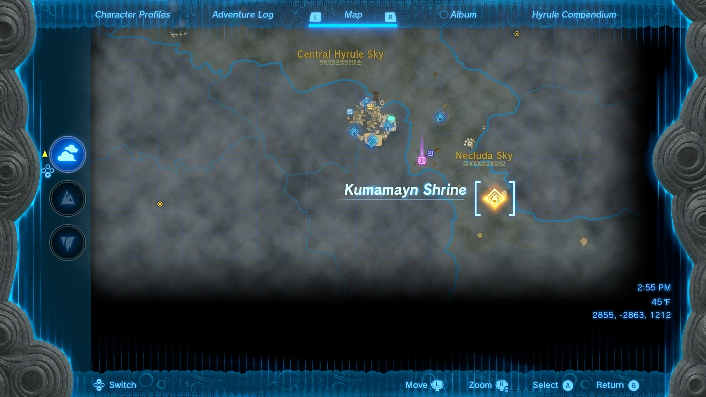

Launch into the sky from the Rabella Wetlands Skyview Tower and use your Paraglider to head east. Find a floating platform with two stacked springs. Climb on top of the springs and hit to launch yourself into the sky. 

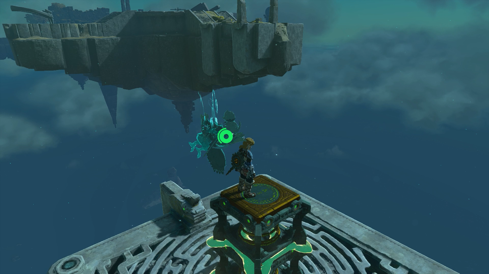

Glide to the next sky island to activate the green hand at the shrine location. This will begin the Necluda Sky Crystal shrine quest. 

## The Necluda Sky Crystal

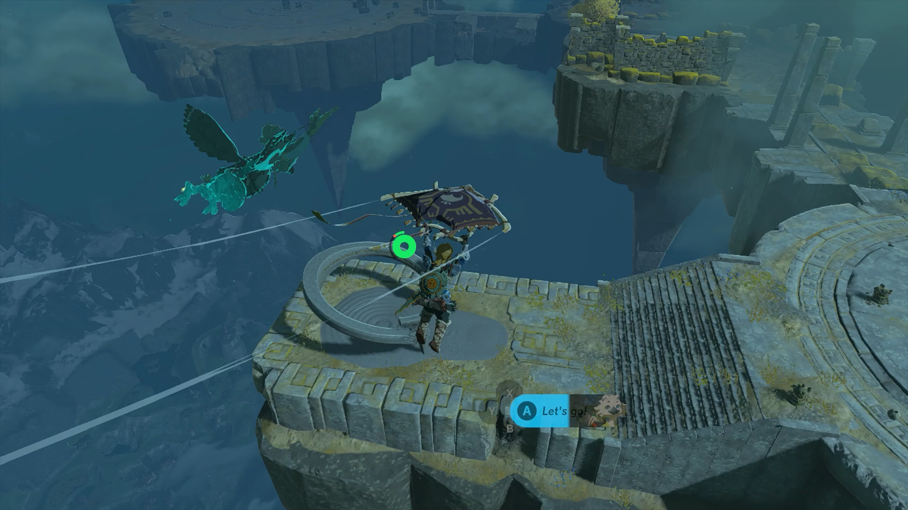

Head east to the edge of the sky island. Use the Paraglider to reach the next island. 

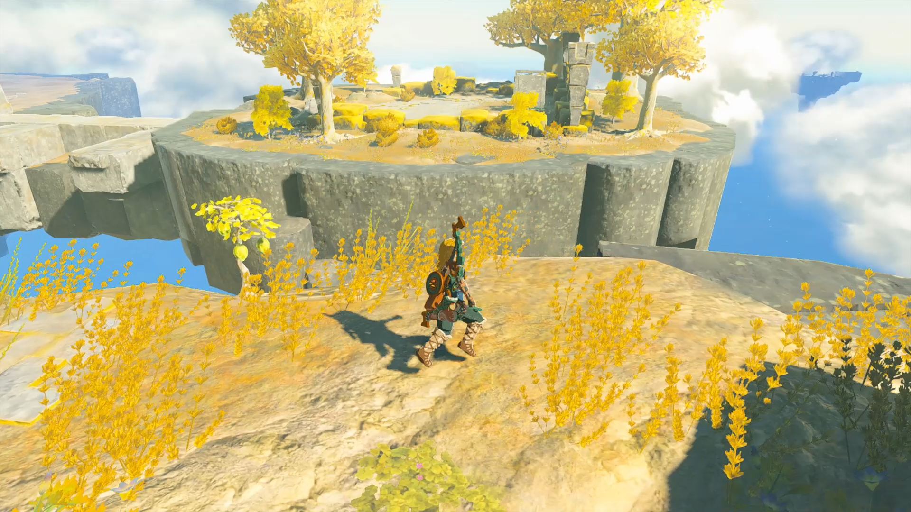

You’ll find a launching ramp with two springs already built. Use Ultrahand to position it at an angle facing the sky island with the shrine where you previously were. 

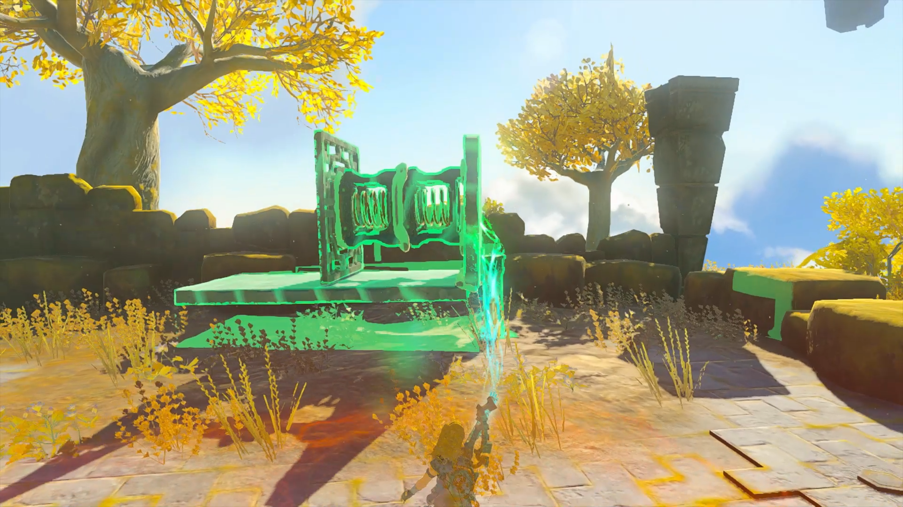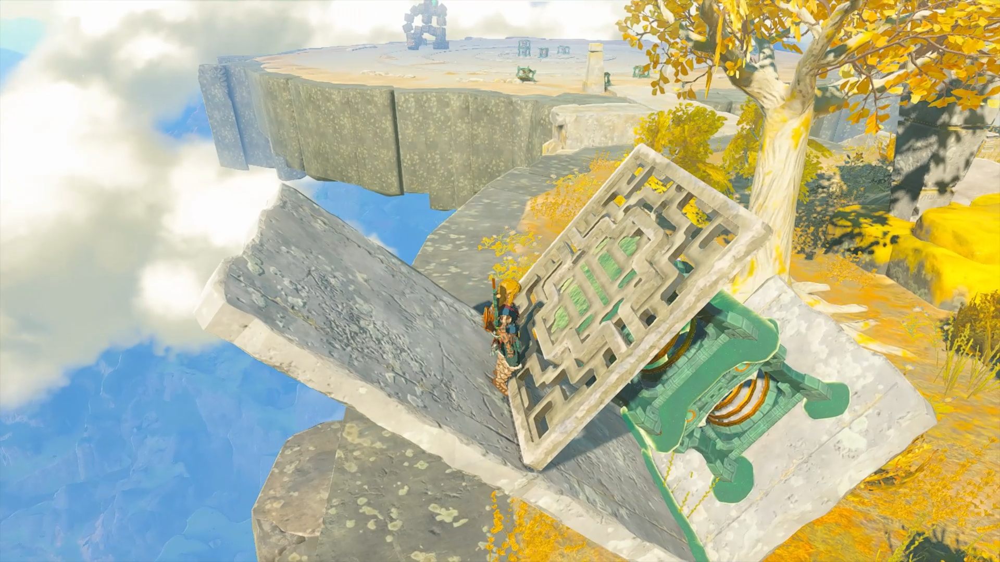

Once you have placed the launching ramp, head north to find a Flux Construct III. Use Ultrahand to remove the Necluda Sky Crystal attached to its body and carry it back to your launching ramp. 

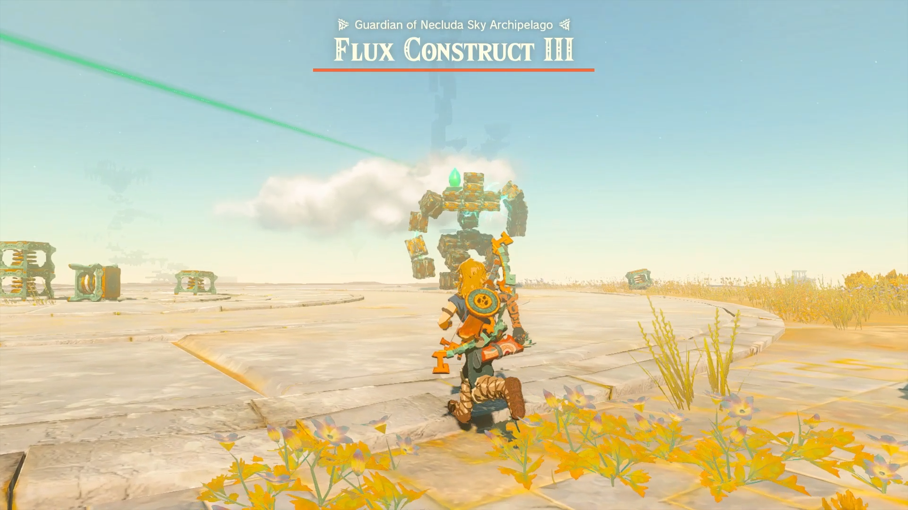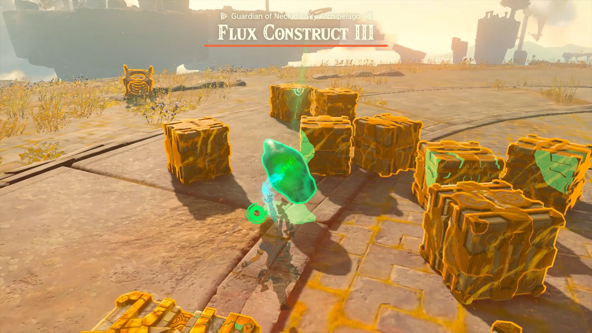

Place the sky crystal on the ramp and hit the springs to launch it. Reset the device and jump on. Hit it again to launch yourself to the sky island. Find the sky crystal and place it at the glowing green marker to activate the shrine. 

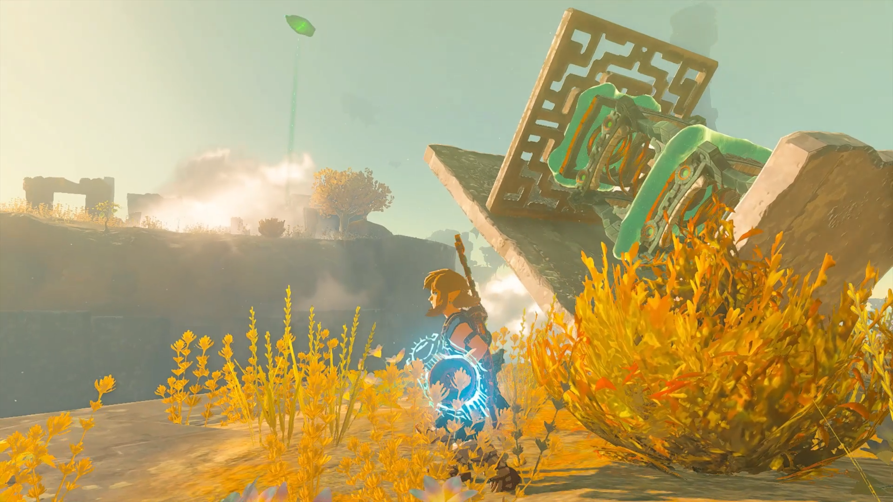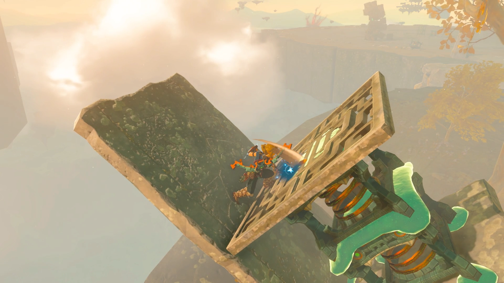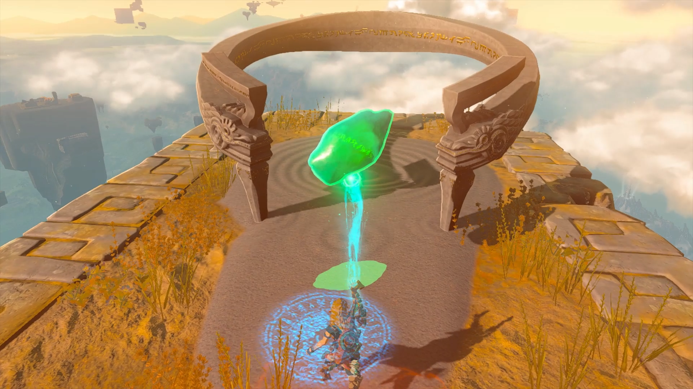

  * Coordinates: 2855, -2863, 1212

The Necluda Sky Crystal

## Kumamayn Walkthrough and Puzzle Solutions

Enter the shrine and you will be rewarded with Rauru’s Blessing. Head straight up the stairs to open the treasure chest with a Zonaite Bow inside. 

Continue up the next set of stairs to exit the shrine. 

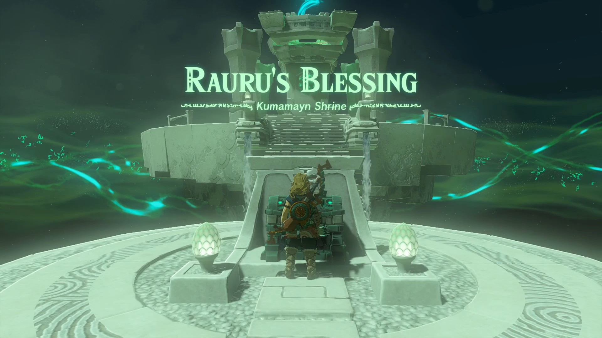

Kumamayn Shrine

Congrats on solving the shrine and earning a Light of Blessing! Click or tap here to return to the rest of the Shrine Guides. You can also check out which shrines are nearby with our shrine map filter on our complete map of Hyrule.

### Up Next: Walkthrough

Previous

About IGN's Zelda TotK Guide Writers

Next

Walkthrough

### Top Guide Sections

  * Walkthrough
  * Zelda: Tears of The Kingdom Switch 2 Edition Guide
  * Zelda Notes Voice Memories
  * List of Side Quests and Side Adventures

### Was this guide helpful?

Leave feedback

### In This Guide

The Legend of Zelda: Tears of the KingdomNintendo EPD

Initial Release: May 12, 2023

Learn more

Go to comments