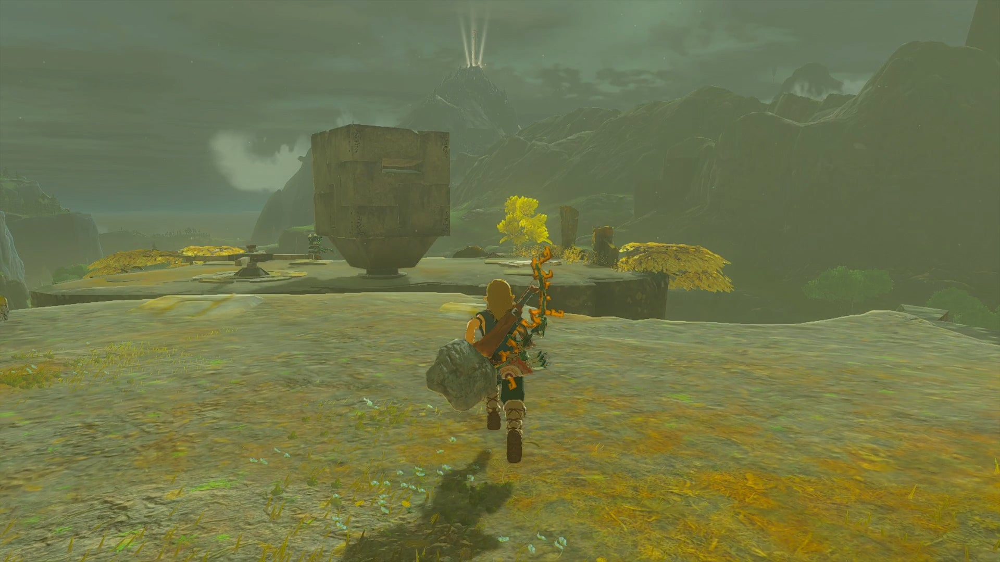
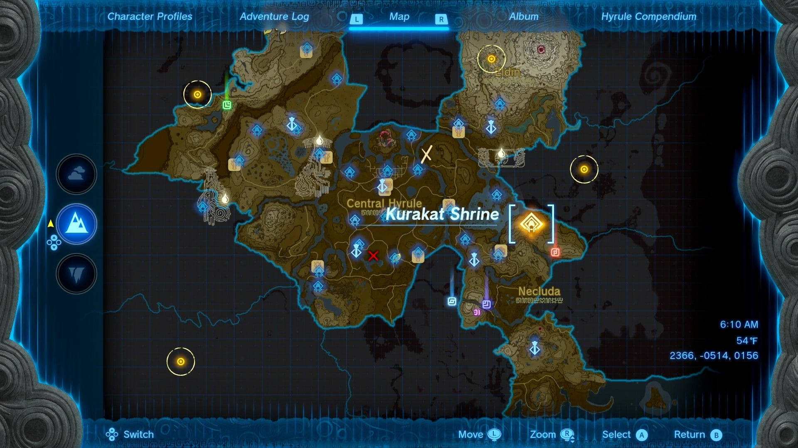
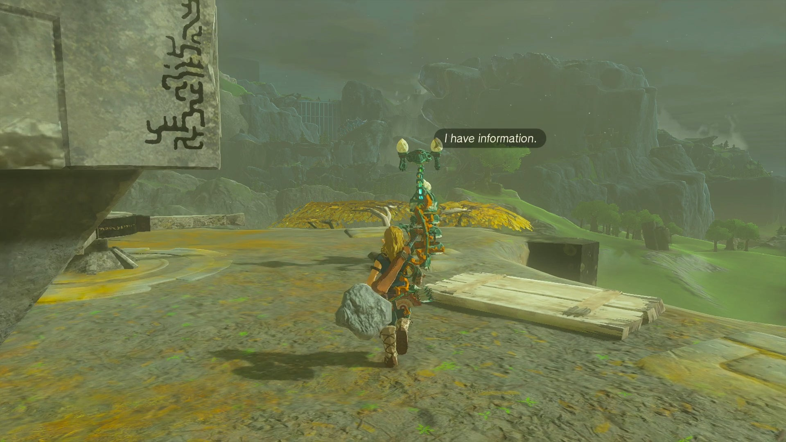
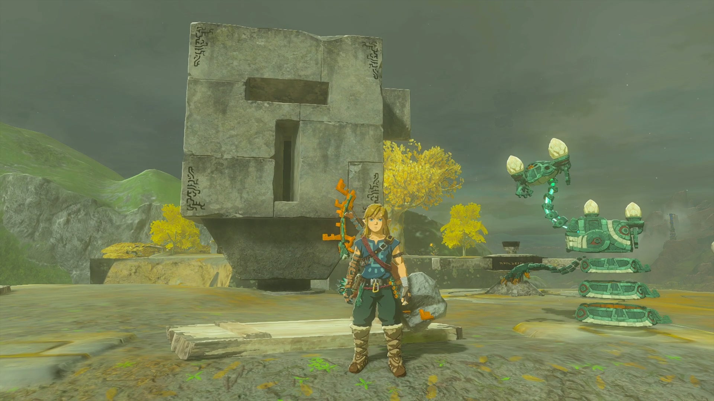
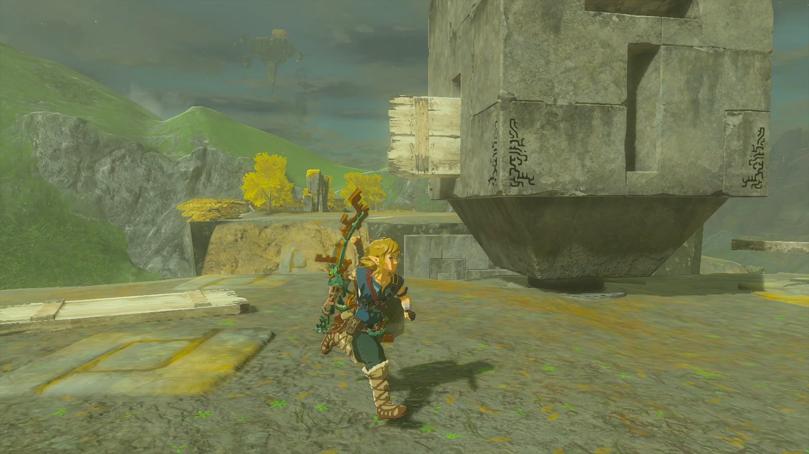
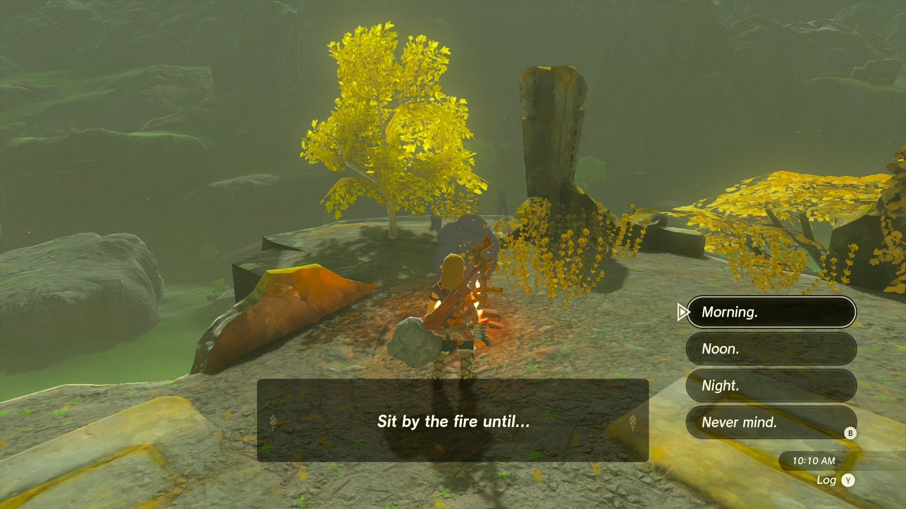
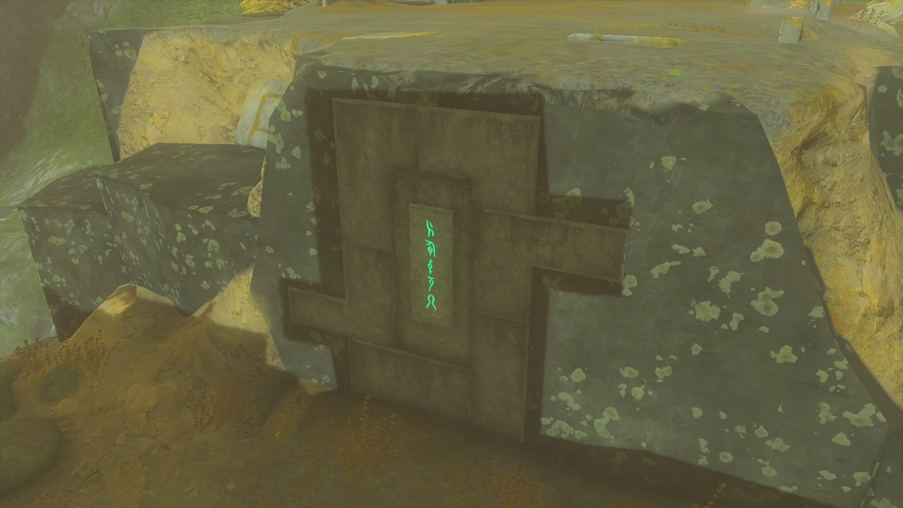

Kurakat Shrine (Rauru’s Blessing) in Zelda: Tears of the Kingdom is a shrine located in the Lanayru Great Spring region. This page contains a guide for how to locate and enter the shrine, a walkthrough for the shrine itself, and puzzle solutions, as well as treasure chest locations for the TotK Kurakat Shrine. 

### Treasure and Rewards

  * Magic Scepter

## Location/How to Reach

Kurakat Shrine is located in the Lanayru Great Spring region to the northeast of Quatta’s Shelf. In order to uncover the shrine, you must complete the “Dyeing to Find It” Shrine Quest by solving the stone shadow puzzle on the surface. 

  * Coordinates: 2366, -0514, 0156

## Dyeing to Find It Walkthrough and Puzzle Solutions

Kurakat Shrine is hidden from plain sight, but speaking to the nearby Steward Construct will provide a hint as to how to uncover the shrine entrance. 

“Dye the white pattern black when the sun awakens in the sky. Then will the sacred shrine appear.” 

You’ll notice a white pattern etched into the stone behind a large rotating structure. Take note of its distinctive shape and head over to the wheel. 

Rotate the stone shape until an obvious the obvious T-shaped side is facing the direction of the Steward Construct. 

Once in this position, use the Ultrahand ability to grab one of the pieces of wood next to the structure and rotate horizontally. Slide the wooden slat into the gab on the left facing side of the stone structure. 

Light the campfire nearby and rest until morning. 

Make your way back towards the stone-etched pattern, and you’ll notice a cast upon the wall. 

Wait until the shadow lines up the this pattern and the shrine entrance will emerge. 

Dyeing to Find It

Head inside the Kurakat Shrine to receive a Magic Scepter from the chest and your complimentary Light of Blessing. 

Kurakat Shrine

Congrats on solving the shrine and earning a Light of Blessing! Click or tap here to return to the rest of the Shrine Guides. You can also check out which shrines are nearby with our shrine map filter on our complete map of Hyrule.

### Up Next: Walkthrough

Previous

About IGN's Zelda TotK Guide Writers

Next

Walkthrough

### Top Guide Sections

  * Walkthrough
  * Zelda: Tears of The Kingdom Switch 2 Edition Guide
  * Zelda Notes Voice Memories
  * List of Side Quests and Side Adventures

### Was this guide helpful?

Leave feedback

Go to comments