**Kyokugon Shrine** (**Alignment of the Circles**) in The Legend of Zelda: Tears of the Kingdom is a shrine located in the Central Hyrule Region, specifically under Hyrule Field's Great Plateau. This page contains a guide for how to locate and enter the shrine, a walkthrough and puzzle solutions for the shrine itself, and treasure chest locations for the TotK Kyokugon shrine. 

Be sure to check out these other guides to help you through the other Shrines and find troublesome collectables! 

  * Shrine filter on IGN's interactive map of Hyrule
  * All Shrine Locations and Solutions
  * List of Shrine Quests
  * Dragon Locations and Farming Guide
  * Korok Seed Locations

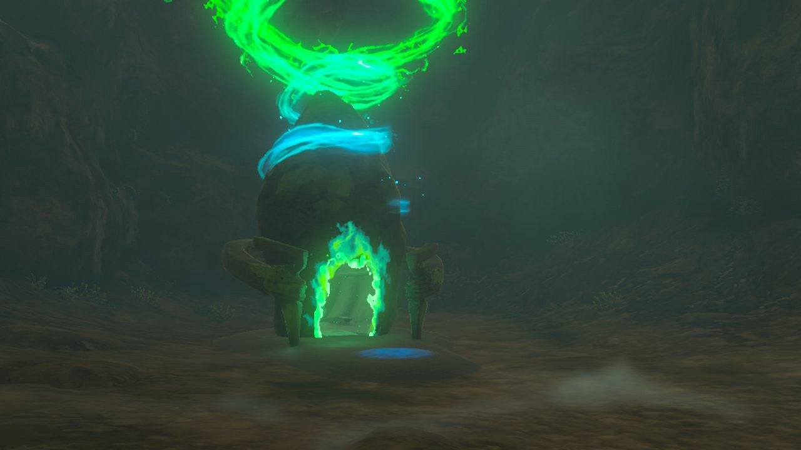

### Treasure and Rewards

  * Hearty Elixir
  * Bubbul Gem

## Kyokugon Shrine Location

Around the Great Plateau's Forest of Spirits, you may get a constant notice that a Shrine of Light is nearby. This shrine is under the plateau in a cave right near Addison and the Hyrule Restoration Materials platform (coordinates **-0838, -1482, 0025**). 

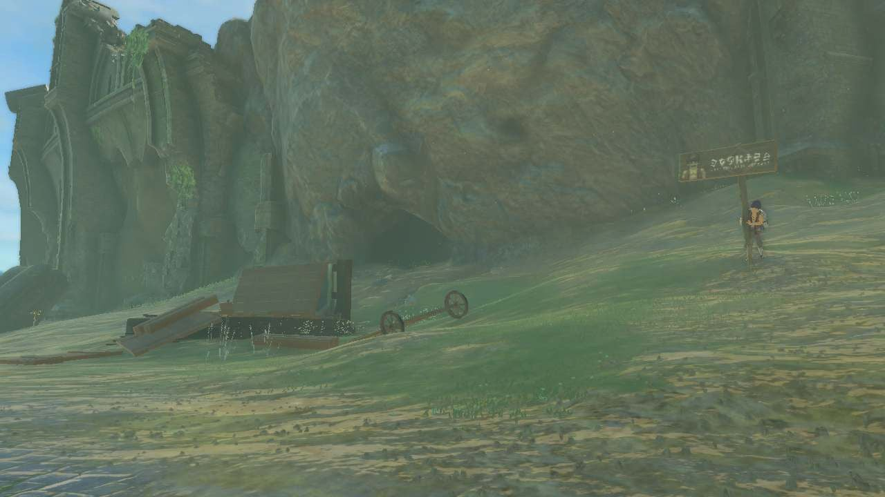

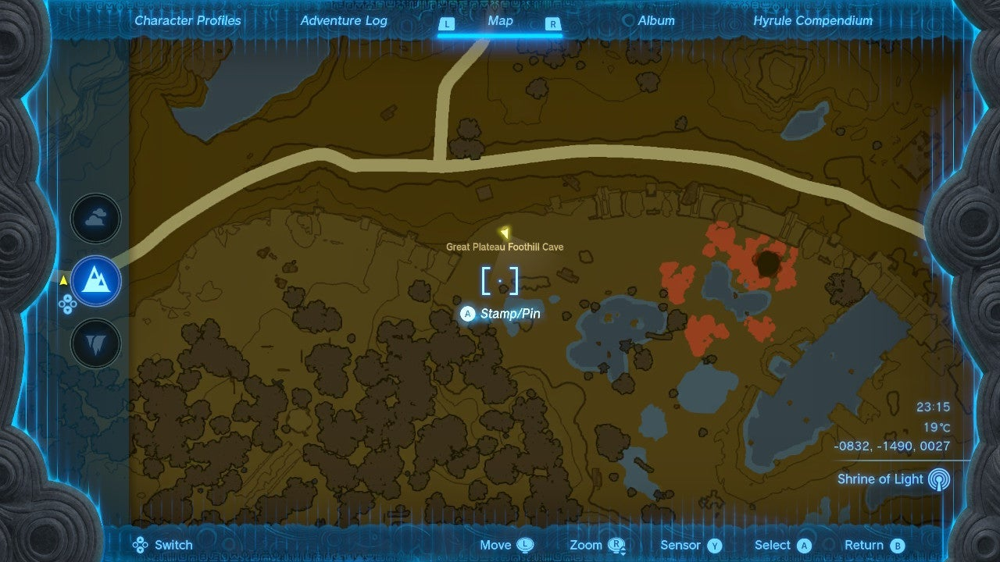

Destroy the red rock wall with bomb plants or a rock hammer (weapon + rock fusion) and you'll discover the Great Plateau Foothill Cave. 

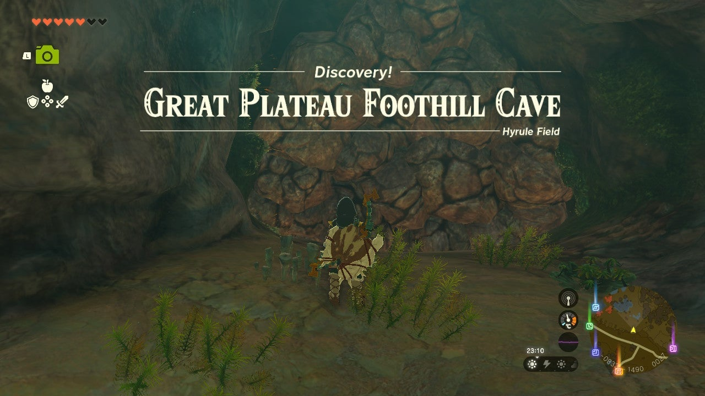

After getting through the red rock walls you'll come across an open cavern filled with brightbloom seeds, luminous stone, and two Horriblins. Knock them off the ceiling with arrows and lay your weapons into them. With them out of the way you can now focus on destroying the next blue rock wall and the grey rock wall. Do the blue one on the right side of the wall first, not the one on the end of the path. Behind the rock wall is a Bubbulfrog and not much else, so it's quick to clear. The grey and blue rock walls are tougher than the red ones but can be destroyed in the same way. 

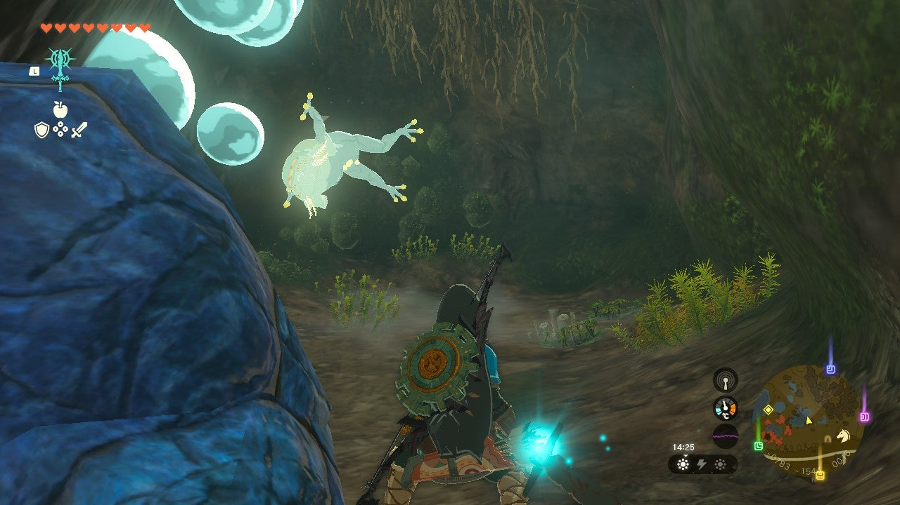

Now back to the main path, destroy the grey rock wall. It's a dense wall so you may end up going through a rock hammer or two. Once you've destroyed your way through you'll see the shrine in a large cavern. 

  * **Coordinates** : -0706, -1551, 0006

## Alignment of the Circles Walkthrough

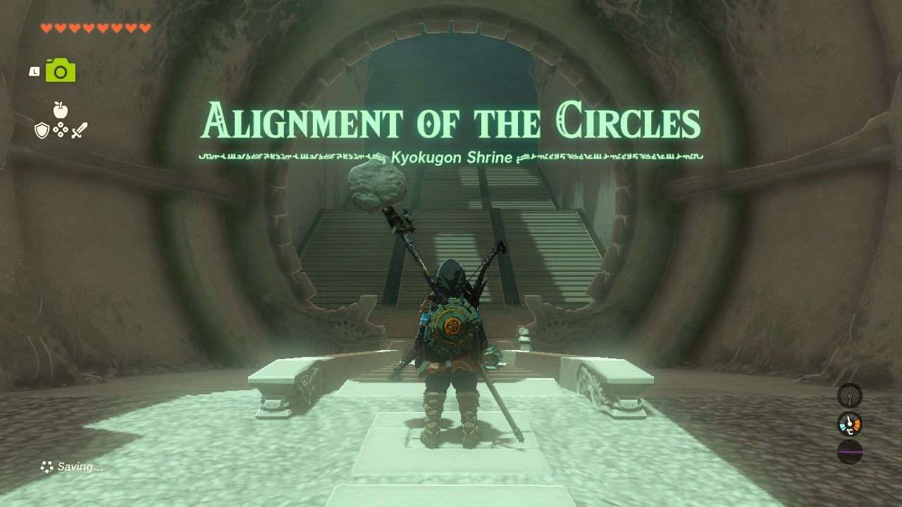

The Kyokugon Shrine is set in one large room. Before you there are four ball ports in a diamond shape in the middle of the room with three additional ports on varying levels to the left and right of the center. There are only four balls, though. The solution to this shrine is on the ceiling. Above the room are four green circles that indicate which ports should have a ball. 

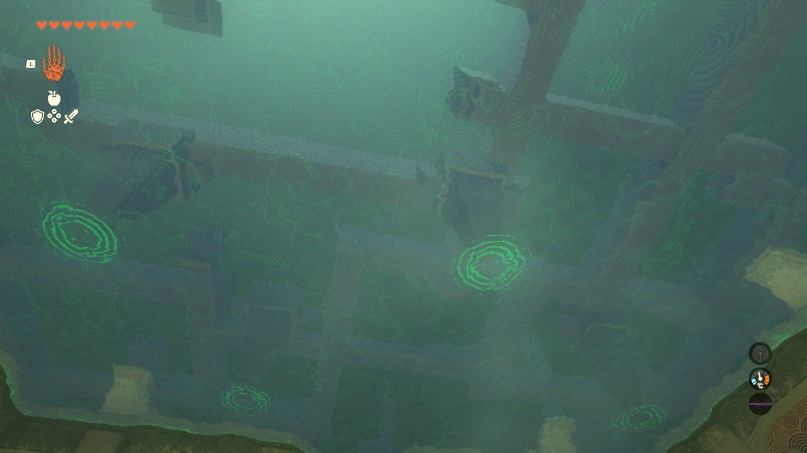

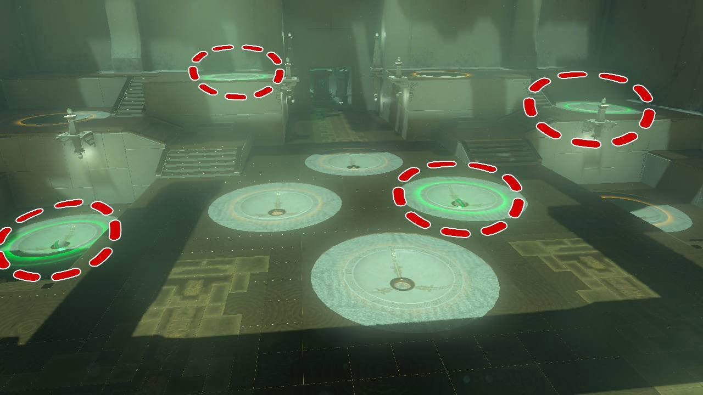

Place the balls in the following spots to open the gate: 

  * Top left port
  * Bottom left port
  * Center right port
  * Middle right port

With that the gate will open leading to the exit and the shrine's treasure chest. 

### How to Get the Treasure Chest

In the exit room is another large gate and locked behind it is the treasure chest. 

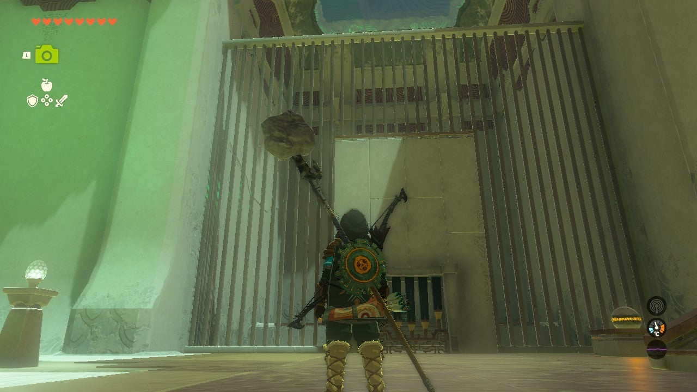

To the right of the gate is another ball. Look to the ceiling and you'll see another green circle to the left of the shrine exit. 

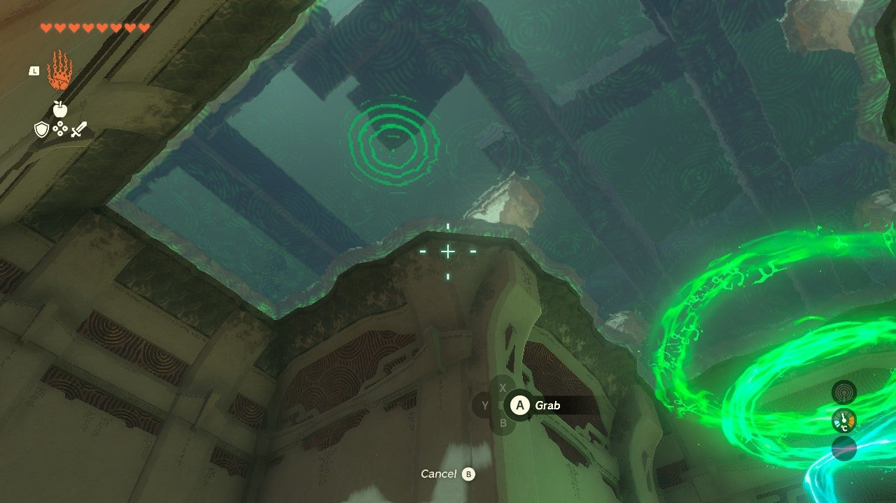

Use Ultrahand to remove a panel in the floor to expose a ball port. 

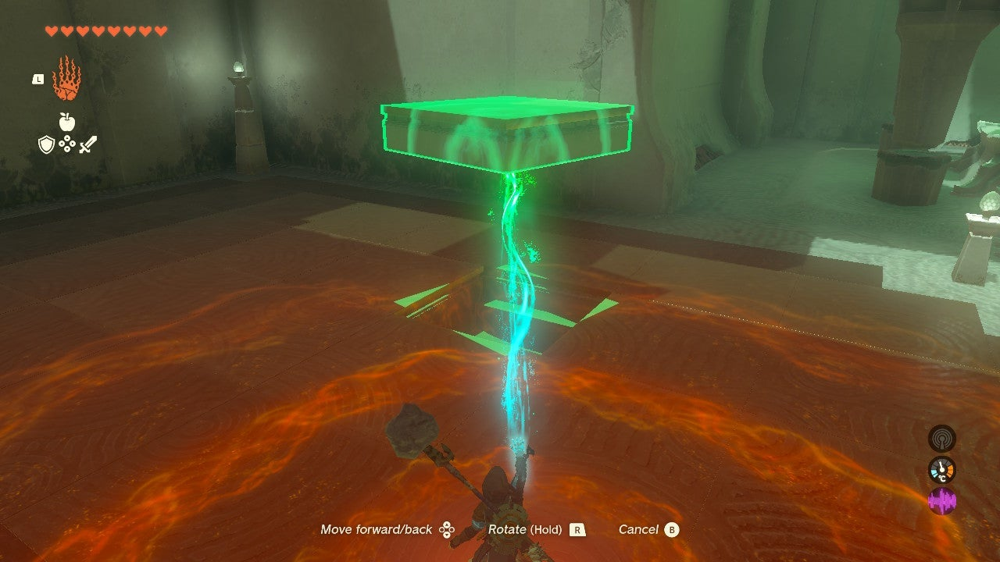

Grab the ball by the gate and deposit it in the port to open the gate. In the treasure chest you'll find a Hearty Elixir. 

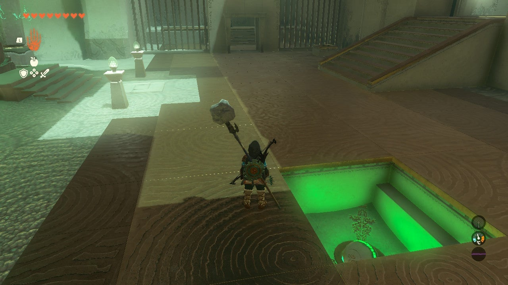

Proceed to the exit to collect your Light of Blessing. 

Kyokugon Shrine

Congrats on solving the shrine and earning a Light of Blessing! Click or tap here to return to the rest of the Shrine Guides. You can also check out which shrines are nearby with our shrine map filter on our complete map of Hyrule.

### Up Next: Walkthrough

Previous

About IGN's Zelda TotK Guide Writers

Next

Walkthrough

### Top Guide Sections

  * Walkthrough
  * Zelda: Tears of The Kingdom Switch 2 Edition Guide
  * Zelda Notes Voice Memories
  * List of Side Quests and Side Adventures

### Was this guide helpful?

Leave feedback

### In This Guide

The Legend of Zelda: Tears of the KingdomNintendo EPD

Initial Release: May 12, 2023

Learn more

Go to comments