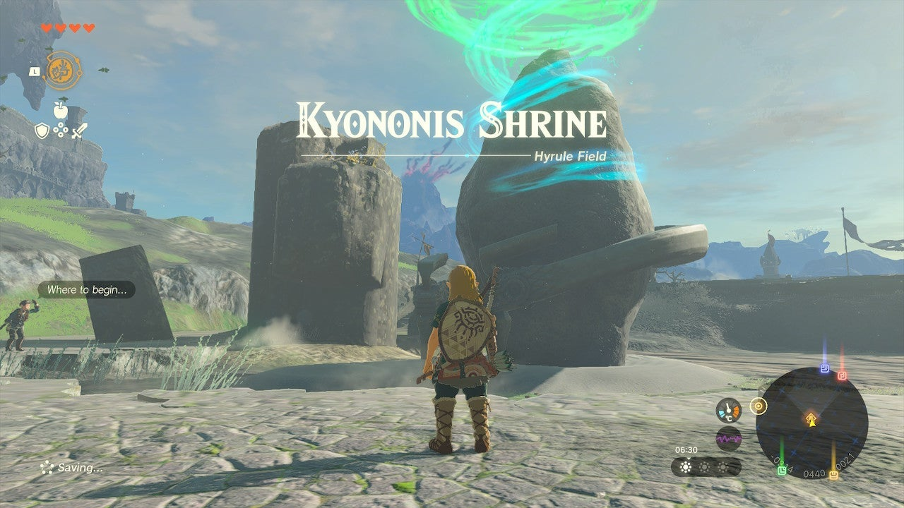
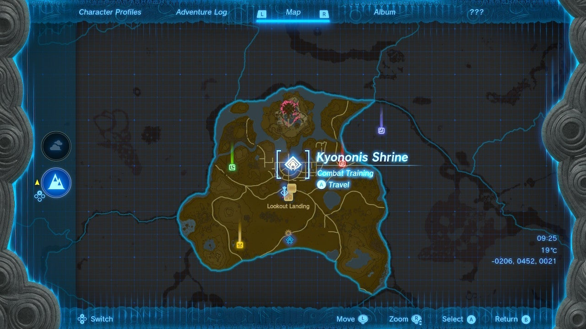
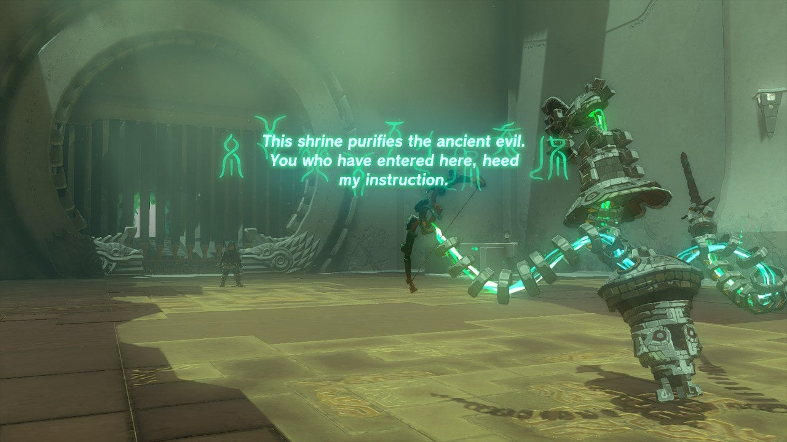
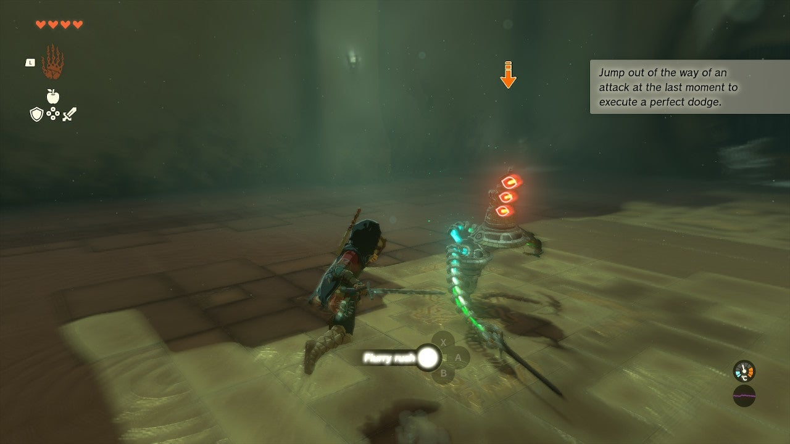
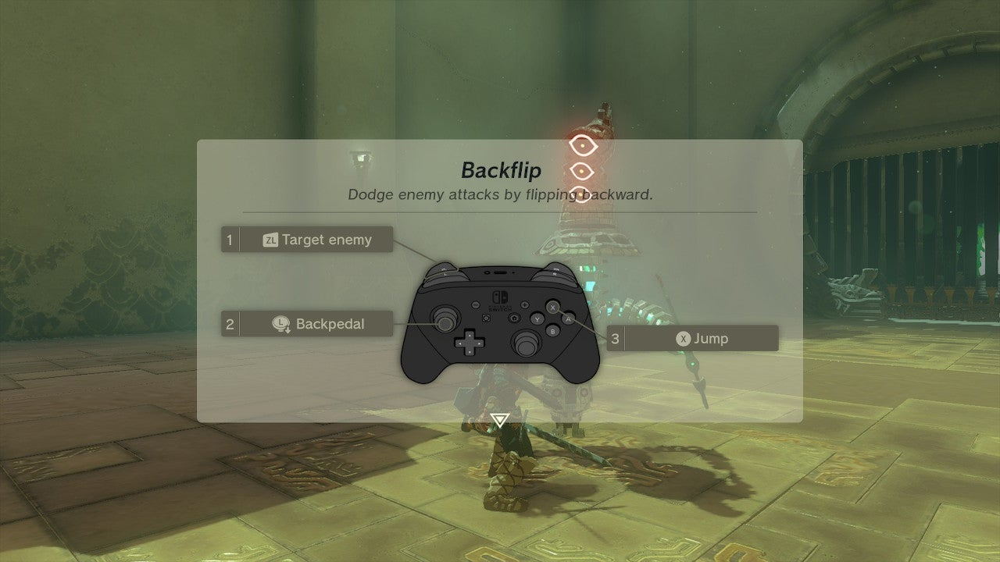
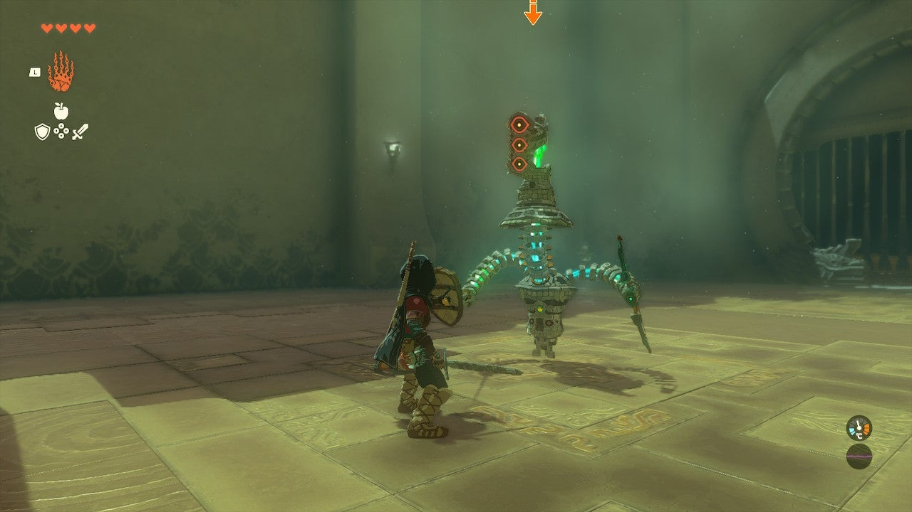
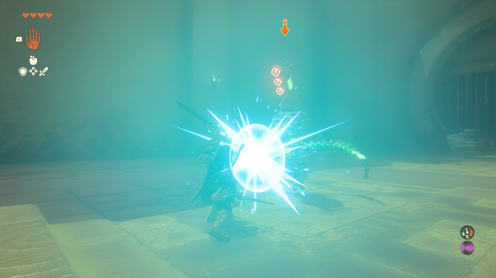
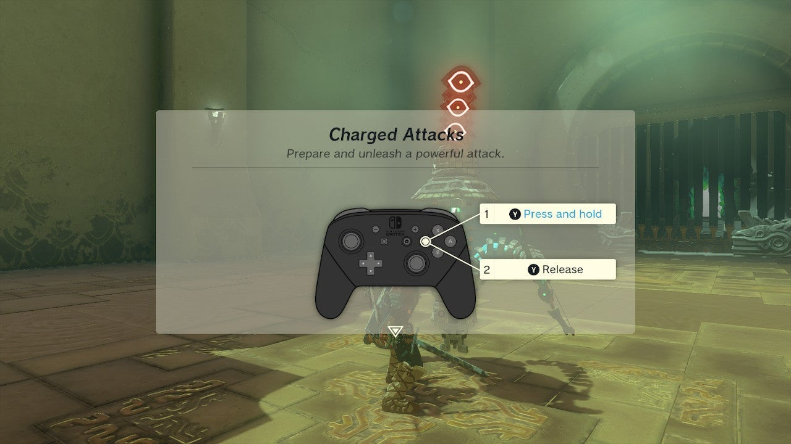
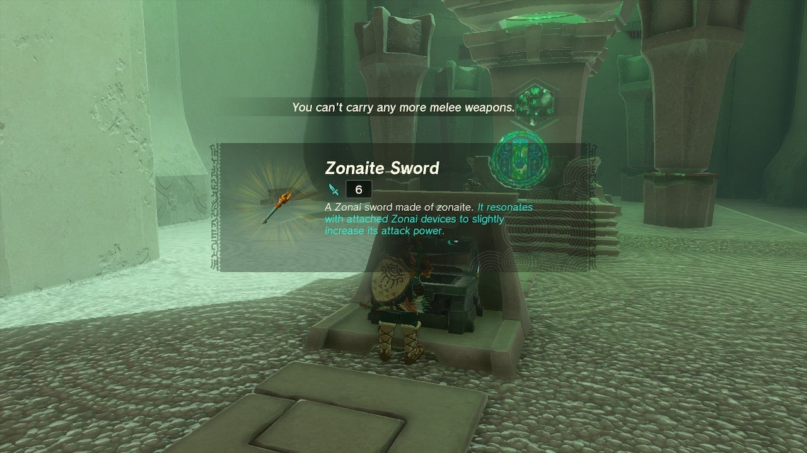

Kyononis Shrine (**Combat Training**) in The Legend of Zelda: Tears of the Kingdom is a shrine located in the Central Hyrule Region and is one of 152 shrines in TOTK (see all shrine locations). This page contains a guide for how to locate and enter the shrine, a walkthrough for the shrine itself, and puzzle solutions as well as treasure chest locations for the TotK Kyononsis shrine. 

### Treasure and Rewards

  * Zonaite Sword

## Kyononis Shrine Location

The Kyononis Shrine is on the ground in Central Hyrule in plain view, due north of Lookout Landing and Lookout Landing Skyview Tower. Bring a selection of one-handed weapons to the shrine. Even a stick will be fine for the training you get here. 

  * Coordinates: -0205, 0451, 0021

## Kyononis Shrine Walkthrough

This Combat Training shrine will lead you through a tutorial on Perfect Dodge and Perfect Guard counterattacks. Approach the construct in the center of the arena. No damage will be dealt except for in the tutorial so don’t waste your arrows or items. 

  * **Perfect Dodge** : Equip a single-handed weapon and shield using the D-Pad left and right buttons. You can lock on to the construct with LEFT TRIGGER and you’ll see the arrow above it turn red. Strafe around it to get a sense of your lock-on. Now, move in close and wait for the construct to wind up an attack. Hold left or right on the LEFT STICK and press Y to dodge. You can do this several times. If done right before the enemy swing, you will be able to counterattack with a Flurry, by tapping Y.

  * **Perfect Dodge** : This is the same strategy but you hold DOWN on the LEFT TRIGGER to jump back when the construct swings.

  * **Perfect Guard** : Ready your shield and wait for the enemy to wind up. When it does, hit A to swing the shield and knock the weapon stroke back.
  * **Charged Attack** : Hold Y to charge an attack – stay locked on! Let go to unleash it. This will destroy the construct.

Collect the items dropped by the construct. 

## Treasure Location

Your reward for the Combat Trial is that you don’t have to find a hidden treasure chest. It’s right near the exit! Inside is a Zonaite Sword. Exit the shrine. 

Kyononis Shrine

Congrats on solving the shrine and earning a Light of Blessing! Click or tap here to return to the rest of the Shrine Guides. You can also check out which shrines are nearby with our shrine map filter on our complete map of Hyrule.

### Up Next: Walkthrough

Previous

About IGN's Zelda TotK Guide Writers

Next

Walkthrough

### Top Guide Sections

  * Walkthrough
  * Zelda: Tears of The Kingdom Switch 2 Edition Guide
  * Zelda Notes Voice Memories
  * List of Side Quests and Side Adventures

### Was this guide helpful?

Leave feedback

### In This Guide

The Legend of Zelda: Tears of the KingdomNintendo EPD

Initial Release: May 12, 2023

Learn more

Go to comments